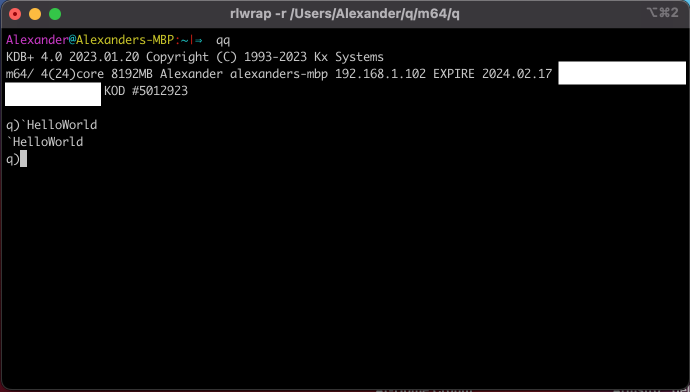

##  Welcome to DefconQ - Your Beginner's Guide to Navigating the KDB/Q Universe!

Hey there, tech enthusiasts and aspiring KDB/Q developers! Are you ready to embark on an exciting journey into the world of q programming, tice architecture, and design? Look no further, because you've just stumbled upon your ultimate resource for demystifying the KDB/Q landscape.

We get it - starting out in the tech world can be a bit overwhelming. The jargon, the paradigms, the concepts - they can feel like a maze that's hard to navigate. But fear not! Our mission is to guide you through this maze, one step at a time, and make these seemingly complex topics as easy to grasp as building blocks.

<!--truncate-->

### Why Are We Here?

Being a self-starter myself - our blog is born out of the desire to make KDB/Q accessible to everyone, especially beginners. We've been in your shoes, and we understand the struggles of wrapping your head around the q programming language, tick architecture, and design principles. That's why we're here to break down those barriers, sprinkle in some practical tips, and empower you to dive into the KDB/Q world with confidence.

#### What Can You Expect?

Whether you're a complete novice or someone looking to brush up on their skills, our blog has something for you. We'll start with the basics, explaining q programming paradigms in a way that won't make your head spin. We'll delve into the intricacies of tick architecture and design, so you can build solid foundations for your projects.

But that's not all! We're curating a collection of helpful resources that'll serve as your tech toolbox. From must-read articles to insightful videos, we're cherry-picking the best content to aid your learning journey. And yes, we're rolling up our sleeves to create step-by-step tutorials that walk you through real-world scenarios, so you can see these concepts in action.

### Join Us On This Adventure

Buckle up, because this is a journey you won't want to miss. Whether you're aspiring to be a programmer, an architect, or just someone intrigued by the tech magic happening behind the scenes, we're here to welcome you with open arms. Let's turn the overwhelming into the understandable, the complex into the clear, and the daunting into the doable.

So, stick around, bookmark us, and get ready to embark on a tech adventure that'll leave you with newfound knowledge, skills, and an unquenchable thirst for all things tech. Welcome to DefconQ - where we're turning tech novices into tech savvy superheroes, one blog post at a time!

