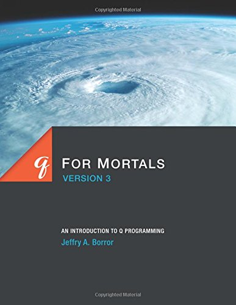
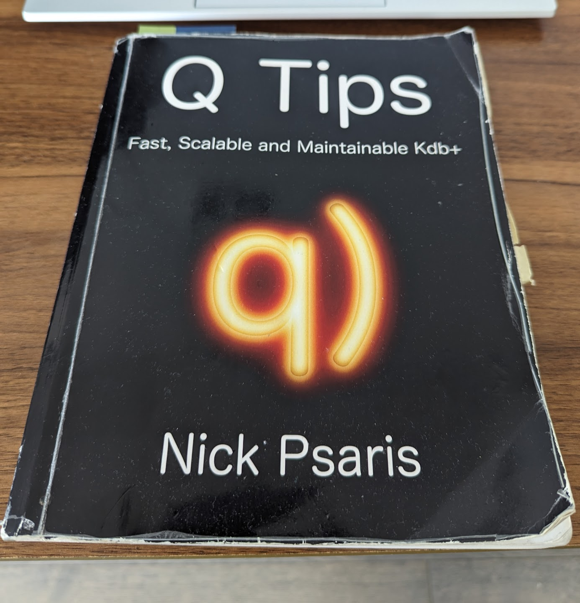
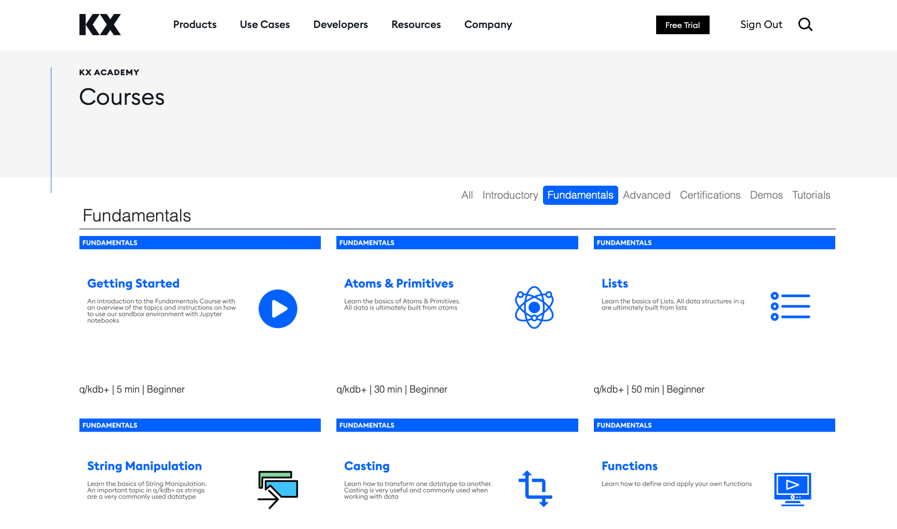
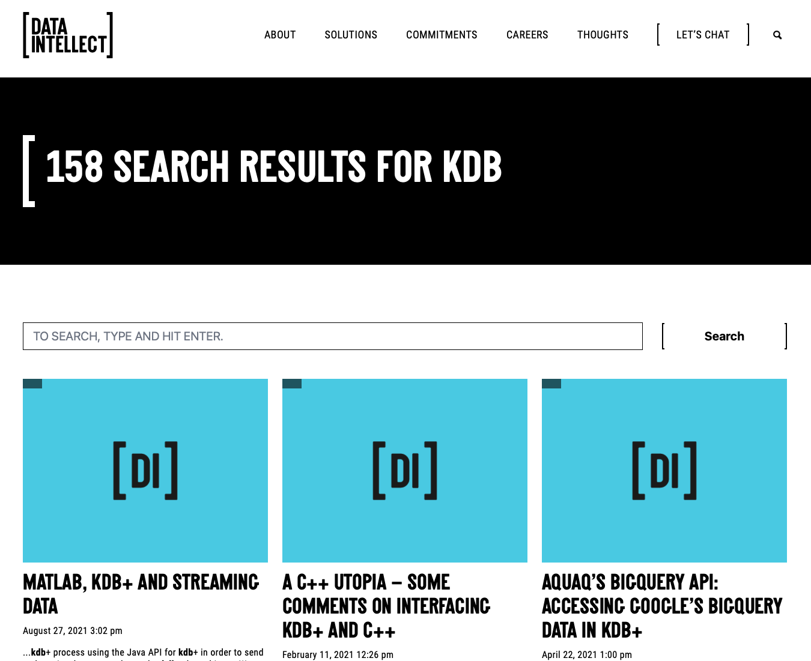
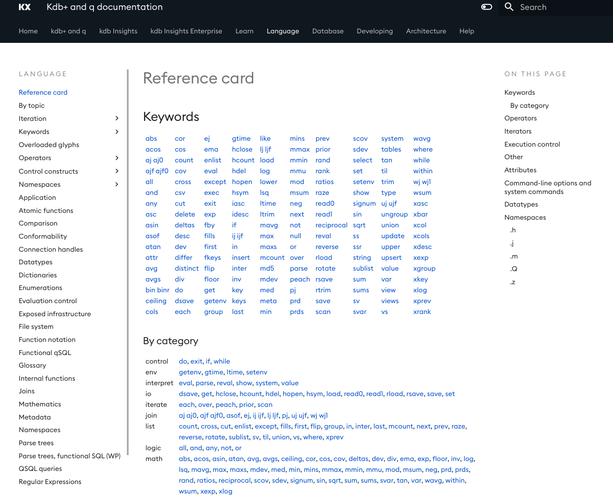

In this blog post, I'll be sharing my favourite KDB/Q learning resources. These are the go-to references that most experienced KDB/Q developers will have encountered, offering an excellent starting point for anyone looking to dive into the world of KDB/Q.

<!--truncate-->

## The TL;DR

If there's one thing that you need to read about KDB/Q then it's the below books:

 - [Q For Mortals](https://amzn.to/3BVir4I) by Jeffry A. Borror. [Free online version](https://code.kx.com/q4m3/)
 - [Q Tips](https://amzn.to/3UjkAgZ) by Nick Psaris 

## The detailed version

Mastering KDB/Q can be quite challenging due to its steep learning curve, especially if you're new to vector programming languages. The resources below are designed to provide a solid foundation and help you grasp the essential concepts of the Q programming language.

### Books

#### Q for Mortals by Jeffry A. Borror

If you're new to the Q programming language and embarking on your learning journey, your first step should be to thoroughly read "Q for Mortals" by Jeffry A. Borror, cover to cover. This book serves as a comprehensive guide to essential q concepts and provides a strong foundation in understanding the KDB/Q database.

Beginning with the fundamental data structures of KDB/Q, including Atoms, Lists, and Dictionaries, the book progressively introduces you to Tables, which form a core data structure in KDB/Q. It delves into intricate details about the functioning of operators, guides you through crafting your custom functions, an integral aspect of functional programming (though KDB/Q isn't purely functional), and illustrates the creation of derived functions using iterators, another pivotal element of KDB/Q.

Chapter 9 introduces q-sql and its role in querying and manipulating tables, while Chapter 14 offers insights into the KDB/Q database, encompassing the process of persisting data to disk. These chapters collectively provide an excellent foundational understanding of KDB/Q, making "Q for Mortals" an indispensable resource for newcomers as well as experienced developers.

Written in a highly accessible manner, the book is accompanied by illustrative coding examples and snippets, allowing for easy comprehension and hands-on learning. After completing a full read-through, you can revisit specific chapters whenever needed to reinforce your understanding and delve deeper into the content for a more solid grasp.

#### Q-Tips by Nick Psaris

After reading of "Q for Mortals," the next step is to explore my preferred KDB/Q book, "Q Tips," authored by Nick Psaris. While "Q Tips" does offer an initial section introducing fundamental concepts and KDB/Q data structures in its initial chapters, I personally found it more advantageous to have a foundational understanding from "Q for Mortals" before delving into "Q Tips."

Within the pages of this book, Nick draws upon his extensive experience and insights garnered from hands-on usage of KDB/Q within a dynamic real-world trading setting. He leads readers on a practical expedition, guiding them through the step-by-step construction of an intricate event processor in KDB/Q, right from the ground up. Nick seamlessly intertwines the fundamental elements of KDB/Q with the pertinent intricacies of market microstructure, resulting in the creation of a synthetic market data generator.

In this context, Nick not only illustrates how to efficiently capture, store, and analyze vast datasets, but also explains the Q programming paradigm and progressively develops the associated libraries. Throughout this journey, he weaves in well-observed and refined tips that he's gleaned from his own experience, ensuring readers gain comprehensive insights into the process.

As you can see from the image of my well-worn copy of Q-Tips below I have read the book several times from front to back and I wholeheartedly recommend Q-Tips to anyone who wants to bring their KDB/Q programming skills to the next level.

### Online resources

#### KX Academy 

In October 2021 KX announced the launch of [KX Academy](https://kx.com/academy/), an online portal for on-demand training. The Academy offers a range of courses, split into two main difficulty levels, Fundamentals and Advanced. In addition to that, you can also find introductory sessions on KX Dashboard, KX Developer, KX Insight and the recently published Python Interface, PyKX. Demos and Tutorials will deepen your newly acquired knowledge with some practical, hands-on examples. 

The Fundamental section combines a series of 15 short courses containing expanatory videos and Jupiter notebooks running in a freely accessible, live sandbox development environment with pre-loaded data sets, giving you seemingless access to the power of KDB/Q without having to install anything on your local machine. This is a perfect, practical addition to the book "Q for Mortals" mentioned earlier. I suggest you take the courses alongside when reading the book. 

The Advanced section of KX Academy builds up on your previously acquired knowledge and explains more advanced concepts of KDB/Q in 15 Jupiter notebook courses. The modules cover topics such as Enumeration, Attributes, different ways of persisting tables, Joins, Iterators, Functional Selects and more. These topics are also covered in "Q for Mortals" but again, the Jupiter notebooks provide a great practical addition to the theory covered in great detail in the book.

After completing each section, you have the opportunity to validate your understanding by obtaining either of the two certificates, putting your knowledge to test. 

#### Data Intellect's Blog

[Data Intellect](https://dataintellect.com), formerly known as AquaQ, is a consultancy firm providing complete software solutions across a broad range of sectors, including but not limited to Financial Institutions such as Investment Banks or Hedge Funds, Fintec, Healthcare, Renewables or Telematics, just to name a few. One of their expertises is KDB/Q and you can find plenty of more advanced topics on their [blog](https://dataintellect.com/thoughts/?_sft_category=blog). While some of the content is for the more experienced developer, I really enjoy the in depth knowledge provided by them. In addition to the great details provided, Data Intellect also covers technologies or databases beyond KDB/Q and how to interact with them. The blog posts are skillfully crafted, easily understandable, and serve as an excellent platform to enhance your understanding beyond the foundational concepts acquired from other sources.

But that's not all. The best part is that Data Intellect provides a complete, production ready KDB/Q framework called [TorQ](https://dataintellect.com/thoughts/?_sft_category=blog) for free as OPEN SOURCE. Yes, you read that right. Go and check it out for yourself, you can find TorQ [here](https://github.com/DataIntellectTech/TorQ)
 

#### [UPDATED] Habla Computing Blog and Weekly Cue

In recent months, we've witnessed the emergence of a promising newcomer in the KDB/Q landscape. I'm thrilled to witness the expansion of the KDB/Q community, with the contributions of my colleagues and friends at [Habla Computing](https://www.linkedin.com/company/habla-computing/) in Madrid proving to be an invaluable asset for those venturing into the world of KDB/Q. [Juan](https://www.linkedin.com/in/jserranohidalgo/) and [Jesus](https://www.linkedin.com/in/jesús-lópez-gonzález-98237248/), both seasoned software developers with extensive backgrounds in Scala, have embarked on their journey with KDB/Q in the past few years, spearheading the efforts behind the [Habla Computing blog](https://www.habla.dev/blog/) and the [Weekly Cue](https://www.linkedin.com/pulse/weekly-cue-1-accumulating-sums-habla-computing-er8wf/?trackingId=RWhEsgG6cJLkslLOztv%2B4A%3D%3D) series on LinkedIn. The Weekly Cues, are bite-sized Linkedin articles explaining a KDB/Q topic in a easy and simple way, ideal to satisfy your hunger for KDB/Q knowledge. Following this, their [Weekly Quests](https://www.linkedin.com/pulse/weekly-quest-1-sliding-sum-mastery-habla-computing-p3gre/?trackingId=XHUq3wpldVEtOZx5u62T3g%3D%3D) challenge you to apply your newfound knowledge by solving KDB/Q puzzles, aiming to craft the most concise and efficient q code—an opportunity to gauge your skills alongside fellow KDB/Q developers in the community. It's a delightful and interactive approach to learning KDB/Q concepts, offering glimpses into the expertise of seasoned developers. Make sure to check them out! Moreover, Habla Computing hosts monthly meetups in Madrid (with online streaming available), operating under the theme "Everything, Everywhere All with KDB/Q." I had the pleasure of presenting at their inaugural Meetup in April, and you can access the recording [here](https://www.linkedin.com/pulse/defconq-everything-everywhere-all-kdbq-habla-alexander-unterrainer-yawqf/?trackingId=NE5DvIxmc1V6nzJMdfPsyQ%3D%3D).

### What's next

If you've made it this far and possibly explored some of the suggested resources, you likely posses a solid understanding of KDB/Q, its concepts, applications, strengths and architecture. At this point, you might ask yourself what's next on this beautiful journey of mastering KDB/Q, which like any other skill, holds boundless potential. Moving forward,practice is key. Mastery, after all, emerges from dedicated practice. Nevertheless, I'd like to offer you two more resources to help you on your path:

#### KX Whitepapers

Whitepapers are short, focused  papers explaining a particular topic in KDB/Q. These topics cover a broad spectrum, ranging from direct association with the Q programming language, its application, and interfaces to strategies for managing large data and systems. Furthermore, there exists a segment dedicated to delving into Machine Learning within the realm of KDB/Q. Notably, the complexity of these whitepapers varies significantly, with the majority catering to more seasoned developers.

It's worth mentioning that while some of these whitepapers may lack in-depth explanations of the presented code or practical implementation guidance, this should not deter you from exploring them. Below, I've compiled a list of whitepapers that I've personally perused and find exceptionally well-written and valuable for expanding your knowledge. Do keep in mind that I haven't read all whitepapers available [here](https://code.kx.com/q/wp/) and I can't comment on every single one of them

 - [Building real-time tick subscribers](https://code.kx.com/q/wp/rt-tick/) by Nathan Perrem
 - [Common design principles for kdb+ gateways](https://code.kx.com/q/wp/gateway-design/) by Michael McClintock
 - [Query Routing: A kdb+ framework for a scalable, load balanced system](https://code.kx.com/q/wp/query-routing/) by Kevin Holsgrove
 - [Iterators](https://code.kx.com/q/wp/iterators/) by  Conor Slattery & Stephen Taylor
 - [Parse trees and functional forms](https://code.kx.com/q/wp/parse-trees/) by Peter Storeng & Stephen Taylor
 - [Interprocess communications](https://code.kx.com/q/wp/ipc/) by  Katrina McCormac

I will cover some of them in future blog posts. 

#### KX Reference

The final resource I'd like to introduce is akin to a Swiss pocket knife in the realm of KDB/Q learning: the KX Reference card. This invaluable tool encompasses a comprehensive compilation of KDB/Q keywords, datatypes, namespaces, operators, command-line options, and much more – the list is extensive and beyond the scope of this discussion.

I find the Reference Card to be an indispensable asset, to the extent that I routinely keep it open in one of my web browser tabs. Whether you're seeking a swift verification of a keyword's functionality, exploring operators that align with your requirements, or revisiting subjects that may have become rusty over time, the Reference Card stands as your go-to resource.

And thus, we conclude our journey. Wishing you joyful learning and coding endeavors ahead

