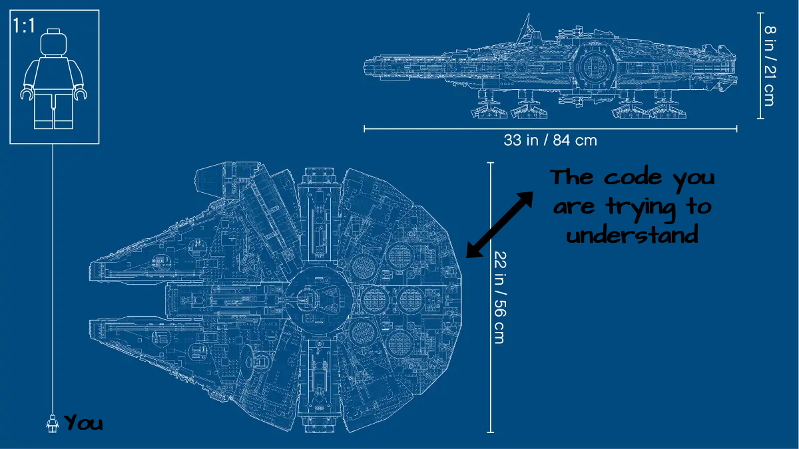
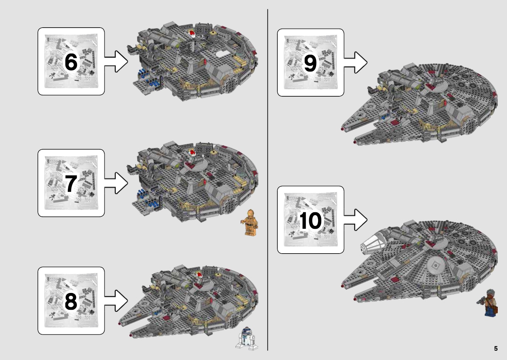

In my previous blog post, I shared my favourite [Go-To KDB/Q Learning Resources](https://defconq.tech/blog/Go-To%20KDB/Q%20Learning%20Resources) to help you to get started. However, as you dive deeper into the KDB/Q programming language and you begin to read and review other's code you might experience a slight sense of overwhelm. Two main characteristics of KDB/Q, namely its tersness and and its [left-of-right](https://code.kx.com/q4m3/4_Operators/#412-left-of-right-evaluation) evaluation order (KDB/Q expressions are evaluated left-**of**-right which equates to expressions are evaluated right-**to**-left), can pose initial challenges for new KDB/Q developers. It's important to overcome these hurdles and become familiar with these features as you progress. 

<!--truncate-->

When you start looking at other's KDB/Q code for the first time, it can be akin to a five-year-old attempting to independently assemnle the gigantic Lego Millenium Falcon immediately after learning how to connect just two Lego pieces. The experience can be overwhelming, leaving you unsure where to start. THe image below serves as an illustration of the described sensation.


When you assess your current knowledge in relation to the task at hand, you might perceive it as inadequate and insufficient.



Nevertheless, if we deconstruct the code into smaller components and methodically examine it step by step, expression by expression, we often come to realize that the code we're grappling with may not always be as daunting as initially presumed.



## Dividing code into smaller components

That's precisely the method we'll employ in this blog post. We'll dissect a line of KDB/Q code that could appear complex initially - maybe we won't even grasp its purpose at first glance. However, by breaking it down into small, discrete expressions and evaluating them sequentially, we'll unravel its underlying logic and functionality.

We are accomplishing this by examining a fascinating pattern introduced by Stephen Taylor, the KX Librarian, as outlined in this [post](https://community.kx.com/t5/Community-Blogs/Meet-the-Zen-monks/ba-p/11604). Take a glance at the code provided below and take a moment to make an educated guess about its purpose.

```
q){x{y _ x}/1 -1*(1 reverse\" "<>x)?'1b}"   Trim the spaces.  "
```

<details>
  <summary>Solution here </summary>
    <p>
      
      #### Did you guess right? The anonymous function (or lambda) trims all the spaces before and after the text. The ```1 function\input``` pattern applies a function and not applies it

      ```
      q){x{y _ x}/1 -1*(1 reverse\" "<>x)?'1b}"   Trim the spaces.  "
      "Trim the spaces."
      ```

    </p>
</details>

It's quite surprising how much can be achieved with such little code,isn't it? Now, let's break it down methodically, taking each component into careful consideration.

:::caution
Remeber, KDB/Q is evaluated left-**of**-right, meaning we have to read our code right-**to**-left. 
:::

The first code section we examine is the following.
```
(expression)?'1b
```

The '?' operator, along with the '!' operator, arguably possesses the greatest number of overloads among KDB/Q operators. In this specific context, the '?' operator functions as a [**'find'**](https://code.kx.com/q/ref/find/) operation.

Let's look at an example. Suppose we have a list of integers and we would like to find the index at which that element occurs. We can do this the following way:

:::caution
Indexing starts at 0 in KDB/Q
:::

```
q)10 5 4 3 2?3  // 3 occurs at the 4th position in the list
3
```

:::danger
`?` find only returns the first index of the elemnt you are searching for
:::

```
q)10 5 4 3 2 3?3
3
q)
```

:::tip
It's strongly advised to have the [KX reference card](https://code.kx.com/q/ref/) readily available, particularly when you're starting your KDB/Q journey and are still becoming acquainted with various operators, their overloads, and functionalities.
:::

## The power of Iterators and their applications

The `'` operator exemplifies another unique concept within KDB/Q, which is the concept of [iterators](https://code.kx.com/q/basics/iteration/). Iterators can be described as functions that take values as arguments and generate new functions that apply those values repetitively. In this specific instance, the `'` operator signifies ["each"](https://code.kx.com/q/ref/maps/#each) and applies a value item-by-item to a dictionary, list, or conforming combinations of lists and dictionaries.

Allow me to demonstrate this behavior with a straightforward example. Imagine we have a list of strings and aim to determine the length of each string:

```
q)list:("Hello";"World";"lorem";"ipsum")
q)count list
4
```
As you can see, `count list` returns the length of the list of strings rather than the length of each individual string itself. We therefore have to use the `each` operator to achieve the desired result.

```
q)count each list
5 5 5 5
```

In the above example we make use of the mnemonic keyword **each** which can be used to apply a unary value without having to use parentheses or brackets. We could have achieved the same result by doing the following 

:::note
`count` is a unary value
:::

```
q)(count')list
5 5 5 5
q)count'[list]
5 5 5 5
q)count@'list
5 5 5 5
```

When examining the entire code snippet together, we can see that `(expression)?'1b` will search (and find) the index of the first occurence of 1b in **each** element of the list denoted by expression. Sounds complicated? Allow me to provide a demonstration for better clarity:

```
q)(000101010111b;0101010101b)?'1b
3 1
```

Our next task is to determine the actual result of the expression enclosed within parentheses.

```
(1 reverse\" "<>x)?'1b
```

To do so, we solely focus on the expression within parentheses and ignore the second part. We can easily do this, we already know what it does

```
1 reverse\" "<>x
```

This expression can be further divided into three components. The keyword `reverse`, the component `" "<>x` and the `\`, another KDB/Q [**iterator**](https://code.kx.com/q/basics/iteration/).

Let's examine each of these components separately, starting, in good KDB/Q fashion with the most right one:

```
q)" "<>"Hello World"
11111011111b
```

The code we executed produces a boolean mask. It compares each element of the string to the empty string " " and yields "**true**" for elements that differ and "**false**" for those that are the same. Consequently, we can infer that the `<>` operator assesses inequality. If our aim is to do the opposite and examine equality, we can simply apply the equality operator, which is represented by `=`.

This conveys another, valuable lesson in KDB/Q, specifically: *"A fundamental feature of atomic functions is that their action extends automatically to the items in a list"* as explained in [Chapter 4: Operators](https://code.kx.com/q4m3/4_Operators/#403-extension-of-atomic-functions) of "Q for Mortals".

Don't take my word for it, witness it for yourself:

```
q)2 3 4+5 6 7
7 9 11
```

:::danger
Of course, if you want to combine two lists they must be of the same length, otherwise KDB/Q will throw an error
```
q)2 3 4+5 6
'length
  [0]  2 3 4+5 6
            ^
```
:::

Prior to delving into the `1 function\input` pattern, let's explore the functionality of the keyword `reverse`.

As you probably can guess, the keyword [`reverse`](https://code.kx.com/q/ref/reverse/) reverses the order of items of a list or dictionary.

```
q)reverse "Hello World"
"dlroW olleH"
q)reverse 0 1 2 3 4 5
5 4 3 2 1 0
```
The string `Hello World` becomes `dlroW olleH` and the list `0 1 2 3 4 5` becomes `5 4 3 2 1 0`

## Exploring the versatility of Scan and Over

Now, it's time to address the most intricate part of this code snippet - the `1 function\input` pattern. The `\` operator is referred to as "Scan". To clarify the "Scan" iterator, we must first explain the "Over" iterator. *"The [Over](https://code.kx.com/q4m3/6_Functions/#676-over-for-accumulation) iterator `/` is a higher-order function that provides the principal mechanism for recursion in q. In its simplest form it modifies a binary function to accumulate results over a list"*.

*"The [Scan](https://code.kx.com/q4m3/6_Functions/#678-scan) iterator `\` is a higher-order function that behaves just like `/` except that it returns all the intermediate accumulations instead of just the final one".* 

Now let's illustrate this with an example, a single line of code carries the weight of a thousand words.

First, let's look at `Over`

```
q)(+/)1 2 3 4 5
15
```
Can you perceive what "Over" does? It applies the binary function `+` to the list `1 2 3 4 5` and accumulates the results over the list, effectively returning the sum of all elements `1 2 3 4 5`.

Now, let's look at `Scan`
```
q)(+\)1 2 3 4 5
1 3 6 10 15
```

Much like Over, Scan also yields the cumulative sum of all elements in the list, however, with one key difference: Scan returns all intermediate steps, returning the rolling sum, rather than just the sum of all elements.

:::info
There exist two keywords for the two scenarios described above: the keyword **sum** corresponds to `(+/)` and the keyword **sums** corresponds to `(+\)`.
:::

Here's the evidence

```
q)sum 1 2 3 4 5
15
q)sums 1 2 3 4 5
1 3 6 10 15
```

Because of KDB/Q's concise nature, operators have numerous overloads. This principle extends to the iterators Over and Scan. Depending on the valence (the number of inputs to a function) associated with Over or Scan, these iterators exhibit varying behavior. A comprehensive list of their behaviors can be found [here](https://code.kx.com/q/ref/iterators/)

In the context of the `1 function\input` pattern, Scan functions similarly to what you might recognize as a "Do-Loop" in conventional programming languages. It's important to note that Scan will also produce the input as the initial result when applied to a unary function.

The following example should illustrate this behavior:

```
q)5 enlist\1
1
,1
,,1
,,,1
,,,,1
,,,,,1

q)5(`f;)\1
1
(`f;1)
(`f;(`f;1))
(`f;(`f;(`f;1)))
(`f;(`f;(`f;(`f;1))))
(`f;(`f;(`f;(`f;(`f;1)))))
```

In the initial example, you'll observe that the number 1 is enlisted five times, whereas in the second example, a nested list is generated with a depth of five levels. Both examples begin by displaying the input as the initial step.

Now, let's try to put things together and see what we get. Let's look at the following code snippet:

```
q)1 reverse\"Hello"
"Hello"
"olleH"
```
As we explained earlier, the Scan will display the input first, and then repeat the function, reverse in this case, n-times, where n is 1, resulting into a list of strings consisting of "Hello" the original string, and its reverse "olleH"

Let's attempt to apply this concept to the originally provided string:  "     Trim spaces     ", and apply the whole expression within parentheses

```
q)1 reverse\" "<>"   Trim the spaces.  "
000111101110111111100b
001111111011101111000b
```
Apologies if that was too swift. Let's break it down step by step.

```
q)" "<>"   Trim the spaces.  "
000111101110111111100b
```

The initial segment of the expression involves a character-by-character comparison between the given input string and an empty string. It yields a boolean mask with `0b` where the elements differ and `1b` where they match. This boolean mask is subsequently utilized as input for the `1 function\pattern.` In this context, Scan begins by presenting the input, followed by applying the `reverse` function precisely once.

Let's combine that with the initial expression we examined, `?'1b` find each 1b:

```
q)(1 reverse\" "<>"   Trim the spaces.  ")?'1b
3 2
```

Upon inspecting the two boolean masks, it becomes evident that the initial `1b` occurrence appears at index 3 in the first mask and index 2 in the second mask, respectively.

```
000111101110111111100b   // first occurrence of 1b is at index 3
001111111011101111000b   // first occurrence of 1b is at index 2
```

The next part of the code is straightforward, we multiply 1 -1 with 3 2, REMEMBER: operators are atomic, meaning their functionality extends automatically to the items in a list. This yields the following result

```
q)1 -1*(1 reverse\" "<>"   Trim the spaces.  ")?'1b
3 -2
```

Next, we encounter another lambda function combined with an iterator, but in this case, it's Over.

```
x{y _ x}/1 -1*(1 reverse\" "<>x)?'1b
```

## Other KDB/Q operators

Let's take a closer look at the functionality of the operator `_` inside the lambda does: `_` also called [Drop](https://code.kx.com/q/ref/drop/), drops items from a list, entries from a dictionary or columns from a table 

:::caution
Let's avoid any confusion between **[drop](https://code.kx.com/q/ref/drop/)** and **[cut](https://code.kx.com/q/ref/cut/)** even though they are the same operator but function differently. 
::: 

From the KX refernce card:

Drop leading or trailing items

```
x _ y		_[x;y]
```

Where
- x is an int atom
- y a list or dictionary

returns y without the first or last x items.

Let's look at an example:

```
q)5_0 1 2 3 4 5 6 7 8      /drop the first 5 items
5 6 7 8
q)-5_0 1 2 3 4 5 6 7 8     /drop the last 5 items
0 1 2 3
q)1 _ `a`b`c!1 2 3
b| 2
c| 3
```

Now, the remaining task is to integrate our understanding of "drop" with our knowledge of "Over." In this scenario, "Over" is applied to a binary function where "drop" takes two parameters, `x` and `y.` Upon closer examination of the code, it's apparent that within the lambda, we apply `y _ x` rather than `x _ y.` However, you might be wondering about the additional `x` preceding the lambda. This variation arises from the different notation forms offered in KDB/Q. Functions can be expressed in either prefix or infix notation.

Application of a binary function `f` on arguments `x` and `y` is written `f[x;y]` in **prefix** or `x f y` in **infix**. Note: **infix** notation only works for Q functions, while functions defined by yourself can only be used in **prefix** notation.

You can find the different applications of iterators and their valence [here](https://code.kx.com/q/ref/accumulators/)

Over applied to a binary function can be written either 
```
x v2/y
or
v2/[x;y]
```

meaning that the `x` we observe in front of the lambda function `{y _ x}/` is the first parameter to the function.

## Putting it all together

If we take a closer look at the entire code, we'll notice that the input to the primary lambda function is the string we intend to trim. Additionally, the `y` parameter in the lambda corresponds to the two indexes, 3 and -2. If you recall from the initial part of the code, when we reverse the boolean mask, we obtain the first index of a "true" flag in the "original" boolean mask and the first index of a "true' flag in the "reversed" boolean mask. However, let's pause for a moment and consider this. The first index of a "true" flag in the "reversed" boolean mask is, in fact, the same as the first index of the "original" boolean mask when we count from the opposite end of the boolean mask (namely from the back/end).

Haven't we recently discovered that "drop" used in conjunction with a negative number will discard the last "n" elements? Indeed, we have! So, the remaining piece of the puzzle is to grasp how "Over" is applied to this function. Yet, we're already acquainted with this concept, as "Over" serves as a higher-order function that facilitates recursion in q. In its basic form, it adapts a binary function to accumulate results over a list.

Let's take a peek. To simplify matters, I'll display some of the intermediate outcomes rather than the entire expression
.
```
q)"   Trim the spaces.  "{y _ x}/3 -2
"Trim the spaces."
```

:::tip
A helpful technique for debugging and comprehending the actions of "Over" is to initially employ "Scan" and examine all the interim outcomes. This can provide valuable insights into the ultimate result.
:::

Let's give this technique a try. You can observe how "Scan" begins by removing the first three (empty) characters from the string and subsequently discards the last two (empty) characters, resulting in the desired outcome: a string that has been trimmed of all leading and trailing spaces.

```
q)"   Trim the spaces.  "{y _ x}\3 -2
"Trim the spaces.  "
"Trim the spaces."
```

And there you have it! As a final step, let's consolidate all the code and execute it one more time, appreciating how elegantly everything aligns.

```
q){x{y _ x}/1 -1*(1 reverse\" "<>x)?'1b}"   Trim the spaces.  "
"Trim the spaces."
```

As an exercise, you can delve into the second code example from the original [post](https://community.kx.com/t5/Community-Blogs/Meet-the-Zen-monks/ba-p/11604) by Stephen Taylor and attempt to decipher it independently. If you encounter any queries or uncertainties along the way, don't hesitate to reach out for assistance. 

Happy coding!

