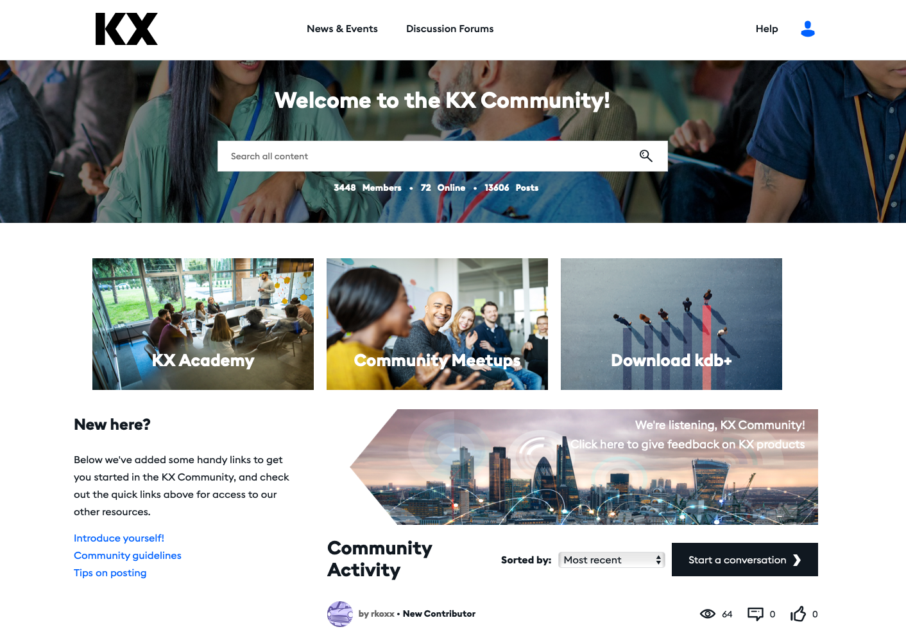
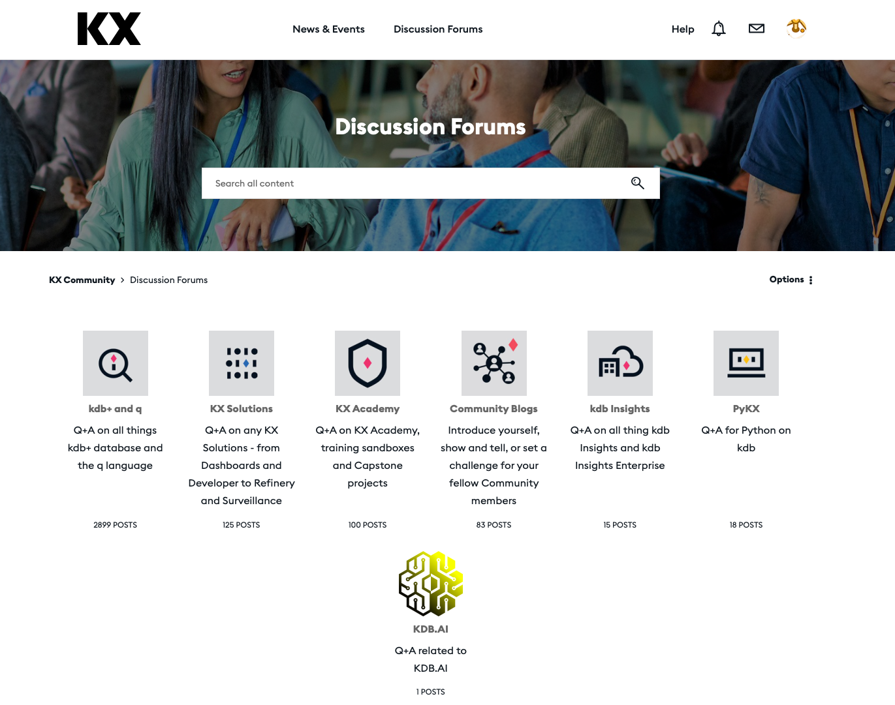
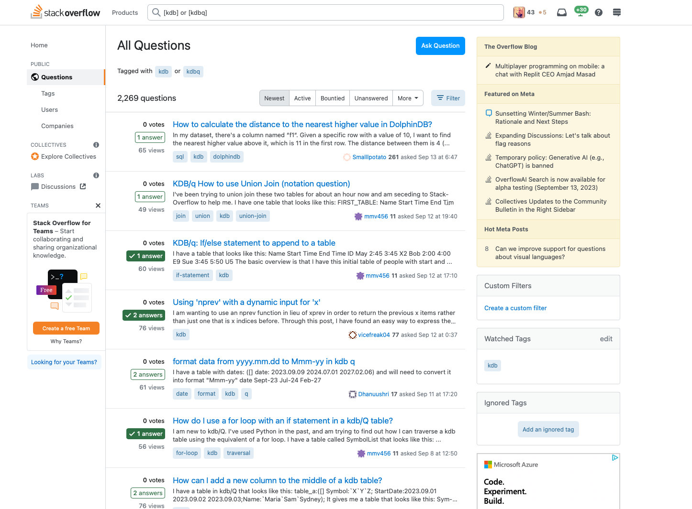

So, you've delved into 'Q for Mortals' and a few other fundamental references I shared with you in my previous [post](https://defconq.tech/blog/Go-To%20KDB/Q%20Learning%20Resources), immersed yourself in code, tutorials, and successfully tackled your initial tasks. However, as you progress, you inevitably encounter that frustrating error. You try the different approaches you normally attempt when running into an error but you've exhausted every strategy, set breakpoints, meticulously stepped through the code, and yet, you can't figure out what's wrong with your code. Maybe you've encountered a challenge you are unsure how to tackle or perhaps you simply want to ensure your solution is optimal, whether in terms of execution time or memory usage. In any of these scenarios, the need for assistance arises, and in this blog post, we'll look at the different options for help with your KDB/Q challenges.  

<!--truncate-->

In the early days of KDB/Q (technically it was K back then but lets keep the history of KDB/Q for another blog post), comprehensive documentation and online resources were scarce. For those utilizing KDB/Q in a professional capacity, one option was to register with your work email address on a listbox/topicbox email distribution list. Here, you could post your questions or inquiries, relying on the hope that experienced and knowledgeable developers within the community would offer responses. Nevertheless, if you weren't using KDB/Q in a professional context or attempted to learn it independently, there were limited documentation and resources at your disposal.

Over time, the KDB/Q community expanded, leading to more comprehensive documentation and increased resources for seeking assistance. While KDB/Q doesn't enjoy the same level of all-pervasive online information as Python, where a simple Google search for 'How to do XYZ in Python' yields countless results, you can still depend on the two sources mentioned below to access support."

## KX Community

In September 2021, KX launched the KX Community, an online forum designed to serve as a centralized hub for all your KDB/Q inquiries. Within this forum, queries and issues are categorized into various discussion topics, including KDB/Q, KX Solutions or Products, KX Academy (which I previously discussed [here](https://defconq.tech/blog/Go-To%20KDB/Q%20Learning%20Resources#kx-academy)), KX Insight, or their latest offering, KDB.AI.

The forum is open to anyone seeking answers related to KDB/Q, offering a user-friendly interface. It enjoys active participation from KDB/Q developers within the industry, and, notably, it is closely monitored by seasoned developers from KX. These KX experts serve as forum administrators and actively engage by responding to inquiries and questions.

In my opinion, the KX Community serves as an excellent resource for assistance when you encounter challenges. Additionally, it provides a valuable platform for acquiring knowledge about prevalent issues and their corresponding resolutions. Whether you're striving to comprehend the intricacies of KDB/Q, grappling with an architectural design query, or seeking insights into any of the KX products, this forum proves highly beneficial.

If you haven't signed up yet, go and register yourself [here](https://community.kx.com)

## Stackoverflow

If you're a developer, you're likely familiar with StackOverflow. However, for those who may not have encountered StackOverflow before, here's an analogy: StackOverflow is to programmers what Google is to non-programmers - an essential website for finding answers to all your questions.

As of the time of this writing, StackOverflow boasts a vast repository of 23,908,328 questions spanning the realms of programming, software development, and similar domains. Out of these 23 Million questions, a mere 2,269 questions are related to KDB/Q. Yes, you read that right, meaning that only **0.0095%** of all questions on Stackoverflow are related to KDB/Q. That's pretty low if you ask me. To provide a comparison, consider Python, one of the widely-used mainstream programming languages, which boasts a staggering 2.1 million questions, equivalent to approximately 9%.

The relatively limited number of KDB/Q questions on StackOverflow is combined with a lack of a robust categorization. While I consider StackOverflow a valuable platform for posting questions, I must also acknowledge that it may not offer the same level of structured organization as the KX Community.  However, it's worth mentioning that there is an active participation from experienced developers who consistently respond to KDB/Q queries, and I've personally come across valuable solutions and code snippets within the StackOverflow KDB/Q section as well. 

I consider Stack Overflow to be a valuable supplement to your repertoire of resources for addressing KDB/Q-related queries.

## Mentorship

Another approach to seek solutions for your KDB/Q queries is to explore the possibility of finding a mentor. Whether you discover a mentor within your current team or organization, or seek one externally, I recommend initiating a mentor-mentee connection with an experienced KDB/Q developer. While some highly skilled KDB/Q developers may appear intimidating at first, you may be pleasantly surprised by the willingness of most of them to offer assistance and guidance.

To summarize, the combination of KX Community and StackOverflow, along with the option of connecting with a mentor or a knowledgeable colleague, provides a comprehensive support system to address any KDB/Q-related challenges you may encounter.

Happy Coding!
