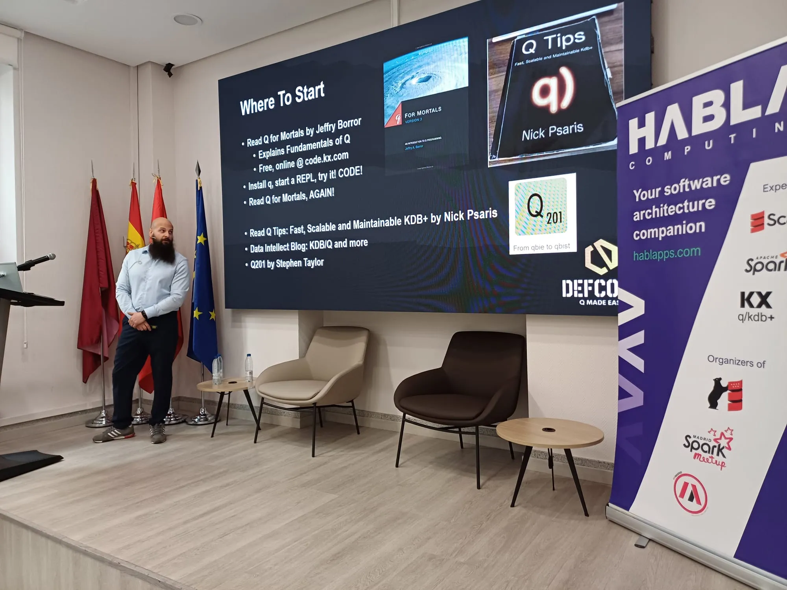
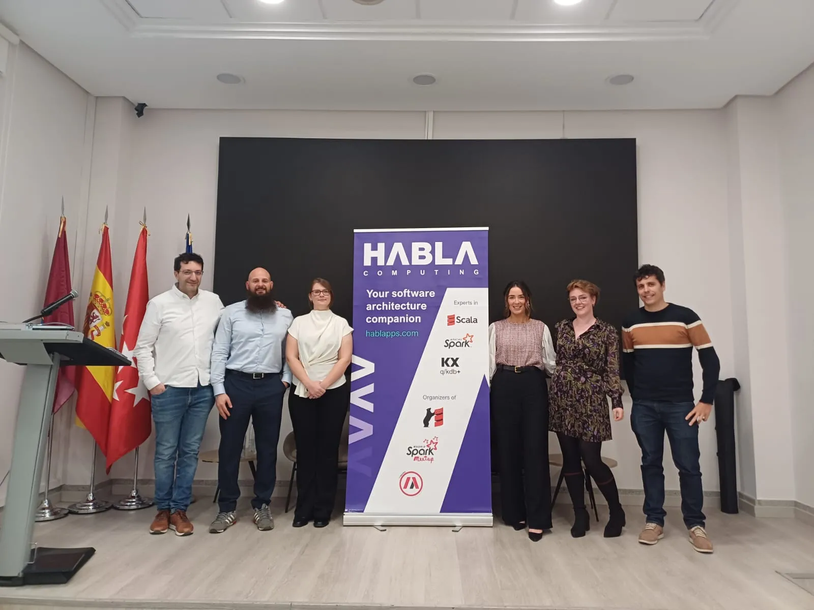

Mid January, I stumbled upon a KDB/Q meetup hosted by [Habla Computing](https://hablapps.com) in Madrid, boasting an interesting lineup of talks and speakers. Spontaneously, I opted to seize the opportunity and booked a trip to the sunny capital of Spain to attend the event. Following the meetup, during the networking session, I had the pleasure of meeting [Juan](https://www.linkedin.com/in/jserranohidalgo/), a founding partner of Habla Computing, and [Jesus](https://www.linkedin.com/in/jesús-lópez-gonzález-98237248/), the VP of Research at Habla Computing, who warmly welcomed me into the small, but growing, Spanish KDB/Q community. Engaged in a stimulating conversation about our mutual enthusiasm for KDB/Q, Juan and Jesus extended a kind invitation for me to speak at their upcoming conference, an offer I eagerly embraced. Not only did I feel honoured to have the opportunity to share my expertise on KDB/Q, but I also take every chance to escape the rainy weather of the UK and spend some time in Spain.

<!-- truncate -->

## Everything, Everywhere, All with KDB/Q - The Event

The long-awaited premiere of "Everything, Everywhere, All with KDB/Q" occurred on April 3rd, drawing a significant crowd of over one hundred online participants and 30 individuals who joined in person, making it a great success. During my presentation I shared some tips and trick for how to get started with KDB/Q as well as some insights into how to read, understand and learn KDB/Q, a topic I discussed in more details in one of my blog post available [here](https://www.defconq.tech/blog/How%20to%20Read,%20Understand%20and%20Learn%20KDB/Q%20code). I was joined on stage by amazing colleagues and peers of the KDB/Q industry, including [Zan Buchanan](https://www.linkedin.com/in/zan-buchanan-33b5a8148/) from [Data Intellect](https://dataintellect.com), along with [Aoife Clark](https://www.linkedin.com/in/aoife-clarke-638188136/) and [Rebecca Kelly](https://www.linkedin.com/in/kellyr13/) from [INQDATA](https://www.inqdata.ai). For those who missed it, you can access the event agenda and the recording of the live stream here:

## Agenda

- Welcome - [Habla Computing](https://hablapps.com)
- [Alexander Unterrainer](https://www.linkedin.com/in/alexanderunterrainer) ([DefconQ](https://defconq.tech) & [Data Intellect](https://dataintellect.com)): How to Read, Understand, and Learn KDB/Q.
- [Zan Buchanan](https://www.linkedin.com/in/zan-buchanan-33b5a8148/) ([Data Intellect](https://dataintellect.com)): Migrating kdb+ applications to the Cloud using Amazon FinSpace with Managed kdb Insights.
- [Aoife Clarke](https://www.linkedin.com/in/aoife-clarke-638188136/) & [Rebecca Kelly](https://www.linkedin.com/in/kellyr13/) ([INQDATA](https://www.inqdata.ai)): INQDATA - Quant Data, Made Easy.

<iframe width="1120" height="630" src="https://www.youtube.com/embed/3MTDH5zjDJ0?si=H8CBNdJcsEIksHFv" title="YouTube video player" frameborder="0" allow="accelerometer; autoplay; clipboard-write; encrypted-media; gyroscope; picture-in-picture; web-share" referrerpolicy="strict-origin-when-cross-origin" allowfullscreen></iframe>

## The Speakers

### [Zan Buchanan](https://www.linkedin.com/in/zan-buchanan-33b5a8148/)

Zan Buchanan is a seasoned KDB+ engineer with 6 years of hands-on experience in designing, creating, and maintaining KDB+ systems. Currently part of a dynamic team at Data Intellect, she thrives on solving complex challenges using KDB+. In her presentation "Migrating kdb+ applications to the Cloud using Amazon FinSpace with Managed kdb Insights", Zan explained how Data Intellect seamlessly integrated their open-source kdb framework, TorQ, with Amazon FinSpace with Managed kdb Insights. In her talk, Zan explored the essential considerations, challenges, and benefits of this integration. Additionally, Zan shared her and Data Intellect's experience with cloud-based solutions for financial data management using Managed kdb Insights.

### [Aoife Clarke](https://www.linkedin.com/in/aoife-clarke-638188136/) & [Rebecca Kelly](https://www.linkedin.com/in/kellyr13/)

Aoife Clarke, Head of Business Development at INQDATA is responsible for cultivating enduring partnerships that fuel sustainable client success. Her extensive experience in sales and partnership management allows her to forge strategic alliances built on mutual trust and respect. Aoife champions a client-centric approach, fostering long-term relationships with both partners and clients, ensuring aligned goals and consistent value delivery. Her dedication to client advocacy ensures that INQDATA not only delivers exceptional results today, but lays the foundation for continued success in the future.

Rebecca Kelly, Head of AI and Analytics at INQDATA, is an expert in high-performance software development, specializing in financial tick data analysis. With a background in mathematics and a master's degree in AI, Rebecca's expertise lies at the intersection of data science and technology. She was honoured as the Women in Tech New York Evangelist of the Year in 2020, recognizing her commitment to diversity and innovation in the industry. As a speaker, Rebecca shares insights into AI, analytics, and finance, inspiring audiences with her knowledge and experience.

Aoife and Rebecca introduced [INQDATA](https://www.inqdata.ai), the latest innovative startup leveraging KX technology to provide MDaaS on the Cloud, showcasing the services, use cases and solutions INQDATA has to offer. Rebecca also provided an introduction to the timeseries analysis capabilities of KX Technology for the KDB/Q learners in the audience as well as some notes on architecting KX Technology in Cloud environments for the more experienced KX users.

### [Alexander Unterrainer](https://www.linkedin.com/in/alexanderunterrainer)

As the founder of [DefconQ](https://defconq.tech), a KDB/Q tech blog, my presentation provided valuable insights and strategies to demystify the challenges that learners often encounter when starting out with KDB/Q. Drawing inspiration from the comprehensive guide found in the corresponding blog [post](https://www.defconq.tech/blog/How%20to%20Read,%20Understand%20and%20Learn%20KDB/Q%20code) at www.defconq.tech, my presentation aimed to equip attendees with the essential tools to accelerate their proficiency in KDB/Q.

## The Companies

Each speaker represented a leading company within their respective domain, drawing upon years, if not decades, of invaluable experience. With backgrounds spanning various investment banks, global financial market practitioners, and financial market technology consultancies, the collective expertise of the panelists formed an ideal lineup for this event.

### [Data Intellect](https://dataintellect.com) - Big Data Problems - Meet Smart Data Solutions

At core, [Data Intellect](https://dataintellect.com) is a data and technology consultancy firm. Their key key area of expertise is financial and capital markets technology solutions however, the utility of these solutions allows Data Intellect to apply fintech data expertise to other industries such as smart energy and healthcare. This proprietary offering is complemented by a wealth of experience in data engineering, electronic trading systems, data capture applications, regulatory and compliance systems and middle and back office enterprise web solutions. 

Some of the services provided by Data Intellect include, but are not limited to:

- **Time Series Data and KDB+**: Data Intellect understands the challenges and opportunities associated with managing and analysing time series data. By applying those same skills, Data Intellect can build and optimize solutions using other technology stacks and in other sectors.
- **Performance-based Software Enginerring**: Data Intellect's performance software-engineering team helps design, build and tune modern software solutions using a blend of performant technologies coupled with leading-edge innovations, all backed by a wealth of industry-based experience and knowledge.
- **Data Analytics & Engineering**: The team around Data Intellect is experienced in all aspects of interpreting, representing and visualizing different types of data across market-leading platforms and environments. They help clients maximize the potential of their data to enhance their decision making.
- **Solution Delivery**: From the early stages of planning and scheduling to the nuances of managing delivery timelines and achieving business outcomes, Data Intellect team will guide your project from conception to completion.
- **KDB+ Training**: Data Intellect provides tailored training delivered by their dedicated training team in a classroom or virtual setting via our online training portal complete with videos, assessments, puzzles and progress monitoring. Their training curriculum covers all their services from KDB+, C++ to Data Analytics and can be customised to your set-up.

If you would like to have more information about Data Intellect, please visit their website [https://dataintellect.com](https://dataintellect.com)

### [INQDATA](https://www.inqdata.ai)

INQDATA simplifies market data management with a cloud based solution that handles all aspects of data ingestion, storage, preparation, and quality control. Our high-performance environment, powered by the worlds fastest timeseries database kdb+, gives financial institutions faster access to cleansed, real-time, and historical datasets on-demand. With INQDATA, experience seamless data integration without the infrastructure, support or maintenance hassle.

INQDATA provides continuous intelligently curated data ready to be used without limitations:

- Programmatically ingests and hydrates data from data providers's.
- Implements sophisticated data quality functionality including codified cleansing rules and a rich, configurable user driven data tagging infrastructure.
- Utilises kdb+ to provide a highly performant data storage distribution framework, dynamically scaling with user demand.
- Provides a seamless API for data access in customer familiar tooling (Python, kdb+, R, etc…).
- Developed to fully leverage the benefits of cloud architecture.

### [DefconQ](https://defconq.tech)

If you've stumbled upon this blog post, chances are you're already familiar with DefconQ. However, if this happens to be your first visit, allow me to offer a brief introduction. DefconQ is a technology blog dedicated to all things KDB/Q. Initially conceived to aid individuals in grasping the fundamentals of KDB/Q, my aim is to simplify the complexities of the Q programming language, along with essential KDB/Q language and architecture concepts. Encountering challenges during my own journey with KDB/Q and grappling with its steep learning curve, I founded DefconQ—a KDB/Q tech blog that I wished had existed when I first embarked on this endeavor.

## The Hosts - [Habla Computing](https://hablapps.com)

Finally, I'm excited to introduce the host of this fantastic event: [Habla Computing](https://hablapps.com), your trusted companion in software architecture. Led by Juan, the founding partner, and Jesus, the VP of Research, Habla Computing drives digital transformation through functional programming and language-driven architectures. Among their array (pun intended) of services, Habla Computing offers:

- Architecture: You can count on their knowledge and experience in designing well-founded libraries, frameworks and applications, to grow your codebase from a solid start or re-engineer major components from solid principles
- Consulting: Habla Computing helps companies to ensure that technology issues are kept under control during the whole project life-cycle. 
- Training: Condensed training in Scala and KDB/Q as well as tailor-maded courses for you or your development team.

## Conclusion

In summary, the event was a resounding success. Although the turnout in Madrid could have been higher, we were delighted to be joined by over a hundred attendees online from various corners of the globe. The lower attendance in Madrid can be attributed to competing events and the allure of enjoying the event from the comfort of one's home. Personally, I thoroughly enjoyed meeting colleagues and peers and had a great time presenting. It's inspiring to witness the expansion of the KDB/Q community beyond traditional financial hubs like London or New York. Additionally, I'm pleased to see the growing presence of female developers, highlighted by the fact that I was the only male speaker at the event. I am eagerly looking forward to many more events like this and I am committed to attending, whether as a speaker or as an attendee. . 

## Pictures

(Alexander presenting: How to get started with KDB/Q)

(The speakers and the hosts. From left to right: Juan, Alexander, Zan, Aoife, Rebecca, Jesus)

