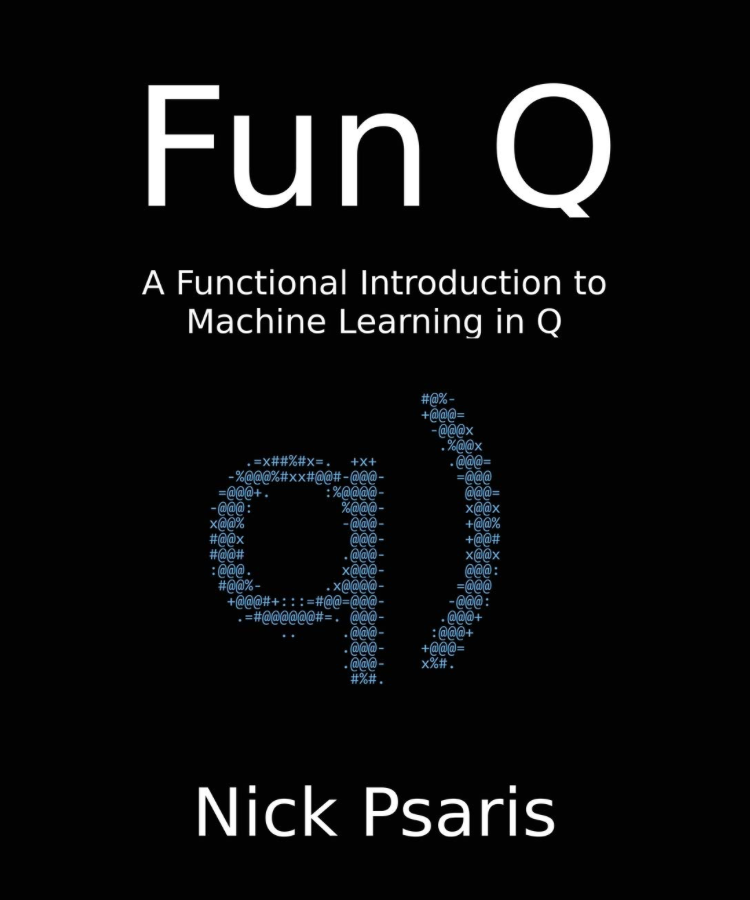
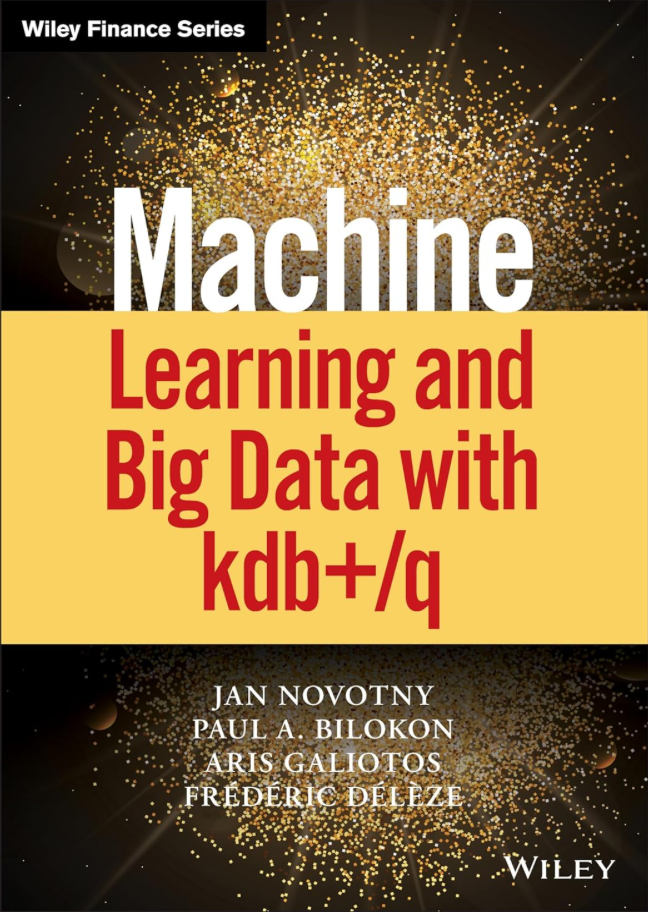
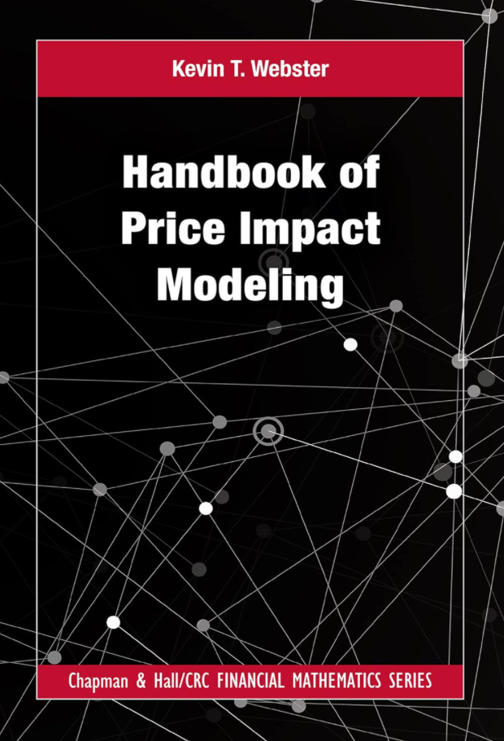

Welcome back, fellow KDB/Q enthusiasts! If you've been following my blog journey, you've likely come across one of my earlier posts where I shared my favorite [Go To KDB/Q Learning Resources](https://www.defconq.tech/blog/Go-To%20KDB/Q%20Learning%20Resources) aimed at beginners for diving into the world of KDB/Q. Congratulations on your progress thus far! Now, as seasoned learners in this domain, it's time to elevate our understanding further. In this latest post, we're shifting gears to focus on more advanced learning material. Whether you're looking to deepen your expertise or explore new horizons, join me as we explore advanced resources to expand your KDB/Q knowledge.

<!-- truncate -->

As in my earlier post, I'll organize the resources into two sections. The first section will spotlight books covering advanced KDB/Q topics. The first two books will explore machine learning techniques in KDB/Q, while the third book is targeted more at financial market practitioners and quants, discussing price impact modeling, supplemented by KDB/Q code examples. In the second section of this post, I'll unveil a collection of valuable online resources offering advanced KDB/Q insights.

## Books

### [Fun Q - A Functional Introduction to Machine Learning in Q by Nick Psaris](https://www.google.com/url?sa=t&source=web&rct=j&opi=89978449&url=https://www.amazon.co.uk/Fun-Functional-Introduction-Machine-Learning/dp/1734467509&ved=2ahUKEwiv4biv_ZKGAxX0gP0HHbyHCx4QFnoECBAQAQ&usg=AOvVaw0r3dosQluajwEz_HraaqHR)

[Fun Q - A Functional Introduction to Machine Learning in Q](https://www.google.com/url?sa=t&source=web&rct=j&opi=89978449&url=https://www.amazon.co.uk/Fun-Functional-Introduction-Machine-Learning/dp/1734467509&ved=2ahUKEwiv4biv_ZKGAxX0gP0HHbyHCx4QFnoECBAQAQ&usg=AOvVaw0r3dosQluajwEz_HraaqHR) is authored by none other than [Nick Psaris](https://www.linkedin.com/in/nickpsaris/), the KDB/Q developer behind my personal favorite KDB/Q book, Q Tips (which I've previously mentioned [here](https://www.defconq.tech/blog/Go-To%20KDB/Q%20Learning%20Resources#q-tips-by-nick-psaris)). Inspired by Andrew Ng, a pioneer in machine learning and co-founder of Coursera, and his online machine learning course, Nick embarked on re-implementing the entire curriculum in Q. Pushing Q to its limits, Nick meticulously translated all machine learning algorithms into Q, fine-tuning them multiple times to optimize code performance and reusability. While the table of contents may seem intimidating at first glance, Nick assured me that extensive mathematical knowledge isn't necessary. As he puts it, "once you see the three lines of code required to implement it (k-nearest neighbors and k-means) and play with the code, you'll be amazed by its simplicity (though the magic remains)!" It's no surprise that Nick's book has received stellar reviews from esteemed Q experts, quants, KDB/Q developers, and financial market participants alike.

**Accompanying GitHub**: [Fun Q](https://github.com/psaris/funq)

 

### [Machine Learning and Big Data with KDB+/Q by Jan Novotny, Paul A. Bilokon, Aris Galiotos, Federic Deleze](https://www.amazon.co.uk/Machine-Learning-Data-Wiley-Finance-ebook/dp/B081LNTSDV/ref=pd_sbs_d_sccl_1_2/257-8564627-3518516?pd_rd_w=Nvkbt&content-id=amzn1.sym.f5d177b3-9290-4c61-8b0e-06b08cdd933f&pf_rd_p=f5d177b3-9290-4c61-8b0e-06b08cdd933f&pf_rd_r=11E4DZMFHPR0JY2Q9D71&pd_rd_wg=2aQRF&pd_rd_r=76a40471-4589-4304-95cd-816826532247&pd_rd_i=B081LNTSDV&psc=1)

[Machine Learning and Big Data with KDB+/q](https://www.amazon.co.uk/Machine-Learning-Data-Wiley-Finance-ebook/dp/B081LNTSDV/ref=pd_sbs_d_sccl_1_2/257-8564627-3518516?pd_rd_w=Nvkbt&content-id=amzn1.sym.f5d177b3-9290-4c61-8b0e-06b08cdd933f&pf_rd_p=f5d177b3-9290-4c61-8b0e-06b08cdd933f&pf_rd_r=11E4DZMFHPR0JY2Q9D71&pd_rd_wg=2aQRF&pd_rd_r=76a40471-4589-4304-95cd-816826532247&pd_rd_i=B081LNTSDV&psc=1) marked a milestone as the first book covering machine learning with KBD/Q. This collaborative effort brings together leading figures from two worlds: quantitative finance and KDB/Q. [Paul Billion](https://www.linkedin.com/in/bilokon/), renowned quant and founder of [Thalesians](https://thalesians.com), joined forces with fellow quantitative finance experts [Jan Novotny](https://www.linkedin.com/in/jan-novotny-44865510/) and [Frederic Deleze](https://www.linkedin.com/in/frédéric-délèze-9324652/), along with [Aris Galiotos](https://www.linkedin.com/in/ftiok/), one of the most experienced KDB/Q developers in the industry, to bundle their wealth of experience and knowledge into this comprehensive guide. The book is structured into four parts, with the initial two sections dedicated to mastering KDB/Q fundamentals and core concepts—a prerequisite for leveraging the data science and machine learning techniques covered in parts three and four. 

Following a gentle introduction to KDB/Q, which covers foundational topics such as dictionaries, tables, iterators, and progresses to more advanced concepts like joins, parallelization, parse trees, and functional selects, the book dives nto an extensive array of machine learning and data science concepts. These encompass Linear Regression, Time Series Econometrics, Fourier Transformation, Eigensystems, and Simulating Asset Prices, among numerous others—too many to list within this brief paragraph. With Aris' extensive experience in designing, building, and engineering multiple large-scale enterprise systems, real-time analytics, and machine learning algorithms using kdb+, combined with the quantitative finance expertise brought by the other three authors, this book is a valuable resource for both KDB/Q developers with an interest in data science and machine learning, and financial market practitioners such as quants, researchers, or quant traders.

**Accompanying Github**: [Machine Learning and Big Data with KDB+/Q](https://github.com/hanssmail/quantQ)

### [Handbook of Price Impact Modeling by Kevin T. Webster](https://www.amazon.co.uk/Handbook-Modeling-Chapman-Financial-Mathematics-ebook/dp/B0C1JRJXQD/ref=sr_1_1?crid=32Q54VRWWIEX1&dib=eyJ2IjoiMSJ9.IXbICVzITiLXKi21nipo3A.wQpvnqpuY8cE8_fq1TBkZ7ADxcIT9eLjarjZ6Ixpcgo&dib_tag=se&keywords=Handbook+of+Price+Impact+Modeling&qid=1716026313&s=digital-text&sprefix=handbook+of+price+impact+modeling%2Cdigital-text%2C160&sr=1-1)

The third book in this series leans more toward finance rather than KDB/Q specifics. In [Handbook of Price Impact Modeling](https://www.amazon.co.uk/Handbook-Modeling-Chapman-Financial-Mathematics-ebook/dp/B0C1JRJXQD/ref=sr_1_1?crid=32Q54VRWWIEX1&dib=eyJ2IjoiMSJ9.IXbICVzITiLXKi21nipo3A.wQpvnqpuY8cE8_fq1TBkZ7ADxcIT9eLjarjZ6Ixpcgo&dib_tag=se&keywords=Handbook+of+Price+Impact+Modeling&qid=1716026313&s=digital-text&sprefix=handbook+of+price+impact+modeling%2Cdigital-text%2C160&sr=1-1), [Kevin Webster](https://www.linkedin.com/in/kevin-t-webster/)  offers practitioners and students a mathematical framework rooted in academic references to effectively apply price impact models to quantitative trading and portfolio management. Although the book primarily focuses on practical applications and essential skills for joining a quantitative trading desk, it provides only a brief introduction to KDB/Q in the appendix, spanning just over 20 pages. Nonetheless, for quantitative researchers or traders, this book offers valuable insights and guidance on how to: 
- Build a market simulator to back test trading algorithms
- Implement closed-form strategies that optimize trading signals
- Measure liquidity risk and stress test portfolios for fire sales
- Analyze algorithm performance controlling for common trading biases
- Estimate price impact models using public trading tape

**Kevin Webster, The Science of Price Impact Modeling at KXCon23**: [Youtube](https://www.youtube.com/watch?v=kZij5uX_Tm0)

## Online resources 

In the latter part of this blog post, I'll be sharing some valuable online resources. While I've previously mentioned a few of them in my initial blog post [here](https://www.defconq.tech/blog/Go-To%20KDB/Q%20Learning%20Resources) , it's worth highlighting that these resources offer an abundance of advanced topics and serve as a valuable asset for KDB/Q developers at any proficiency level. Furthermore, I've included additional resources that have been particularly beneficial in my journey as a KDB/Q developer, along with a newcomer that will to elevate your understanding of KDB/Q to new heights. If this has piqued your interest, keep reading. However, if you're new to KDB/Q and just embarking on your learning journey, feel free to check out my blog post on my recommended starting resources for KDB/Q [here](https://www.defconq.tech/blog/Go-To%20KDB/Q%20Learning%20Resources). I've enhanced my list of recommended beginner learning resources to incorporate the valuable content shared by my peers and friends at [Habla Computing](https://hablapps.com) in Madrid. Their contributions serve as a valuable asset for both novice and experienced KDB/Q developers.

### [KX](https://kx.com)

Without [KX](https://kx.com), the company behind KDB/Q and its forefront development, there wouldn't be much to discuss in the first place. Although KDB/Q was initially created by [Arthur Whitney](https://en.wikipedia.org/wiki/Arthur_Whitney_(computer_scientist)) (you can read about the history of KDB/Q [here](https://www.defconq.tech/docs/language/history)), it's currently owned and maintained by KX. Naturally, KX provides an extensive array of learning resources, including a free online version of ["Q for Mortals"](https://code.kx.com/q4m3/) by Jeffry Borror, [blog posts](https://kx.com/blog/), an extensive [reference](https://code.kx.com/q/ref/) page, [whitepapers](https://code.kx.com/q/wp/), and an [online academy](https://learninghub.kx.com/academy/) hat they've recently revamped. KX also actively fosters the [KDB/Q community](https://learninghub.kx.com/forums/) with [Michaela Woods](https://www.linkedin.com/in/michaela-woods-50502b60/) serving as just one of their evangelists. For seasoned developers, I highly recommend exploring the KX whitepapers, as they offer a wealth of valuable insights.

### [Data Intellect Blog](https://dataintellect.com/thoughts/?_sft_category=blog) 

[Data Intellect](https://dataintellect.com) not only stands as a powerhouse in KDB/Q consultancy but also generously shares their wealth of knowledge and experience through their insightful [blog posts](https://dataintellect.com/thoughts/?_sft_category=blog). Under the leadership of [Jonny Press](https://www.linkedin.com/in/jonny-press-7005602/), a legendary figure in the KDB/Q Community, alongside [Gary Davies](https://www.linkedin.com/in/drgarydavies-kdb/), another prominent and indispensable name in the KDB/Q world, the Data Intellect blog serves as an invaluable resource of knowledge. Some of their posts have even inspired my own blog entries, educating me on critical topics like understanding [memory size of KDB/Q objects](https://dataintellect.com/blog/adventure-in-retrieving-memory-size-of-kdb-object/), [garbage collection](https://dataintellect.com/blog/garbage-collection-kdb/), and [order book storage](https://dataintellect.com/blog/level-2-storage-formats/). Additionally, their blog covers a wide range of subjects including [architecture design and reviews](https://dataintellect.com/blog/ark-0-introducing-ark/), [memory properties of KDB/Q](https://dataintellect.com/blog/kdb-is-memory-hungry-right/), [version updates](https://dataintellect.com/blog/unlimited-connections-a-kdb-4-1-story/) and their implications, [framewokrs](https://dataintellect.com/blog/ark-1-kdb-framework/) as well as technologies that interface with KDB/Q. I vividly recall Jonny's KDB/Q Architecture presentation at a London KDB Meetup nearly a decade ago—it was a crucial moment where I learned invaluable insights into KDB/Q architecture design, best practices, and pitfalls to avoid. If you're seeking to enhance your KDB/Q expertise, I highly recommend diving into their blog.

### [Timestored Blog by Ryan Hamilton](https://www.timestored.com/b/)

An often overlooked but invaluable source of KDB/Q wisdom is [Ryan Hamilton's](https://www.linkedin.com/in/justryanhamilton/) blog on [Timestored](https://www.timestored.com). Ryan, a seasoned KDB/Q developer with an esteemed reputation, has build numerous large-scale enterprise systems for various investment banks. Although Ryan's primary focus is now on [Pulse](https://www.timestored.com/pulse/) (I have blogged about Pulse [here](https://www.defconq.tech/docs/productivity/pulse)), a developer platform for internal data UIs, his blog remains a treasure trove of insights derived from decades of hands-on experience. It was through his blog that I gained a deep understanding of KDB/Q's [memory management](https://www.timestored.com/kdb-guides/memory-management), knowledge I haven't found anywhere else (for a comprehensive blog about memory management, read my post [here](https://www.defconq.tech/docs/concepts/memoryManagement). In addition to the wealth of KDB/Q insights available on Ryan's blog, you also have the opportunity to download [qstudio](https://www.timestored.com/qstudio/) — an IDE originally tailored for KDB/Q but now accommodating various other databases as well.   

### [Ferenc Bodon's Blog](https://bodonferenc.github.io)

[Ferenc](https://www.linkedin.com/in/ferencbodon/) currently as the Head of Benchmarking and Engineering at KX Hungary, has a rich background as an experienced data engineer, software developer, and multilingual programmer. Before joining KX, Ferenc worked for more than a decade at Morgan Stanley, building out and extending their KDB/Q data warehouse. With expertise spanning software architecture and an academic foundation in data mining and statistics, Ferenc occasionally shares his wisdom on KDB/Q or conducts insightful comparisons between KDB/Q and other mainstream programming languages via his [blog](https://bodonferenc.github.io). Whenever he shares his insights, it's certainly worthwhile to take note.

### [Q201 by Stephen Taylor](https://q201.org)

Finally, I'm thrilled to introduce [Stephen Taylor's](https://www.linkedin.com/in/stephen-taylor-b5ba78/) initiative, [Q201](https://q201.org) - a novel learning platform tailored for KDB/Q programmers, with a keen focus on understanding the syntax and semantics of this unique language, along with vector-programming techniques. Stephen has decades of software development experience, with a particularly strong background in APL—an influence that resonates strongly in Arthur's creation of KDB/Q. Notably, Stephen also served as the librarian for the official KDB/Q documentation at KX. Personally, I consider Stephen one of the rare KDB/Q developers who not only comprehends the language's complexity but also possesses the ability and patience to educate them to us mere mortals. Initially drafted as a textbook titled "Post Atomic: Vector programming in q," Stephen opted to release the content freely as a website, aspiring to establish a communal learning hub for KDB/Q enthusiasts. The website is complemented by q201.chat on StackExchange and a Study Buddy pinboard for connecting with fellow learners. This project is particularly close to my heart, as Stephen offered me the opportunity to collaborate with him, enabling me to deepen my involvement in the community to which he's been such a pivotal contributor and advocate. For those seeking a deeper grasp of KDB/Q, I highly recommend exploring Q201.

**That's all folks. Happy Learning**

