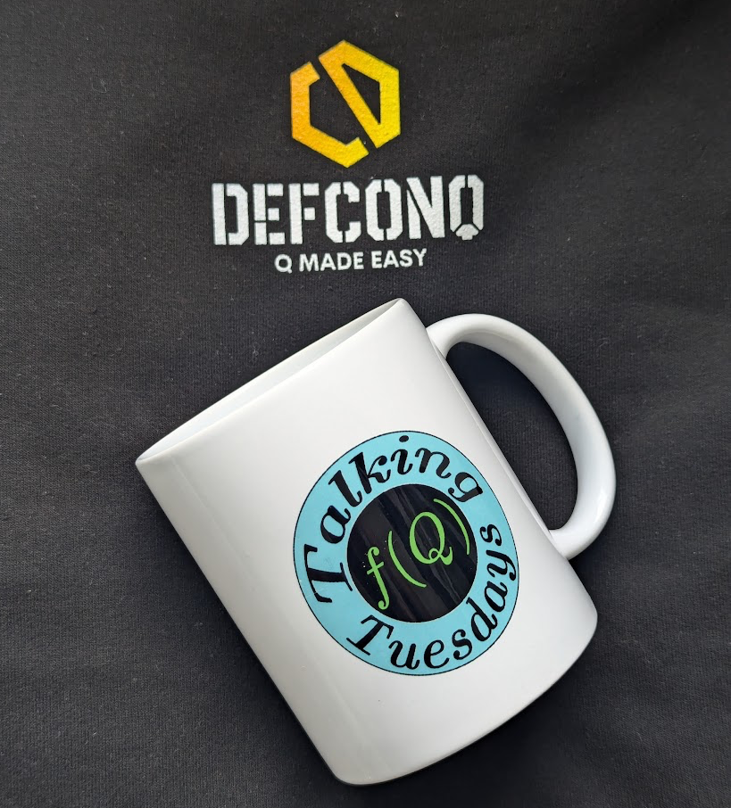

In this blog post, I have a special treat for you. I sat down with [Dimitri Bianco](https://www.linkedin.com/in/dimitri-bianco/) a seasoned quant who runs his own podcast and [YouTube channel](https://www.youtube.com/@DimitriBianco)  dedicated to all things quant finance. I have been following Dimitri for a while and always found his podcasts incredibly informative and helpful, so when the opportunity to join him on a podcast and discuss KDB/Q came up, I couldn't turn it down. Dimitri’s engagement provides graduates and students at the start of their careers with valuable insights to help them choose the right path. While I had to figure most things out on my own, Dimitri's podcast offers a valuable industry perspective into the field of quantitative finance.

<!-- truncate -->

## The host: [Dimitri Bianco](https://www.linkedin.com/in/dimitri-bianco/)

Dimitri holds a degree in Finance and Business Administration from Washington State University, as well as a Master's degree in Applied Economics from the University of Michigan. He is a seasoned full-stack quant, with expertise in model development, validation, implementation, and internal audit. Additionally, Dimitri has extensive experience in risk management, having worked for several financial institutions, including Santander Bank, in the field of quantitative finance. Beyond his impressive career, Dimitri launched his own podcast and YouTube channel nearly over a decade ago and provides advice and insights into the world of quantitative finance. His platform covers everything quant finance, the different roles available, how to break into quantitative finance, and how to build a fulfilling career.

## Talking Tuesdays: Fancy Quant meets DefconQ

Dimitri and I sat down for a chat about KDB/Q, a vector-oriented programming language. We discussed what it is, why it's so performant, its applications, and its significance in finance, particularly in quantitative finance. We also touched on the hiring process for graduates, remote work, and much more. If you missed the podcast, you can find the recording below and on [Dimitri's YouTube channel](https://www.youtube.com/@DimitriBianco). If the podcast sparked your interest in KDB/Q, I'm sharing some references for you to learn more about it:

- [Go-To KDB/Q Learning Resources](https://www.defconq.tech/blog/Go-To%20KDB/Q%20Learning%20Resources)
- [How to Read, Understand and Learn KDB/Q code (Blog Post)](https://www.defconq.tech/blog/How%20to%20Read,%20Understand%20and%20Learn%20KDB/Q%20code)
- [How to Read, Understand and Learn KDB/Q code (Conference Presentation)](https://www.defconq.tech/blog/DefconQ%20at%20Everything,%20Everywhere,%20All%20with%20KDB/Q%20by%20Habla%20Computing)
- [Unleashing the Power of Time-Series Analysis and Big Data: Why KDB/Q Reigns Supreme](https://www.defconq.tech/docs/language/why_KDB)
- [The Speed Secrets of KDB/Q](https://www.defconq.tech/docs/language/speed)

And now, without further ado:

<iframe width="1120" height="630" src="https://www.youtube.com/embed/cQmKQaJFZFg?si=3veMWaEx21Np_-xi" title="YouTube video player" frameborder="0" allow="accelerometer; autoplay; clipboard-write; encrypted-media; gyroscope; picture-in-picture; web-share" referrerpolicy="strict-origin-when-cross-origin" allowfullscreen></iframe>

