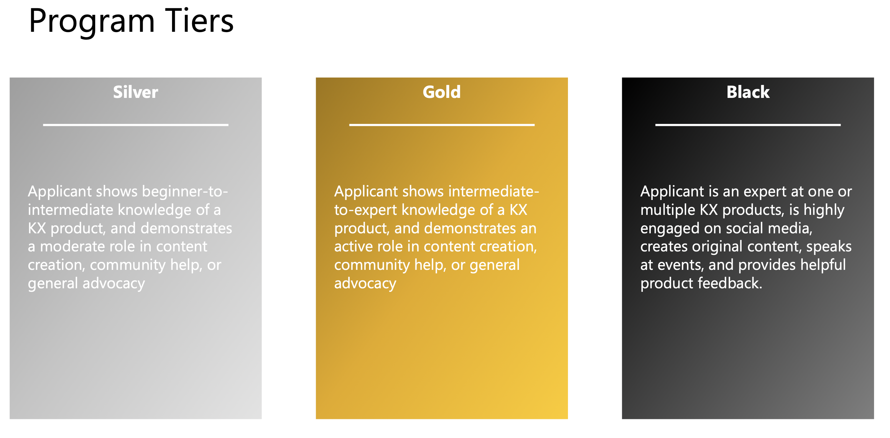
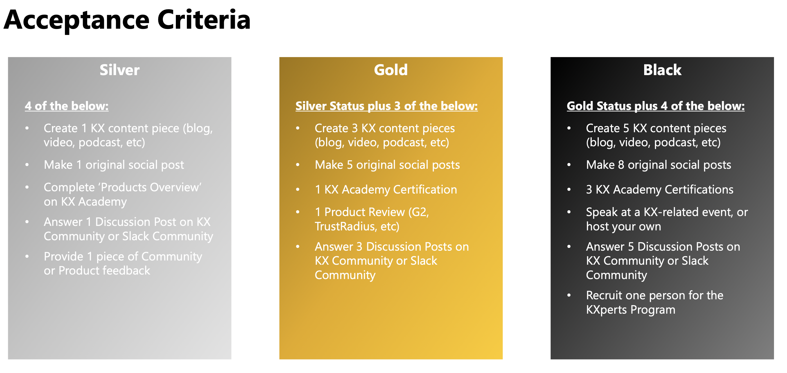
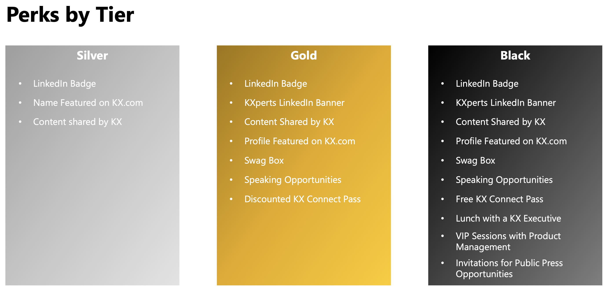
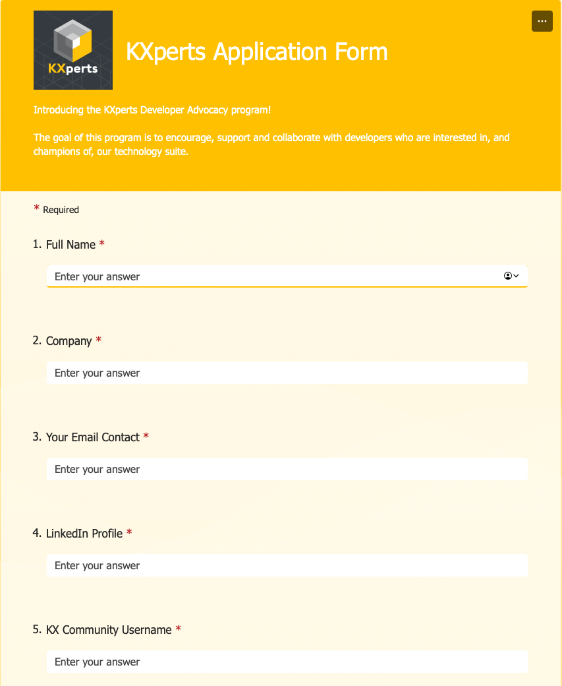

A little over a year ago, [KX](https://www.kx.com) introduced the [KXperts](https://www.kx.com/kxperts/) a team of KX developers with deep passion and expertise in KDB/Q and vector databases. Their main goal is to help developers become more proficient with KX technologies, such as [KDB/Q](https://code.kx.com/q/), [KDB.AI](https://kdb.ai), [KDB Insights](https://code.kx.com/insights/1.10/microservices/index.html), [PyKX](https://code.kx.com/pykx/2.5/) and more. The team currently consists of [Michaela Woods](https://www.linkedin.com/in/michaela-woods-50502b60/), [Michael Ryaboy](https://www.linkedin.com/in/michael-ryaboy-software-engineer/), [Ryan Siegler](https://www.linkedin.com/in/ryan-siegler-816207102/), [Laura Kerr](https://www.linkedin.com/in/laura-kerr-59046069/), and [Megan McParland](https://www.linkedin.com/in/megan-mcparland-4605b9180/), and I've had the pleasure of meeting and collaborating with most of them. The KXperts have produced a series of videos, technical blogs, tutorials, and online courses for the [KX Academy](https://learninghub.kx.com), and they host live streams and meetups, all aimed at building a robust KX community.

<!-- truncate -->

At the KX London Meetup in May 2024, KX introduced the KXperts Developer Advocacy Program, opening the KXperts team to external developers who share a passion for KDB/Q and vector databases. The main goal of this program is to encourage, support, and collaborate with developers who are enthusiastic about the KX technology suite. Due to my contributions to the KX community through [DefconQ](https://www.defconq.tech) as well as my engagement on [Stackoverflow](https://stackoverflow.com) and the [KX Discussion Forum](https://learninghub.kx.com/forums/), I have been awarded the black tier of the KXpert Developer Advocacy Program. This recognition is a significant achievement for me, and I am incredibly honored to be the first developer admitted to the program. For those interested in joining but unsure of the process, benefits, or requirements, I have prepared the following summary with all the information you need.

### KXpert Tiers

The KXperts Developer Advocacy Program consists of three different tiers, silver, gold and black, with black being the highest tier among them. Each tier has specific entry requirements and offers different benefits. Below, I have outlined how each tier is defined, the entry requirements and benefits for each tier.

Silver Tier               		 | Gold Tier				| Black Tier
:---------------------------------------:|:------------------------------------:|:-------------------------------------:
| |

### How to apply

Applying to the KXperts Developer Advocacy Program is straightforward and simple. Just fill out the form [here](https://forms.office.com/pages/responsepage.aspx?id=MmAAi833TkCPb0cZ8EFBe5SmUGAYdqNBgRUb7Zmk5fZURUhNMUpQTUEzWlZGV04zRTlMQUpHU1FKMSQlQCN0PWcu). You'll need to answer a few questions, such as **"Tell us about your KDB journey so far",** **"What do you believe makes you a good candidate for this program?"** and **"Tell us about any contributions you have made to the broader KX Community."** You can provide evidence of your contributions, such as blogs, videos, talks, or answers on Stack Overflow and the KX Community. Check it out for yourself!

[KXPerts Application Form](https://forms.office.com/pages/responsepage.aspx?id=MmAAi833TkCPb0cZ8EFBe5SmUGAYdqNBgRUb7Zmk5fZURUhNMUpQTUEzWlZGV04zRTlMQUpHU1FKMSQlQCN0PWcu)

### Conclusion

The KXperts Developer Advocacy Program is a fantastic initiative to be part of the KX Community. It provides an excellent platform to showcase your contributions, expertise, and knowledge as a KDB/Q developer. The different tiers—silver, gold, and black—offer various levels of recognition and reward, making it accessible for everyone to participate and be acknowledged at their own pace. You shouldn't feel pressured to achieve the black tier, as it requires significant commitment and might not suit everyone's preferences. Ultimately, receiving the KXpert accreditation is a great honor and sets you apart in the field, highlighting your dedication and skill in working with KDB/Q and the broader KX technology suite.
