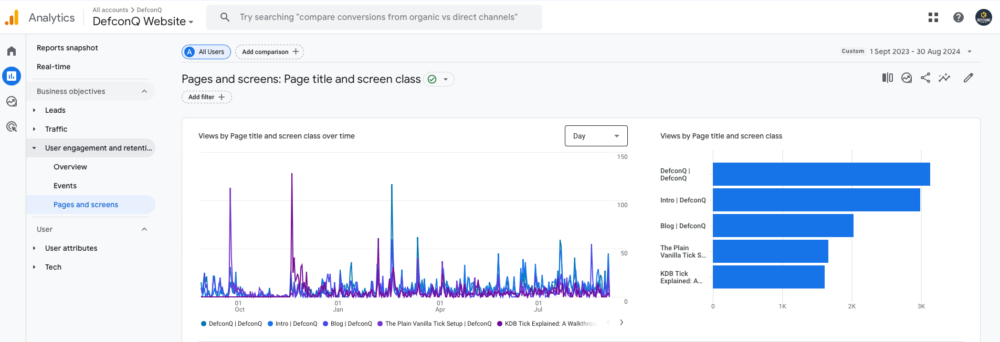
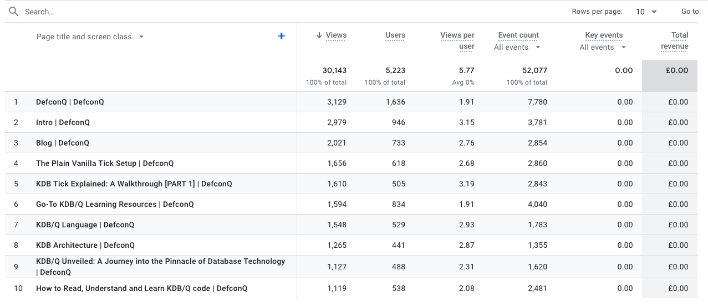
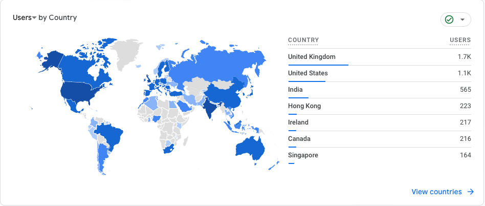
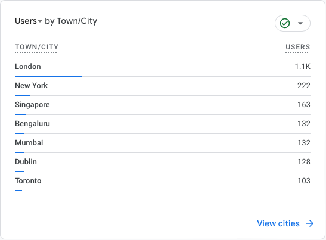
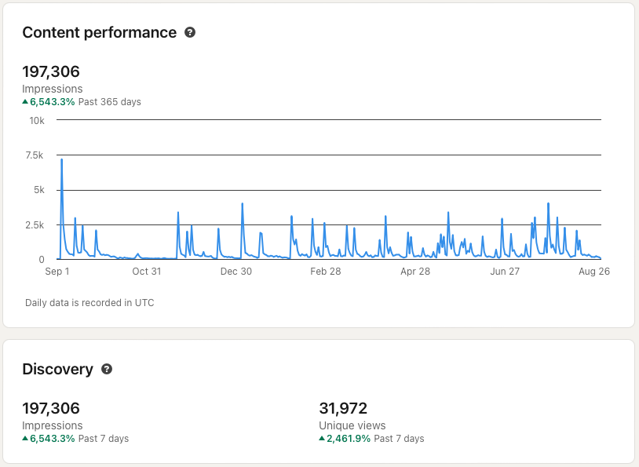
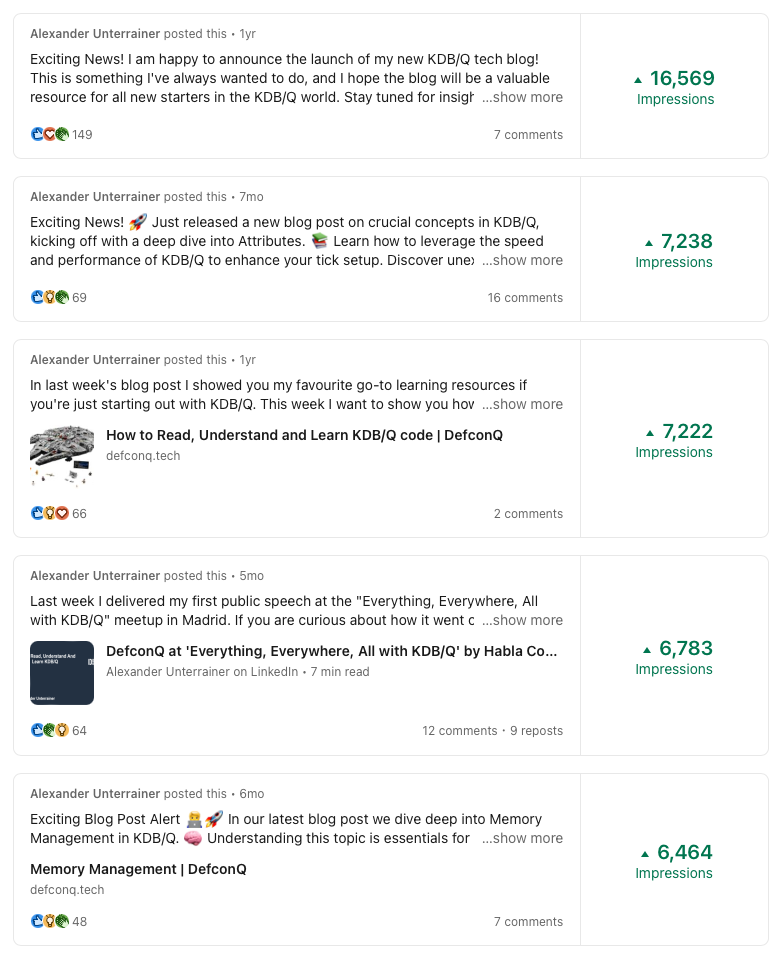
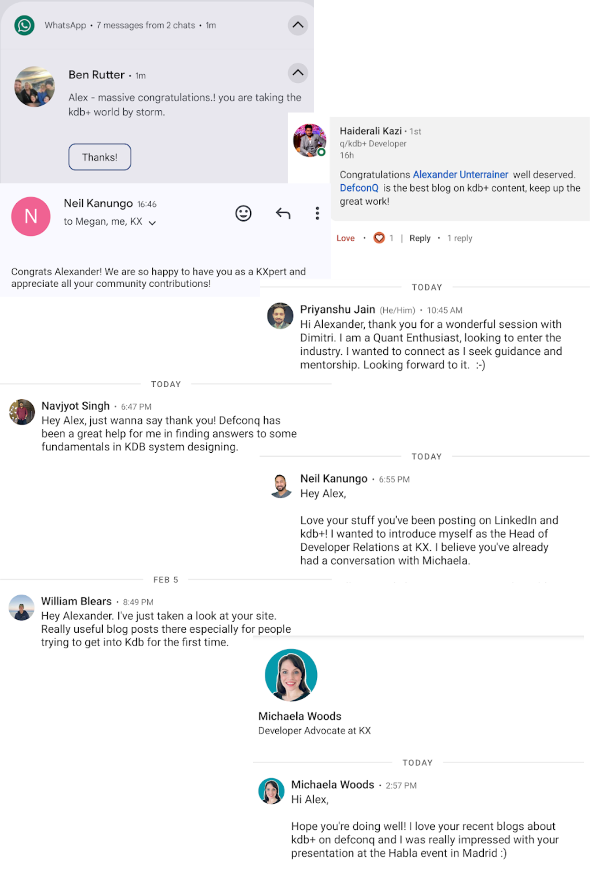

One year ago, on my birthday, I launched **DefconQ**, a KDB/Q-focused blog aimed at helping developers and KDB/Q newcomers enhance their skills or get started with the language. What began as a small personal project to motivate myself to deepen my KDB/Q knowledge quickly evolved into a valuable resource for the KDB community. I never anticipated the level of popularity, feedback, and support the blog would receive. As DefconQ celebrates its first anniversary today, I want to share some key milestones and extend my gratitude to everyone who has supported **DefconQ** in any way, whether by reading the posts, liking or sharing the content, providing me with a platform to share my knowledge, or supporting the project in other ways. Read on to discover the milestones DefconQ has achieved and what's in store for the future.


<!-- truncate -->

## DefconQ's Year in Review

### TL;DR

```
q)show TLDR:(`$("Posts";"Reach";"Followers";"Meetups & Conferences";"Livestreams & Podcasts";"Collaborations";"Awards"))!26 197306 434 3 3 1 1
Posts                 | 26
Reach                 | 197306
Followers             | 434
Meetups & Conferences | 3
Livestreams & Podcasts| 3
Collaborations        | 1
Awards                | 1
```

### Blog Posts

Let's begin with the metric that is personally the most significant for me: the number of blog posts published. Over the past year, I've shared **26** pieces of content (including this one) on my blog, ranging from blog posts to learning materials. While some pieces took more time to create than others, I've maintained an average of publishing new content every two weeks. For me, this consistency is a significant achievement. While some posts were less technical than others, I believe that most of them added value in one way or another. This is reflected in the website traffic, as shown in the Google Analytics report below.




As the breakdown shows, DefconQ received over **30,000 views** from **5,223 visitors** in the past year. The most popular posts were [The Plain Vanilla Tick Setup](https://www.defconq.tech/docs/architecture/plain), [KDB Tick Explained: A Walkthrough](https://www.defconq.tech/docs/tutorials/tick), and [Go-To KDB/Q Learning Resources](https://www.defconq.tech/blog/Go-To%20KDB/Q%20Learning%20Resources).

### Reach

A closely related metric I was particularly interested in is the actual reach of **DefconQ**. Since most updates are posted from my personal [Linkedin](https://www.linkedin.com/in/alexanderunterrainer/) account, DefconQ's standalone reach doesn't fully capture the overall impact. Therefore, I've included both my personal reach and DefconQ's reach in this analysis. We already know that the DefconQ blog attracted over **5,000** visitors last year. Now, let's take a closer look at the demographics of these visitors.




It's no surprise that the United Kingdom and the United States are the predominant countries, with London and New York being the cities with the most users. However, what comes as a surprise is the fact that even smaller countries or countries where KDB/Q is traditionally not present showed interest in DefconQ. Such countries include Brazil, Argentina, Colombia, Chile,Indonesia, South Africa, Nigeria, Ghana, Norway, Sweden, Finland or China, among others.



Although my LinkedIn account generated nearly 200k impressions over the past year, with top-performing posts averaging around 6-7k impressions each, I’m not a huge fan of this metric because it doesn’t necessarily indicate engagement. LinkedIn defines impressions as the number of times a post is visible for at least 300 milliseconds, with at least 50 percent of the post in view on a signed-in member’s device or browser window ([Source: LinkedIn](https://www.linkedin.com/help/lms/answer/a564051/content-analytics-for-your-linkedin)). However, considering that roughly 10,000 people list KDB/Q as one of their skills on LinkedIn, it’s quite impressive that my posts reach about two-thirds of them.



### Followers

Over the past year, **DefconQ** gained **434** followers on LinkedIn—a modest number, likely due to the fact that I primarily share updates from my personal account rather than the [DefconQ](https://www.linkedin.com/company/defconq/) page. Since most of my KDB/Q network is connected to my personal profile, it made sense to post updates there to reach a broader audience. However, if you're reading this and don't yet follow [DefconQ](https://www.linkedin.com/company/defconq/) on LinkedIn, I encourage you to head over and give it a follow [here](https://www.linkedin.com/company/defconq/)!

### Meetup and Conferences

#### Everything, Everywhere, All with KDB/Q by [Habla Computing](https://hablapps.com)

After attending a KDB/Q Meetup in Madrid this past January, where I had the pleasure of meeting [Juan](https://www.linkedin.com/in/jserranohidalgo/) and [Jesus](https://www.linkedin.com/in/jesús-lópez-gonzález-98237248/) from [Habla Computing](https://hablapps.com), I was invited to present at their upcoming inaugural KDB/Q Meetup titled "Everything, Everywhere, All with KDB/Q," a series designed to promote KDB/Q in Spain. This was my first public speaking engagement as a KDB/Q professional, and it was a great success. I had the honor of presenting alongside renowned peers like [Rebecca Kelly](https://www.linkedin.com/in/kellyr13/) and [Aoife Clarke](https://www.linkedin.com/in/aoife-clarke-638188136/) from [INQDATA](https://www.inqdata.ai),  as well as my colleague [Zan Buchanan](https://www.linkedin.com/in/zan-buchanan-33b5a8148/) from [Data Intellect](https://dataintellect.com). My presentation, [How to Read, Understand, and Learn KDB/Q code](https://www.defconq.tech/blog/How%20to%20Read,%20Understand%20and%20Learn%20KDB/Q%20code) was well-received by the audience. For those who couldn't attend the meetup, the recording is available for review [here](https://www.defconq.tech/blog/DefconQ%20at%20Everything,%20Everywhere,%20All%20with%20KDB/Q%20by%20Habla%20Computing).

#### KX Meetup in London

After my first public appearance in Madrid, I was honored to be invited by [KX](https://kx.com) to participate in a panel discussion at the KX Meetup in London. Joining Andrew Wilson and [Conor McCarthy](https://www.linkedin.com/in/conor-mccarthy-08aa25a7/), two highly experienced KDB/Q developers working on key components of the KX ecosystem—on a panel moderated by [Michaela Woods](https://www.linkedin.com/in/michaela-woods-50502b60/) was an incredible experience. We discussed the latest advancements in [PyKX](https://code.kx.com/pykx/2.5/), the updates introduced in KDB/Q version 4.1, and the growth and future of the KDB/Q community.

#### Iverson College 2024

After a six-year break, [Iverson College](https://iversoncollege.com), organized by the well-known [Stephen Taylor](https://www.linkedin.com/in/stephen-taylor-b5ba78/), made its return to Trinity Hall in Cambridge this summer. Iverson College is a residential event for array programming enthusiasts to explore and discuss topics related to vector programming languages. This year’s conference featured an incredibly impressive lineup of [participants](https://iversoncollege.com/participants/), including both language implementers and developers. The wealth of experience, knowledge, and expertise present made this a truly unique experience for me and one of the standout highlights of this year's KDB/Q events.

### Livestreams and Podcasts

#### Mastering KBD/Q Architecture: DefconQ meets KX

[KX](https://kx.com), along with the KXperts team led by [Michaela Woods](https://www.linkedin.com/in/michaela-woods-50502b60/), has begun hosting livestreams as part of the revamp of their KX Academy. For their second episode, I had the pleasure of joining Michaela and [Cynthia Faus Viadé](https://www.linkedin.com/in/cynthiafaus/) to discuss KDB/Q Architecture. I believe this is a fantastic initiative to spread KDB/Q knowledge and connect with a broader audience, as the livestreams are accessible from anywhere in the world. If you missed the livestream, no worries! I've written a detailed summary [here](https://www.defconq.tech/blog/DefconQ%20meets%20KX%20-%20Mastering%20KDB+%20Architecture%20-%20A%20Panel%20Discussion), which also includes the recording of the discussion.

#### DefconQ meets Fancy Quant

Another new milestone for DefconQ was joining the seasoned podcaster and YouTuber [Dimitri Bianco](https://www.linkedin.com/in/dimitri-bianco/) on his [Fancy Quant - Talking Tuesday](https://www.youtube.com/@DimitriBianco) podcast. Dimitri and I had an in-depth conversation about all things KDB/Q and Quant finance. We discussed why KDB/Q is so prevalent in the financial industry and what makes it an excellent choice for building applications. We also covered how to kickstart a career in Quant Finance, which degrees and universities are relevant, how to advance in your career, and even debated the pros and cons of living in a big city versus a more remote location. Dimitri is a fantastic host, and I thoroughly enjoyed our conversation. The podcast touches on a broad range of topics, not just KDB/Q. If you're interested in Quantitative Finance or KDB/Q, this episode is a must-listen. Don't forget to follow [Dimitri](https://www.linkedin.com/in/dimitri-bianco/) and [me](https://www.linkedin.com/in/alexanderunterrainer/) for more insights!

[DefconQ meets Fancy Quant - podcast](https://www.defconq.tech/blog/DefconQ%20meets%20Fancy%20Quant%20-%20Alexander%20Unterrainer%20and%20Dimitri%20Bianco%20discuss%20KDB/Q)

#### ArrayCast

The stellar lineup at [Iverson College 2024](https://iversoncollege.com), which included [ArrayCast](https://www.arraycast.com) host [Conor Hoekstra](https://www.linkedin.com/in/conorhoekstra/) and nearly all the regular panelists - [Stephen Taylor](https://www.linkedin.com/in/stephen-taylor-b5ba78/), [Adám Brudzewsky](https://www.linkedin.com/in/abrudz/) and Bob Therriault - made it the perfect setting to record an episode of ArrayCast in the historic halls of Trinity College, Cambridge. This also gave me the exciting opportunity to make my debut on the ArrayCast podcast as one of the many participants in this special episode. You can listen to the full episode [here](https://www.arraycast.com/episodes/episode87-iversonsession) If you're interested in Array Programming Languages, [ArrayCast](https://www.arraycast.com) is **THE** podcast to follow, so be sure to check it out!

### Collaborations 

#### Q201

At the start of this year, I received a somewhat unexpected email from [Stephen Taylor](https://www.linkedin.com/in/stephen-taylor-b5ba78/) - an APL and KDB/Q enthusiast and the former librarian of the official KX documentation, a developer who hardly needs an introduction in the KDB/Q community. Stephen shared details about his latest project, [Q201](https://q201.org), an initiative aimed at teaching and explaining KDB/Q at a deep technical and language level. He was also looking to engage more with the KDB/Q community by hosting online workshops and tutoring sessions for interested students. After discovering my blog, Stephen invited me to contribute to his project—a request I was honored to accept. How could I possibly turn down such an esteemed invitation? Since then, I’ve been assisting Stephen with reviewing the content of Q201, providing feedback on areas that might need more detail, and helping to host and coordinate several online workshops with different students. I really enjoy working on this project because it offers a different approach from mine and deepens my understanding of KDB/Q. I highly recommend Q201 to anyone interested in KDB/Q.

### Certificates and Awards

#### KXperts

One of my proudest moments this year was being recognized by KX as the first KDB/Q developer to receive the "Black Tier," the highest level in their KXpert Advocacy Program, for my work with DefconQ. This award is not only a significant honor but also the ultimate validation hat the content I create is making a valuable impact on the KDB/Q Community. If you're interested in learning more about the KXpert Advocacy Program and how to get involved, you can read about it in my blog post [here](https://www.defconq.tech/blog/KXperts%20-%20A%20Developer%20Advocacy%20Program%20by%20KX) 

### Reader's Feedback

The most rewarding achievement, however, is the overwhelmingly positive feedback I receive from my blog readers. It's incredibly fulfilling when a stranger reaches out to thank me for the content I share, expressing how my blog posts have been helpful or inspirational. That kind of feedback is truly amazing and one of my biggest motivations to continue doing what I do. Here are a few highlights of the feedback I've received over the past year.



## What the Future holds

After reflecting on the milestones DefconQ has achieved over the past year, I'd like to take this final section to look ahead at what's in store for the future. Obviously, I'll continue to post content in the form of blog posts, technical articles, podcasts, and livestreams. I also plan to keep participating in conferences and meet-ups. However, there are some new initiatives on the horizon, including in-person events for my blog readers, KDB/Q developers, and aspiring KDB/Q professionals. While I can't reveal all the exciting projects just yet, I can share that I'll be hosting an Ask Me Anything (AMA) session soon. In this AMA, I'll answer all your questions about KBD/Q, how to learn it, advance your career, break into the KDB/Q world, or anything else you'd like to know. Stay tuned, keep following my blog, and if you haven't already, be sure to follow [DefconQ](https://www.linkedin.com/company/defconq/) and [me](https://www.linkedin.com/in/alexanderunterrainer/)!


