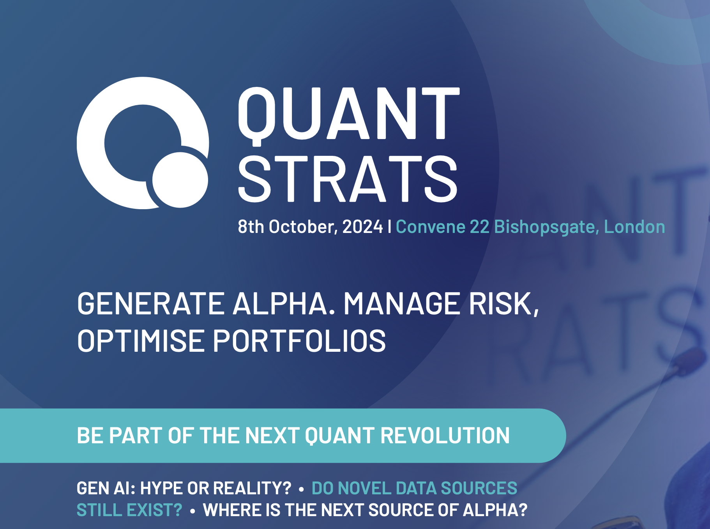
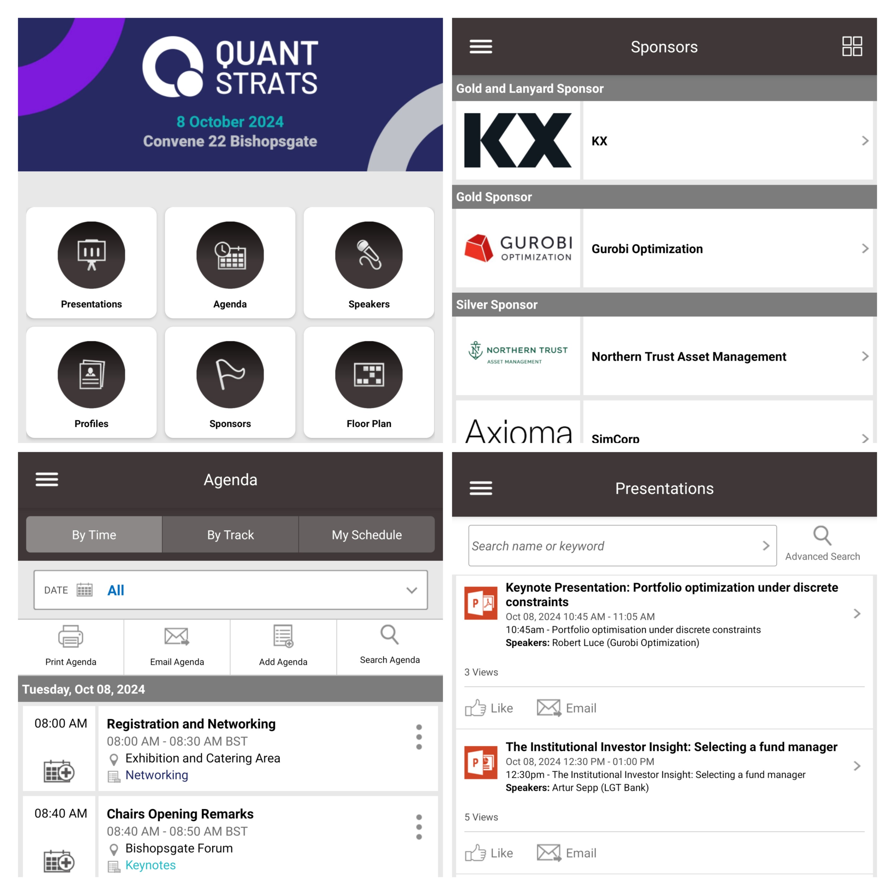

# DefconQ goes Quant Strats

**Disclaimer**: This is not a sponsored or paid blog post. I attended Quant Strats purely out of my passion and interest in Quantitative Finance and related topics. I frequently participate in meet-ups, conferences, presentations, and workshops focused on finance, quantitative finance, technology, FinTech, and crypto, driven by curiosity and enthusiasm. After all, it’s the field I work in.

# Introduction

Last week, I had the opportunity to attend [QuantStrats 2024](https://www.alphaevents.com/events-quantstratsuk) in London, one of the most highly anticipated quantitative finance conferences of the year. After a successful debut in New York last year, QuantStrats made its first appearance in the heart of the City of London, one of the world’s most historic financial hubs. While I'm sure you're eager to hear about the discussions, this post won’t be a recap of the event. Instead, I’ll focus on what made QuantStrats such a standout conference and why you should consider attending in the future if you get the chance.

<!-- truncate -->

## Content

QuantStrats featured an impressive variety of topics centered around quantitative finance, including alpha generation, risk management, portfolio optimization, and the application of generative AI in finance. A major focus of the conference was, unsurprisingly, data. With more data available today than ever before, discussions revolved around how to select, onboard, and extract maximum value from it, and how to make informed decisions based on that data. This led to presentations on AI, machine learning, NLP, and large language models (LLMs), exploring how these technologies can not only unlock value from data but also where and how they can add the most impact to an organization.

Given recent political and geopolitical developments—including two major ongoing wars and upcoming elections—another key theme was how to navigate the current macroeconomic landscape, protect assets, and continue generating alpha.

The third major topic of the conference was digital assets and crypto, focusing on how to leverage the digital assets space to diversify or hedge portfolios.

The presentations at QuantStrats were of the highest quality, thanks not only to the exceptional lineup of speakers—industry leaders from top-tier investment banks, hedge funds, asset managers, and research institutions—but also to the careful curation of content. This was overseen by a specially formed advisory board, which included some of the most prominent names in finance. Among them were **Michael Steliaros**, Global Head of Portfolio Engineering and Trading at ADIA; **Professor Petter Kolm** from NYU; **Sameer Gupta**, Head of Data Solutions at Point72; **Matt Greenwood**, CIO of Two Sigma; **Anthony Ledford**, Chief Scientist at Man AHL; **Stefan Zohren**, Deputy Director of the Oxford-Man Institute; **Florian Ielpo**, Head of Macro and Multi-Asset Portfolio Manager at Lombard Odier Investment; and **Nicole Koenigstein**, Chief Data Scientist and Head of AI & Quantitative Research at Wyden Capital.

Moreover, the conference never felt like a sales pitch. The presentations and content were entirely professional and focused on practical insights. There was just one brief session, structured as a series of five-minute elevator pitches, where five companies introduced or showcased how their data offerings, platforms, software, or tools could provide a competitive edge in the market. But that was the extent of it.

## Speakers

The speaker lineup at QuantStrats was just as impressive as the content. With over 50 experts from leading institutions across the industry, the conference truly stood out. These professionals, with years—if not decades—of hands-on experience, covered a broad range of topics including Data and Data Sourcing, AI, ML, NLP, and LLMs, Portfolio and Risk Management, Alpha Generation and Portfolio Construction, Alternative Data and Investments, Crypto, and both Micro and Macro Economics. Together, they explored current trends, anticipated future developments, and addressed the most pressing challenges in the field. 

The conference began with keynote speakers and panel discussions in the main room, while the afternoon sessions were split into different streams and tracks based on attendees’ interests. At times, the abundance of excellent speakers and presentations reminded me of being at one of the many electronic dance music (EDM) festivals I attend when I’m not blogging about KDB/Q—where you have to prioritize and choose between your favorite DJs and headliners due to overlapping set times. Similarly, at QuantStrats, I often faced tough decisions, having to pick one presentation over another. But that's certainly a good problem to have!

Some of the notable speakers included:

- **Michael Steliaros**, Global Head of Portfolio Engineering and Trading, ADIA
- **Laura Serban**, Managing Director, AQR
- **Alex Remorov**, Director, Systematic Active Equities, BlackRock
- **James Munro**, Head of ArcticDB, Man Group
- **Joe Hanmer**, Global Head of Quant, Fidelity International
- **Mark Fleming-Williams**, Head of Data Sourcing, Capital Fund Management
- **Kimiya Minoukadeh**, Director - Head of eFX Quants, ING
- **Hamza Bahaji**, Head of Financial Engineering, Amundi Asset Management
- **Amadeo Alentorn**, Head of Systematic Equities, Jupiter Asset Management
- **Justin Xu**, Managing Director, Head of Risk, Millennium Global Investments
- **Marc Vesecky**, Senior Managing Director of Global Quantitative Strategies, Variation Fund Management
- **Alessandro Balata**, Fasanara Capital
- **Barry Fitzgerald**, Co-Head of Front Office Engineering, Man Group
- **Prasad Shinde**, Lead Specialist - UK, I & MENA, KX ...and many more. 

## Attendees

The attendees at QuantStrats were equally impressive. With over 75% of the audience coming from both the buy-side and sell-side, the event truly lived up to its reputation and sparked fascinating discussions. It brought together participants from all corners of the industry, and the excitement and engagement in the buzzing rooms were tangible. It was a fantastic opportunity to connect with like-minded professionals in the quant space, exchanging ideas on the latest trends, challenges, and solutions in the field. Regardless of experience or seniority, everyone was friendly, open, and approachable. I even had an interesting conversation during the lunch break with Aric Whitewood, CEO of XAI Asset Management, and David Mascio, one of the speakers. Attendees represented some of the biggest names in the industry, including but not limited to firms like **Winton, Goldman Sachs, ADIA, Marshall Wace, Aspect Capital, Two Sigma, BlackRock, Man Group, Citadel, BlueCrest, Point72, JPMorgan, Jupiter, Balyasny Asset Management, AQR, KX, and many more**.

## Organisation

Aside from the outstanding lineup of speakers and presentations, the second most impressive aspect of QuantStrats was its flawless organization. The entire day flowed seamlessly. From arrival and registration to coordination and setup, everything was executed perfectly. The venue was carefully chosen to comfortably accommodate nearly 300 attendees. Even during the morning keynote sessions and panel discussions in the main room, it never felt crowded—there was plenty of space for everyone. The stage was visible from all angles, and audio monitors and screens ensured that everyone could see and hear the presentations clearly. The smaller breakout rooms for the afternoon sessions were just as well-equipped as the main hall.

After the individual afternoon presentations, the conference wrapped up with four interactive roundtable discussions, which added a refreshing, engaging touch.

One standout feature of the event was the app provided for the conference. Not only did it include the floor plan, agenda, and a list of all speakers and attendees, but it also offered detailed attendee profiles. You could filter by name, company, or interest, and the app even matched your interests with those of other attendees, making it easy to find common ground. You could connect with others, schedule meetings, and communicate via in-app messaging. For privacy, this was fully customizable according to your preferences.

As a final bonus, the slides and presentation decks were made available in the app after the conference. Overall, the organization was truly top-notch. While I’ve attended well-organized events before, this one set a new benchmark, raising the bar for conference standards.

It wasn't all about work—there was plenty of time to socialize, network, and enjoy the refreshments available during the three breaks throughout the day. A one-hour lunch break, featuring a healthy meal, gave everyone the chance to recharge and approach the afternoon sessions with renewed energy. In the evening, a reception and networking drinks provided the perfect opportunity to wrap up the conference in a relaxed and engaging atmosphere.

## Cost and ROI (Return on Investment)

Now that we’ve covered all the great aspects of QuantStrats, let’s talk about the price. To my pleasant surprise, the cost was quite reasonable. There were two pricing tiers: one for the buy-side and one for the sell-side, each with four phases — **Early Bird 1,Early Bird 2, Early Bird 3, and the Final Pricing phase**. For the buy-side, the prices were **£750, £850, £950, and £1,100** for each phase, respectively. On the sell-side, the prices were **£950, £1,050, £1,150, and £1,300**. Additionally, groups of three or more received a 33% discount. Overall, I believe this was a very fair price for the value provided.

## Conclusion

In conclusion, QuantStrats 2024 was an exceptional event, bringing together top-tier industry leaders, cutting-edge topics, and outstanding organization. Whether you're looking to stay up-to-date on the latest trends in quantitative finance, learn from the best in the field, or simply network with like-minded professionals, this conference offered a wealth of opportunities. The breadth of topics—from AI and machine learning to risk management and digital assets—ensured there was something for everyone, while the interactive sessions and roundtable discussions fostered meaningful dialogue and idea exchange.

## Extra Bonus: Quant Strats 2025 - New York Edition

If you’re passionate about quantitative finance, QuantStrats is an event you shouldn’t miss. And here’s some exciting news: QuantStrats will be heading to **New York in March 2025**! If you’re in or near New York, I highly recommend attending. It's an invaluable opportunity to deepen your knowledge, expand your network, and be part of one of the most impactful events in the quant space.

You can register for the event here and take advantage of the Early Bird discount. [Quant Strats 2025 - New York Edition](https://tinyurl.com/993d5zyz)

