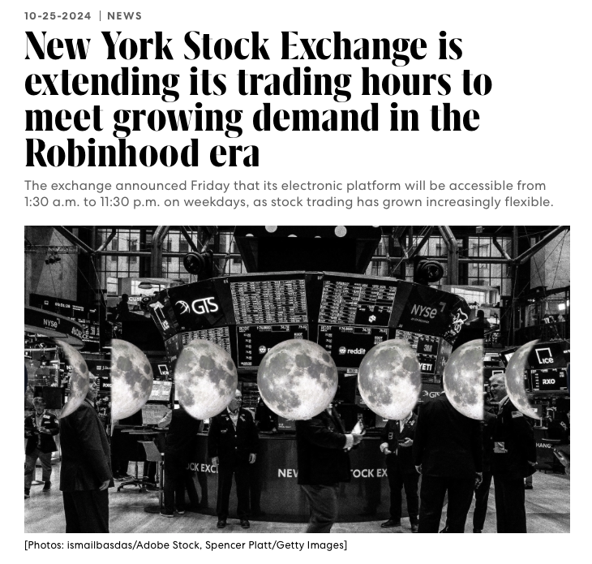

Last week, in a groundbreaking move, the New York Stock Exchange (NYSE) revealed plans to extend after-hours trading on its Arca electronic exchange. Pending regulatory approval, this would expand Arca's operating hours from 1:30 a.m. ET to 11:30 p.m. ET, Monday through Friday, offering 22 hours of trading each weekday. This development follows other major exchange announcements this year, the Texas Stock Exchange (TXSE Group), backed by BlackRock and Citadel Securities. To learn more about how these changes could reshape the electronic trading landscape, keep reading below.

<!--truncate-->

## The Plan

First things first, let's examine the New York Stock Exchange’s (NYSE) latest proposal. On Friday, the NYSE announced its plans to extend trading hours on its all-electronic Arca exchange to 22 hours a day.

This proposal aligns with growing interest in around-the-clock trading in U.S. markets. Robinhood, for example, introduced “24/5 trading” in May 2023, allowing trades from 8 p.m. ET on Sundays to 8 p.m. ET on Fridays. Meanwhile, global cryptocurrency markets already operate 24/7.

Under the new plan, NYSE Arca’s trading would open at 1:30 a.m. and close at 11:30 p.m. ET on weekdays, pending regulatory approval, according to the NYSE’s parent company, Intercontinental Exchange. Currently, extended trading hours on the NYSE range from 4 a.m. ET to 8 p.m. ET, with regular trading between 9:30 a.m. and 4 p.m. ET.

NYSE Arca, a leading platform for trading exchange-traded funds (ETFs) and over 8,000 U.S.-listed securities, would allow trading of all U.S.-listed stocks, ETFs, and closed-end funds during these expanded hours.

The proposal comes in response to rising demand for U.S. securities trading. Kevin Tyrrell, Head of Markets at the New York Stock Exchange, commented, "The NYSE’s initiative to extend U.S. equity trading to 22 hours a day, five days a week highlights the strength of our U.S. capital markets and the increasing global demand for our listed securities. As the steward of U.S. capital markets, the NYSE is proud to lead the way in providing exchange-based trading access to our U.S.-listed companies and funds for investors across global time zones."

## Redefining the Game: What NYSE's 22-Hour Trading Means for Electronic Markets

What will these extended trading hours mean for the electronic trading landscape? Opinions are divided. While some market participants believe the impact will be limited and consider the proposal premature. Jim Toes, CEO of the Security Traders Association, noted in a CNBC interview, "The application seems very premature, as the demand for overnight and weekend exchange trading is still speculative." Dmitri Galinov, former head of Credit Suisse’s dark pool, holds a different view. “There is certainly demand from international markets, especially in South Korea, Japan, and parts of Europe,” he stated in a Sunday interview with CNBC.

He also pointed out a growing interest among U.S. retail traders who wish to trade at night, noting, “Many retail traders work during the day and want the option to trade past the current 8 p.m. cutoff when they get home.”

While demand from retail traders for extended hours is evident, the key question remains: will institutional traders follow suit? Although institutional investors are unlikely to be early adopters, and trading volumes are expected to be thin initially, competition around extended trading hours is undoubtedly intensifying. Earlier this year, TXSE Group, backed by BlackRock (BLK.N) and Citadel Securities, announced plans to launch the Texas Stock Exchange in Dallas, challenging the dominance of New York-based exchanges in an effort to attract global firms. With Citadel Securities—one of the world’s largest market makers—supporting TXSE, automation and extended trading hours appear increasingly likely, broadening stock market access.

## Shifting the Clock: How Extended Hours are Transforming the Trading Tech Landscape

For software developers and engineers in the financial industry focused on trading implications, the consequences are clear: trading data volumes are poised to grow even larger. Today, we already manage unprecedented amounts of data and information, the highest in human history. While this increase in data and trading volume is a natural outcome of technological evolution, extended trading hours are likely to accelerate this growth. As financial technologists, we must adjust and adapt, prioritizing the availability and stability of our trading applications to meet these expanding demands.

## KDB/Q: The Definitive Solution for Data-Driven Finance

The next steps in response to this increase in trading volume and the corresponding rise in trading data and information are in your hands. You need to pivot toward technologies designed for big data that can manage substantial amounts of information for both real-time processing and historical data storage. Additionally, rapid computation and calculation are crucial for processing and analyzing the vast amounts of data you’re capturing. What better technology for this than KDB/Q? KDB/Q is the established go-to solution for handling, storing, processing, and analyzing big data and time series data.
 
## Next Steps

So, what are your next steps? It's clear that learning KDB/Q can provide you with a significant competitive advantage, especially if you’re starting from scratch. Luckily, I’ve just released the most comprehensive KDB/Q study plan ever created. This unprecedented study plan caters to a wide range of needs—whether you're an aspiring KDB/Q developer, a mainstream developer who needs to work with KDB/Q, a quant or quant developer focused on building efficient business logic in KDB/Q, a data or business analyst trying to make sense and looking to interpret data, or a manager overseeing a team of developers wanting to grasp the KDB/Q stack. There’s something here for everyone. So don’t hesitate—check it out here!
 
Find my unprecedented KDB/Q study plan [here](https://www.defconq.tech/docs/studyPlan/intro)

**Happy Learning!**

**Source:**
- [The New York Stock Exchange Plans to Extend Weekday Trading on its NYSE Arca Equities Exchange to 22 Hours a Day](https://ir.theice.com/press/news-details/2024/The-New-York-Stock-Exchange-Plans-to-Extend-Weekday-Trading-on-its-NYSE-Arca-Equities-Exchange-to-22-Hours-a-Day/default.aspx)
- [CNBC: New York Stock Exchange to extend after-hours trading](https://www.cnbc.com/2024/10/25/new-york-stock-exchange-to-extend-after-hours-trading.html)
- [CNBC: The pros and cons for investors of nonstop trading as NYSE looks to go 22 hours a day](https://www.cnbc.com/2024/10/28/the-pros-and-cons-for-investors-of-nonstop-trading-as-nyse-looks-to-go-22-hours-a-day-.html)
- [Reuters: BlackRock, Citadel Securities-backed TXSE Group to launch Texas Stock Exchange](https://www.reuters.com/markets/us/blackrock-citadel-backed-group-start-new-national-stock-exchange-texas-wsj-2024-06-05/)

