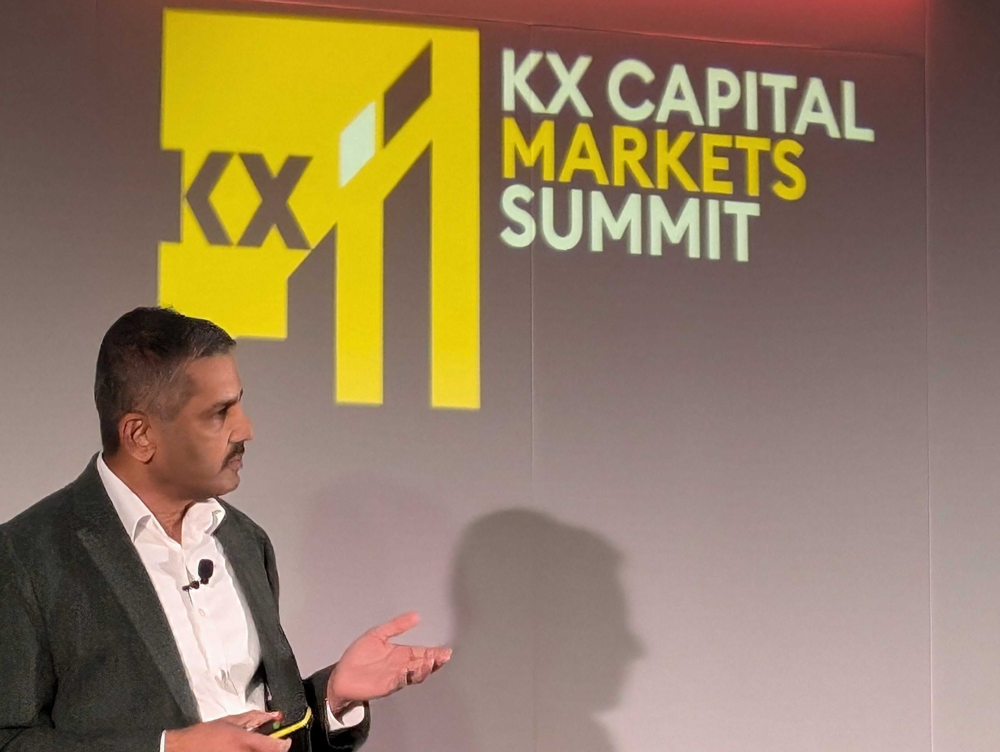
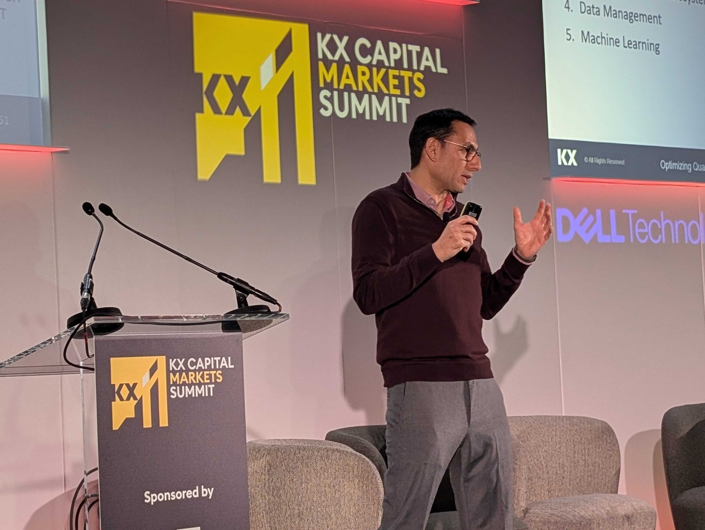
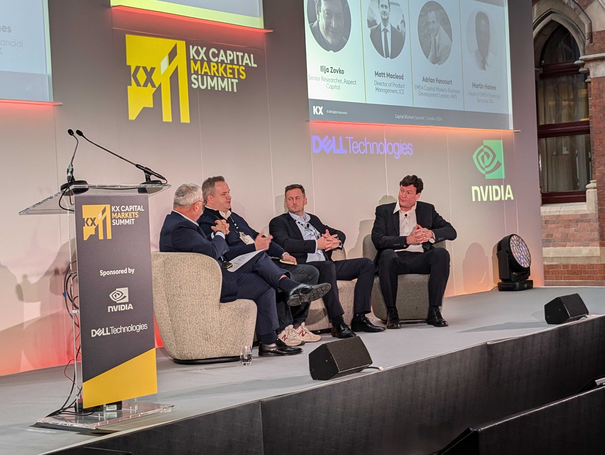
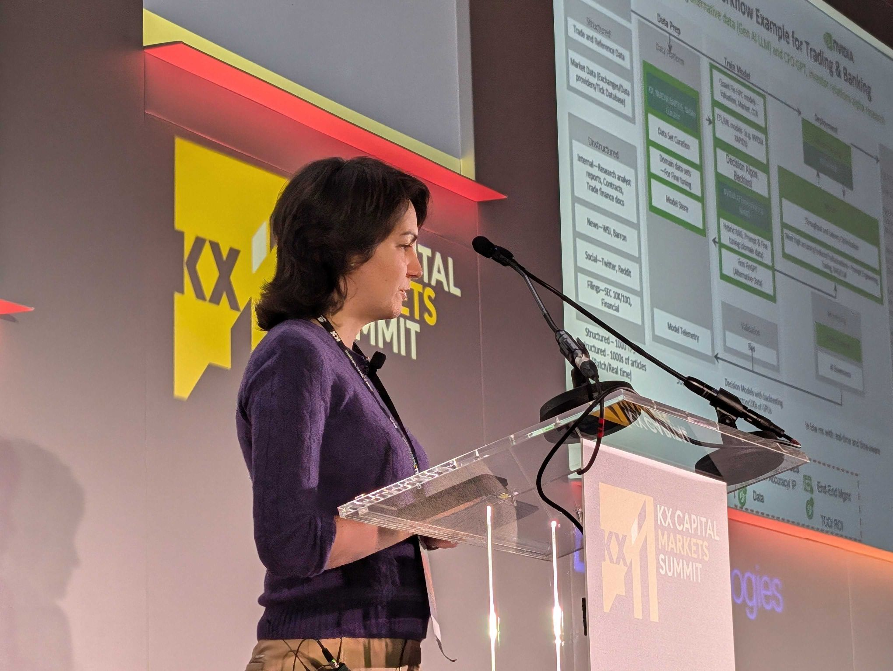
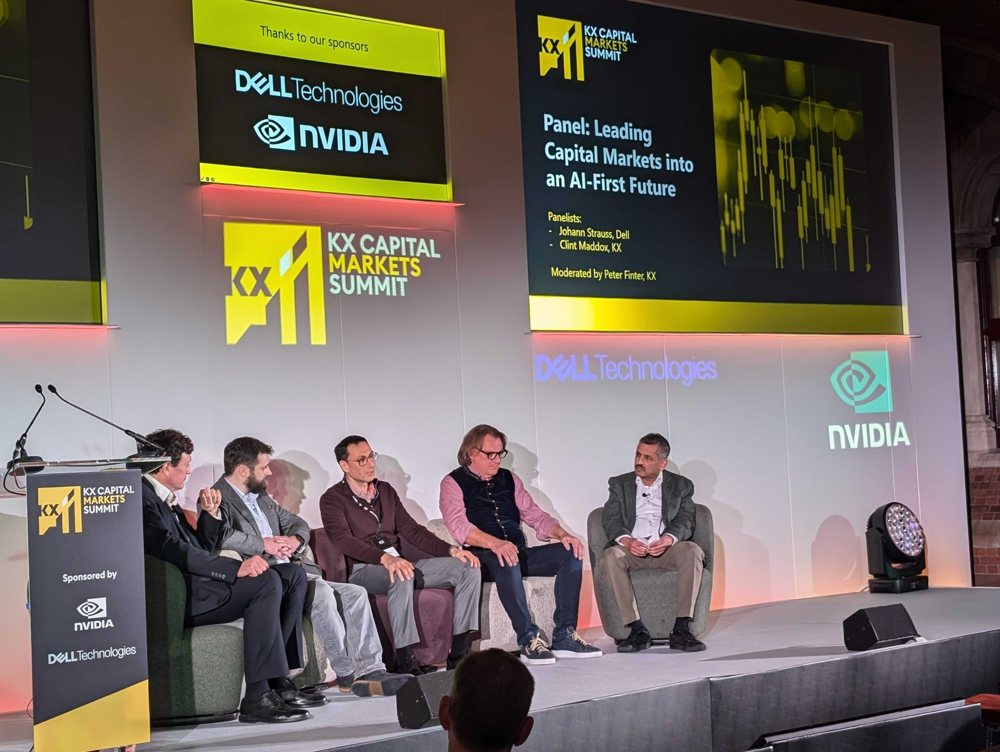

Last week, I had the pleasure of attending the **KX Capital Market Summit**. Following an invitation of my friends at [KX](https://kx.com), I joined market participants and other KDB/Q developers for a day full of keynote presentations, real-world use cases of KX products, and engaging networking sessions with fellow KDB/Q enthusiasts. 

This summit was one of the standout highlights of the year for me, as I was thrilled to hear about the latest advancements at KX, learn how market participants and industry experts leverage KDB/Q to gain a competitive edge, and see KXperts showcase innovative solutions they’ve been working on. On a personal note, it was also a wonderful opportunity to reconnect with KDB/Q developers I hadn’t seen in a while and catch up with my friends at KX. It’s an event I wouldn’t have missed for the world!

<!--truncate-->

## The New KX - Framing the AI Journey In Capital Markets

The summit began with an inspiring keynote session featuring KX CEO [**Ashok Reddy**](https://www.linkedin.com/in/areddy/) and CMO [**Peter Finter**](https://www.linkedin.com/in/peterfinter/). Ashok took us on a journey through KX’s history, from its founding in 1993 (the same year as Nvidia) to its evolution into the powerhouse it is today. He emphasized KX’s strength, speed, and transformative impact on capital markets, particularly as firms move toward an AI-first future. Highlighting KX’s mission, Ashok stated, ***“Our focus is on the technology problems so you can focus on the business problems.”***  He also introduced the concept of **AI Factories**, emphasising how they empower firms to make high-stakes, data-driven decisions and support quants in leveraging cutting-edge AI.

Next, Peter Finter delivered fascinating insights into the AI landscape. He underscored the critical role AI plays in enabling quants to uncover market patterns, speed up iteration cycles, and transform ideas into action—helping firms maintain their edge in high-speed markets. Peter noted that only ***6% of organizations achieve meaningful ROI from AI***, leaving significant room for growth. His presentation revolved around the powerful mantra: **“Survival of the Fastest.”** And if speed is the game, KX and KDB/Q undeniably sit at the summit of the data mountain!

## Optimising Quantitative Development with KDB: A Case Study in Performance and Scalability with B2C2

The first guest speaker of the day, [**Jad Sarmo**](https://www.linkedin.com/in/jad-sarmo-5b2b858/), Head of Quantitative Development at **B2C2**, delivered an insightful session on leveraging a scalable KDB/Q architecture to manage high-volume data and empower quantitative research in the fast-paced crypto space. Jad showcased how integrating tools like **PyKX, AWS, and KX Dashboards** delivers rapid insights, enhancing decision-making and maintaining a competitive edge in dynamic markets. The presentation offered valuable lessons on harnessing **KDB/Q, PyKX and KX Dashboards** for scalable data analysis and research. Attendees also gained insights into building a cloud-based KX infrastructure, illustrated through real-life challenges and benefits. This engaging session highlighted how KDB/Q’s robust and scalable architecture revolutionizes quantitative analysis in crypto, offering firms a clear advantage with actionable, rapid insights. 

A key takeaway from Jad's presentation was the emphasis on the importance of high-quality data, highlighting that recent data holds greater significance than data from a decade ago. This is particularly true in financial markets, which continuously evolve over time, unlike other industries.

## Frictionless Deployment for Capital Markets: Accelerating Time to Value

After a brief break and networking session, the day continued with the first panel discussion. [**Adrian Fancourt**](https://www.linkedin.com/in/adrian-fancourt-315489/), Head of Capital Markets Business Development, EMEA at **AWS**, joined [**Matt MacLeod**](https://www.linkedin.com/in/themacleod/) from **ICE** and [**Ilija Zovko**](https://www.linkedin.com/in/zovko/) from **Aspect Capital** to discuss he challenges faced by capital markets clients in managing data infrastructure. Ilija opened with a candid observation about the difficulty of finding interns who either know KDB/Q or are eager to learn it. My suggestion? Take advantage of the free personal trial edition or the student edition of KDB, offering a year of access that can be easily renewed. For learning KDB/Q, there’s no better place than **DefconQ** - check out my comprehensive study plan [here](https://www.defconq.tech/docs/studyPlan/intro). 

The panel explored solutions to help capital markets firms overcome infrastructure management challenges, emphasizing the need for streamlined approaches that enable data teams to focus on generating insights rather than grappling with infrastructure. Together, KX, ICE, and AWS deliver a frictionless deployment model that removes bottlenecks by handling infrastructure setup, normalizing data, and ensuring its immediate availability for analysis. This session highlighted how KX accelerates time to market and value through innovative data management and deployment strategies.

## Fixed Income Trading: It's More Than About Time 

Next up was [**Ken Garrett**](https://www.linkedin.com/in/ken-garrett-8328a312/), Head of Fixed Income eTrading at **ING**, delivering what many of my peers considered another highlight of the day. Ken explored how fixed-income trading analytics can go beyond traditional time-series and tick data. He showcased the robust capabilities of KDB and the Q programming language in managing extensive data aggregation, a critical requirement for tackling the multidimensional challenges of trading. This approach is particularly valuable in low-liquidity markets, where conventional tools often struggle. Ken's session demonstrated how KDB and Q can enhance data oversight and offer a competitive advantage in complex trading environments.

## How PyKX expands access to KX products

After a short break, which included exclusive solution showcases and 1:1 consultation sessions with KX experts, [**Conor McCarthy**](https://www.linkedin.com/in/conor-mccarthy-08aa25a7/), VP of Data Science at **KX**, As the Lead Architect of PyKX, Conor explained what PyKX is (for those unfamiliar) and why it is quickly becoming the gold standard for data access and analysis among KX clients who haven't made the transition to pure KDB/Q yet.  He highlighted how recent innovations in PyKX are elevating KX products to new heights in terms of democratization and performance.

Conor showcased exciting new features introduced in version 3.0, emphasizing PyKX's hybrid architecture that combines the speed and scale of kdb+ with seamless integration into Python’s ML and deep learning libraries, enabling advanced AI-driven algorithms and analytics workflows. Two standout upgrades were:

- **Python-First Query API**: A user-friendly API that unifies fast access to real-time and historical data within Python’s ML environment.
- **Python-First Streaming Workflows**: Enables real-time data handling within Python, simplifying the application of ML and AI models to high-frequency data streams. An impressive 95% of tasks can now be performed entirely within Python, reducing the need for extensive programming language expertise.

I had the privilege of a personal demo of these new features and must say they make life remarkably easy for Python-first developers. However, as a devoted KDB/Q enthusiast, I have to admit that my preferred language of choice remains, and will always be, KDB/Q.

For more details about PyKX, check out these two press releases and explore the official documentation available on [code.kx.com](https://code.kx.com/pykx/3.0/)

- [BigDataWire: KX Aims to Unlock Python’s Potential with PyKX 3.0](https://www.bigdatawire.com/2024/11/14/kx-aims-to-unlock-pythons-potential-with-pykx-3-0/)
- [BusinessWire: KX Supercharges Python Workloads with kdb+ Speed and AI/ML Library Integration](https://www.businesswire.com/news/home/20241112167685/en/KX-Supercharges-Python-Workloads-with-kdb-Speed-and-AIML-Library-Integration)

## Accelerated Computing and Generative AI: Applications in Finance with NVIDIA

Next, [**Lavinia Ghita**](https://www.linkedin.com/in/lavinia-ghita13/), Senior AI Solutions Architect at **NVDIA**,  explored the natural synergy between KX and NVIDIA—stemming not only from their shared inception year but also from their mutual focus on innovation. Lavinia provided valuable insights into accelerated computing and large language model (LLM) applications in finance and trading, showcasing how these technologies are revolutionizing the industry. Her presentation included an overview of the latest advancements in the field, a detailed examination of practical use cases, and guidance on accessing enterprise-ready accelerated computing infrastructure and resources. The discussion highlighted how AI solutions are transforming capital markets by mapping the journey from traditional applications to advanced AI-driven decision-making, with a focus on:

- Opportunities and implementation challenges
- Unlocking the full potential of AI
- The new AI Factory for Capital Markets and strategies to tackle common AI obstacles.

## AI beyond the hype – lessons learnt

After the final break and networking session, [**Johann Strauss**](https://www.linkedin.com/in/straussjohann/), CTO for AI Pursuit at **Dell Technologies**, delivered what I found to be the most energetic and engaging presentation of the day. Johann highlighted that while headlines often focus on massive investments in “mega clusters” by tech giants, the enterprise market is more concerned with integrating AI into business processes. He addressed the challenges enterprises face in navigating the complex AI landscape, including governance, the sway of “random vendors” influencing AI projects within business units, and the critical need for predictable costs.

Johann emphasized six core capabilities that can address the majority of enterprise AI use cases, encouraging CIOs to prioritize these foundational elements instead of attempting to build an extensive array of capabilities. His presentation focused on the "how" of implementing AI in the enterprise, advocating for a factory-style approach to drive AI adoption across organizations effectively.

## Leading Capital Markets into the AI-First Future

To close out the day, Johann Strauss (Dell), Ken Garrett (ING), Jad Sarmo (B2C2), and KX CEO Ashok Reddy shared the stage for a thought-provoking panel discussion on how capital markets firms can achieve an AI-first future.

Following the insightful session, attendees were treated to a cocktail reception that rounded off the event in style. The highlight of the evening? A magician who captivated the crowd with mind-blowing tricks, leaving even [Data Intellect](https://dataintellect.com) CTO [**Jonny Press**](https://www.linkedin.com/in/jonny-press-7005602/) utterly speechless. It was the perfect finale to an incredible day.

I looking forward to the next KX event! Until then, happy coding!
