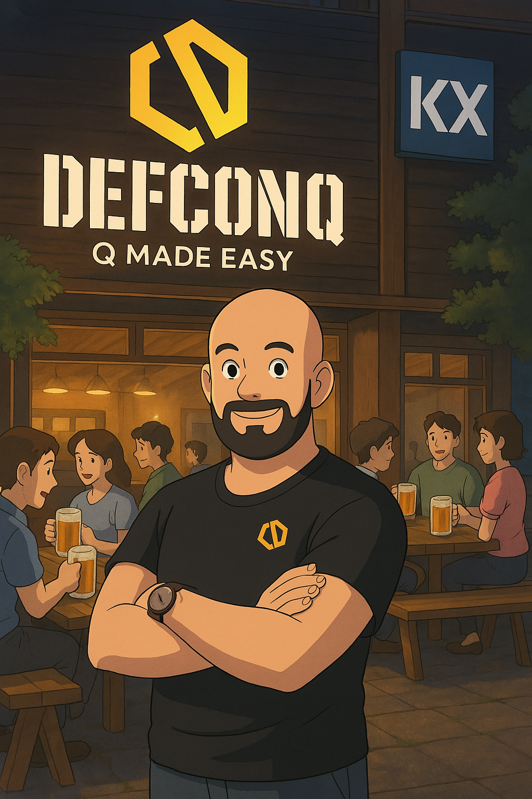

As part of our shared mission to grow the KDB/Q community in London, KX and DefconQ have teamed up and we are excited to announce the first-ever **London KDB/Q Community Happy Hour**, with many more to come! This event is open to all KDB/Q developers and enthusiasts who would like to connect, share ideas, or simply enjoy some good company over drinks.

**When: Thursday, 22nd May, from 17:30**

**Where: Flight Club, Shoreditch**

**Signup here**: [Brews & Qs Happy Hour](https://go.marketing.kx.com/kx-happy-hour-london?_gl=1*1k23ea*_gcl_au*MTk4NjUzMTI5OS4xNzQ1NzQ3Mzg4*_ga*OTcyNzM3MTIwLjE3Mjk4NTgxNjQ.*_ga_96WX6WQP6Y*MTc0NTc0NzM4OS4xNTguMS4xNzQ1NzQ4MzMzLjYwLjAuMTE1ODM1Njg5NQ..)

I’ll be your host for the evening, and thanks to the generous support of KX, the event is fully sponsored.

Whether you're a seasoned KDB/Q developer or just starting your KDB/Q journey, come join us for a fun evening with the community. Looking forward to seeing many of you there!

