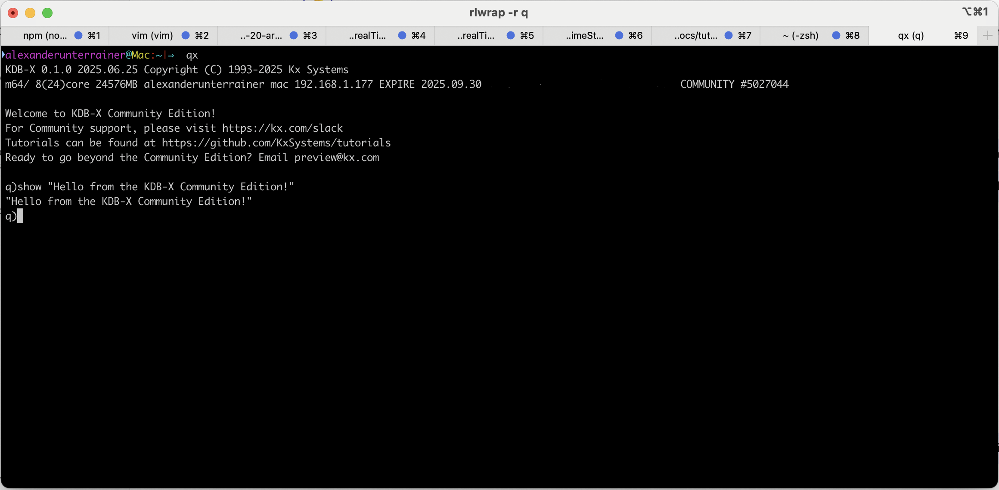

This is it ladies and gentleman! The moment we’ve all been waiting for! KX just dropped the long-promised **Community Edition**, and **IT'S FREE**. Yes!!, you read that right: **it's free**. Not for a week. Not for personal use only. **Free to use, even commercially**. Holy cow, this honestly feels like Christmas came early this year. If you're wondering what all the hype is about and why I'm so excited about this breaking news, keep reading, you don't want to miss this.

<!--truncate-->

## KDB-X: The Next Evolution of Time-Series Databases

First thing first, let's start with the biggest reveal: the name. The new KDB/Q release isn’t called 4.2 or 5.0… it’s now officially **KDB-X**. Whether this means we’re teaming up with Professor X, Wolverine, and the rest of the X-Men is still unconfirmed, but let’s just say I’m hopeful. Now, what exactly does this new edition bring? This is a public beta release, and KX has promised more features to come. But even in its current form, the offering is pretty generous. So, what’s actually included? A quick look at the product licensing page reveals that KDB-X gives you up to **16GB of RAM**, **4 secondary threads per process**, and **8 IPC connections**. Best of all, you can run it both on-premises and in the cloud, for personal and commercial use. Oh, and did I mention? PyKX is included too.

After KX made the big announcement, I couldn’t resist giving KDB-X a spin myself. I headed over to the public preview page and just a few clicks later, I was up and running with the new release. Installation? By far the smoothest KDB/Q setup I’ve experienced to date. One simple command in the terminal kicks things off, and a short guided setup later, you’re good to go.

What really stood out: transitioning from the previous version was completely seamless. No refactoring, no tweaks, no surprises. Everything just ***worked*** right out of the box.  

One frustrating **"feature"** that’s finally been removed?!? Remember trying to use the Personal Edition offline, like during travel, on a plane, or anytime you had spotty or no internet, only to be blocked because it needed to validate your license? That’s now a thing of the past. KDB-X runs completely offline with no connection required. Finally, I can actually get some work done mid-flight and take my mind off my totally irrational fear of flying (yes, I know it’s silly, but hey, we’ve all got our quirks).

Another pleasant surprise is that KX has made the Community Edition available not just for on-premise hardware, but also for cloud environments. Great news for all the cloud enthusiasts out there! Whether you're using GCP, Azure, or AWS, spinning up a virtual machine and running your KDB tick stack is now simpler than ever. Or, as LMC and U2 put it best: “Take me to the clouds above."

If you recall the promises made during the last KX meetup about a community edition, the first look at KDB-X suggests that KX is staying true to their word. While there may not be a flood of groundbreaking changes just yet, this release is a strong signal that KX is listening to its community and taking steps in the right direction. It feels like the momentum is shifting, and I’m optimistic there are plenty more updates and features on the horizon.

The fact that KDB-X Community Edition is free for commercial use is a game-changer. Within the limits of the community license, you can build, deploy, and even run production systems without spending a single penny. This opens up huge opportunities, especially for startups or smaller companies that want to prototype, test market fit, or build real-time analytics platforms without the upfront licensing costs. You get the power of KDB-X, Wall Street’s fastest time-series engine, with zero financial barrier to entry. It’s the perfect bridge to go from idea to production, and only scale up commercially when you’re ready. 

Ultimately, this is fantastic news for the entire KDB community. By lowering the entry barrier, it will attract more developers, spark greater interest, and, fingers crossed, lead to more job opportunities and roles across the industry.

So, what’s next for ***YOU***? If you’re as excited as I am about this shift and curious to explore how you can use and benefit from KDB-X, whether it’s building, testing, experimenting, or just geeking out over all things KDB, don’t hesitate to reach out. I’d love to connect and chat. In the meantime, here are some excellent resources to help you get started.

**Resources**
- [Introducing KDB-X Public Preview](https://kx.com/products/introducing-kdb-x-public-preview/)
- [Product Usage Restrictions](https://docs.kx.com/product/licensing/usage-restrictions.htm#kdb-x-personal-trial-download)
- [Go-To KDB/Q Learning Resources](https://www.defconq.tech/blog/Go-To%20KDB/Q%20Learning%20Resources)
- [How to Read, Understand and Learn KDB/Q code](https://www.defconq.tech/blog/How%20to%20Read,%20Understand%20and%20Learn%20KDB/Q%20code)
- [The Plain Vanilla Tick Setup](https://www.defconq.tech/docs/architecture/plain)
- [KDB/Q Study Roadmap](https://www.defconq.tech/docs/category/kdbq-study-roadmap)
- [KDB/Q Tutorials](https://www.defconq.tech/docs/category/tutorials)
