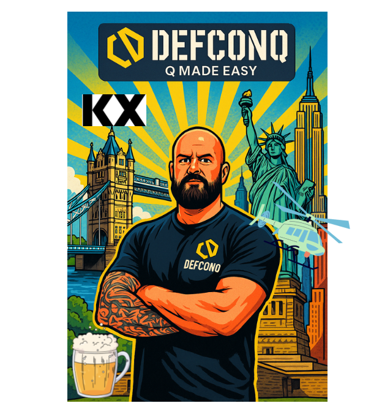

September is going to be a busy one. Just in time for **DefconQ’s 2nd birthday**,  we’re hosting **not one, but two Happy Hours**, on two different continents! I’m thrilled to announce the **Brews & Qs: Belfast Edition 🍻**, hosted by **DefconQ** and kindly sponsored by [**KX**](https://kx.com).

Join us for a relaxed evening of conversation, community, and cocktails at the KX Happy Hour, a casual meetup for **KDB/Q developers** to network, swap stories, and share ideas. Whether you’re a seasoned veteran or just starting out, this is a great opportunity to connect with others who speak your language (literally).

This session’s conversation starter: the [**public preview of KDB-X Community Edition**](https://kdb-x.kx.com/sign-in). We’ll chat about what’s new, how it might fit into your projects, and hear perspectives from fellow developers, all in an open, informal setting.

No slides, no agenda, just great conversations, good company, and a chance to strengthen your KDB-X/Q network.

<!--truncate-->

📍 You’ll find the event details and sign-up link below.
💬 If you can’t make the Happy Hour but still want to connect, drop me a message and I’ll do my best to arrange something.

**When**: Wednesday, 10th September, from 17:00

**Where**: [Tetto Garden at the Bullitt Hotel, Belfast, Northern Ireland](https://maps.app.goo.gl/dMm8gVPAjcHpiDRW9)

**Signup here**: [Event Signup](https://events.kx.com/brewsandqsbelfast)

**Linkedin Event Page:** [here](https://www.linkedin.com/events/7361852603938275328/)

Looking forward to seeing many of you there!

## About [KX](https://kx.com)

Their mission is to accelerate data and AI-driven innovation with high performance analytics solutions, enabling their customers to transform into AI-first enterprises. [KX](https://kx.com) is trusted by the world's top investment banks & hedge funds, aerospace and defense, life and health sciences, semiconductor, telecommunications, and advanced manufacturing companies. KX technology enables the discovery of richer, actionable insights for faster, better informed decision making which drives competitive advantage and transformative growth for our customers. KX operates across North America, Europe, and Asia Pacific.
