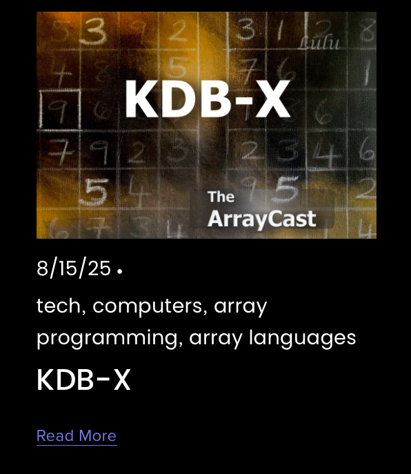

Because of a scheduling conflict and the unavailability of Stephen Taylor, panelist of the well-known **ArrayCast**, I had the privilege of stepping in for my third appearance, this time as a (guest) panelist. Or, as the former ice hockey player in me would say, I got called up as the backup goalie.

In this episode, we welcomed [Ashok Reddy](https://www.linkedin.com/in/areddy/), **CEO of KX**, who shared insights on the newly released **KDB-X Community Edition**. We covered the motivations behind this move, the current state of the community edition, and what’s coming next on the roadmap.

If you’re curious about KDB/Q, what the new community edition brings to the table, and our broader discussion, I highly recommend tuning in.

<!--truncate-->

## What Are Array Programming Languages?

Array programming languages, like APL, J, and K (the foundation of KDB/Q), are designed to operate on entire sets of data, **arrays**, with a single, concise expression. Unlike traditional languages that loop through elements one by one, array languages apply operations across whole vectors, matrices, or tables at once. This leads to **massive gains in performance, readability, and expressiveness.**  Their power lies in **thinking and coding at a higher level of abstraction**, closer to how data is naturally structured, making them a perfect choice in fields like quantitative finance, analytics, and high-performance computing. **Fewer lines, faster code, smarter execution.**

## [The Array Cast](https://www.arraycast.com)

The **Array Cast** is a podcast dedicated to the fascinating world of **array programming languages**, from [**APL**](https://en.wikipedia.org/wiki/APL_(programming_language)) and [**J**](https://en.wikipedia.org/wiki/J_(programming_language)) to [**K**](https://en.wikipedia.org/wiki/K_(programming_language)), [**Q**](https://en.wikipedia.org/wiki/Q_(programming_language_from_Kx_Systems)), and beyond. Hosted by [Conor Hoekstra](https://www.linkedin.com/in/conorhoekstra/), a well-known voice in the programming language community, the show features an expert panel including [Adám Brudzewsky](https://www.linkedin.com/in/abrudz/) (APL), [Stephen Taylor](https://www.linkedin.com/in/stephen-taylor-b5ba78/) (APL, Q), [Marshall Lochbaum](https://www.dyalog.com/dyalogue-newsletters.htm?nl=27&a=162) (J, APL, BQN), and [Bob Therriault](https://www.linkedin.com/in/bob-therriault-a096602b7/) (J). Together, they dive deep into the design, philosophy, and power of array-oriented programming, but always in a way that's engaging, insightful, and often entertaining. Even if you’ve never written a line of APL or Q, the Array Cast is worth your time: it offers a fresh perspective on problem solving, language design, and computational thinking that anyone in tech can appreciate.

## Panelists

### 🎙️ [Conor Hoekstra](https://www.linkedin.com/in/conorhoekstra/)

Research Scientist at NVIDIA, Conor works on array programming models and languages. He's the visionary host of Array Cast, co-creator of the [“Algorithms + Data Structures = Programs”](https://www.linkedin.com/company/algorithms-data-structures-programs-podcast/posts/?feedView=all) podcast, and organizer of the Programming Languages Virtual Meetup series

### 💡 [Adám Brudzewsky](https://www.linkedin.com/in/abrudz/)

Adám is a seasoned APL programmer and teacher, leading language design at Dyalog Ltd. He’s deeply involved in the APL community and continually advances the language and its ecosystem

### 📚 [Stephen Taylor](https://www.linkedin.com/in/stephen-taylor-b5ba78/)

A developer, technical writer, and educator, Stephen is an advocate for array languages, particularly APL and Q. He’s actively involved in community outreach and array-language education.

### 🛠️ [Marshall Lochbaum](https://www.dyalog.com/dyalogue-newsletters.htm?nl=27&a=162)

An array-programming language implementer at [Dyalog Ltd](https://www.dyalog.com), Marshall brings deep expertise in J, APL, BQN, and language implementation. With strong academic training (MSc in CS), he focuses on performance tuning and multi-threaded algorithm optimizations

### 🎧 [Bob Therriault](https://www.linkedin.com/in/bob-therriault-a096602b7/)

Bob is the driving force behind Array Cast, a veteran TV producer turned podcast entrepreneur based in British Columbia, he brings decades of media production experience to the show.

### [Alexander Unterrainer](https://www.linkedin.com/in/alexanderunterrainer/)

Consultant and thought leader in KDB/Q, a powerful time-series database and programming language used widely in quantitative finance. Alexander runs [DefconQ](https://www.defconq.tech), a blog, community, and learning hub focused on KDB/Q development.

## ArrayCast Guest

### [Ashok Reddy](https://www.linkedin.com/in/areddy/)

Ashok Reddy is the Chief Executive Officer of KX. In this role, he is responsible for scaling the company's growth trajectory with a mission to accelerate the speed of data and AI-driven business innovation to enable KX customers to transform into real-time intelligent enterprises.

Together, this group delivers a compelling mix of high-level expertise, language design know-how, and thoughtful programming-podcast production, and they make Array Cast a must-listen for anyone interested in computational thinking, language design, and modern array paradigms.

## Episode 112 of ArrayCast

[KDB-X](https://www.arraycast.com/episodes/episode112-kdbx)

