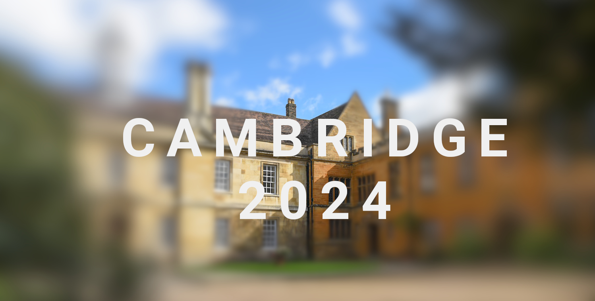
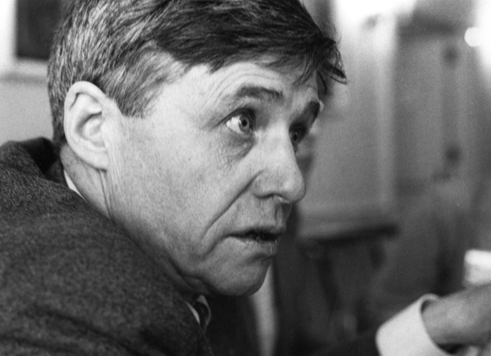

One of the true highlights of last year was being invited to [Iverson College](https://iversoncollege.com) 2024, an initiative led by [Stephen Taylor](https://www.linkedin.com/in/stephen-taylor-b5ba78/), a long-standing advocate of APL and other array programming languages. Stephen is widely known in the KDB/Q community for his contributions, particularly his work on much of the documentation still available on [code.kx.com](https://code.kx.com/home/). This post features a short video created by [Miki Yamanouchi](https://www.mikiy.com), a London based photographer and film maker, and captures key moments from the event. A heartfelt thank you to Stephen for being not just an ambassador for array programming, but a true cornerstone of our community.

<!--truncate-->

## Iverson College: A Tribute to Kenneth Iverson

Iverson College is a unique residential gathering for developers and enthusiasts of array programming languages, such as APL, J, K, q, BQN, and more, honoring the legacy of Kenneth E. Iverson. Since its inaugural meeting in 2011 at Trinity Hall, Cambridge, the event has offered an invitation-only, immersive experience where participants live, work, and learn together in an informal environment. With past editions held in places like Tuscany and Suffolk, the conference brings together both seasoned implementers and curious newcomers for lively, unscripted conversations and spontaneous talks, without any agenda, offering an atmosphere richer and more collaborative than typical conferences. Past editions of Iverson College have a rich history of attracting leading voices from the KDB/Q community, with Arthur Whitney himself attending on more than one occasion.

The community met again in August 2024 in  Cambridge, with many of the ArrayCast team members in attendance, making it one of the most eclectic and engaging gatherings to date. You can revisit some of the event’s best moments in the highlight video below as well as in the ArrayCast episode 89, which was recorded at the Iverson College 2024. 

<iframe width="560" height="315" src="https://www.youtube.com/embed/w-MyzJLHfmc?si=PxIQJbzfT2FNYP7D" title="YouTube video player" frameborder="0" allow="accelerometer; autoplay; clipboard-write; encrypted-media; gyroscope; picture-in-picture; web-share" referrerpolicy="strict-origin-when-cross-origin" allowfullscreen></iframe>

[The ArrayCast Episode 89 - The Iverson College Experience](https://www.arraycast.com/episodes/episode89-iversonreflect)

