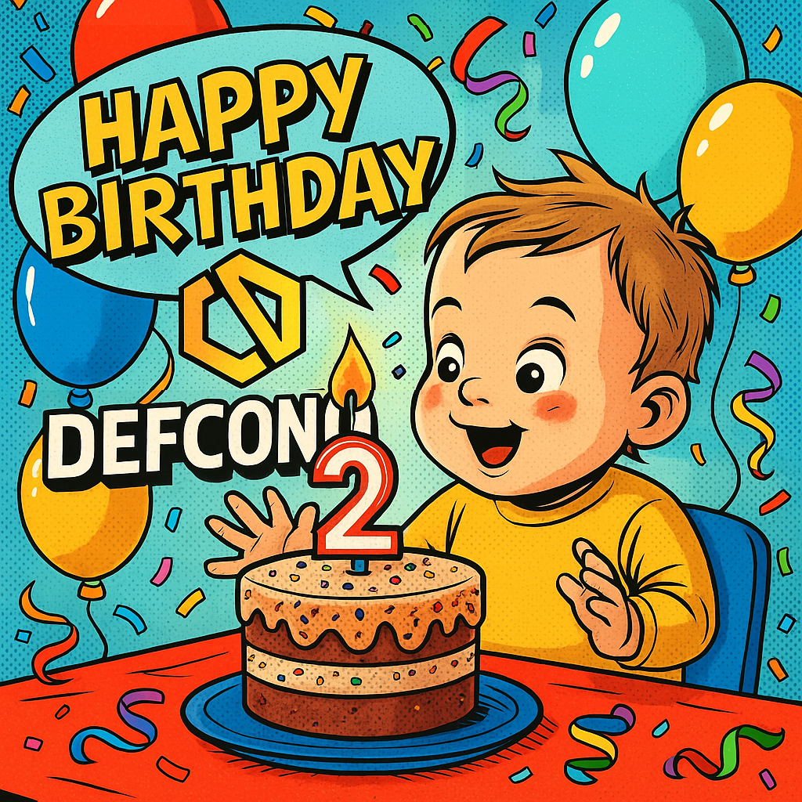
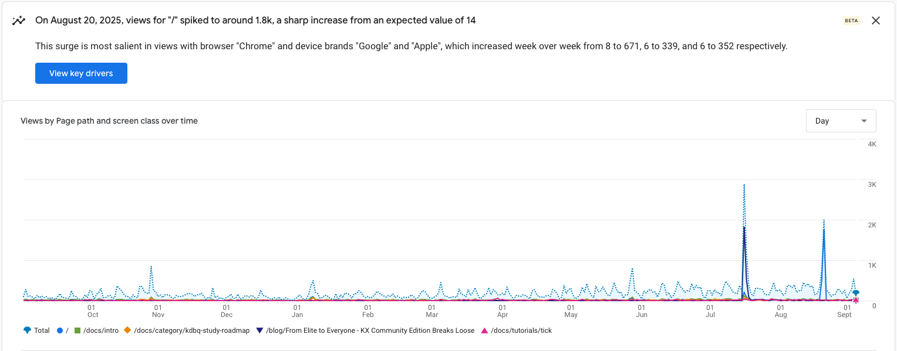
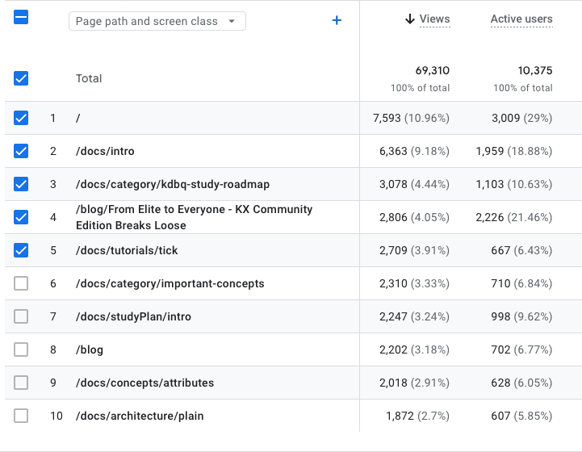
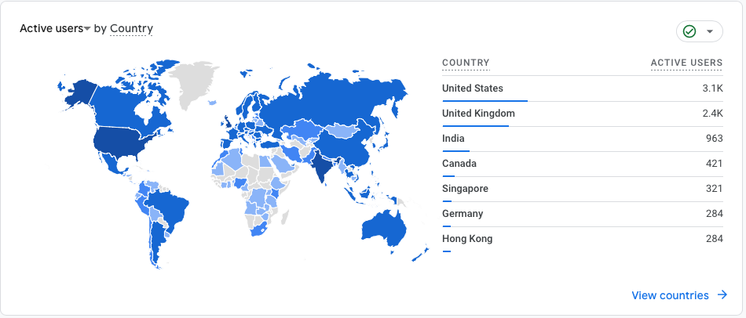
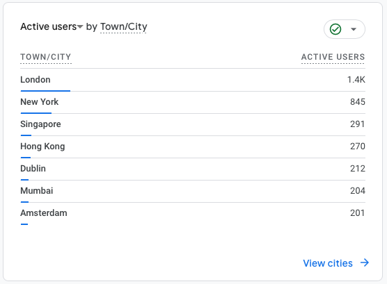
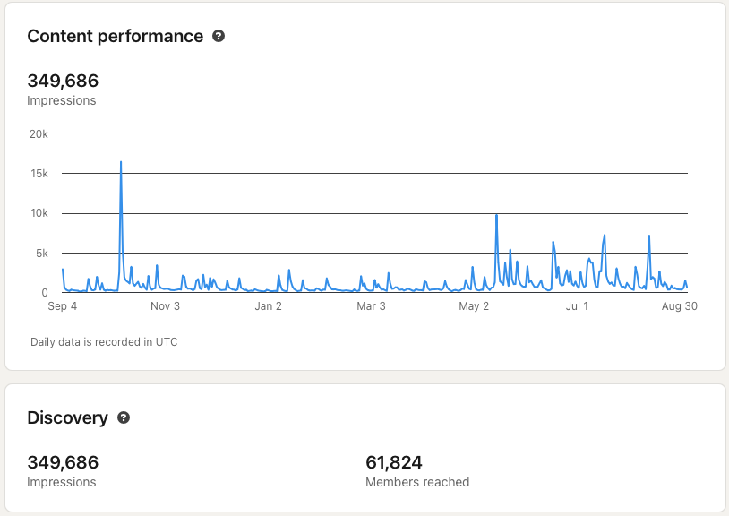
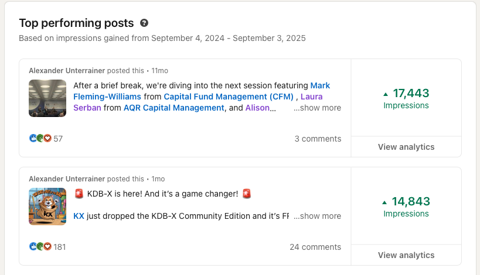

It’s hard to believe, but **DefconQ** just turned two!

What began as a small personal hobby, mainly to improve my own KDB/Q skills, has since evolved into a full-fledged side project and growing community. I never expected the blog to gain such traction, nor could I have imagined the incredible feedback and connections it would bring.

I’m truly grateful to everyone who has supported DefconQ along the way, whether you’ve subscribed to the newsletter, liked or reshared a LinkedIn post, attended a community meet-up, or simply read an article. Your encouragement and engagement mean the world to me.

As is now tradition, I’d love to share some of the highlights from the past year. Let’s take a look back and celebrate what we’ve built together. And if you’re wondering who won the **FREE PREMIUM ticket** to [**Quant Strats Europe 2025**](https://www.alphaevents.com/events-quantstratsuk), where I’ll be hosting a KDB/Q Masterclass, keep reading. The winner is revealed in this blog post!




<!-- truncate -->

## DefconQ's Year in Review

### TL;DR

The summary below highlights all DefconQ activities from September 4th, 2024 through September 4th, 2025.

```
q)show TLDR:(`$("Posts";"Reach";"Followers";"Meetups & Conferences";"Livestreams & Podcasts";"Collaborations";"Awards";"Newsletters";"Swag Store";"Bench Press PR";))!31 349686 655 1 3 0 1 2 1 120
Posts                 | 31
Reach                 | 349686
Followers             | 655
Meetups & Conferences | 1
Livestreams & Podcasts| 3
Collaborations        | 0
Awards                | 1
Newsletters	      | 2
Swag Store	      | 1
Bench Press PR	      | 120	
```

### Blog Posts

Just like last year, I want to start my recap with the metric that makes me proudest: the number of blog posts published. At its heart, DefconQ has always been about sharing knowledge and helping others learn KDB/Q. Over the past **12 months**, I published **31 blog posts**, a steady increase from the **26 articles in year one**. From deep dives into key KDB/Q concepts and hands-on tutorials, to curated resources, podcasts, community meet-ups, industry insights and news, the range of content has been both fun and rewarding to create. On average, this equates to one post every two weeks, a rhythm that shows consistency, but also reflects sustainable growth. Thank you to everyone who has read, shared, or joined along the way. Below are some highlights of the traffic and reach DefconQ achieved this year!



While DefconQ typically sees a steady flow of a few hundred visitors per day, the chart shows two significant spikes toward the end. Both are easy to trace back: the first coincides with my blog post on KDB-X, the newly launched KDB/Q community edition, while the second follows shortly after my third appearance on the ArrayCast as a guest panelist. The first spike from my blog post on KDB-X (link [here](https://www.defconq.tech/blog/From%20Elite%20to%20Everyone%20-%20KX%20Community%20Edition%20Breaks%20Loose)), drew nearly **2000 views** on its own and pushed total daily traffic past **3000**. The ArrayCast recap (link [here](https://www.defconq.tech/blog/ArrayCast%20Insights%20-%20Community%20Edition,%20Community%20Voices%20-%20Talking%20KDB-X%20on%20ArrayCast)) generated almost the same number of views, though overall traffic for that day leveled out just above 2000.



Even more impressive is the breakdown of **user activity**: over the past year, **total visits** grew from **30k** to **69k**, more than a **100%** increase. Active users also doubled, climbing from just over **5k** to more than **10k**. A clear sign that developers see real value in the content I’m sharing.

### Reach

Another key metric I track is reach, because what’s the point of creating content if it doesn’t reach people, right? Since my mission is to share KDB/Q knowledge and make this powerful array programming language more accessible, it’s important to connect with as many readers as possible. As with last year, the statistics below reflect a combination of my blog readership, my personal LinkedIn presence, and, new this year, my Substack newsletter.



One notable takeaway from the user-by-country breakdown is that the United States has now overtaken the United Kingdom, with the majority of users coming from the US. Another shift worth highlighting is Canada moving into fourth place, surpassing both Hong Kong and Ireland. While Ireland dropped out of the top ranks, Germany and Singapore made their way into the leaderboard.



On the bright side, London held onto its spot as the city with the most active users.

Much like last year, most of my blog post announcements went out via my personal LinkedIn profile, so it makes sense to look at those numbers too. And honestly, they blew me away. Impressions nearly doubled, climbing from just under **200k to 350k**.



My **top-performing posts** reached **17.5k and 15k impressions** each, and overall, more than 60k people engaged with my content. A milestone I’m truly proud of.



### Followers

Our [DefconQ LinkedIn community](https://www.linkedin.com/company/defconq/) experienced a strong growth over the past year, reaching **655 followers**, a **50% increase** compared to the first year. This is a fantastic milestone considering most of the conversations still happen through my personal profile. On top of that, my [DefconQ Substack newsletter](https://defconq.substack.com/), which I only launched a year ago, already has **173 subscribers**! If you haven’t joined yet, head over and subscribe, it’s free, and it guarantees you’ll never miss a blog post (they’ll come straight to your inbox!). 

### Meetup and Conferences

While I didn’t speak at any major conferences this year, I had the pleasure of hosting something even more special: the very **first KDB/Q Community Happy Hour** in London! Nearly **60 developers** joined at Flight Club in Shoreditch for an agenda-free evening full of darts, laughter, networking with both new and familiar faces and brilliant conversations. We stayed until the pub finally kicked us out. The energy and turnout were so encouraging that for DefconQ’s second anniversary, we’ll be hosting not one but **TWO** Happy Hours, one in Belfast and another in New York. You can read more about them here.

[September 10th, 2025: Brews and Qs Belfast Edition - KX and DefconQ Happy Hour!](https://www.defconq.tech/blog/Brews%20and%20Qs%20Belfast%20Edition%20-%20KX%20and%20DefconQ%20Happy%20Hour!)

[September 17th, 2025: New York, New York - DefconQ Goes International](https://www.defconq.tech/blog/New%20York,%20New%20York%20-%20DefconQ%20Goes%20International)

Following the **anniversary**, I’ll be back on the conference stage. On September 19th, I’ll be in New York at the [**Cornell Financial Engineering Manhattan 2025 Future of Finance & Ai Conference**](https://www.rebellionresearch.com/cornell-financial-engineering-manhattan-2025-future-of-finance-ai-conference), and in October, I’ll present a **KDB/Q Masterclass** at [**Quant Strats Europe**](https://www.alphaevents.com/events-quantstratsuk) in London. Tickets for both conferences are still available and you can get a **20% Discount** for **Quant Strats Europe** if you book via my link below.

**Tickets**:

[**Cornell Financial Engineering Manhattan 2025 Future of Finance & Ai Conference**](https://www.rebellionresearch.com/cornell-financial-engineering-manhattan-2025-future-of-finance-ai-conference)

[**Quant Strats Europe 2025**](https://www.alphaevents.com/events-quantstratsuk/srspricing-0?disc=AU-QS25&salesmethod_c=Full%20Delegate%20Sales#/)

### Livestreams and Podcasts

2025 was a **podcast-heavy** year for me, I had the opportunity to appear on **three podcast episodes** in total: twice as a guest and once as a (guest) panelist!

#### Top 10% Podcast

Back in March, I had a great chat with [Craig Whiting](https://www.linkedin.com/in/craig-whiting-b75a8ba/), MD of RLS Search, on his ***Top 10% Podcast***. We explored the world of Tech in Finance, covering everything from banking graduate schemes and nepotism in investment banks to salary progression, promotions, and more. If you’re considering a career move, navigating the job market, or just starting out, this episode is well worth a listen. Link [here](https://www.defconq.tech/blog/The%20Truth%20About%20Tech%20Jobs%20in%20Finance%20-%20Nepotism,%20Hedge%20Funds%20&%20Salary%20Secrets!)
 
#### The ArrayCast - Learning q with Alexander Unterrainer

Next up was a real highlight and milestone for me, my first solo appearance on the ArrayCast, the must-listen podcast for array programming enthusiasts. While I had previously joined a group recording during Iverson College 2024, this was the first time I had a full episode to myself, which felt special. Given that The ArrayCast has featured some of the most respected names in the KDB/Q community, it was an honor to add my voice to that list. If you’re passionate about KDB/Q or array programming in general, this one's for you. Link [here](https://www.defconq.tech/blog/The%20Array%20Cast%20-%20Where%20Code%20Meets%20Curiosity)

#### The ArrayCast - KDB-X

My second appearance on The ArrayCast this year was as a (guest) panelist, stepping in for Stephen Taylor due to a scheduling clash in Stephen's diary. In episode 112, we welcomed Ashok Reddy, CEO of KX, who shared insights into the newly released KDB-X Community Edition. Together, we explored the motivations behind this release, its current state, and what’s next on the roadmap. Whether you’re a long-time KDB/Q practitioner or just getting started with this powerful array programming language, this episode is well worth a listen. Link [here](https://www.defconq.tech/blog/ArrayCast%20Insights%20-%20Community%20Edition,%20Community%20Voices%20-%20Talking%20KDB-X%20on%20ArrayCast)

### Collaborations 

Not every collaboration I explored this year materialised, but that’s part of the journey. What I did gain were incredible new connections, inspiring conversations, and friendships that I know will spark collaborations down the road. The seeds are planted, and I’m excited for what’s to come!

### Certificates and Awards

#### Quant Strats Advisory Board

Technically, this isn’t an award or certificate, but to me, it feels like one. Earlier this year, I was honored to be nominated to the Advisory Board of [Quant Strats](https://www.alphaevents.com/events-quantstratsuk), the leading conference for quantitative professionals and finance practitioners. If you’re in finance, this is truly a must-attend event, and I can’t recommend it enough. Curious what to expect? I attended last year and shared a full recap [here](https://www.defconq.tech/blog/DefconQ%20goes%20QuantStrats%202024). Tickets for this year are still available, and with my link below, you can enjoy a **20% discount**.

[**Quant Strats Europe 2025**](https://www.alphaevents.com/events-quantstratsuk/srspricing-0?disc=AU-QS25&salesmethod_c=Full%20Delegate%20Sales#/)

### Reader's Feedback

As I shared last year, the most rewarding achievement for me is the overwhelmingly positive feedback from my readers. There’s nothing more fulfilling than when someone I’ve never met reaches out to thank me, saying my blog posts have been helpful or inspiring. More than once, I’ve had fellow developers recognize me at meetups and strike up a conversation about KDB/Q, which I’m always delighted to do. So if you ever spot me at a meetup, or even just walking around London, don’t hesitate to come and say hi. That kind of feedback is priceless, and it remains one of my strongest motivations to keep writing and sharing.

### Failures

Being my own toughest critic, I also acknowledge my failures. Last year, I promised an AMA (Ask Me Anything) session, but unfortunately, it didn’t happen. I’m making it up to you: I’ll be hosting the AMA this October, once all the meet-ups and conferences are wrapped up. During the session, I’ll do my best to answer your questions about KDB/Q, careers, or anything else you’d like to ask. It will take place on Reddit, and questions can be submitted completely anonymously. More details will be shared soon.

### Quant Strats Euoper 2025 Giveaway Winner

Now, for the highlight of this wrap-up: it’s time to announce the winner of the DefconQ Giveaway for a free premium ticket to Quant Strats Europe 2025. And of course, how better to pick a winner than with KDB/Q, after all, we are KDB/Q developers! So, without further ado, here we go.

<iframe width="560" height="315" src="https://www.youtube.com/embed/xtaFBVAQVPs?si=znLv0RGBRar451qR" title="YouTube video player" frameborder="0" allow="accelerometer; autoplay; clipboard-write; encrypted-media; gyroscope; picture-in-picture; web-share" referrerpolicy="strict-origin-when-cross-origin" allowfullscreen></iframe>


### What the Future holds

After such a successful year, the future of DefconQ has never looked brighter. I already have a few projects and ideas in the works, along with some bigger plans I’ve been developing behind the scenes. Everything will be revealed in due time, so for now, stay tuned, subscribe to my newsletter, and keep up with everything happening at DefconQ.

**Until then, happy coding!**
