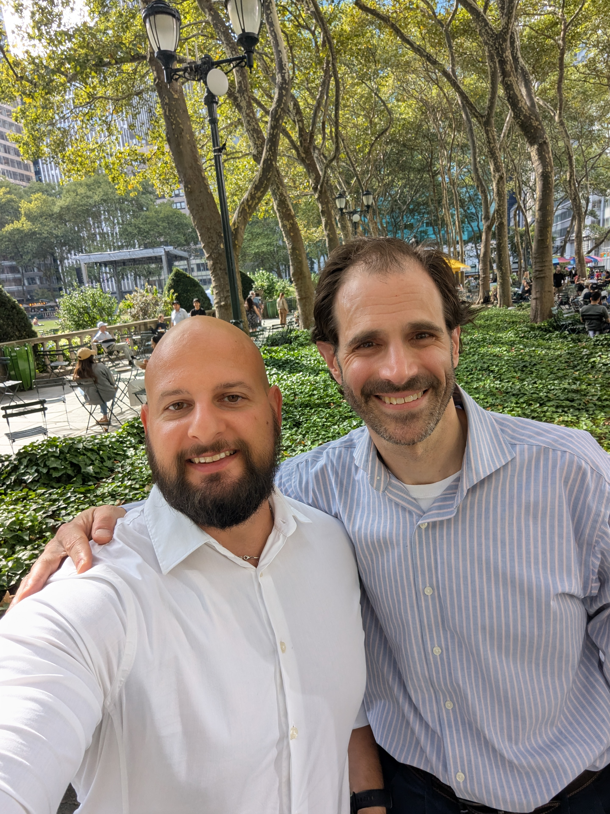
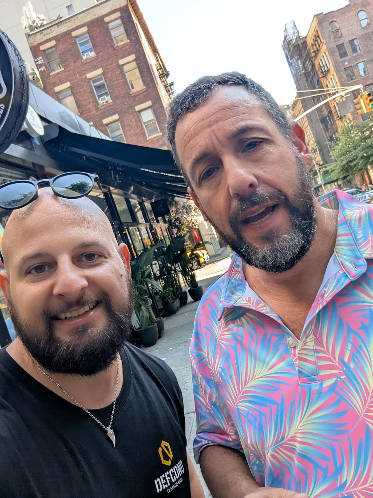

The past two weeks have been exciting. To mark **DefconQ**’s two-year anniversary, I hosted not just one, but **two Happy Hours**, one in **Belfast** and another in **New York**. Adding to the excitement, I joined a panel at one of the most prominent conferences in quant finance, right in the heart of New York. Since I was already there, I also spent some time working from my client’s office, a leading hedge fund on Wall Street. If you couldn’t make it to any of these events, no worries, this blog post recaps all the highlights.

<!-- truncate -->

## Belfast Happy Hour: A Small City with a Big KDB/Q Community

It’s hardly a surprise that plenty of KDB/Q developers come from Ireland, after all, both of the leading KDB/Q consultancies, **Data Intellect** and **First Derivatives**, are based there. And just as much as Belfast baps and unpredictable weather are part of Irish life, neither rain nor wind could keep the local KDB/Q community from gathering for the [**KX**](https://kx.com) & **DefconQ Brews and Q’s Happy Hour**, the first community meetup in quite some time.

Thanks to our generous sponsor [**KX**](https://kx.com), the drinks were flowing, and around **50 developers** came together for an evening of reconnecting with old friends, meeting new peers, and enjoying the community vibe without a fixed agenda. The feedback has been overwhelmingly positive, and there’s already demand for the next Belfast Happy Hour! 

Here’s a glimpse of the Happy Hour in pictures

Big thanks to **Jonny Press**, CTO of [**Data Intellect**](https://dataintellect.com), for proudly rocking the [**DefconQ Swag**](https://defconq.myspreadshop.co.uk). And no, bribes were not involved!

## New York: The City That Never Sleeps

You’ve probably heard the saying that New York is the city that never sleeps, and my week there proved it true. Between battling jetlag, working with my client (a major hedge fund), joining a Data Intellect dinner with colleagues in town, hosting the DefconQ New York Happy Hour, and speaking on a panel at the Cornell Future of Finance & AI Conference, there was hardly any time left for sightseeing. I also took the chance to meet one of my role models, Nick Psaris, author of my all-time favourite KDB/Q book Q-Tips.

### Bridging Time Zones: Working for a Global Team

Working for an international investment bank or hedge fund usually means being part of a global team spread across multiple time zones. The same is true for the hedge fund I work with, our team spans three different regions. Since I was already planning a trip to New York to speak at a conference, I took the opportunity to spend a few days working from the New York office. Meeting my colleagues face-to-face was a refreshing change from our usual messenger chats and video calls, and it was great to connect with everyone in person.

### Data Intellect Dinner: A Showcase of Global Leadership

As I wasn’t the only Data Intellect team member in town, [**Joyce**](https://www.linkedin.com/in/joyce-tiu-4762086/), our **Head of North America**, took the opportunity to bring together all New York based colleagues for a dinner. It was a great chance to meet many new faces and connect with some of the developers I’d previously interacted with.

### From Mentors to Icons: Meeting Role Models, New Faces, and the Legend, Arthur Whitney himself

Since this was my first visit to New York, I couldn’t resist following a personal agenda and meeting some people I’ve always wanted to connect with.

First up was [Nick Psaris](https://www.linkedin.com/in/nickpsaris/), one of my role models and the author of [***Q-Tips: Fast, Scalable and Maintainable KDB***](https://www.amazon.co.uk/Tips-Fast-Scalable-Maintainable-Kdb/dp/9881389909?crid=G2TNX4GGQWIG&dib=eyJ2IjoiMSJ9.VCKeLo2g0L8BbcEPt_fQmAIJX9-x_c0VvRd85jm-W1GZeeW3sYheJeXYEmGb_uzVQ96Szn9Y33CyZ7thZJhEkhZ81vgmveNSIGlKgQlrRIrR90WjnKnHx1AXQsrI7fClQt2Ut8K07NJc1P0z4N7o0YTFsmBXfmDZ8687ewEYMHYChLIjm7DHEWn05iRHNUXiD9pZFf973sTZPEy9lkPVfjzedZz599oQiczct4Z3u7JPqXmVunDckZL5VDu2SRbg7mLW4KHnKqta1G_zwbftP3SzCs8mxY2X4ISEirUU12w.sFEP6CnW5pGkCGk53MFSKyczImItuxsp4epLvtG5Ag0&dib_tag=se&keywords=kDB&nsdOptOutParam=true&qid=1729545712&sprefix=kdb,aps,86&sr=8-1&linkCode=sl1&tag=defconq-21&linkId=ff9bc9c3ae8e15e4dc6e0b6fabf6d95a&language=en_GB&ref_=as_li_ss_tl), my all-time favorite KDB/Q book. We caught up on a sunny day in Bryant Park, right in the heart of Manhattan, and had a fascinating conversation about all things KDB/Q. It was a real highlight for me, and I even got my copy of **Q-Tips** signed.

Next, I had the pleasure of meeting **Dennis Shasha**, professor and computer science researcher. Dennis was one of the earliest users of KDB/Q, and it was inspiring to hear his stories about the early days of Q and K. To my surprise, I also discovered that Dennis isn’t just a polyglot in programming languages, he’s fluent in German, Italian, French, and Spanish. We also bonded over our shared connection to [**South Tyrol**](https://en.wikipedia.org/wiki/South_Tyrol), my hometown, where Dennis gives guest lectures at the [**Free University of Bolzano**](https://www.unibz.it), the very place I earned my bachelor’s degree.

And finally, I met the legendary inventor of KDB/Q himself, [**Arthur Whitney**](https://www.linkedin.com/in/arthurwhitney/). I’ll admit, I was pretty nervous heading into dinner at a small American restaurant, after all, I wanted to make a good impression. But Arthur was incredibly welcoming and generous with his wisdom. Of course, we talked plenty about KDB/Q, but we also shared thoughts beyond tech. The evening flew by, and I left feeling deeply grateful for the experience.

### DefconQ Takes Manhattan: Happy Hour in New York

On Wednesday, September 17th, right across from Grand Central Station, the New York KDB/Q community came together for the very first, and definitely not the last, **DefconQ Happy Hour**, generously sponsored by [**Data Intellect**](https://dataintellect.com). Around 50 KDB/Q developers and enthusiasts gathered in one of Manhattan’s lively pubs to connect, share ideas, network, and simply enjoy a great evening together.

**Data Intellect** was out in full force, with many of their New York-based developers joining, alongside [**Joyce**](https://www.linkedin.com/in/joyce-tiu-4762086/), Head of North America, and special guests [**Ciara**](https://www.linkedin.com/in/ciara-mccloskey-88b1b2177/), [**Paul**](https://www.linkedin.com/in/paul-wright-aquaq-analytics/), and [**Justin**](https://www.linkedin.com/in/justin-gilmore-881908125/) who flew in from London.

The atmosphere was buzzing, the conversations flowed as easily as the drinks, and true to tradition, a few of us stayed until closing time.

### From Data to Alpha: DefconQ at Cornell Financial Engineering Manhattan

Friday marked another first for me: stepping onto the stage at the [**Cornell Financial Engineering Manhattan 2025 Future of Finance & AI Conference**](https://www.rebellionresearch.com/cornell-financial-engineering-manhattan-2025-future-of-finance-ai-conference) to join a panel on ***"Building Models From Real World Data Sets"***. The discussion was moderated by [Gordon Ritter](https://www.linkedin.com/in/gordonritter/) and featured an impressive lineup including [Dr. Ioana Boier](https://www.linkedin.com/in/ioana-boier-9083a998/?lipi=urn%3Ali%3Apage%3Ad_flagship3_detail_base%3BlNQ%2BI2JuSKuOtHQV9rMcHg%3D%3D) (AI Research, Nvidia), [Evan Reich](https://www.linkedin.com/in/evanreich/?lipi=urn%3Ali%3Apage%3Ad_flagship3_detail_base%3BlNQ%2BI2JuSKuOtHQV9rMcHg%3D%3D) (Head of Data Strategy & Sourcing, Verition Fund Management LLC ), [Paul Krueger](https://www.linkedin.com/in/paulmkrueger/?lipi=urn%3Ali%3Apage%3Ad_flagship3_detail_base%3BlNQ%2BI2JuSKuOtHQV9rMcHg%3D%3D) (Quant Trader, Millennium), and [John "Morgan" Slade](https://www.linkedin.com/in/morganslade/?lipi=urn%3Ali%3Apage%3Ad_flagship3_detail_base%3BlNQ%2BI2JuSKuOtHQV9rMcHg%3D%3D) (CEO, Exponential Technology Inc.) and myself. 

Organized by Professor [Victoria Averbukh](https://www.linkedin.com/in/victoria-averbukh-kulikov-05aa403/) (Director, Cornell Financial Engineering Manhattan) and [Alexander Fleiss](https://www.linkedin.com/in/alexander-fleiss-70b49410/) (CEO, Rebellion Research), the conference has become a staple in the finance community. This year was no exception: sold out with over **300 attendees**, yet still intimate enough to connect, exchange ideas, and strengthen industry relationships.

I was also happy to reconnect with [Christina Qi](https://www.linkedin.com/in/christinaqi/), CEO of [Databento](https://databento.com), who I first met in London earlier this year. Her company is making big waves on Wall Street with its fresh approach to market data. If you’re curious about how to stream real-time data into your KDB/Q Tick plant, you’ll find my tutorial linked [here](https://www.defconq.tech/docs/tutorials/realTimeStocksUpdate). 

Overall, I truly enjoyed contributing to such a high-caliber event and look forward to hopefully taking the stage again in the future.

## Big Apple Reflections

Looking back, I can honestly say that this past week in New York has been one of the proudest moments of my career so far. From sitting in front of a Bloomberg Terminal for the very first time at 19, fresh out of high school with no clear direction, to experiencing the 2008 financial crisis while working in the portfolio management team of a small investment bank in Northern Italy, to returning to university at 23 and eventually rejoining the workforce at 28 in a large international investment bank in London… I never would have imagined that one day I would be working on Wall Street, even if only for a week, halfway across the globe. Here’s to many more adventures ahead.

**P.S. Meet DefconQ’s newest fan: Adam Sandler.**

