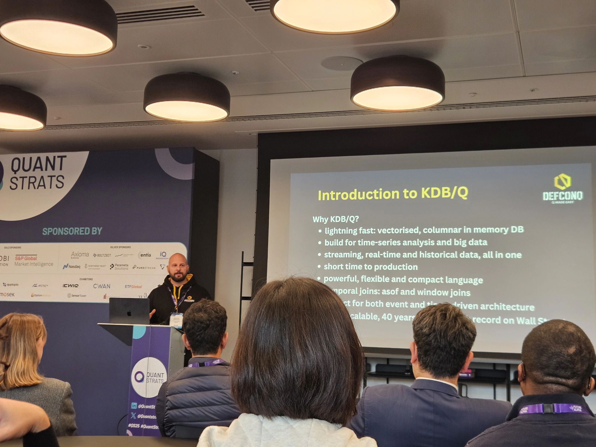
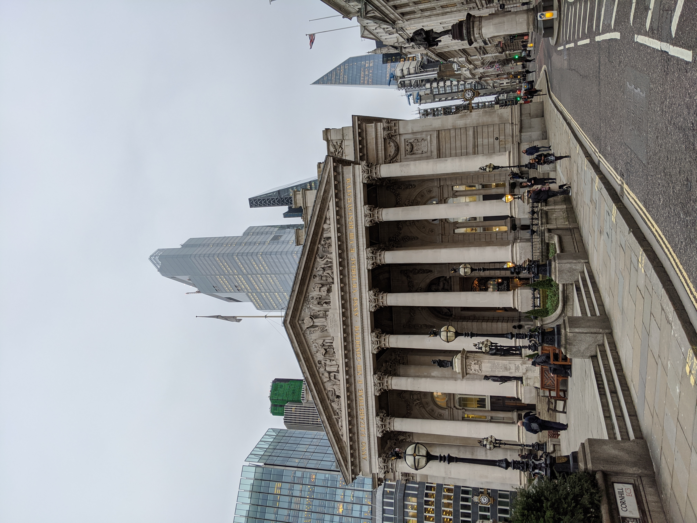
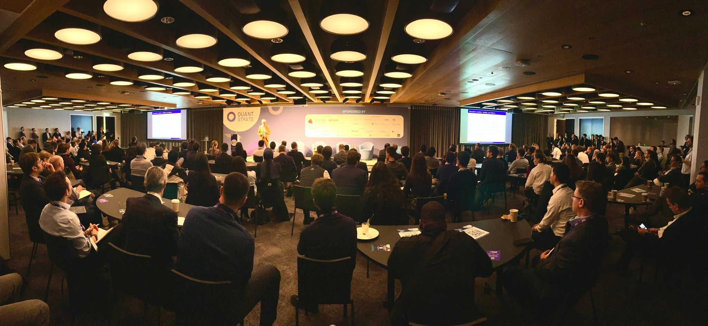
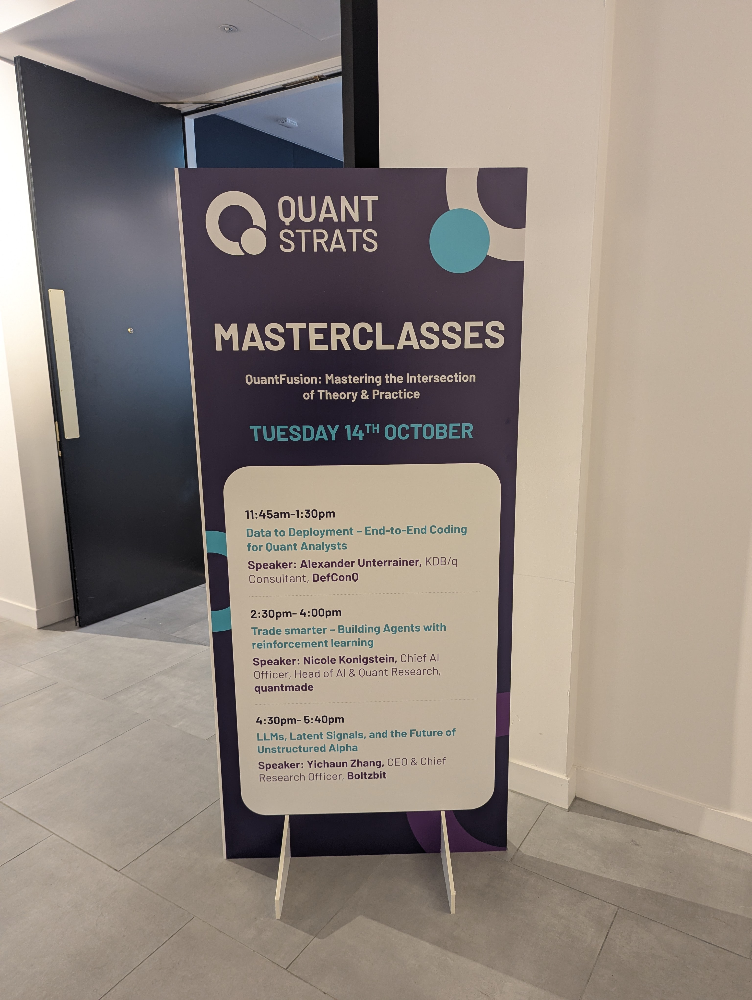
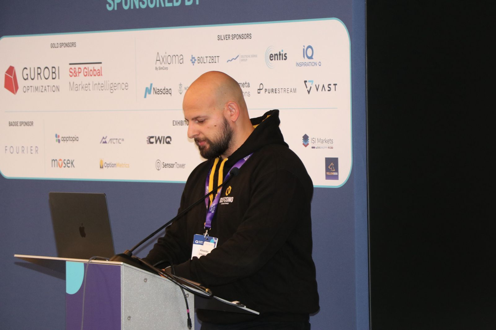
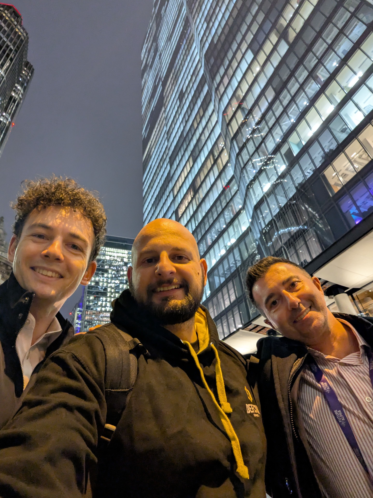
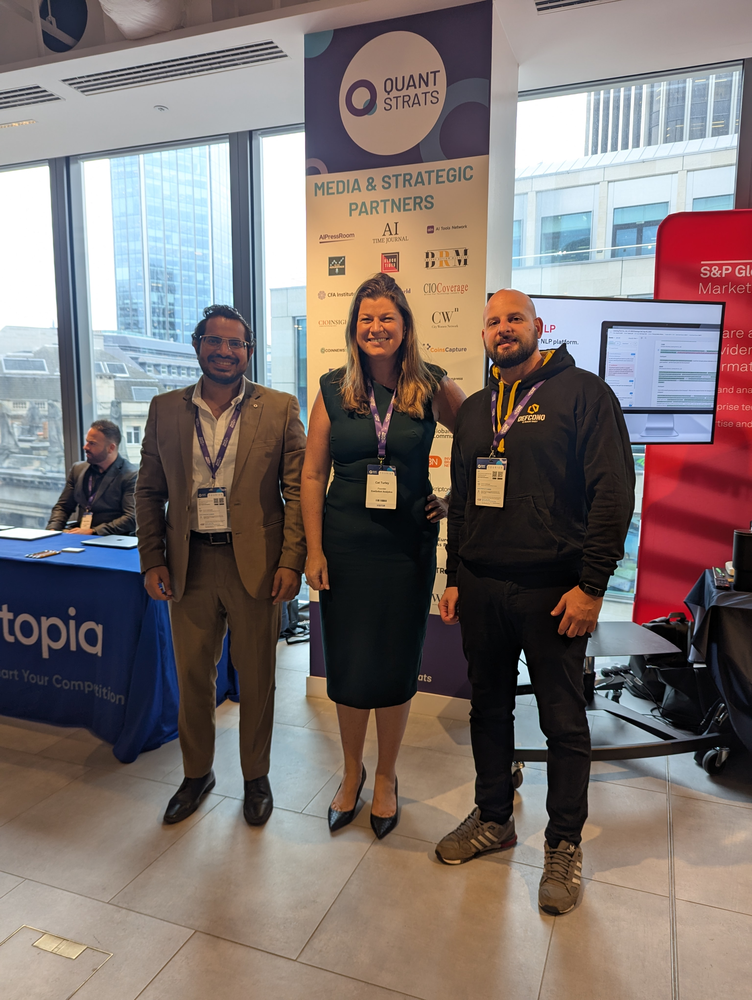
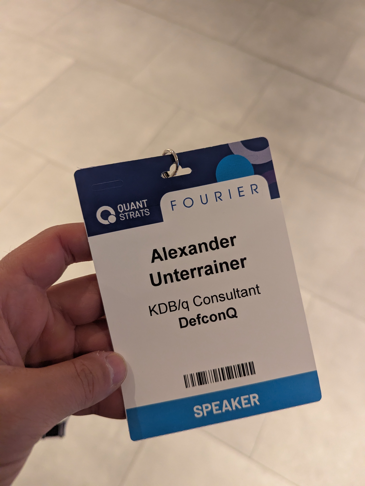

Last week marked one of my professional highlights of the year, the long-awaited [Quant Strats](https://www.alphaevents.com/events-quantstratsuk) conference finally took place! Hosted on October 14–15 at Convene 22 Bishopsgate in London, the event delivered two action-packed days filled with cutting-edge insights, technical deep dives, and forward-thinking discussions at the intersection of quantitative finance, AI, and data infrastructure. 
Just like last year, this blog post will recap the event and share some of the key highlights. Among them was undoubtedly my KDB/Q Masterclass, a deep dive into **Wall Street’s most powerful array programming language and real-time database**. Keep reading to find out more.

<!-- truncate -->

[Quant Strats](https://www.alphaevents.com/events-quantstratsuk) took place right in the heart of the City of London, the historical financial district, just a short walk from Bank Station. As you stroll down Threadneedle Street, passing the historic [**Bank of England**](https://en.wikipedia.org/wiki/Bank_of_England) on your left and the [**Royal Exchange**](https://en.wikipedia.org/wiki/Royal_Exchange,_London), one of the world’s oldest trading hubs, first opened in 1571, you can almost feel the spirit of global finance in the air. [**Voltaire**](https://en.wikipedia.org/wiki/Voltaire) captured this essence perfectly in **Letters on the English (1733)**, writing:

> “Take a view of the Royal Exchange in London, a place more venerable than many courts of justice, where the representatives of all nations meet for the benefit of mankind. There the Jew, the Mahometan, and the Christian transact together, as though they all professed the same religion, and give the name of infidel to none but bankrupts.”

A fitting reflection on the city that still serves as one of the world’s great crossroads of commerce and ideas.

But on this particular Tuesday morning, the usual buzz of the City of London was matched, no surpassed, by the energy inside the halls of **Quant Strats Europe 2025**. With over **500 attendees** representing some of the world’s leading buy- and sell-side institutions, the atmosphere was electric, a room full of some of the brightest minds in quantitative finance, all eager to connect, learn, and push the boundaries of the field.

## Setting the Stage & Big Themes

After the welcoming remarks of the host, the conference opened with a macroeconomic outlook from [Mike Bell](https://www.linkedin.com/in/mike-bell-cfa/), setting the tone for the conversations around risk, regime shifts, and policy tailwinds. From there, participants dived into panels and sessions on topics such as:
- Geopolitical shocks & real-time market signalling
- Alpha warfare and how AI is reshaping quant strategy
- Machine learning interpretability in finance
- Architecting where models live (cloud vs on-prem vs hybrid)
- Extracting latent signals from unstructured data (LLMs, NLPs)
- Portfolio construction innovations (multi-asset, private & public)
- Execution optimization, alternative data, and data pipelines

The agenda was ambitious, bridging theory and practice, and bringing deep technical sessions alongside broader strategy talks.

A few standout features:

- **Quickfire “Insight Unlocked”** sessions: five-minute lightning talks delivering tight, actionable ideas
- **Masterclass / workshop tracks** on specialized topics
- **Expo demo drives and networking breaks** built in to let practitioners explore tools and connect
- **An app that truly elevates the conference experience**: Guiding you seamlessly through the event with a host of powerful features. I already raved about the Quant Strats Event App last year (you can read my full review [here](https://www.defconq.tech/blog/DefconQ%20goes%20QuantStrats%202024#organisation)), and it continues to impress. 
- A spotlight on data infrastructure, deployment architecture, and real-time systems rather than just pure model research

Overall, the ***focus shifted from signal generation to signal execution, model robustness, deployment trade-offs, and system architecture***, exactly where the rubber meets the road in quant finance.

## My Highlight: Masterclass Data to Deployment, End-to-End Coding for Quant Analysts

For me, the highlight of Quant Strats was leading the **90-minute masterclass** titled ***Data to Deployment: End-to-End Coding for Quant Analysts***. In that session, I guided attendees through a full pipeline:

1. **Introduction to KDB/Q**: History, evolution and important concepts of Wall Street's most powerful array programming language
2. **Ingest & Stream Data** - live integration from historical end-of-day (EOD) files as well as real time data from [**Databento**](https://databento.com), a market data provider, giving you **125$** credit when signing up. 
3. **Data Handling & Cleaning** - parsing, transformations, and schema logic
4. **Signal Generation & Strategy Logic** - crafting a simple rading signal, using simple moving averages (SMA), in KDB/Q
5. **Optimization, Deployment & Execution** - from prototype to a deployable system
6. **Leveraging existing libraries** such as [**ExeQution Analytics**](https://exequtionanalytics.com), to focus on what's important: **turning data into alpha**
7. **Visualization & Dashboarding** - showing results using [**Pulse**](https://www.timestored.com/pulse/), the framework that even makes me enjoy UI work

What made the Masterclass special is the balance between hands-on coding and strategic architecture. Many participants told me afterward that seeing ***how everything connected:*** **data ➡️  model ➡️  execution ➡️  monitoring**, helped solidify how to build a real quant system, not just isolated research code. 

One recurring theme during the masterclass (and across the event) was the significance of performance, interpretability, and model flexibility. Building for speed is important, but so is building for maintainability and resilience over time.

## Memorable Panels & Moments

Some highlights that stuck with me:

- **The Geopolitical Shock Panel** asked: *How do you separate noise vs signal in global events? and What data sets help decode policy shocks in real time?* It’s a reminder that markets don’t operate in a vacuum and quant models must ingest events.
- **Alpha Warfare: Winning the AI Arms Race** explored where quant teams get edge when everyone has access to advanced models and compute. Not just model selection, but infrastructure, data, pipelines, and latency matter.
- **Model interpretability & explainable AI** sessions tackled guardrails: how to deploy ML in finance when regulators or stakeholders demand transparency.
- The discussion on **where models should live**, cloud vs on-prem, tackled real tradeoffs: latency, compliance, cost, and hybrid flexibility.
- And the closing keynote ***From Pit Wall to Portfolio***, by [Neil Martin](https://www.linkedin.com/in/neil-random-logic/) (ex-Formula 1 strategist) drew powerful parallels between motorsport analytics and quant finance: split-second decisions, feedback loops, and optimizing under pressure.

## Reflections & Takeaways

- **Systems matter as much as models**: Many talks framed quant work not just as statistical or ML problems, but as engineering and software problems.
- **Deployment & infrastructure tradeoffs shine**: It’s one thing to produce a signal in Jupyter or research code; it’s another to embed it into a production pipeline.
- **Data quality, latency & pipeline robustness are differentiators**: Several speakers emphasized that alpha can be lost more in poor data ingestion or messy pipelines than in suboptimal modeling.
- **Hybrid architectures are the future**: The middle ground, balancing on-prem control with cloud scalability, is where many quant firms will land.
- **AI & LLMs are maturing but need guardrails**: The promise is high, but interpretability, drift, and risk control cannot be ignored.

## Conclusion

From a personal perspective, seeing the breadth of talent in one room, researchers, engineers, portfolio experts, platform builders, reaffirms that the future of quant is multidisciplinary. Model authors must understand pipelines; engineers must think in signal space. And **KDB/Q continues to prove why it’s the gold standard for quantitative finance**. Its unmatched ability to process, analyse, and store massive volumes of real-time and historical data makes it the ultimate choice for building modern, scalable, and ultra-low-latency systems. Whether you’re streaming tick data, engineering features for machine learning, or running complex backtests, KDB/Q empowers quants to focus on insights rather than infrastructure. Simply put, when it comes to speed, scalability, and precision, nothing comes close.

I walked away energized, with new connections, fresh ideas, and a clearer view of where quant finance is heading.

If you’re working with KDB/Q, or planning to, and need expert guidance on architecture reviews, system design, or simply want to deepen your understanding of the language, don’t hesitate to reach out. I’m always happy to help fellow quants and developers get the most out of KDB/Q and bring their data infrastructure to the next level.

## Quant Strats Europe Photo Dump 

