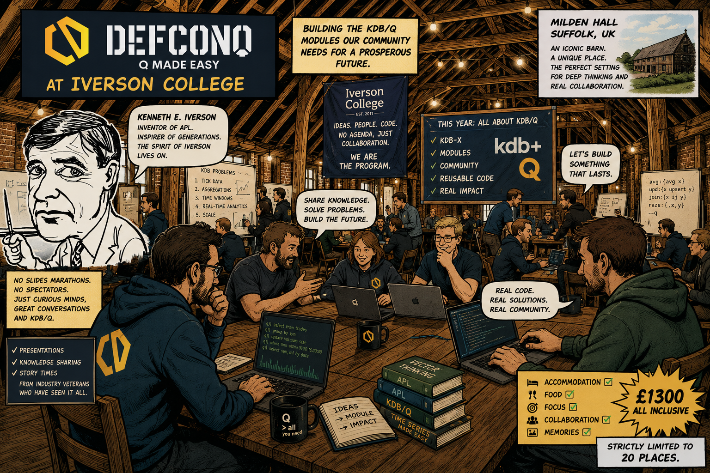

If you’ve been around the KDB/Q ecosystem for a while, chances are you’ve come across the legendary Iverson College. Founded by former KX Librarian Stephen Taylor in honour of Kenneth E. Iverson, the inventor of APL, the college has been running since 2011. After a brief hiatus between 2018 and 2023, it made a strong return in 2024. This year DefconQ joins forces with Stephen to reconvene the College at one of its favourite venues: Milden Hall. 

<!--truncate-->

While previous meetings spanned a range of Iversonian programming languages, this year’s meeting will be entirely on KDB/Q. That said, the principles and concepts explored remain broadly applicable across the wider family of vector languages, with future meetings set to expand again.

Iverson College is half conference, half house party. There’s no rigid agenda, no back-to-back slide decks, and no passive audience. The participants *are* the programme. It’s a collaborative, immersive environment where ideas are shared, challenged, and built upon in real time. Inspired by the ethos outlined in the college’s foundations, the focus is on deep learning through interaction, not presentation. Even though there will be no pre-set agenda, there will be a handful of presentations, knowledge-sharing sessions, and story times from some of the most experienced voices in the industry. We shall bring together some of the smartest, most experienced kdb developers.

With the recent release of KDB-X and the introduction of modules, this year’s meeting of the College will centre around building the modules the community actually needs. And we won’t just talk about them, we’ll start implementing them. The goal is to lay the groundwork for a shared, community-driven codebase that can be reused and extended in real production environments.

The setting for all of this is Milden Hall, a Tudor barn in Suffolk that has hosted some of the college's most memorable meetings. It’s a unique workspace that fosters the kind of close collaboration and focused work the event is known for. The ticket price of £1300 includes meals (we bring our own chefs) and hostel-level accommodation, ensuring everyone can fully immerse themselves in the experience without distraction. Places are strictly limited to just 20 attendees, keeping the environment intimate, focused, and highly interactive.

**When**: 6 - 10 September, 2026 \
**Where**: [Milden Hall, Suffolk](https://www.thehall-milden.co.uk)  \
**Price**: 1300£ \
**Signup here**: You can secure your ticket by sending an email to dean@iversoncollege.com and we will send you the payment instructions

Some impressions of the 2024 edition of the Iverson College in Cambridge, captured by [Miki Yamanouchi](https://www.mikiy.com), a London based photographer and film maker.

You can learn more about Iverson College and explore previous editions [here](https://iversoncollege.com).

<iframe width="560" height="315" src="https://www.youtube.com/embed/w-MyzJLHfmc?si=-Wi6KgzPeNpyIr5-" title="YouTube video player" frameborder="0" allow="accelerometer; autoplay; clipboard-write; encrypted-media; gyroscope; picture-in-picture; web-share" referrerpolicy="strict-origin-when-cross-origin" allowfullscreen></iframe>
