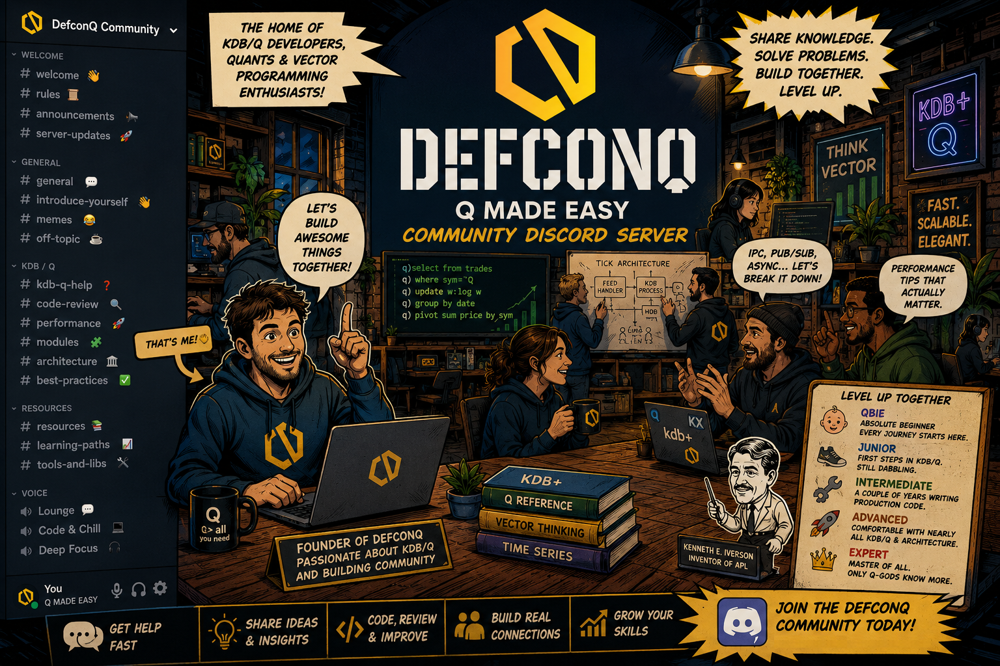

The **DefconQ Community Server** is officially live. Over the last few years, DefconQ has grown from a simple technical blog into something much bigger: a growing **community** of KDB/Q developers, engineers, quants, and vector programming enthusiasts who genuinely care about learning, building, and pushing the ecosystem forward. Launching a dedicated community server felt like the natural next step.

<!--truncate-->

The goal is simple. We want to create a place where people can:
- exchange ideas
- share best practices
- ask questions without feeling intimidated
- discuss architecture and production systems
- collaborate on projects
- and ultimately learn from each other

And importantly: this is **not** intended to become just another forum about KDB/Q.

The DefconQ server is designed to be a genuine community space: **independent, objective, and driven by the people participating in it**. No consultancy agenda. No hidden sales pitch. No “our framework solves everything” marketing. Just developers helping developers and people passionate about vector programming sharing knowledge.

Whether you are:
- completely new to q
- building your first tickerplant
- debugging IPC at 2AM
- designing distributed architectures
- or debating whether everything should really be a list

...there will be a place for you.

The server will include dedicated channels for:
- KDB/Q help
- architecture discussions
- performance tuning
- KDB-X modules
- code reviews
- learning resources
- and community projects

Over time, the goal is to grow this into one of the strongest independent KDB/Q communities out there, a place where knowledge is shared openly and where people can genuinely level up together.
So if that sounds like your kind of place, come join us.

Join the DefconQ Community Discord Server [here](https://discord.gg/wKVdH6xrW)

Happy chatting and Happy coding.
