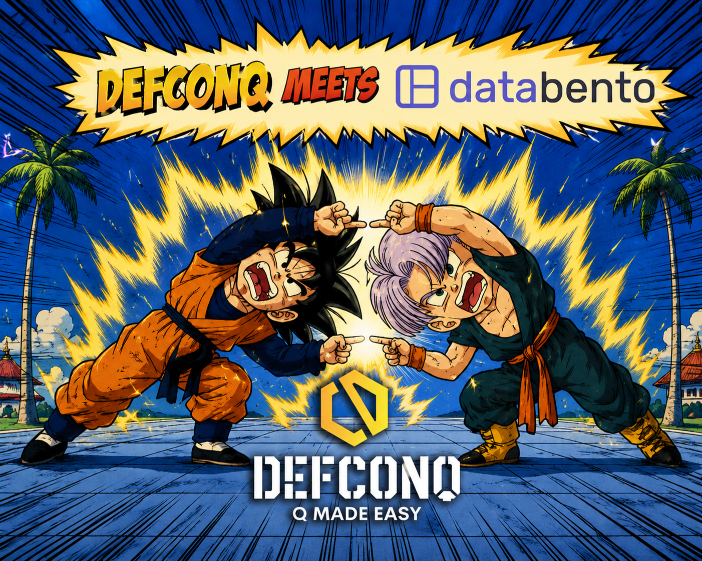

## There Is No KDB Without Market Data

Let’s be honest: there is **no KDB/Q** without market data. 

You can build the cleanest tickerplant in the world, design elegant schemas, optimise queries until they scream, and architect the perfect stack, but without data flowing into it, it’s all just a very expensive and slightly nerdy sculpture.

Market data is the *lifeblood* of every serious KDB/Q system. It’s where the story begins.
And yet, for something so fundamental, getting access to market data as an individual developer has historically been ... painful.

That’s exactly why I’m excited to announce that **DefconQ** and [**Databento**](https://databento.com) are teaming up for an upcoming **Meetup in London**, a community event for quants, financial engineers, developers, and anyone working with market data who wants to see what happens when market data stops being a headache and starts becoming something you can actually work with.

<!--truncate-->

## Who Is Databento?

If you haven’t come across Databento yet, chances are you will. Databento recently celebrated its third anniversary, and in a remarkably short time has established itself as one of the most exciting and fastest-growing players in the market data space. The company was built around one core idea: creating modern market data infrastructure capable of serving some of the world’s leading trading firms while still remaining accessible to individual developers, researchers, startups, and smaller teams.

And clearly, that vision resonated.

Today, Databento serves more than 40,000 users and powers firms representing hundreds of billions in AUM, alongside products spanning fintech, AI, quantitative research, and trading infrastructure. What makes Databento particularly refreshing is that it genuinely feels like it was built by engineers who have personally suffered through the pain of traditional market data providers before.

Because they have.

Historically, market data has often felt like it was built for procurement teams, lawyers, and infrastructure departments first ... and developers somewhere near the bottom of the priority list. Complicated onboarding. Opaque pricing. Questionable APIs. Documentation that feels like it was written during the Cold War. Strange licensing restrictions. Integration projects that somehow become multi-week engineering exercises.

Databento flipped that script.

Their platform makes it possible to access historical and real-time market data through a clean, well-documented API, without the usual layers of friction many developers have simply accepted as “part of the process.” Fast access. Transparent pricing. Modern tooling. Excellent documentation. 

It sounds simple, but anyone who has integrated market data providers before knows this is absolutely not a given.

## The Founders Behind It

Databento was founded by people who clearly understand both the technical and commercial realities of market data because they lived through them themselves while working inside the industry.

At the top is [Christina Qi](https://www.linkedin.com/in/christinaqi/), alongside [Luca Lin](https://www.linkedin.com/in/linl/) and [Renan Gemignani](https://www.linkedin.com/in/renan-gemignani/). Together with the broader core team, they bring experience from prestigious hedge funds, quantitative trading firms, and high-performance financial infrastructure environments where market data is not just important, it is mission critical.

And honestly, I think that experience is exactly why the product feels different.

This wasn’t built by people theorising about market data problems from the outside. It was built by engineers and quants who were tired of dealing with bad market data vendors themselves. The frustrations that many of us have simply learned to tolerate, painful integrations, poor tooling, strange workflows, slow onboarding, became the motivation for building something better.

And perhaps that’s what stood out to me most when I met Christina and the Databento team in London: they genuinely understand the problems developers and engineers face because they’ve been on the receiving end of them.

That combination of technical depth, practical thinking, and building from real-world frustration tends to produce very good products.

## How We Got Here

This meetup actually started with a DefconQ tutorial. A while ago, I wrote my real-time stock market tutorial, walking readers through how to stream live data into a KDB/Q stack. Initially, I used Yahoo Finance to pull market data because, well ... it was free and it worked. Until it didn't.

Anyone who has ever used Yahoo Finance for anything even remotely serious knows what happens next: you request a little too much data and suddenly the door gets slammed shut. That was a problem. I wanted to create something realistic for DefconQ readers, something that actually resembled how a production-style system works. But I also wasn’t exactly sitting on a Bloomberg budget to pay for a full real-time market data feed just to support a tutorial.

That’s when I came across Databento. The free credits they provide were exactly what I needed to make the tutorial happen. 

Now, I’ll be honest: my expectations were cautiously optimistic. 

Because integrating market data providers can be painful. Documentation gaps, weird APIs, unexpected licensing complexity, strange authentication workflows, if you’ve done it before, you know.

So I mentally blocked off some time for “integration pain.” And then something strange happened: There wasn’t any.

Thanks to the excellent documentation and a genuinely easy-to-use API, I managed to integrate Databento into the tutorial in a single evening, while my wife was at a Beyoncé concert.

That might sound like a silly benchmark, but trust me: in market data integration time, that’s lightning fast.

## From Tutorial to Meetup

The tutorial went on to become one of DefconQ’s more popular hands-on walkthroughs, and to my surprise, Christina herself featured it. That eventually led to me meeting Christina and the Databento team at a London meetup, and if you’ve ever wondered whether technical people can also be genuinely fun people, the answer is yes.

Now they’re back in town.

And this time, we’re hosting something together.

## Why You Should Attend

This meetup is not just another fintech networking event where everyone pretends to enjoy warm white wine and vague conversations about “innovation.” This is a real community event for people who actually work with data.

If you are a:

- Quant
- Financial Engineer
- Market Data Engineer
- KDB/Q Developer
- or anyone building systems that depend on fast, reliable market data ...

... this is genuinely worth attending.

You’ll get the opportunity to learn directly from the Databento team, understand how their platform works, ask technical questions, and see why accessing market data has become dramatically easier than it used to be. 

And perhaps just as importantly, you’ll meet others in the DefconQ community who care about the same problems you do, architecture, infrastructure, data engineering, market data, production systems, and all the weird little things that only people in this niche get excited about.

There will be conversations, technical discussions, networking, and plenty of opportunities to ask the questions you don’t usually get to ask.

Because at the end of the day, market data is where many of our systems begin.

And if someone makes that easier for developers, it’s worth paying attention.

See you there.

**The Details**:

**When**: Wednesday, July 1st 2026 \
**Where**: Hedosophia, 2 Soho Place, London W1D 3BG \
**Sign Up Link**: [here](https://luma.com/p22b7ff3)

**IMPORTANT**: This event is expected to reach capacity, so sign up as soon as possible. If you can no longer attend, please cancel your registration to free up your spot for someone else.

