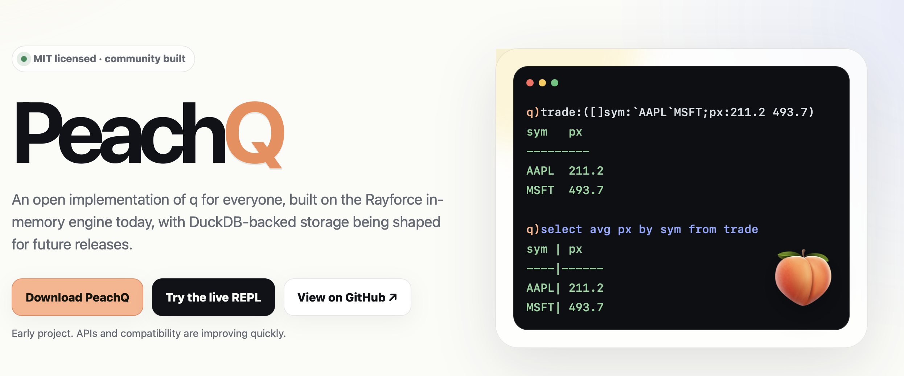

## The Summer of New Beginnings

It seems the weather isn't the only thing refusing to cool down this summer. Only a few days ago, I wrote about [L](https://www.defconq.tech/blog/L%20Has%20Landed%20-%20A%20New%20Runtime%20for%20k%20and%20q%20Enters%20the%20Scene), [Jacob Loveless'](https://www.linkedin.com/in/jacobloveless/) new runtime for k and q, and why I believe it's one of the projects worth watching in the evolving k ecosystem.

Well... here's another one.

This time, it's [**PeachQ**](https://peachq.org), an **open-source implementation** of the q language spearheaded by none other than [**Ryan Hamilton**](https://www.linkedin.com/in/justryanhamilton/).

If you're sensing a pattern, you're right. Innovation is happening. And, perhaps more importantly, it's happening in the open.

<!--truncate-->

## Meet Ryan Hamilton

Ryan Hamilton is hardly a new face in the community.

If you've spent any amount of time working with KDB/Q over the last decade, chances are you've used one of his tools, read one of his articles, or benefitted from one of his countless contributions.

As the founder of [**TimeStored**](https://www.timestored.com), Ryan has quietly become one of the ecosystem's most prolific builders.

In many ways, you could say he's the ***Pulse*** of the community.

Yes, that's a deliberate pun.

Not only because one of his flagship products is called [**Pulse**](https://www.timestored.com/pulse/), but because Ryan has consistently kept the community moving forward through new ideas, thoughtful discussions, and practical tooling.
Over the years he has built:

- [**QStudio**](https://www.timestored.com/qstudio/): one of the best-known IDEs for KDB/Q development.
- [**Pulse**](https://www.timestored.com/pulse/): powerful platform for building real-time data applications.
- Numerous open-source tools, integrations and community resources spanning far beyond traditional KDB/Q development.

I've had the pleasure of working with Ryan on several feature implementations for Pulse, and one thing quickly becomes apparent: if there's a useful feature to build, Ryan usually finds a way to ship it.

## A Long-Time Advocate for Improving q

One thing I've always appreciated about Ryan is that he doesn't simply point out problems: he proposes solutions.

Over the years, his blog has become a collection of thoughtful ideas about where the ecosystem could evolve. He's written about making q more approachable, improving interoperability with modern data tooling, embracing open-source technologies, expanding SQL support, introducing richer language features such as type hints, simplifying deployment, broadening compatibility, and generally making the language easier to adopt beyond its traditional financial audience.

Some of these articles were deliberately speculative. Others explored "what if?" scenarios.

With **PeachQ**, many of those ideas are no longer just blog posts.

Ryan now has the opportunity to implement them himself.

That might be one of the most exciting aspects of the project.

## So, What Is PeachQ?!?

At its core, [**PeachQ**](https://peachq.org) is an **MIT-licensed, open-source implementation of the q language.** It aims to preserve the expressive array programming model and familiar qSQL semantics while providing a modern, community-driven implementation that anyone can use, inspect, extend, and improve. Today it runs on the Rayforce in-memory engine, with future plans including DuckDB-backed storage and broader interoperability with modern data ecosystems.

That last point is particularly important.

Unlike proprietary runtimes, PeachQ is being developed in **public.**

The project openly tracks compatibility, encourages contributions, and invites developers to help shape everything from language support and tooling to libraries, drivers, IDE integration, and package ecosystems.
For a language that has traditionally lived behind commercial licensing, that's a significant shift.

## Compatibility Is Already Moving Fast

At the time of writing, PeachQ reports approximately **66% language compatibility with q.**

Now, depending on how you look at it, that number can either sound encouraging or daunting.

Personally?

I think it's incredibly impressive.

Building a language is hard.

Building a language with decades of existing behaviour, subtle semantics, and production expectations is even harder.

Having worked with Ryan before, I'm probably a little less surprised than others. He's someone who iterates quickly, listens carefully to feedback, and ships improvements at an impressive pace.
If history is anything to go by, I wouldn't expect that compatibility percentage to stand still for very long.

## More Than Just Another Runtime

It's tempting to view PeachQ purely as another implementation of q.

I think that would be underselling it.

Open implementations change ecosystems.

They lower barriers to entry.

They encourage experimentation.

They enable universities, startups, independent developers and hobbyists to learn, prototype and build without worrying about licensing constraints.

Perhaps most importantly, they encourage tooling.

Open languages tend to attract IDEs, language servers, testing frameworks, package managers, notebooks, AI integrations, linters, debuggers and countless community projects that become difficult to justify in closed ecosystems.

That's how ecosystems grow.

## Why This Matters

If you've been following **DefconQ** recently, you'll notice a recurring theme.

**First L.**

**Now PeachQ.**

And trust me—they're not the only projects currently being worked on.

For many years, innovation around q largely revolved around applications built on top of the language.

Now we're beginning to see innovation happening within the language ecosystem itself.

That's healthy.

Competition drives innovation.

Different implementations explore different ideas.

Developers gain more choice.

And the entire community benefits.

Whether you ultimately choose commercial q, L, PeachQ, or something else entirely almost becomes secondary.

The important part is that people are building.

People are experimenting.

People are investing their time into making the ecosystem stronger.

## Looking Ahead

PeachQ is still in its early days, but it's already one of the most interesting open-source projects in the k and q world.

Knowing Ryan, I expect it to evolve rapidly. I also wouldn't be surprised to see many of the ideas he's championed over the years gradually finding their way into the language itself.

One thing is certain: I'll be following the project closely.

And if this summer has taught us anything, it's that the k and q ecosystem is entering one of its most exciting periods in years.

I'll be here covering every step of that journey.

**Good Luck Ryan!**

Stay tuned.
