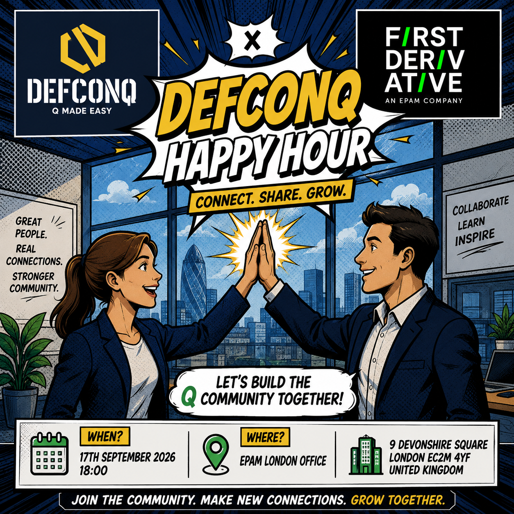

The wait is over: **DefconQ Happy Hour** is returning to London! 

After another fantastic turnout at our previous events, we're bringing the KDB/Q community together once again for an evening of great conversations, new connections, and plenty of laughs. Whether you're a seasoned developer, just starting your journey with KDB/Q, or simply curious about the ecosystem, this is the perfect opportunity to meet like-minded people in a relaxed, informal setting. 

This time, we're delighted to be hosted by [First Derivative (FD)](https://firstderivative.com) of [EPAM Financial Services](https://www.epam.com), who have kindly opened the doors of their London office for the community. A huge thank you to the EPAM team for supporting the event and helping us continue to grow the KDB/Q community. 

<!--truncate-->

**Event Details**

📅 **Date**: Thursday, 17th September 2026\
🕕 **Time**: 18:00 onwards\
📍 **Venue**: [EPAM London Office, 9 Devonshire Square, London](https://maps.app.goo.gl/9HSiBCUk9sehN8hDA)\
✏️  **Sign up**: [DefconQ x First Derivative Happy Hour Eventbride](https://www.eventbrite.com/e/defconq-x-first-derivative-happy-hour-tickets-1996997754040?aff=oddtdtcreator)

**Please note that registration is mandatory for security reasons. Unfortunately, entry cannot be granted without prior registration.**

## More Than Just a Meetup

**DefconQ Happy Hour** isn't about presentations or slide decks.

It's about conversations.

It's about finally putting faces to the names you've seen on LinkedIn or Discord. It's about sharing ideas, discussing architecture, debating language features, swapping war stories from production systems, and maybe even discovering your next career opportunity.

Whether you're looking for technical discussions, career advice, collaborators for your next project, or simply a good chat over a drink, you'll find all of that—and more.

## Come for the Community, Stay for the Conversations

The KDB/Q ecosystem has always thrived because of its people. Every Happy Hour brings together developers, quants, architects, hiring managers, students, and industry veterans under one roof.

So if you've been meaning to get more involved in the community, this is your chance.

Spaces are limited, so make sure to register early.

I can't wait to see familiar faces, meet plenty of new ones, and raise a glass to another fantastic evening with the community.

**See you on 17th September!**

## About First Derivative & EPAM: Strategic Synergy

First Derivative, established in 1996 in Newry, Co. Down, Ireland, is a global provider of technology products and consulting services to leading institutions in finance, technology and energy. With deep expertise in trading technology, risk management, data analytics and regulatory compliance for capital markets, First Derivative delivers capital markets intelligence to clients worldwide. Today, the company employs over 1,300 professionals across 15 offices globally.

As part of EPAM Systems, First Derivative benefits from the scale and innovation of a leading global provider of digital platform engineering and software development services. Founded in 1993 in Princeton, New Jersey, EPAM specializes in bespoke software development, digital transformation, cloud solutions, data engineering, and experience design across industries including finance, healthcare, retail, and more. EPAM’s global presence includes over 60,000 professionals in more than 50 countries across Europe, Asia, North America and beyond.

Together, First Derivative and EPAM combine capital markets expertise with world-class digital engineering, offering clients strategic solutions and transformative technology to meet the demands of today’s dynamic markets.

### Open Roles at First Derivative
[KDB Developer - HYBRID IN THE UNITED KINGDOM: LONDON](https://careers.epam.com/en/vacancy/kdb-developer-bltr2oe962ttko44k6z_en)

[KDB Developer - HYBRID IN THE UNITED KINGDOM: NEWRY, THE UNITED KINGDOM: BELFAST](https://careers.epam.com/en/vacancy/kdb-developer-blt54kjhtipi14pigbe_en)

