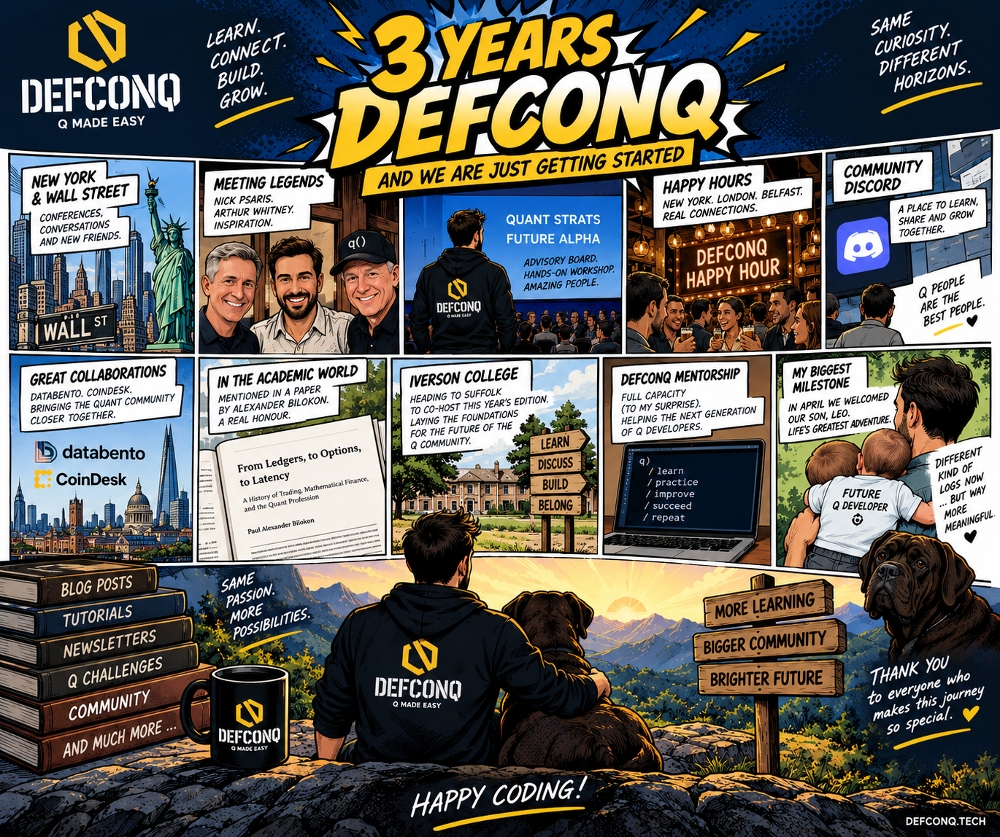

Three years.

It somehow became a DefconQ tradition to mark every birthday with a blog post: a chance to look back at the previous twelve months, reflect on what happened, celebrate some of the milestones, and, inevitably, talk about what comes next.

And as I sit down to write the third edition, I genuinely couldn't be happier with how the past year has unfolded.

<!-- truncate -->

When I started DefconQ three years ago, the idea was pretty simple: make q more accessible, document some of the knowledge I'd accumulated over the years, improve my own understanding along the way, and hopefully give something back to a technology and community that have played a huge part in my career.

Three years later, DefconQ has become much more than a technical blog.

It's become a community.

And this year, more than any other, felt like the year that community really started coming together. The DefconQ blog itself now spans dozens of articles across KDB/Q, architecture, market data and community topics, while the Discord Server, events and collaborations have increasingly expanded DefconQ beyond written content.

So, in keeping with tradition, let's rewind twelve months.

## From DefconQ to Wall Street 🗽

The third year started with a pretty big milestone for me personally: **my first trip to New York.**

And if you're going to visit New York for the first time as someone who has spent most of his career working in finance, there are probably worse ways to do it than spending a week working on **Wall Street.**

During the same trip, I had the opportunity to take part in the [**Cornell Financial Engineering Manhattan 2025 Future of Finance & AI Conference**](https://www.rebellionresearch.com/cornell-financial-engineering-manhattan-2025-future-of-finance-ai-conference), joining a panel right in the heart of New York's financial district.

For someone who has been fascinated by finance, technology and quantitative finance for most of his adult life, that was a pretty special moment.

But DefconQ trips are rarely just about conferences. We also brought the **DefconQ Happy Hour to New York**, giving me the opportunity to meet plenty of people from the US KDB/Q and quant community whom I'd previously only known through LinkedIn, email or the blog. It was one of two anniversary Happy Hours that September, alongside Belfast.

There is something quite surreal about starting a niche technical blog from your laptop and, two years later, standing in a bar on the other side of the Atlantic surrounded by people who know that blog.
Those are the moments that remind me why I keep doing this.

## Meeting Some of My q Heroes

New York also delivered another personal highlight. I finally got to meet **Nick Psaris** my favourite q author and someone whose work I've admired for years.

Anyone who has spent serious time learning q will know how valuable a good technical author can be. The best books don't simply teach syntax; they change the way you think about a language. Nick's work has done exactly that for me, so getting the chance to meet him in person was genuinely special.

And then there was another encounter that needs very little introduction.

**Arthur Whitney**

Meeting the man behind k, and one of the people whose ideas ultimately shaped an enormous part of my professional life, was certainly one for the DefconQ history books. Not bad for a first trip to New York.

## From Attendee to Advisory Board

Another big development this year came through my involvement with [**Future Alpha / Quant Strats**](https://www.alphaevents.com/events-futurealphaglobal). 

What started with attending the conference because of my own fascination with quantitative finance has grown into a much deeper relationship. I joined the advisory board and, at Quant Strats Europe, ran a hands-on KDB/Q masterclass.
The session, **"Data to Deployment: End-to-End Coding for Quant Analysts,"** took attendees through the journey from ingesting data all the way to signal generation, optimisation, deployment and visualisation, a practical look at how the individual pieces of a quantitative system actually fit together.

That was exactly the kind of session I wanted DefconQ to be associated with from the beginning:
**Less**: *here are 100 slides about what you could theoretically do.*

**More**: *open the laptop and let's actually build the thing.*

And apparently they haven't managed to get rid of me yet: **I'll be returning to New York for Future Alpha 2027.**

## Happy Hours, Discord and Building a Real Community

The Happy Hours continued too.

What started as an experiment has become one of my favourite parts of DefconQ. Getting developers, quants, architects, students and industry veterans into the same room, with no sales pitch and no complicated agenda, has repeatedly produced some of the best conversations I've had around KDB/Q.

This year also saw the launch of the **DefconQ Community Discord Server.**

That felt like an important next step.

A blog is inherently one-directional: I write something, you read it.

A community should be different.

The Discord gives people somewhere to ask questions, discuss ideas, share projects, tackle the Weekly Q Challenges and, most importantly, talk to each other. It turned DefconQ from somewhere you *visit* into somewhere the community can actually *meet*.

And that's something I'd like to build on much further over the coming year.

## DefconQ Meets the Wider Quant World

Another theme of the past year has been collaboration. DefconQ teamed up with **Databento**, bringing the worlds of KDB/Q and modern market data infrastructure closer together. The collaboration grew naturally from the same problem I've written about many times: there is no serious KDB/Q system without data flowing through it. Together with **Databento and CoinDesk,** we also brought the wider quant and data community together for **Quant Night in London.**

That's something I'd like DefconQ to continue doing.

KDB/Q doesn't exist in isolation.

It sits at the intersection of quantitative finance, market data, trading infrastructure, databases and increasingly AI. Connecting our relatively small but highly specialised community with the wider financial technology ecosystem creates opportunities for everyone.

## DefconQ Goes Academic

There was another milestone I certainly wasn't expecting when I started writing three years ago. **DefconQ was referenced in an academic paper.** Professor **Alexander Bilokon** included DefconQ in his work discussing the history and evolution of trading, mathematical finance and the quant profession.

For someone who started DefconQ largely as a personal learning project, seeing the platform referenced in academic work about an industry I've spent my career in was a rather nice full-circle moment.
Turns out all those evenings spent writing about q instead of watching Netflix weren't entirely wasted after all.

## And, Of Course... Content

Despite everything else going on, DefconQ remained what it has always been at its core:

A place to learn.

More blog posts.

More tutorials.

More newsletters.

More architecture discussions.

More market-data content.

More community posts.

More Weekly Q Challenges.

And occasionally more terrible q-related jokes than anyone reasonably asked for.

This year's topics stretched from gateways and real-time architectures to market data, extended trading hours, community projects and the changing k ecosystem.

And that last point is particularly interesting.

Anyone following my recent posts will have noticed that the ecosystem itself seems to be entering a new chapter. New runtimes and implementations are appearing. New people are building. Old assumptions are being challenged.

There is a lot happening.

And DefconQ intends to be right in the middle of it.

## DefconQ Mentorship

This year I also launched something I'd been thinking about for quite some time: the **DefconQ Mentorship Program.**

The idea was to offer something more personal than another tutorial, to work directly with developers who want to accelerate their KDB/Q journey, whether that's improving their technical skills, understanding architecture, preparing for interviews or navigating the industry.

I wasn't entirely sure what the response would be.

Then it reached full capacity.

That genuinely surprised me.

But it also reinforced something I've increasingly realised through DefconQ: there is still significant demand for structured, practical KDB/Q education, particularly the kind that bridges the enormous gap between knowing q syntax and actually being able to build and operate real systems.

There is plenty more I want to do here.

## Next Stop: Iverson College

And the third year isn't quite finished yet.

In just a couple of days, I'm heading to **Suffolk**, where DefconQ will co-host this year's **Iverson College** alongside **Stephen Taylor.**

Iverson College has a long history within the array-programming world and was founded in honour of Kenneth E. Iverson, the creator of APL and the intellectual ancestor of much of what eventually became k and q. This year's gathering returns to Milden Hall, with DefconQ joining Stephen in bringing the community together.

But for me, this isn't simply another event.

I hope it becomes an opportunity to bring together some of the people who care deeply about the future of q, k and array programming and start laying foundations for what comes next.

We've been calling it **QKommunity**.

More on that very soon.

## But My Biggest Milestone Had Nothing to Do With q

For all the conferences, Happy Hours, workshops, blog posts, collaborations and DefconQ milestones, the biggest event of my year had absolutely nothing to do with technology.

In April, my wife and I welcomed our first son, **Leo**.

Becoming a parent for the first time is difficult to put into words. You can spend years chasing professional milestones, another client, another conference, another project, another achievement, and then one tiny human arrives and rather efficiently rearranges your entire definition of what matters.

It has undoubtedly been the most life-changing and beautiful part of the past twelve months.

It has also introduced me to an exciting new distributed-systems problem called **sleep deprivation**, for which I have yet to find a sufficiently scalable architecture.

I'm working on it.

## So... What's Next?

Those of you who follow DefconQ closely may have noticed that the pace of new content has slowed slightly at times.

Part of that is simply life getting busier.

But that's not the whole story.

After three years of writing, DefconQ now contains a significant amount of KDB/Q knowledge. There are tutorials covering fundamentals, architecture, real-time systems, gateways, market data, q concepts and much more. At some point, publishing another article simply for the sake of maintaining a posting schedule doesn't add much value.

I'd rather publish something because **it's worth reading.**

And increasingly, my attention is moving towards bigger projects.

There is a lot happening behind the scenes.

Some of it builds on the content already available through DefconQ. Some of it expands into education. Some of it is about community. And some of it is connected to the changes currently taking place across the wider k and q ecosystem.
I won't spoil those announcements here.

But trust me: **DefconQ slowing down does not mean DefconQ is slowing down.**

Quite the opposite.

There is much more planned, and I've been working tirelessly in the background to turn some of those ideas into reality.

Three years in, I still feel like we're only getting started.

## Thank You

Last but certainly not least, I want to thank **every single person who has supported DefconQ over the past three years.**

Every time you read one of my articles.

Every LinkedIn like.

Every comment.

Every repost.

Every recommendation.

Every newsletter subscription.

Every person who turns up to a Happy Hour.

Every Discord message.

Every private message telling me that a tutorial helped you solve a problem, understand a concept, prepare for an interview or learn something new.

Those things matter.

DefconQ is something I build in my spare time because I genuinely enjoy doing it. Seeing people use it, recommend it and contribute to the community is what gives me the motivation to keep going.

So whether you've been following since the first blog post or discovered DefconQ yesterday:

**Thank you.**

Here's to three years of learning, coding, meeting brilliant people, occasionally arguing about q syntax, and building something I never expected would grow this far.

And here's to whatever comes next.

**Happy 3rd Birthday, DefconQ.** 🎂

We are just getting started.

And, as always...

**Happy Coding!** 🚀
