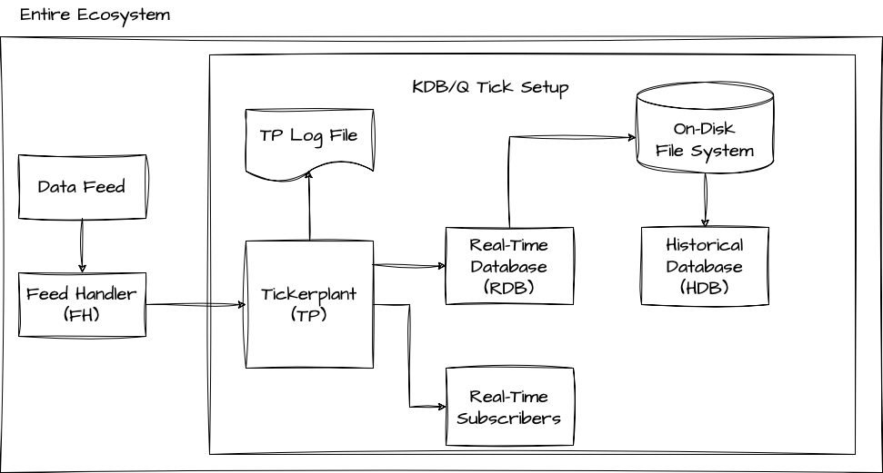
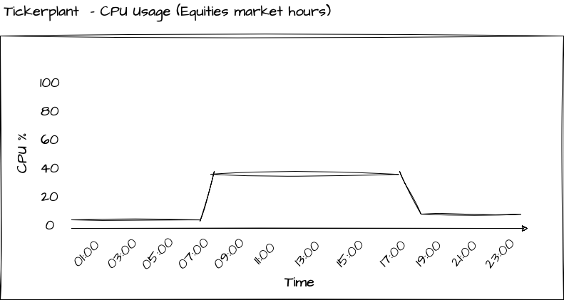
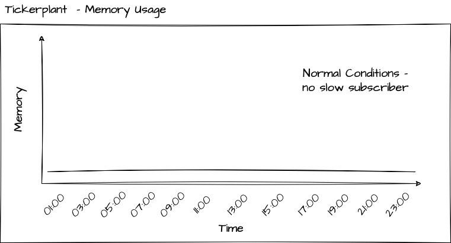
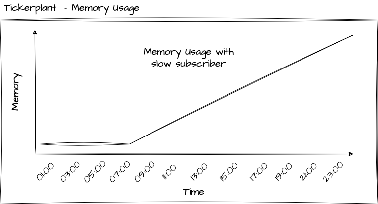
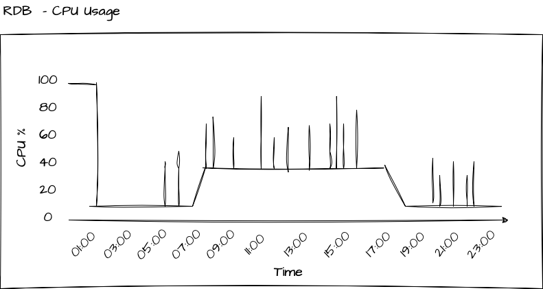
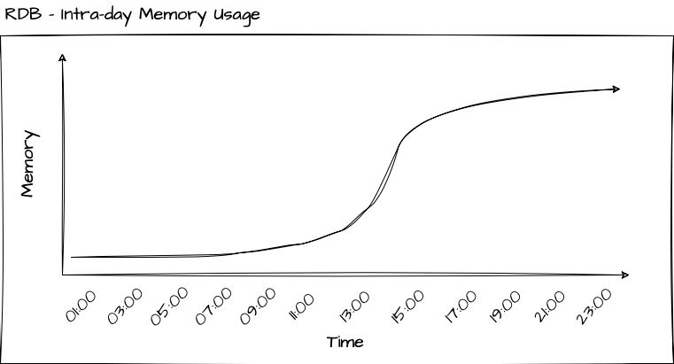
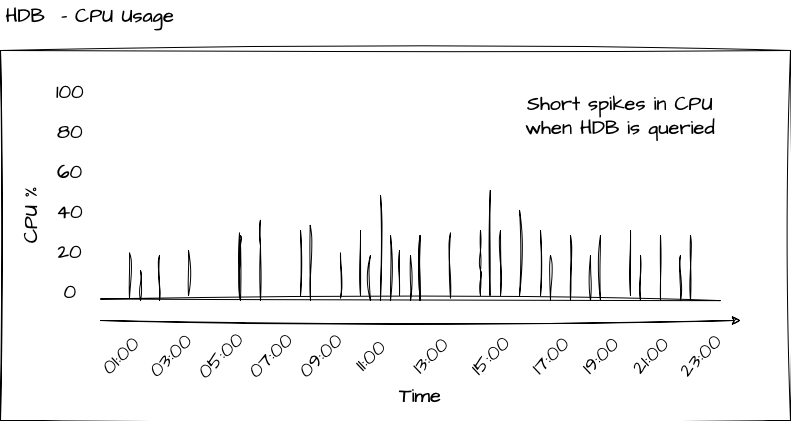
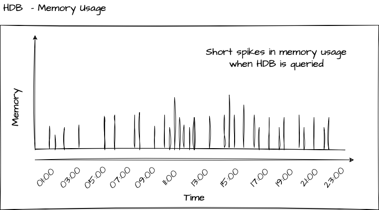

# The Plain Vanilla Tick Setup

A basic KDB/Q Tick setup consists of three  essential elements such as a Tickerplant (TP), a Real-Time Database (RDB), and a Historical Database (HDB). Additionally, this configuration involves the integration of two external processes, namely a Data Feed and a Feed Handler. The provided image below serves as a visual representation of this architectural arrangement.



## External Processes

In a broad sense, a KDB/Q Tick system primarily consists of KDB/Q processes. However, the main task of a KDB/Q tick system is to capture data and thus relies on external data. Typically, this data originates from a Data Feed, an external source, and is sent to the Feed Handler. The Feed Handler is responsible for processing and prepping the data for ingestion into the KDB/Q tick plant. Since Data Feeds and Feed Handlers not only distribute data to KDB/Q processes but also to various other applications, they are typically not implemented using KDB/Q. Let's dive deeper into these two essential processes.

### Data Feed

The Data Feed serves as the primary data source we aim to capture. In the context of KDB/Q, particularly within the financial industry, this often refers to entities like financial exchanges (e.g., Chicago Mercantile Exchange, London Stock Exchange) or financial data providers like Bloomberg or Reuters. However, given the rising interest in cryptocurrencies, crypto exchanges have also become valuable data sources for KDB/Q tick systems. It's important to note that a KDB/Q system is not restricted solely to financial data; it can efficiently store and process various data types, ranging from Formula 1 statistics to air traffic information or any other data that can be streamed to a KDB/Q tick plant. 

### Feed Handler

The primary role of the Feed Handler (FH) is to extract data from the Data Feed and convert it into a format suitable for ingestion by your KDB/Q tick system. This also provides an opportunity to perform actions such as data filtering, normalization, or reordering based on your system's schema. Since Data Feeds can be quite extensive and contain data that may not be relevant to your application, you can filter or extract only the data of interest. Finally, the Feed Handler is responsible for transmitting the processed data to the Tickerplant (TP).

## KDB/Q Processes

The core components of a plain vanilla KDB/Tick setup, in fact, every KDB/Q Tick configuration, consist of a Tickerplant (TP), a Real-Time Database (RDB), and a Historical Database (HDB). In the upcoming section, we will examine each of these essential components individually, delving into their primary functions, CPU usage and memory profiles. 

### The Tickerplant (TP)

You can think of the Tickerplant as the heart of your application. It captures all incoming data records, logs them, and subsequently publishes these messages to any registered real-time subscriber, with the RDB being the primary subscriber in the basic configuration. The TP operates in two distinct modes: 
- **tick mode**: which instantly broadcasts incoming data to all real-time subscribers, and
- **batch mode**: where it accumulates incoming data, either for a specific duration or until a predefined number of records is reached, before releasing it to real-time subscribers in batches

While publishing incoming messages to real-time subscribers is often considered as the main functionality of the TP, it is important to highlight, that maintaining a daily logfile of all incoming data on disk, is equally important. Upon start up, real-time subscribers would request the location of the TP log file and replay this daily logfile in order to gain an up-to-date state of the world for the current day.

When you design the Tickerplant, you should aim for zero-latency, design it as lightweight as possible and ensure it consumes minimal memory resources.

:::danger
Keeping the Tickerplant process running continuously is crucial. If the Tickerplant goes offline, data loss occurs, and recovery is generally impossible unless there is a secondary plant in operation or the data feed maintains a backup of all transmitted data.
:::

#### CPU Usage of a Tickerplant

Because a Tickerplant should ideally be lightweight, its CPU usage should generally remain low. However, the extent of CPU usage can vary based on the type of data it captures. For instance, if it handles equities data, the Tickerplant will primarily operate during stock exchange trading hours. Conversely, capturing Foreign Exchange (FX) or cryptocurrency data may necessitate the Tickerplant to run continuously, close to 24/7. The graph below illustrates the CPU usage of a Tickerplant capturing equities data:



#### Memory profile of a Tickerplant

Ideally, in typical scenarios, the Tickerplant should have minimal to no memory consumption. When operating in tick mode, where messages are immediately sent to all real-time subscribers, memory usage is negligible, as each incoming record is promptly forwarded. Similarly, in batch mode, memory usage remains minimal, as records are typically purged after a short time or a limited number of messages



The only situation, which you must take great care to avoid as it can be disastrous for your Tickerplant, is when it begins to accumulate memory. This typically happens when your system encounters a slow subscriber, which is a subscriber that processes messages from the Tickerplant at a slower rate than they are published. For instance, it could be a real-time engine performing intensive calculations upon receiving a message and being unable to keep up with the incoming messages until those calculations complete. The reason to be cautious in this scenario is that it can lead to a significant increase in the Tickerplant's memory usage, potentially causing your server to run out of memory and resulting in the Tickerplant shutting down, leading to data loss



### The TP Log file

Even though the Tickerplant Log file is not a KDB/Q process, I believe it still deserves its own section in this blog post. As previously mentioned,the TP log file contains a record of all messages received throughout the day and is primarily used for replay purposes to bring real-time subscribers up-to date. In order to get a better understanding of this process, let's have a closer look to what's actually stored in a TP log file. For the purpose of this illustration, I have set up a plain-vanilla tick application using KX's tick.q library that can be found [here](https://github.com/KxSystems/kdb-tick/tree/master). I have created a dummy Feedhandler that simulated some Trades and Quotes data and I left it running for a few minutes, generating a TP log file on disk.

To load the contents of the TP log file into memory, we utilize the `get` function along with the file path to the TP log file.

:::danger
Under no circumstances should you use the `get` function to load a TP log file on any of your production servers. Doing so will load the entire TP log file into memory, potentially causing your server to crash. Instead, you should utilize the internal built-in function `-11!` for replaying TP log files, which I will discuss in a dedicated blog post.
:::

**For illustation purposes only:**
```
q)get `:sym2023.09.24
`upd `quote (0D21:38:56.023019000 0D21:38:56.023019000;`VOD.L`MSFT.O;341.2757 45.14814;341.3268 45.15241;858 585;522 257)
`upd `quote (0D21:38:56.125698000 0D21:38:56.125698000;`VOD.L`IBM.N;341.267 191.0956;341.3161 191.1121;314 580;344 997)
`upd `quote (0D21:38:56.227799000 0D21:38:56.227799000;`MSFT.O`IBM.N;45.14577 191.0947;45.15177 191.1016;850 241;238 361)
`upd `quote (0D21:38:56.326735000 0D21:38:56.326735000;`IBM.N`GS.N;191.0883 178.4911;191.115 178.5073;108 652;407 635)
`upd `quote (0D21:38:56.427270000 0D21:38:56.427270000;`VOD.L`VOD.L;341.2906 341.298;341.3212 341.3318;126 77;926 418)
`upd `quote (0D21:38:56.526807000 0D21:38:56.526807000;`GS.N`VOD.L;178.4866 341.2963;178.5123 341.3279;732 995;12 481)
`upd `quote (0D21:38:56.626675000 0D21:38:56.626675000;`MSFT.O`GS.N;45.14672 178.4928;45.15446 178.5069;578 920;481 564)
`upd `quote (0D21:38:56.726816000 0D21:38:56.726816000;`BA.N`GS.N;128.035 178.4996;128.0455 178.5043;360 605;431 922)
`upd `quote (0D21:38:56.826726000 0D21:38:56.826726000;`MSFT.O`MSFT.O;45.14846 45.14611;45.15033 45.15143;270 221;366 347)
`upd `trade (0D21:38:56.926884000 0D21:38:56.926884000;`GS.N`BA.N;178.5163 128.0462;798 627)
```
When examining the first entry in our TP log file,
```
q)first get `:sym2023.09.24
`upd
`quote
(0D21:38:56.023019000 0D21:38:56.023019000;`VOD.L`MSFT.O;341.2757 45.14814;341.3268 45.15241;858 585;522 257)
```
it becomes apparent that the log file is essentially a list of lists, with each individual list element containing the following three components:
- **upd**   - a symbol containing the name of the update/replay function in our real-time subscriber
- **quote** - a symbol containing the name of the table to be updated
- **data**  - a column oriented list, conforming the schema definition of the table to be updated, containing the data of the new records.

A comprehensive guide on how to replay TP log files is beyond the scope of this post and will be presented in a dedicated section.

### The Real-time Database (RDB)

The Real-Time Database (RDB) is a crucial process that stores all intraday messages in memory, facilitating user queries. It achieves this by subscribing to all tables defined in the Tickerplant and adding the received messages to its local table. In the basic tick setup, at the close of each trading day, the RDB stores all data to disk, dispatches a reload message to the Historical Database (HDB) for data loading, and clears its in-memory storage, preparing for the next trading session.

#### CPU Usage of a RDB 

The Real-Time Database (RDB) tends to be the most demanding process in terms of both CPU and memory usage within your tick setup. When the end of the day (EOD) is reached, the RDB initiates the data saving process, persisting all the intraday data to disk. The duration of this operation can vary widely, ranging from minutes to potentially hours, depending on factors like the asset class and data volume.

During the day, the RDB consistently receives updates from the Tickerplant, which are incorporated into its local tables, maintaining a steady level of CPU usage. Additionally, the RDB serves as the query interface for all intraday queries from users, including quants, traders, intra-day reports, pre-or-after market hours reports,  and other applications that seek access to intraday data. This results in supplementary CPU usage for the RDB process. You can see how the intraday queries lead to spikes in the CPU usage of the RDB in the below picture.

:::tip
1. To optimize user queries for faster performance, add the `g` (grouped) attribute to the `sym` column of your tables. This should be done within the file containing your table schema definitions, which is loaded by the Tickerplant
2. To prevent the RDB from being occupied or blocked by bad user queries, you can use the `-T N` flag, which specifies the maximum duration for a client query to execute.
:::



#### Memory profile of a RDB
The memory behavior of the RDB can be described as follows: it continuously accumulates memory usage until it reaches the maximum level for the day. At the end of the day, the RDB writes the data to disk and purges all data from its local tables. The extent to which this process releases memory and frees up resources depends on the garbage collection mode. In immediate mode `-g 1`, memory is returned to the operating system, whereas in deferred mode `-g 0`, the free memory is returned to the thread-local heap allocated to the q process of the RDB.



:::info
Garbage collection involves more complexity than the simplified explanation I provided. I will delve into the details in a future post
:::

:::tip
You can restrict the memory consumption of the RDB by initializing the RDB process with the `-w N` flag, where N specifies the maximum workspace size in megabytes (MB). A common guideline is to allocate 1.5-2 times your daily data volume for the workspace.
:::

### The Historical Database (HDB) 

The Historical Database (HDB) is a lightweight and straightforward KDB/Q process that mounts the on-disk database. Typically, when dealing with a substantial volume of data, you would partition your database based on factors such as date, month, or year, with date-based partitioning being the most common approach. The HDB is designed to provide efficient access to historical data and is used for querying data that extends beyond intraday information.

Prepare yourself for a crucial lesson. It is important to fully grasp, remember and internalise this concept: In the case of a partitioned (or segmented) Historical Database (HDB), data is not retained in memory permanently when it is queried. Instead, the columns are temporarily mapped into memory, queried and then unmapped. To clarify, this process does not lead to any persistent memory allocation. Only when we store query results in a variable does the data remain mapped in memory until it's no longer required. 

:::tip
To enhance query performance when working with data in the Historical Database (HDB), apply the `p` (parted) attribute on the `sym` column of your tables
:::

### CPU Usage of a HDB

Since the Historical Database (HDB) is designed to be a lightweight process focused solely on serving user queries with historical data, its CPU usage is minimal, if not zero, when not actively processing queries. This concept is illustrated in the diagram below.



#### Memory profile of a Historical Database

Since the Historical Database (HDB) is designed to be a lightweight process focused solely on serving user queries with historical data, its CPU usage is minimal, if not zero, when not actively processing queries. This concept is illustrated in the diagram below.

:::tip
Since the HDB maps only specific columns into memory based on your qsql statement, it is crucial to accurately identify and query only the columns you require, rather than loading the entire table for a given date range.
:::



## Potential enhancements

The architecture described above encompasses the fundamental processes of a basic KDB/Q tick setup. It is essential to grasp the role and functionality of each process, as these serve as the groundwork for more complex and advanced KDB/Q architectures. In a forthcoming post, we will explore potential improvements, including

- Gateways
- Loadbalancers
- Intraday Write Database
- Service/Process discovery

But for the time being, that's all. Happy Coding!
 

