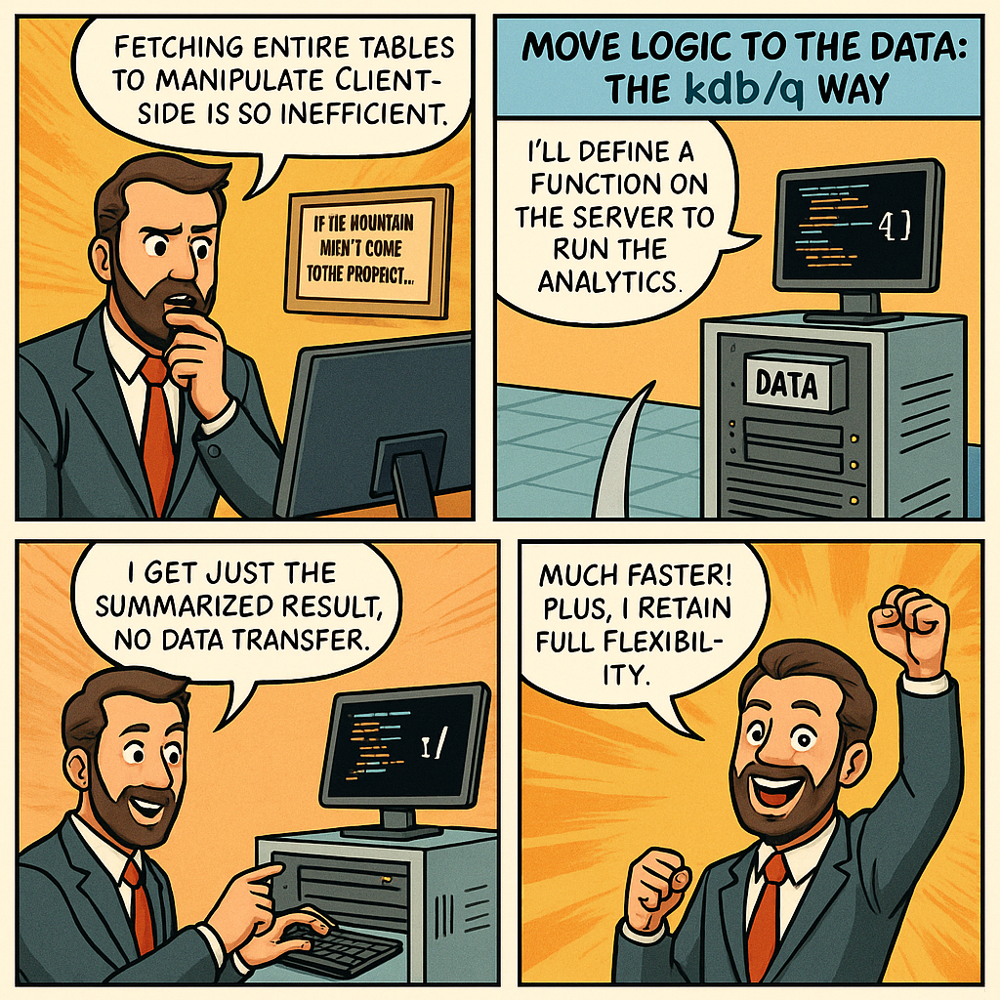

# If the Mountain Won’t Come to You...

You’ve probably heard the saying, ***“If the mountain doesn’t come to the prophet, the prophet must go to the mountain.”***. And no, I haven’t suddenly become a philosopher, so bear with me, this has everything to do with KDB/Q development.

System architecture often requires a bit of abstract thinking. One of the biggest challenges in big data systems is the cost of moving data, fetching massive datasets from a database just to analyze them elsewhere can create serious performance bottlenecks. Transferring raw data over networks (especially across geographies) slows everything down.

But here’s where KDB/Q shines. Unlike most time-series databases, it’s not just a database, it's much more than that, it's a full blown array programming language, purpose-built for data analysis. Instead of dragging all your data across the network to crunch numbers elsewhere, you bring your logic to ***the data***. Run your business logic where the data lives, send back only the final result, **compact, efficient, fast**.

Just like the proverb: when the data won’t come to you, you go to the data.

In this short and simplified blog post, I’ll walk you through how to bring the above concept to life. We’ll keep things minimal for clarity’s sake, using a basic example, but once you grasp the core idea, you’ll see how it scales up to more complex, production-grade systems.



## Laying the Groundwork: Simulating the Mountain

Before we can demonstrate the concept in action, we need to set the stage. We'll simulate a process holding equity data for four symbols, Apple, Google, IBM, and Microsoft, spanning four days. We simulate a dataset of one million records. While that’s modest in the world of big data (and child's play for KDB/Q), it’s perfect for illustrating the core idea. Once you understand the approach, scaling it to fit real-world, complex systems will be straightforward.


```
q)n:1000000
q)equities:([] date:n?.z.D+til 4;sym:`g#n?`AAPL`GOOG`MSFT`IBM;price:n?100.0)
q)select count i by sym from equities
sym | x
----| ------
AAPL| 249888
GOOG| 249475
IBM | 250141
MSFT| 250496
q)select count i by date from equities
date      | x
----------| ------
2025.08.02| 250353
2025.08.03| 249858
2025.08.04| 249946
2025.08.05| 249843
q)-22!equities
16749915
q)1e-6*-22!equities
16.74991
```

As shown in the code snippet above, we’ve now created an `equities` table with one million records, about 250,000 rows for each symbol and each date. Before jumping into our analytics, let’s take a look at the table’s size. Using the [`-22!`](https://code.kx.com/q/basics/internal/#-22x-uncompressed-length) operator, which returns the uncompressed transmission size of an object in bytes. A quick conversion reveals our table would use 16MB. Now, let’s move on to the analytics: we’ll calculate the open, high, low, and close prices for every date-symbol combination. This is nothing complex, just a simple one-liner in KDB/Q. Timing the computation shows it completes in just 16 milliseconds, and the resulting summary table is tiny: only 756 bytes. 

```
q)exec `open`high`low`close!(first;max;min;last)@\:price by date,sym from equities
date       sym | open     high     low          close
---------------| ---------------------------------------
2025.08.02 AAPL| 52.94808 99.99837 0.001122733  70.24182
2025.08.02 GOOG| 8.388858 99.99769 0.001475797  37.44706
2025.08.02 IBM | 30.17723 99.99893 0.001599733  70.03851
2025.08.02 MSFT| 51.59796 99.99651 8.079223e-05 16.81099
2025.08.03 AAPL| 40.66642 99.99756 0.0007903203 49.7864
2025.08.03 GOOG| 17.80839 99.99987 0.0002427492 80.39763
2025.08.03 IBM | 23.06385 99.99921 0.001205644  49.26256
2025.08.03 MSFT| 49.31835 99.99372 0.0007542549 37.21083
2025.08.04 AAPL| 53.47096 99.99956 0.000825664  34.08364
2025.08.04 GOOG| 25.60658 99.99473 0.001111603  32.36165
2025.08.04 IBM | 97.85    99.99736 0.00116278   39.62569
2025.08.04 MSFT| 78.5033  99.99915 0.002760184  95.05164
2025.08.05 AAPL| 51.70911 99.99866 0.001044618  77.00343
2025.08.05 GOOG| 47.07883 99.99848 0.007454539  81.31288
2025.08.05 IBM | 15.08133 99.99977 0.003722939  91.16196
2025.08.05 MSFT| 39.27524 99.99911 0.0002150191 6.901068
q)\ts exec `open`high`low`close!(first;max;min;last)@\:price by date,sym from equities
16 41944416
q)-22!exec `open`high`low`close!(first;max;min;last)@\:price by date,sym from equities
756
```

## The Old-School Data Detour: Dragging Data the Long Way Around

Next, let’s mimic the typical approach most mainstream developers follow, think Python or Java. The standard workflow involves connecting to a database, pulling over the raw data, and then performing analytics locally within the application. It’s a slow and resource-heavy method, especially unsuited for latency-sensitive environments. To simulate this in KDB/Q, we start by assigning port `7777` to the process that holds our equities data, then connect to it from a separate client process, just as an external app would.

We start by connecting to the data process using [`hopen`](https://code.kx.com/q/ref/hopen/), which sets up a communication channel between the client and server processes. Then, we use a lambda, an anonymous function, to fetch the entire `equities` table and perform the analytics locally on the client side. For clarity, we also output the transmission size of the data both before and after the analytics step. As expected, the full dataset is transferred across the network, 16MB of it. While that may not seem like much in this example, in real-world production systems, this kind of data movement can become a major performance bottleneck. When we measure the runtime, this client-side approach takes 56 milliseconds, about 3.5 times longer than executing the same calculation directly on the server.

```
q)h:hopen 7777
q){data:h "select from equities";show -22!data;show result:exec `open`high`low`close!(first;max;min;last)@\:price by date,sym from data;show -22!result}[]
16749915
date       sym | open     high     low          close
---------------| ---------------------------------------
2025.08.02 AAPL| 52.94808 99.99837 0.001122733  70.24182
2025.08.02 GOOG| 8.388858 99.99769 0.001475797  37.44706
2025.08.02 IBM | 30.17723 99.99893 0.001599733  70.03851
2025.08.02 MSFT| 51.59796 99.99651 8.079223e-05 16.81099
2025.08.03 AAPL| 40.66642 99.99756 0.0007903203 49.7864
2025.08.03 GOOG| 17.80839 99.99987 0.0002427492 80.39763
2025.08.03 IBM | 23.06385 99.99921 0.001205644  49.26256
2025.08.03 MSFT| 49.31835 99.99372 0.0007542549 37.21083
2025.08.04 AAPL| 53.47096 99.99956 0.000825664  34.08364
2025.08.04 GOOG| 25.60658 99.99473 0.001111603  32.36165
2025.08.04 IBM | 97.85    99.99736 0.00116278   39.62569
2025.08.04 MSFT| 78.5033  99.99915 0.002760184  95.05164
2025.08.05 AAPL| 51.70911 99.99866 0.001044618  77.00343
2025.08.05 GOOG| 47.07883 99.99848 0.007454539  81.31288
2025.08.05 IBM | 15.08133 99.99977 0.003722939  91.16196
2025.08.05 MSFT| 39.27524 99.99911 0.0002150191 6.901068
756
q)\ts {data:h "select from equities";show -22!data;show result:exec `open`high`low`close!(first;max;min;last)@\:price by date,sym from data;show -22!result}[]
16749915
date       sym | open     high     low          close
---------------| ---------------------------------------
2025.08.02 AAPL| 52.94808 99.99837 0.001122733  70.24182
2025.08.02 GOOG| 8.388858 99.99769 0.001475797  37.44706
2025.08.02 IBM | 30.17723 99.99893 0.001599733  70.03851
2025.08.02 MSFT| 51.59796 99.99651 8.079223e-05 16.81099
2025.08.03 AAPL| 40.66642 99.99756 0.0007903203 49.7864
2025.08.03 GOOG| 17.80839 99.99987 0.0002427492 80.39763
2025.08.03 IBM | 23.06385 99.99921 0.001205644  49.26256
2025.08.03 MSFT| 49.31835 99.99372 0.0007542549 37.21083
2025.08.04 AAPL| 53.47096 99.99956 0.000825664  34.08364
2025.08.04 GOOG| 25.60658 99.99473 0.001111603  32.36165
2025.08.04 IBM | 97.85    99.99736 0.00116278   39.62569
2025.08.04 MSFT| 78.5033  99.99915 0.002760184  95.05164
2025.08.05 AAPL| 51.70911 99.99866 0.001044618  77.00343
2025.08.05 GOOG| 47.07883 99.99848 0.007454539  81.31288
2025.08.05 IBM | 15.08133 99.99977 0.003722939  91.16196
2025.08.05 MSFT| 39.27524 99.99911 0.0002150191 6.901068
756
56 62917344
```

## No More Data Dragging: The KDB/Q Way to Bring Logic to Data

Now that we’ve explored the conventional, and inefficient, method of moving raw data across the network, let’s turn to a more elegant solution: the KDB/Q way. Instead of pulling the full dataset to the client, we define a `getData` function directly on the server. This function performs the open, high, low, and close (OHLC) analytics right where the data lives, returning only the summarized result. This approach drastically reduces network traffic and improves performance. Let’s walk through how it works.

First, we define the function `getData` on the server and run it locally. This verifies that it returns the desired result.

```
q)getData:{exec `open`high`low`close!(first;max;min;last)@\:price by date,sym from equities}
q)getData[]
date       sym | open     high     low          close
---------------| ---------------------------------------
2025.08.02 AAPL| 52.94808 99.99837 0.001122733  70.24182
2025.08.02 GOOG| 8.388858 99.99769 0.001475797  37.44706
2025.08.02 IBM | 30.17723 99.99893 0.001599733  70.03851
2025.08.02 MSFT| 51.59796 99.99651 8.079223e-05 16.81099
2025.08.03 AAPL| 40.66642 99.99756 0.0007903203 49.7864
2025.08.03 GOOG| 17.80839 99.99987 0.0002427492 80.39763
2025.08.03 IBM | 23.06385 99.99921 0.001205644  49.26256
2025.08.03 MSFT| 49.31835 99.99372 0.0007542549 37.21083
2025.08.04 AAPL| 53.47096 99.99956 0.000825664  34.08364
2025.08.04 GOOG| 25.60658 99.99473 0.001111603  32.36165
2025.08.04 IBM | 97.85    99.99736 0.00116278   39.62569
2025.08.04 MSFT| 78.5033  99.99915 0.002760184  95.05164
2025.08.05 AAPL| 51.70911 99.99866 0.001044618  77.00343
2025.08.05 GOOG| 47.07883 99.99848 0.007454539  81.31288
2025.08.05 IBM | 15.08133 99.99977 0.003722939  91.16196
2025.08.05 MSFT| 39.27524 99.99911 0.0002150191 6.901068
q)-22!getData[]
756
q)\ts getData[]
15 41943696
```

Next, we call this function remotely from our client using IPC, allowing the server to execute the computation and return only the summarized result.

```
q)show result:h(`getData;`)
date       sym | open     high     low          close
---------------| ---------------------------------------
2025.08.02 AAPL| 52.94808 99.99837 0.001122733  70.24182
2025.08.02 GOOG| 8.388858 99.99769 0.001475797  37.44706
2025.08.02 IBM | 30.17723 99.99893 0.001599733  70.03851
2025.08.02 MSFT| 51.59796 99.99651 8.079223e-05 16.81099
2025.08.03 AAPL| 40.66642 99.99756 0.0007903203 49.7864
2025.08.03 GOOG| 17.80839 99.99987 0.0002427492 80.39763
2025.08.03 IBM | 23.06385 99.99921 0.001205644  49.26256
2025.08.03 MSFT| 49.31835 99.99372 0.0007542549 37.21083
2025.08.04 AAPL| 53.47096 99.99956 0.000825664  34.08364
2025.08.04 GOOG| 25.60658 99.99473 0.001111603  32.36165
2025.08.04 IBM | 97.85    99.99736 0.00116278   39.62569
2025.08.04 MSFT| 78.5033  99.99915 0.002760184  95.05164
2025.08.05 AAPL| 51.70911 99.99866 0.001044618  77.00343
2025.08.05 GOOG| 47.07883 99.99848 0.007454539  81.31288
2025.08.05 IBM | 15.08133 99.99977 0.003722939  91.16196
2025.08.05 MSFT| 39.27524 99.99911 0.0002150191 6.901068
q)-22!result
756
q)\ts show result:h(`getData;`)
date       sym | open     high     low          close
---------------| ---------------------------------------
2025.08.02 AAPL| 52.94808 99.99837 0.001122733  70.24182
2025.08.02 GOOG| 8.388858 99.99769 0.001475797  37.44706
2025.08.02 IBM | 30.17723 99.99893 0.001599733  70.03851
2025.08.02 MSFT| 51.59796 99.99651 8.079223e-05 16.81099
2025.08.03 AAPL| 40.66642 99.99756 0.0007903203 49.7864
2025.08.03 GOOG| 17.80839 99.99987 0.0002427492 80.39763
2025.08.03 IBM | 23.06385 99.99921 0.001205644  49.26256
2025.08.03 MSFT| 49.31835 99.99372 0.0007542549 37.21083
2025.08.04 AAPL| 53.47096 99.99956 0.000825664  34.08364
2025.08.04 GOOG| 25.60658 99.99473 0.001111603  32.36165
2025.08.04 IBM | 97.85    99.99736 0.00116278   39.62569
2025.08.04 MSFT| 78.5033  99.99915 0.002760184  95.05164
2025.08.05 AAPL| 51.70911 99.99866 0.001044618  77.00343
2025.08.05 GOOG| 47.07883 99.99848 0.007454539  81.31288
2025.08.05 IBM | 15.08133 99.99977 0.003722939  91.16196
2025.08.05 MSFT| 39.27524 99.99911 0.0002150191 6.901068
17 4196928
```

As we can see, this approach is not only significantly faster than the traditional method, but it also drastically reduces the amount of data transferred over the network. In fact, the performance closely matches that of running the query directly on the server, which makes sense, since that's exactly what's happening. Only the summarized result is returned, using just 756 bytes, exactly as if the query had been executed locally.

## From Static to Dynamic: Unlocking Full Flexibility

You might be thinking, wait a second, doesn’t this become limiting if we have to hardcode our analytics function on the server? What happens when we want to modify the logic, query a different table, or tweak parameters? Do we need to update the server code and redeploy every time? That would be a nightmare for flexibility and release cycles. Fortunately, that’s not the case. One of the powerful aspects of KDB/Q (and functional programming in general) is the ability to define lambdas, anonymous functions, that can be sent over IPC at runtime. No need to predefine anything on the server. Let’s see how that works in practice.

```
q)show result:h({exec `open`high`low`close!(first;max;min;last)@\:price by date,sym from equities};`)
date       sym | open     high     low          close
---------------| ---------------------------------------
2025.08.02 AAPL| 52.94808 99.99837 0.001122733  70.24182
2025.08.02 GOOG| 8.388858 99.99769 0.001475797  37.44706
2025.08.02 IBM | 30.17723 99.99893 0.001599733  70.03851
2025.08.02 MSFT| 51.59796 99.99651 8.079223e-05 16.81099
2025.08.03 AAPL| 40.66642 99.99756 0.0007903203 49.7864
2025.08.03 GOOG| 17.80839 99.99987 0.0002427492 80.39763
2025.08.03 IBM | 23.06385 99.99921 0.001205644  49.26256
2025.08.03 MSFT| 49.31835 99.99372 0.0007542549 37.21083
2025.08.04 AAPL| 53.47096 99.99956 0.000825664  34.08364
2025.08.04 GOOG| 25.60658 99.99473 0.001111603  32.36165
2025.08.04 IBM | 97.85    99.99736 0.00116278   39.62569
2025.08.04 MSFT| 78.5033  99.99915 0.002760184  95.05164
2025.08.05 AAPL| 51.70911 99.99866 0.001044618  77.00343
2025.08.05 GOOG| 47.07883 99.99848 0.007454539  81.31288
2025.08.05 IBM | 15.08133 99.99977 0.003722939  91.16196
2025.08.05 MSFT| 39.27524 99.99911 0.0002150191 6.901068
q)-22!result
756
q)\ts show result:h({exec `open`high`low`close!(first;max;min;last)@\:price by date,sym from equities};`)
date       sym | open     high     low          close
---------------| ---------------------------------------
2025.08.02 AAPL| 52.94808 99.99837 0.001122733  70.24182
2025.08.02 GOOG| 8.388858 99.99769 0.001475797  37.44706
2025.08.02 IBM | 30.17723 99.99893 0.001599733  70.03851
2025.08.02 MSFT| 51.59796 99.99651 8.079223e-05 16.81099
2025.08.03 AAPL| 40.66642 99.99756 0.0007903203 49.7864
2025.08.03 GOOG| 17.80839 99.99987 0.0002427492 80.39763
2025.08.03 IBM | 23.06385 99.99921 0.001205644  49.26256
2025.08.03 MSFT| 49.31835 99.99372 0.0007542549 37.21083
2025.08.04 AAPL| 53.47096 99.99956 0.000825664  34.08364
2025.08.04 GOOG| 25.60658 99.99473 0.001111603  32.36165
2025.08.04 IBM | 97.85    99.99736 0.00116278   39.62569
2025.08.04 MSFT| 78.5033  99.99915 0.002760184  95.05164
2025.08.05 AAPL| 51.70911 99.99866 0.001044618  77.00343
2025.08.05 GOOG| 47.07883 99.99848 0.007454539  81.31288
2025.08.05 IBM | 15.08133 99.99977 0.003722939  91.16196
2025.08.05 MSFT| 39.27524 99.99911 0.0002150191 6.901068
14 4198016
```

We can take it a step further by parameterising our lambda, passing in the table name we want to analyse. This approach doesn’t just give you the performance boost of processing data where it lives; it also offers maximum flexibility in how you design your system. 

```
q)\ts show result:h({[x] exec `open`high`low`close!(first;max;min;last)@\:price by date,sym from x};`equities)
date       sym | open     high     low          close
---------------| ---------------------------------------
2025.08.02 AAPL| 52.94808 99.99837 0.001122733  70.24182
2025.08.02 GOOG| 8.388858 99.99769 0.001475797  37.44706
2025.08.02 IBM | 30.17723 99.99893 0.001599733  70.03851
2025.08.02 MSFT| 51.59796 99.99651 8.079223e-05 16.81099
2025.08.03 AAPL| 40.66642 99.99756 0.0007903203 49.7864
2025.08.03 GOOG| 17.80839 99.99987 0.0002427492 80.39763
2025.08.03 IBM | 23.06385 99.99921 0.001205644  49.26256
2025.08.03 MSFT| 49.31835 99.99372 0.0007542549 37.21083
2025.08.04 AAPL| 53.47096 99.99956 0.000825664  34.08364
2025.08.04 GOOG| 25.60658 99.99473 0.001111603  32.36165
2025.08.04 IBM | 97.85    99.99736 0.00116278   39.62569
2025.08.04 MSFT| 78.5033  99.99915 0.002760184  95.05164
2025.08.05 AAPL| 51.70911 99.99866 0.001044618  77.00343
2025.08.05 GOOG| 47.07883 99.99848 0.007454539  81.31288
2025.08.05 IBM | 15.08133 99.99977 0.003722939  91.16196
2025.08.05 MSFT| 39.27524 99.99911 0.0002150191 6.901068
14 4198048
```

And with that, we wrap up this simplified tutorial. You're now equipped to apply this pattern to real-world, production-grade architectures. Feel free to reach out if you have any questions or want to dive deeper.

**Until then, happy coding!**


