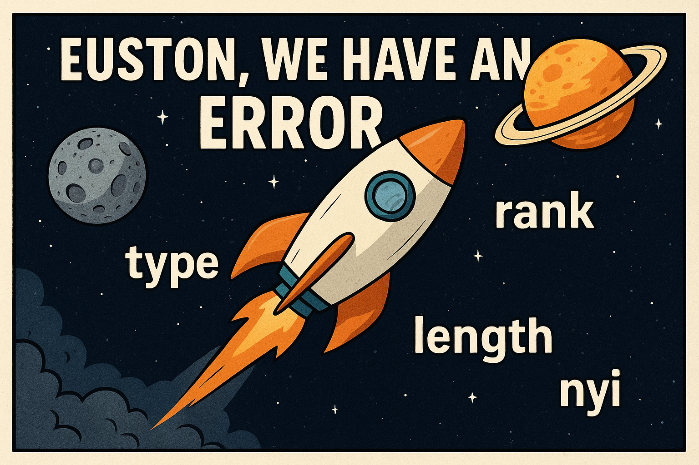

# Euston, We Have an Error

If you’ve just started learning KDB/Q and thought the ***language*** was the only terse thing, think again. The error codes are just as terse. At a first glance, KDB/Q errors can feel confusing, even a bit intimidating, but once you look closer and reflect on them, they actually make a lot of sense. Still, when you’re beginning your journey, it can definitely feel overwhelming.

In this blog post, I’ll break down the ten most common errors you’ll run into, explain what they mean, show examples of how they arise, and walk you through how to avoid them. I will also share some helpful tips and tricks for debugging your code so you can track down issues faster and with confidence.

Strap in, Euston, prepare for lift-off.




## type

Let's start with one of the most intuitive errors you’ll encounter: the **type error**. As the name implies, this happens when the data type of one or more arguments isn’t what KDB/Q expects. A classic example is attempting to add a number to a symbol, an operation that simply doesn’t make sense.

Because KDB/Q is a [**dynamic array language**](https://www.defconq.tech/docs/language/KDB#dynamic-by-design) where both variables and functions can change at runtime, mismatched types can appear more easily than you expect. When they do, KDB/Q politely (well… tersely) lets you know with a `type` error.

Some practical examples are:

```
q)4+`a
'type
  [0]  4+`a
        ^
q)sum `hello`world
'type
  [0]  sum `hello`world
       ^
```

As shown in the examples above, a `type` error is raised in situations where incompatible data types are used. In the first case, adding a number to a symbol triggers the error; in the second, attempting to sum two symbols results in the same issue, an operation that simply has no meaning in KDB/Q. Even when using other operators, such as amending a list of integers with a symbol via the [***amend‐at***](https://www.defconq.tech/docs/concepts/amend), KDB/Q will rightfully complain with a `type` error.

```
q)@[1 2 3;0 1;:;`hello]
'type
  [0]  @[1 2 3;0 1;:;`hello]
       ^
```

However, there are cases where you might ***expect*** a `type` error, yet KDB/Q happily carries on without any complaints. A classic example is adding an integer to a float. Since this operation is mathematically valid, KDB/Q simply performs it, no error needed. 

```
q)3+4.0
7f
```

More surprisingly, concatenating an integer or even a symbol to a string doesn’t trigger a `type` error either. While this might be unexpected at first, at a second glance it works because in KDB/Q, a string is simply a ***list of characters***, and KDB/Q fully supports mixed lists. By appending a value of a different type to a string, KDB/Q implicitly creates a mixed list. You can easily verify this behaviour with the example below.

```
q)"Hello World",4
"H"
"e"
"l"
"l"
"o"
" "
"W"
"o"
"r"
"l"
"d"
4
q)"Hello World", `Errors
"H"
"e"
"l"
"l"
"o"
" "
"W"
"o"
"r"
"l"
"d"
`Errors
```

By applying the [`type`](https://code.kx.com/q/ref/type/) operator to the results of these concatenations, we can clearly confirm that both outputs are treated as mixed lists (type 0h). In other words, KDB/Q doesn’t reject the operation, it simply adapts the data structure. 

## length

Next up is the **length error**, another fairly intuitive one. This error is raised whenever you attempt to perform an operation on two parameters that don’t share the same length. There is one important caveat, though: sometimes KDB/Q can perform an **implicit atomic extension** to make the operation valid. But before we get ahead of ourselves, let’s walk through a few examples.

```
// Operation on parameters of same length, no error is thrown
q)1+2
3
q)1 2 3+4 5 6
5 7 9
// Operation on two parameters of different length, a length error is raised
q)1 2+3 4 5
'length
  [0]  1 2+3 4 5
          ^
q)
```

So far so good, right? Now let’s talk about the [**atomic extensions**](https://code.kx.com/q4m3/6_Functions/#66-atomic-functions) mentioned earlier. When an operation involves one list and one atom, KDB/Q doesn’t immediately complain. Instead, it will automatically **extend** the atom to match the length of the list and then apply the operation element-wise. This clever behaviour prevents a length error and makes working with arrays both powerful and concise.

```
q)1 2 3+10
11 12 13
```

But we’re not done yet, there’s another key detail worth highlighting. Let’s take a step back and remind ourselves what KDB/Q fundamentally is: an **array programming language**. (f you’d like to explore this in more detail, take a look [here](https://www.defconq.tech/docs/language/KDB)). In KDB/Q, tables aren’t magic objects; they are simply **flipped column dictionaries** (Want to nerd out a bit more? You can read the full explanation [here](https://www.defconq.tech/docs/concepts/dictionariesTables)), meaning each column is just a vector. And that leads to an important rule: **whenever you operate on a table column, the result must produce vectors of the same length as the table itself.** If it doesn’t, you’ll immediately run into a `length` error. The example below illustrates exactly what happens when this rule is broken.

```
q)t:([] a:1 2 3;b:`One`Two`Three)
q)show t:([] a:1 2 3;b:`One`Two`Three)
a b
-------
1 One
2 Two
3 Three
q)update c:10 20 from t
'length
  [0]  update c:10 20 from t
       ^
q)update c:10 20 30 from t
a b     c
----------
1 One   10
2 Two   20
3 Three 30
```
Hopefully this makes length errors a lot less mysterious and helps you spot them quickly whenever they show up.

## rank

The `rank` error is somewhat like a cousin of the `length` error, at least that’s how I like to think about it. In KDB/Q the ***rank*** of a function refers to the number of arguments it expects. For example, the addition operator + takes exactly two arguments. If you try to pass more (or fewer), Q throws a rank error. In short, your “argument count” doesn’t match what the function requires. Luckily, this one is easy to fix: just adjust the number of parameters you’re passing.

```
q)+[1;2;3]
'rank
  [0]  +[1;2;3]
       ^
q)f:{[one;two;three] one+two+three}
q)f[1;2;3]
6
q)f[1;2;3;4]
'rank
  [0]  f[1;2;3;4]
       ^
```

## domain

Before diving into the next error, it’s worth revisiting what a function actually is: ***“In mathematics, a function assigns each input value to exactly one output value. The set of valid inputs is called the domain, and the set from which outputs are taken is called the codomain.”*** ([Q for Mortals, Overview](https://code.kx.com/q4m3/0_Overview/#022-functions)). If we provide a value that doesn’t belong to the domain, the function simply can’t operate on it, resulting in a **domain error**. A simple example is the `til` operator. Given a positive integer `x`, it generates all natural numbers from `0` to `x-1`. But its domain excludes negative integers, so passing one instantly triggers a domain error.

```
// The argument is in the domain of the function
q)til 5
0 1 2 3 4
// The argument is outside of the domain of the function
q)til -1
'domain
  [0]  til -1
       ^
```

## mismatch 

If you try to join two tables with a simple comma join but their schemas don’t match, KDB/Q will throw a **`mismatch`** error. And that’s exactly how I think of it: the schema between the two tables **simply doesn’t match**.

```
q)([]a:til 4; b:`one`two`three`four),([]b:til 4;c:`one`two`three`four)
'mismatch
  [0]  ([]a:til 4; b:`one`two`three`four),([]b:til 4;c:`one`two`three`four)
                                         ^
q)([]a:til 4; b:`one`two`three`four),([]a:til 4;b:`one`two`three`four)
a b
-------
0 one
1 two
2 three
3 four
0 one
1 two
2 three
3 four
```

## from

Sticking with table-related issues for a moment: if you write a poorly structured Q-SQL query, you’ll run into a `from` error. This isn’t limited to forgetting the `from` keyword; it appears whenever the query itself is malformed.

```
q)select t where a=1
'from
  [0]  select t where a=1
                        ^
q)selec from t where a=1
'from
  [0]  selec from t where a=1
             ^
```

A simple way to avoid poorly structured Q-SQL queries is to brush up on the basics. You can start by reading my blog post on Q-SQL [here](https://www.defconq.tech/docs/concepts/qsql).

## upd

The `upd` error is a classic one you’ll often encounter during Tickerplant (TP) log replays. Although it’s specific to the replay workflow, it highlights a much broader and more fundamental error pattern. So let’s make sure we really understand what’s going on. To understand why this error occurs, we first need to remind ourselves what’s inside a TP log file. As shown below, a TP log is essentially a list of lists.

```
`upd `trade (0D14:56:01.113310000;`AUDUSD;"S";1000;96.96)
`upd `trade (0D14:56:01.115310000;`SGDUSD;"S";5000;95.45)
`upd `trade (0D14:56:01.119310000;`AUDUSD;"B";1000;95.08)
`upd `trade (0D14:56:01.121310000;`AUDUSD;"B";1000;95.65)
`upd `trade (0D14:56:01.122310000;`SGDUSD;"B";5000;98.14)
```

Each line contains the function to execute (`upd`), the target table name, and the data being written. Once you understand that structure, the reason behind the `upd` error becomes much clearer. The `upd` error isn't random, it only occurs when the `upd` function has not been defined. We can confirm this with a simple example. First, we mimic a typical TP log entry by creating a list where the first element is a function and the remaining elements are its arguments. For simplicity, we’ll use the `+` operator with two integers. Evaluating this list with `value` correctly applies the function and returns the result.

```
q)value (+;2;3)
5
```

Next, we try the same idea using a TP-style entry. We define a small table with user names and ages, then attempt to insert a record by evaluating a list that calls `upd`. 

```
q)show t:([] name:`$(); age: `int$())
name age
--------
q)upd[`t;(`alex;38i)]
'upd
  [0]  upd[`t;(`alex;38i)]
       ^
```
Since `upd` is not defined, evaluating the expression triggers the `upd` error.

This leads us to a more general rule: whenever KDB/Q references a function or variable that doesn’t exist in the current namespace, it throws an error using that missing name. In other words, the error message is simply the name of what’s undefined. Let’s see a practical example of this behaviour.

```
q)thisFunctionDoesntExist[4;5]
'thisFunctionDoesntExist
  [0]  thisFunctionDoesntExist[4;5]
       ^
q)2+thisVariableDoesntExist
'thisVariableDoesntExist
  [0]  2+thisVariableDoesntExist
         ^
```

Understanding this pattern makes it much easier to track down where an error comes from and resolve it quickly.Understanding this pattern makes it much easier to track down where an error comes from and resolve it quickly. The key takeaway: if you’re going to fail, fail fast!

## wsfull

The next error is one you **never** want to see. It doesn’t just signal a (potential) flaw in your code, it means you’ve hit a **hardware limit**: you’ve **run out of memory**. At this point, the process will crash, you’ll stop intake of real-time data, and you may lose data entirely. The example below illustrates how this can happen, but **do not run it unless you want to intentionally crash your machine**, and **never, ever in production.**


```
q)999999999999#0
```


As you can see below, once my MacBook began running out of memory, it slowly started suspending processes one by one. 


It put up a brave fight, but eventually tapped out, shut down, and restarted. For me, it was just an unexpected coffee break before getting back to blogging. But in production? A crash won’t just wake you up like caffeine, it will shake you harder than an espresso shot to the system.


## -w abort

Instead of letting your KDB/Q process eat up all available RAM like it’s at an all-you-can-eat buffet, you can put it on a strict diet. Setting a memory limit ensures that the ***process*** dies when it overeats, not your entire server. Once this limit is hit, the process terminates immediately, but at least the machine stays alive and the rest of your system keeps running. Use the `-w` argument to specify how many MB it’s allowed to consume. For example, `-w 10` restricts it to 10MB. If you leave `-w` at its default value of 0, the process gets unlimited access to your machine’s memory... and we all know how that story ends.

```
alexanderunterrainer@Mac:~|⇒  qx -w 10
KDB-X 0.1.1 2025.09.29 Copyright (C) 1993-2025 Kx Systems
m64/ 8()core 24576MB alexanderunterrainer mac 192.168.1.177 EXPIRE 2025.12.31 COMMUNITY #5029523

q)999999999#0
'-w abort
```

## u-fail

The u-fail error is hands-down my favourite. Not because I bump into it often, in fact, I rarely do, but because of its name. It’s hard not to smile at an error that casually tells you: **“you fail.”** I like to think it’s KDB/Q’s subtle tribute to every *qbie* discovering the language and making their first glorious mistakes.

You’ll run into `u-fail` when trying to apply the **unique attribute** to a list that... well... isn’t **unique**. Likewise, you’ll trigger it by applying the **parted attribute** to a list that isn’t actually **parted**. It’s KDB/Q’s way of gently whispering, ***“nice try, but your attributes need some work.”***

A close cousin to this is the `s-fail` error, thrown when you attempt to mark a list as **sorted** when it’s not actually sorted in **ascending order**. If you’ve been blessed with both `u-fail` and `s-fail`, it may be time for a quick refresher on attributes.

Luckily, DefconQ comes to rescue. Check out my deep dive on attributes [here](https://www.defconq.tech/docs/concepts/attributes). Happy debugging!

```
q)`u#2 2 3 4
'u-fail
  [0]  `u#2 2 3 4
         ^
q)`u#2 2 3 3 2 2 4 3 3 3
'u-fail
  [0]  `u#2 2 3 3 2 2 4 3 3 3
         ^
q)`u#2 3 4
`u#2 3 4
q)`p#2 2 2 3 3 3 4 2 2 3 3
'u-fail
  [0]  `p#2 2 2 3 3 3 4 2 2 3 3
         ^
q)`p#2 2 2 3 3 3 4
`p#2 2 2 3 3 3 4
q)`s#5 4 3 2 1
's-fail
  [0]  `s#5 4 3 2 1
         ^
q)`s#1 2 3 4
`s#1 2 3 4
```
## **BONUS**: nyi

The `nyi error` is another special one, it stands for **“Not Yet Implemented.”** You’ll come across it whenever you attempt an operation that could make sense logically, but simply hasn’t been built into the language (at least not yet). In other words, KDB/Q is telling you: *“Interesting idea... maybe one day, but not today.”* It’s a little reminder that the language continues to evolve, and some ideas still need time to mature.

## Catch Me If You Can: Error Traps that Secure Your KDB/Q Apps

Up to this point, we’ve explored the most common KDB/Q errors, what triggers them, and how to prevent them. But no matter how careful you are, unexpected scenarios still happen, and when they do, you don’t want your entire application grinding to a halt.

To protect your system from crashing in the face of an error, you should wrap any risky or unpredictable code in an **error trap**, using the (heavily overloaded) **trap** `.` or **trap at** `@` operator. The table below shows the syntax and how to use it effectively:


|Function name | Function syntax | Function semantics             |
|------------- | --------------- | ------------------------------ |
| Trap         | `.[g;gx;e]`     | Try `g . gx` ; catch with `e`  |
| Trap at      | `@[f;fx;e]`     | Try `f@fx`   ; catch with `e`  |


Examples:

```
q)neg `a
'type
  [0]  neg `a
       ^
q)@[neg;`a;`error]
`error
q).[+;"ab";`ouch]
`ouch
```

For a deeper exploration of **trap**, you can read the full walkthrough [here](https://www.defconq.tech/docs/concepts/amend#trap). The **extended trap at** functionality is also covered [here](https://code.kx.com/q/ref/dotq/#trp-extend-trap-at) and I’ll leave that one for you to experiment with. Enjoy the challenge!


To wrap things up, KDB/Q errors really aren’t as frightening as they first appear. Now that you understand what they mean and how to interpret them, there’s no need to panic the next time one pops up on your screen. Consider them helpful signposts rather than scary roadblocks.

