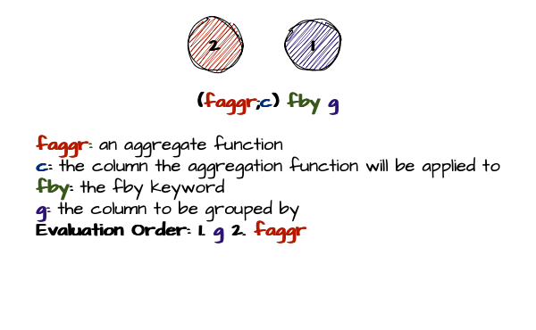

# Mastering the Art of Filtering: An In-Depth Look at `fby` in KDB/Q


In my previous blog post, I gave you an in-depth exploration of [Q-SQL](https://www.defconq.tech/docs/concepts/qsql) and how to effectively query your data. However, I deliberately left out one crucial function: `fby`, or Filter-by. There are two reasons for this. Firstly, the post turned out to be much longer than anticipated, and I didn’t want to overload you with too much technical detail. Secondly, I believei `fby` deserves its own dedicated post. It's a powerful operator that highlights what makes KDB/Q so exceptional when working with big data and time series. After this walkthrough, I hope you'll agree. So, without further ado, let's dive in!

## Syntax



The syntax of `fby`, like (almost)  all KDB/Q, is terse and efficient. `fby` is a binary operator with a parse tree on the left side. Inside parentheses, you specify an aggregation function and the column to which it's applied. Following that is the `fby` keyword, and finally, the column to group by as the right argument to `fby`

```
(faggr;col) fby g
```
where

- **faggr**: is an aggregate function
- **col**: is the column the aggregation function will be applied to
- **`fby`**: is the keyword of the Filter-by operator
- **g**: is the column to be grouped by

So, what does `fby` actually do? It applies an aggregation function to a list (or a column in the case of a table) based on groups that are formed from another list (or column).

Let’s approach this from a practical standpoint—after all, a single line of KDB/Q code speaks louder than a thousand words.

## `fby` in the `where clause`: Powerful filtering

The most frequent application of the `fby` operator is within the where clause of a Q-SQL statement. However, as we’ll discover, `fby` isn’t restricted to the where clause or even solely to Q-SQL queries—it has broader applications. To ease into the topic and gradually build our understanding, let's first explore the application of `fby` within a where clause. 

For demonstration purposes, we'll use our `trade` table again, so let's quickly set it up.

```
q)show trade:([] sym:20?`AAPL`GOOG`IBM`MSFT;price:20?100.; quantity:20?1000;exchange:20?`LSE`NASDAQ`CBOE`NYSE)
sym  price    quantity exchange
-------------------------------
AAPL 88.31223 111      NASDAQ
AAPL 18.9679  859      LSE
AAPL 28.81915 496      LSE
AAPL 74.06357 181      LSE
MSFT 55.38304 79       NASDAQ
MSFT 50.61626 256      NYSE
GOOG 14.55868 986      NYSE
MSFT 38.43624 593      LSE
GOOG 25.1761  520      NASDAQ
IBM  33.85685 67       NASDAQ
IBM  44.10267 181      LSE
IBM  43.60838 682      CBOE
IBM  72.47827 763      LSE
MSFT 53.51104 105      LSE
GOOG 34.38456 951      NYSE
..
```

Now, suppose you want to identify all trade records where the price at which a certain stock was traded is greater than or equal to its average price. A basic KDB/Q approach would involve first using an update statement to calculate the average price for each stock and then updating our table accordingly. Following that, we would execute a second query to select all records where the price meets or exceeds the corresponding average price of that stock. The KDB/Q code below demonstrates this inefficient method.

```
q)select from (update avgPrice:avg price by sym from trade) where price>=avgPrice
sym  price    quantity exchange avgPrice
----------------------------------------
AAPL 88.31223 111      NASDAQ   52.54071
AAPL 74.06357 181      LSE      52.54071
MSFT 55.38304 79       NASDAQ   54.16467
IBM  44.10267 181      LSE      40.50052
IBM  43.60838 682      CBOE     40.50052
IBM  72.47827 763      LSE      40.50052
MSFT 78.02194 628      LSE      54.16467
GOOG 86.62585 715      LSE      47.0074
GOOG 74.29183 833      NASDAQ   47.0074
```

As shown in the output above, the `avgPrice` column has been updated with the average stock price for each corresponding stock, which is why you see the same price repeated multiple times. However, with the incredible capabilities of the `fby` operator, we can accomplish all of this in a single query.

```
q)select from trade where price>=(avg;price) fby sym
sym  price    quantity exchange
-------------------------------
AAPL 88.31223 111      NASDAQ
AAPL 74.06357 181      LSE
MSFT 55.38304 79       NASDAQ
IBM  44.10267 181      LSE
IBM  43.60838 682      CBOE
IBM  72.47827 763      LSE
MSFT 78.02194 628      LSE
GOOG 86.62585 715      LSE
GOOG 74.29183 833      NASDAQ
```

Can we be certain that both queries yield the same result? Let's check. Since our first, more verbose approach adds a new column to the table, we'll need to remove it before comparing it to the output of our second query.

```
q)(select from trade where price>=(avg;price) fby sym)~delete avgPrice from select from (update avgPrice:avg price by sym from trade) where price>=avgPrice
1b
```
As expected, the results match perfectly.

You can also group by multiple columns using the `fby` operator, although the syntax is a bit different from what we’re used to. All you need to do is create an anonymous table with the columns you want to group by. The example below illustrates this concept for better understanding.

```
q)select from trade where price>(avg;price) fby ([] sym;exchange)
sym  price    quantity exchange
-------------------------------
AAPL 74.06357 181      LSE
MSFT 55.38304 79       NASDAQ
IBM  33.85685 67       NASDAQ
IBM  72.47827 763      LSE
GOOG 34.38456 951      NYSE
MSFT 78.02194 628      LSE
GOOG 74.29183 833      NASDAQ
```

## The Magic of `fby` exposed

As we've seen, the `fby` operator is quite powerful. In this section, we'll dive deeper into how `fby` operates under the hood by examining some `k` code. That's right; we’ll be looking at the underlying language of `q`, which is `k`, the `K` in KDB/Q. This exploration is purely for illustrative purposes to help you understand the the mechanics behind the scenes. I do not recommend writing `k` code for your projects, and I strongly advise against using it in a production environment, as `k` code is not supported by KX, as noted [here](https://code.kx.com/q/basics/exposed-infrastructure/).

Now, before we start, we need to quickly review two things: First, how can we obtain the underlying `k` code for `fby`? It's quite simple. For any operator that reveals its underlying `k` code, ou just need to type the operator into your `q` console and hit enter, and the `k` code will be displayed. Let's give it a try.

```
k){$[(#x 1)=#y;@[(#y)#x[0]0#x 1;g;:;x[0]'x[1]g:.=y];'`length]}
```

:::tip
The preceding `k)` indicates that what is being displayed is K code.
:::

Next, we need to clarify an important point: Like `q`, `k` has a wide range of overloaded functions—actually, even more than `q`. Most unary functions in `k` have a corresponding overloaded binary version. To distinguish the unary version from the binary version, `q` displays `k` code with a `:`. Let’s take a look at an example: the `k` code for the `q` keyword `flip`, which is a unary function, is `+:`, as shown below. 

```
q)flip
+:
```

Great! Let's demystify `fby`. To do so, we only need to convery four `q` functions into `k` code: `count`, `group`, `value`, and the iterator `each`. The cooresponding `k` code is as follows:

```
q)count
#:
q)group
=:
q)value
.:
q)each
k){x'y}

q)fby
k){$[(#x 1)=#y;@[(#y)#x[0]0#x 1;g;:;x[0]'x[1]g:.=y];'`length]}
```
Now, let’s begin. The first part of `fby` is a plain, simple [`$`](https://code.kx.com/q/ref/cond/) conditional statement. The syntax of this conditional is simple: we evaluate a condition, and if it’s true, we proceed with the true branch of the statement; if it’s false, we continue with the false branch.

```
q)$[0b;`true;`false]
`false
q)$[1b;`true;`false]
`true
```

The condition we evaluate is a basic comparison: we check whether the length of the `x` parameter of `fby` matches the length of the `y` parameter of `fby`. Let’s take a moment to examine the `fby` statement on its own, outside of the Q-SQL `where clause`.

```
q)(avg;trade`price) fby trade`sym
52.54071 52.54071 52.54071 52.54071 54.16467 54.16467 47.0074 54.16467 47.0074 40.50052 40.50052 40.50052 40.50052 54.16467 47.0074 54.16467 47.0074 40.50052 47.0074 54.16467
```

We can generalise the above code using the parameters `x` and `y`, resulting in the following:

```
x fby y
```
where `x` is a list with the first element being an aggregation function and the second element being a list (when used in a `where clause`, this would typically refer to a column by its name). Meanwhile, `y` is a list of values to group by (similarly, in a `where clause`, this would refer to a column).

```
q)show x:(avg;trade`price)
avg
88.31223 18.9679 28.81915 74.06357 55.38304 50.61626 14.55868 38.43624 25.1761 33.85685 44.10267 43.60838 72.47827 53.51104 34.38456 78.02194 86.62585 8.456454 74.29183 49.01948
q)show y:trade`sym
`AAPL`AAPL`AAPL`AAPL`MSFT`MSFT`GOOG`MSFT`GOOG`IBM`IBM`IBM`IBM`MSFT`GOOG`MSFT`GOOG`IBM`GOOG`MSFT
```

Therefore, we basically compare the length of our price list with the length of our symbol list. If they match, we proceed with the execution of the `fby` function. If they don't, a `length` error is thrown.

```
q)k)(#x 1)=#y
1b
// above k code translated to q code
q)count[x 1]=count y
1b
```

:::tip
There are two ways to test `k` code in a `q` console. You can either enter a single backslash `\` to switch to the `k` interpreter or prepend your code with `k)` to run it directly as `k` code.
:::

```
// For reference
q)fby
k){$[(#x 1)=#y;@[(#y)#x[0]0#x 1;g;:;x[0]'x[1]g:.=y];'`length]}
```

Next, we encounter the [Amend At `@`](https://www.defconq.tech/docs/concepts/amend) operator, one of the most powerful tools in KDB/Q. If you're not fully familiar with it, I highly recommend revisiting its functionality in my previous [blog post](https://www.defconq.tech/docs/concepts/amend). `Amend At @` is heavily overloaded, and in this case, we're looking at the version that takes four parameters and uses the binary function [`assign :`](https://code.kx.com/q/ref/assign/) to modify values in place. One key detail to remember is that KDB/Q's [left-to-right](https://www.defconq.tech/blog/The%20Magnificent%20Seven%20-%20Mastering%20KDB/Q%20Concepts%20for%20Data%20Excellence#left-of-right-and-no-operator-precedence) evaluation applies even within the `Amend At @` operator, meaning the expressions inside the square brackets are evaluated from right to left. So, let's follow this flow step by step.

First, we have `.=y` which perfectly illustrates the power of KDB/Q—just three simple characters accomplish so much. Translating the `k` code into `q`, this becomes `value group y`, which is a bit more verbose than its `k` counterpart. Let's break it down further, starting from the right. We first [`group`](https://code.kx.com/q/ref/group/) the values of `y` (our list of symbols) into a dictionary, mapping each unique symbol to its corresponding indices. Since we only care about the indices, we use the [`value`](https://code.kx.com/q/ref/value/) operator to extract the dictionary's values and assign them to the variable `g`. These indices will then be used in the `Amend At @` operator.

```
q)k)=y
AAPL| 0 1 2 3
MSFT| 4 5 7 13 15 19
GOOG| 6 8 14 16 18
IBM | 9 10 11 12 17
q)k).=y
0 1 2 3
4 5 7 13 15 19
6 8 14 16 18
9 10 11 12 17
```
As you can see, above `k` code can easily be translated into `q` code.

```
q)group y
AAPL| 0 1 2 3
MSFT| 4 5 7 13 15 19
GOOG| 6 8 14 16 18
IBM | 9 10 11 12 17
q)value group y
0 1 2 3
4 5 7 13 15 19
6 8 14 16 18
9 10 11 12 17
```

We then use the indices stored in `g` to access the corresponding elements in our list of prices. Remember, the parameter `x` is a tuble `x:(avg;trade`price)`, where the first element is an aggregation function and the second element is the list (in this case, the list of prices).

```
q)k)x[1]g:.=y
88.31223 18.9679 28.81915 74.06357
55.38304 50.61626 38.43624 53.51104 78.02194 49.01948
14.55868 25.1761 34.38456 86.62585 74.29183
33.85685 44.10267 43.60838 72.47827 8.456454
```

In this case, there is no difference between the `k` code and the corresponding `q` code - indexing follows the exact same syntax in both languages.

```
q)x[1]g:value group y
88.31223 18.9679 28.81915 74.06357
55.38304 50.61626 38.43624 53.51104 78.02194 49.01948
14.55868 25.1761 34.38456 86.62585 74.29183
33.85685 44.10267 43.60838 72.47827 8.456454
```

The code snippet above demonstrates another important lesson in KDB/Q: when indexing with a nested list, such as the indexes stored in `g`, the resulting list will conform to the structure of the index list. In other words, the shape of the result matches the shape of the index list. This concept is also emphasized in [*Q for Mortals, Chapter 3 - Lists*](https://code.kx.com/q4m3/3_Lists/) under section [3.9.3 Indexing with Nested Lists](https://code.kx.com/q4m3/3_Lists/#393-indexing-with-nested-lists)

```
q)g
0 1 2 3
4 5 7 13 15 19
6 8 14 16 18
9 10 11 12 17
q)x[1]g
88.31223 18.9679 28.81915 74.06357
55.38304 50.61626 38.43624 53.51104 78.02194 49.01948
14.55868 25.1761 34.38456 86.62585 74.29183
33.85685 44.10267 43.60838 72.47827 8.456454
q)count each g
4 6 5 5
q)count each x[1]g
4 6 5 5
q)type g
0h
q)type x[1]g
0h
```

We then apply the aggregation function stored in `x[0]`, which is the first element of our tuple, to the elements retrieved by indexing into the list. Since our indexes form a nested list, we need to use an iterator to apply the function to each sublist within our list of prices, as it’s structured as a list of lists. In this case, we are leveraging the [**each** `'`](https://code.kx.com/q/ref/maps/#each)  operator.

```
q)k)x[0]'x[1]g
52.54071 54.16467 47.0074 40.50052
// converting to q code
q)x[0] each x[1]g
52.54071 54.16467 47.0074 40.50052
q)x[0]@'x[1]g
52.54071 54.16467 47.0074 40.50052
```

As you can see from the code above, `k` and `q` are nearly identical. The only small difference is the fact that you need to use the keyword [`each`](https://code.kx.com/q/ref/maps/#each), since our aggregate function is a unary operator. If you prefer using the `each` glyph, you can apply some syntactic sugar by combining the [`@`](https://code.kx.com/q/ref/overloads/#at) operator with the `'` symbol. 

Since our aggregation function is [`avg`](https://code.kx.com/q/ref/avg/#avg), we are computing the average for each sublist, and return the result as a list. Below code illustrates this:

```
q)avg each x[1] g
52.54071 54.16467 47.0074 40.50052
// for reference
q)x[1] g
88.31223 18.9679 28.81915 74.06357
55.38304 50.61626 38.43624 53.51104 78.02194 49.01948
14.55868 25.1761 34.38456 86.62585 74.29183
33.85685 44.10267 43.60838 72.47827 8.456454
// You could manually compute each average
q)avg (x[1] g) 0
52.54071
q)avg (x[1] g) 1
54.16467
q)avg (x[1] g) 2
47.0074
q)avg (x[1] g) 3
40.50052
```

Alright, so far so good. Now that we understand the final expression in the `Amend At @` operator (the fourth parameter), the remaining task is simply to use these values as the right operand in the function defined by the third parameter, which is `assign :` in our case. As the left operand for `assign :`, we use the elements at index `g`, specified in the second parameter of the `Amend At @` operator. Does it sound complicated? Let's break it down. If you'd like a refresher on the `Amend At @` operator, you can check out my blog post [here](https://www.defconq.tech/docs/concepts/amend). As a quick reminder, here's the syntax for using Amend At with a binary function:

```
@[d; i; v; vy]
```
where 
- `d` is an atom, list, or a dictionary (value); or a handle to a list, dictionary or datafile
- `i` indexes where d is to be amended
- `v` is a binary function
- `vy` is the right domain of `v`, the right parameter

It feels quite theoretical, doesn't it? Let's bring it to life with a practical example applied to our use case. To simplify things a bit, we know that our list of prices contains 20 elements, so we can simulate this using a list of natural numbers from 0 to 19.

```
// Our prices ...
q)x 1
88.31223 18.9679 28.81915 74.06357 55.38304 50.61626 14.55868 38.43624 25.1761 33.85685 44.10267 43.60838 72.47827 53.51104 34.38456 78.02194 86.62585 8.456454 74.29183 49.01948
// ... contain 20 elements
q)count x 1
20
// the indexes we calculated in the last part of the Amend At @ operator
q)g
0 1 2 3
4 5 7 13 15 19
6 8 14 16 18
9 10 11 12 17
// we raze them
q)raze g
0 1 2 3 4 5 7 13 15 19 6 8 14 16 18 9 10 11 12 17
// and sort them in ascending order
q)asc raze g
`s#0 1 2 3 4 5 6 7 8 9 10 11 12 13 14 15 16 17 18 19
// Which corresponds to the natural numbers from 0 to 19
q)til 20
0 1 2 3 4 5 6 7 8 9 10 11 12 13 14 15 16 17 18 19
q)til[20]~asc raze g
1b
```

We can index into the list of natural numbers using the indexes stored in the variable `g`. Since `g` is a nested list containing four sublists, we need four values as the right argument to the assign function when using `Amend At @` with those indexes. The elements at the indexes of the first sublist will take the first value, those in the second sublist will take the second value, and so on. Let's walk through this step by step.

```
// Index into our list of natural numbers from 0 to 19 using the indexes stored in variable g
q)til[20] g
0 1 2 3
4 5 7 13 15 19
6 8 14 16 18
9 10 11 12 17
// this can be rewritten using Applt At @
q)@[til 20;g]
0 1 2 3
4 5 7 13 15 19
6 8 14 16 18
9 10 11 12 17
// Verify that above code is actually the same
q)@[til 20;g]~til[20] g
1b
// Now, let's use Apply At to assign the values 1,2,3,4 to the elemtns at index g
q)@[til 20;g;:;1 2 3 4]
1 1 1 1 2 2 3 2 3 4 4 4 4 2 3 2 3 4 3 2
// We index into the list using g to highlight what happened
q)@[til 20;g;:;1 2 3 4] g
1 1 1 1
2 2 2 2 2 2
3 3 3 3 3
4 4 4 4 4
```
As shown in the previous example, we replaced all values at the indexes of the first sublist with the value 1, all elements of the second sublist with the value 2, and so on, using the assignment operator. Breaking it down step by step, the process would look like this:

First, we replace all elements at the indexes of the first sublist with the value 1. To better illustrate the behavior, we use the variable `g` to group the elements by sublists again.

```
q)@[til 20;g[0];:;1] g
1 1 1 1
4 5 7 13 15 19
6 8 14 16 18
9 10 11 12 17
```

Next, we replace all elements at the indexes of the second sublist with the value 2.

```
q)@[til 20;g[1];:;2] g
0 1 2 3
2 2 2 2 2 2
6 8 14 16 18
9 10 11 12 17
```

Then we replace all elements at the indexes of the third sublist with the value 3.

```
q)@[til 20;g[2];:;3] g
0 1 2 3
4 5 7 13 15 19
3 3 3 3 3
9 10 11 12 17
```

Finally, we replace all elements at the indexes of the fourth sublist with the value 4.

```
q)@[til 20;g[3];:;4] g
0 1 2 3
4 5 7 13 15 19
6 8 14 16 18
4 4 4 4 4
```

Excellent! Now, the final step is to understand what's happening in the first expression of the `Amend At @` operator. Let's take a closer look at its role and what it accomplishes.

Remember, `x[0]` was our aggregation function, `x[1]` the list of prices and `y` the list of symbols, as well as the function `count` being defined as `#` in `k`.

```
q)k)x 1
88.31223 18.9679 28.81915 74.06357 55.38304 50.61626 14.55868 38.43624 25.1761 33.85685 44.10267 43.60838 72.47827 53.51104 34.38456 78.02194 86.62585 8.456454 74.29183 49.01948
q)x 0
avg
q)y
`AAPL`AAPL`AAPL`AAPL`MSFT`MSFT`GOOG`MSFT`GOOG`IBM`IBM`IBM`IBM`MSFT`GOOG`MSFT`GOOG`IBM`GOOG`MSFT
q)count 
#:
```

What this expression does is first take 0 elements from our list of prices, resulting in an empty list. Then, it applies the aggregation function, which is average `avg` in our case, to this empty list, returning the corresponding null value for the data type of the list. Next, it retrieves the length of our second parameter, `y` (the list of symbols in this case), and produces a list with the same number of null elements as there are elements in `y`.

```
q)k)(#y)#x[0]0#x 1
0n 0n 0n 0n 0n 0n 0n 0n 0n 0n 0n 0n 0n 0n 0n 0n 0n 0n 0n 0n
```
Translating above into `q` results in the following code

```
q)(count y)#x[0]0#x 1
0n 0n 0n 0n 0n 0n 0n 0n 0n 0n 0n 0n 0n 0n 0n 0n 0n 0n 0n 0n
```


To be completely honest, I'm not entirely sure why this step is necessary. Amending the initial price list with the new values should achieve the same result. However, I'm certain there must be a valid reason for it that I'm not seeing yet. Believe it or not, there are still plenty of KDB/Q concepts I haven't fully grasped either. Just like you, I'm constantly learning and discovering new things every day.

This concludes our little exploration of the magic behind `fby` and the world of `k` code. As I mentioned earlier, I strongly advise against using `k` n a production environment. However, gaining insight into what's happening behind the scenes can enhance your understanding of KDB/Q and make you a better developer.

## `fby` beyond the `where clause`

Now that we’ve uncovered the magic behind `fby`, et’s take it a step further. If you thought that fby could only be used in the `where clause` of a Q-SQL query, think again. Its power extends far beyond that! In fact, `fby` can also be used within the `column phrase` of a Q-SQL query. Drawing inspiration from a solution provided by [Attila Vrabecz](https://www.linkedin.com/in/attila-vrabecz-b948a52/)  to one of the [coding challenges](https://www.linkedin.com/pulse/weekly-quest-14-smoothing-curve-habla-computing-xanxf/?trackingId=r1iQTrlaPQcJR6VUAwc37Q%3D%3D) set by my friends at [Habla Computing](https://www.linkedin.com/company/habla-computing/posts/?feedView=all) in Madrid, we’re going to explore how to leverage the `fby` operator in the `column phrase`. Let's first have a look at the challenge and its setup:

The challenge is as follows (full details can be found [here](https://www.linkedin.com/pulse/weekly-quest-14-smoothing-curve-habla-computing-xanxf/?trackingId=r1iQTrlaPQcJR6VUAwc37Q%3D%3D)):
***To face this task we will receive a table with price observations for multiple assets over time, the goal is to compute the midpoint between the previous and current Price for each asset.***

**Input**: Prices Table: with columns for asset, time and prices.

**Output**: Table: with the column prices updated with the midpoint values, except for the first row of each asset.

**Example:**

```
// Input
t:([] asset: `AMZN`GOOG`AMZN`AAPL`AMZN; time: 10:43 12:02 12:38 12:54 15:55; price: 108.244 103.9113 103.8967 102.5633 101.1562)
// Output
asset time  price
--------------------
AMZN  10:43 108.244
GOOG  12:02 103.9113
AMZN  12:38 106.0703
AAPL  12:54 102.5633
AMZN  15:55 102.5265
```
When I first reviewed the challenge, it was clear that the solution involved calculating a simple rolling window average with a range of 2. Here's the solution I came up with:
```
q)update 2 mavg price by asset from t
asset time  price
--------------------
AMZN  10:43 108.244
GOOG  12:02 103.9113
AMZN  12:38 106.0703
AAPL  12:54 102.5633
AMZN  15:55 102.5264
```
However, Attila's solution was not only more elegant but also twice as fast as my initial approach or any of the other solutions submitted by others. Let's take a look at Attila's approach.
```
// for length
f:{@[x;`price;fby[;x`asset](2 mavg;)@]}
// for speed
f:{@[x;`price;fby[;x`asset]({.5*first[x]+':x};)@]}
```

While Attila leverages the `Amend At @` operator in conjunction with the `fby` operator, we can alternatively rewrite this as a pure Q-SQL statement:

```
// first function rewritten to a Q-SQL statement 
q)update price:(2 mavg;price) fby asset from t
asset time  price
--------------------
AMZN  10:43 108.244
GOOG  12:02 103.9113
AMZN  12:38 106.0703
AAPL  12:54 102.5633
AMZN  15:55 102.5264
// first function rewritten to a Q-SQL statement
q)update price:({0.5*first[x]+':x};price) fby asset from t
asset time  price
--------------------
AMZN  10:43 108.244
GOOG  12:02 103.9113
AMZN  12:38 106.0703
AAPL  12:54 102.5633
AMZN  15:55 102.5264
q)(update 2 mavg price by asset from t)~update price:(2 mavg;price) fby asset from t
1b
q)(update 2 mavg price by asset from t)~update price:({0.5*first[x]+':x};price) fby asset from t
1b
``` 

## `fby` beyond Q-SQL

As shown in the code above, you can use `fby` outside of a `where clause`. But what is even more impressive, as demonstrated by Attila's code, is the fact that you can use `fby` without a Q-SQL statement altogether. Let’s break down the code in more detail. 

We start with the first function:

```
q)f:{@[x;`price;fby[;x`asset](2 mavg;)@]}
q)f t
asset time  price
--------------------
AMZN  10:43 108.244
GOOG  12:02 103.9113
AMZN  12:38 106.0703
AAPL  12:54 102.5633
AMZN  15:55 102.5264
q)(update 2 mavg price by asset from t)~f t
1b
```

Attila utilized the ternary version of the `Amend At @` operator to update the prices in the table by using the `fby` operator as the function within `Amend At @`. Since `fby` is a binary operator, and the ternary version of `Amend At @` requires a unary function, he addressed this by transforming the binary `fby` into a unary function through the composition of two projections. First, he created a projection on a list of `(2 mavg;)@`, and then another on ```fby[; x`asset]```. By composing these projections, he formed a unary function. In KDB/Q, composition follows the mathematical principle: given two functions, `f` and `g`, composition operator creates a new function `h(x) = (g ∘ f)(x) = g(f(x))`, meaning that `g` is applied after `f` has been applied to `x`. You can learn more about composition [here](https://code.kx.com/q/ref/apply/#composition).

The second function is quite similar to the first, but with a slight variation. Although it uses more characters, it’s faster. This is due to the optimization where multiplication is used instead of division—multiplying by `0.5` is quicker than using the `avg` operator to calculate the average of two numbers. Additionally, we see the use of the [`each prior ':`](https://code.kx.com/q/ref/maps/#each-prior) iterator. This iterator applies a binary function between each item in a list and its preceding item. A good example of its application can be seen in the `deltas` function. 

```
q)deltas
-':
```

The first item in a list, by definition, has no preceding item. When the derived function is applied as a binary function, the left argument serves as the "seed"—the value that precedes the first item. If the derived function is applied as a unary function (as with `deltas` or `+':`), and the operator has an identity element recognized by q, that element will be used as the seed. In this case, we need to provide the initial left argument, which is `first[x]`. Beyond that, everything else operates just as it does in the first function.


I hope this blog post has helped you gain a deeper understanding of `fby` and the mechanics behind it. If you enjoy my content, consider subscribing to my newsletter—it's completely free! Subscribe [here](https://defconq.substack.com/)  
