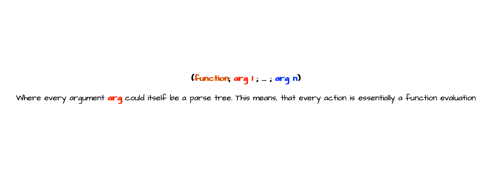
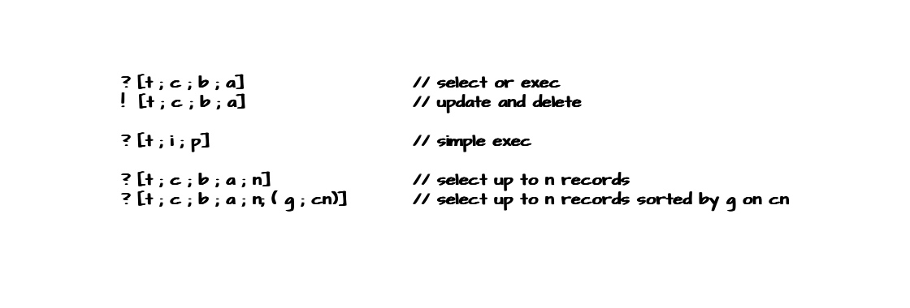
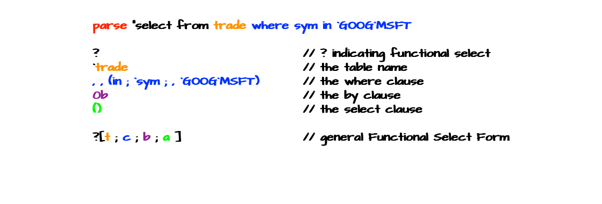
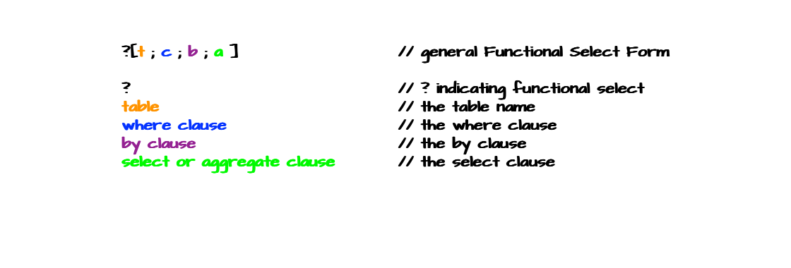

# Embracing Terseness: Functional Forms and Parse Trees

Over the past few weeks, we've explored a lot about querying data, starting with Q-SQL and progressing to the powerful capabilities of the `fby` operator. Now, there are only two topics left to dive into: the functional form of Q-SQL statements and parse trees. The functional form offers a more concise way of writing Q-SQL, and it ties closely to the concept of parse trees, which we will also cover. After that, we'll move on to **joins**, which will be explored in an upcoming blog post.

## Why Functional Form Matters

Understanding and applying the functional form of Q-SQL statements in KDB/Q is essential. The functional form offers numerous advantages over traditional Q-SQL, including the flexibility to dynamically select columns and build `where clauses`. Mastery of the functional form and the ability to translate Q-SQL statements into it is a crucial skill for any KDB/Q programmer. Consider a simple example where we need an API that allows a user to dynamically choose data from a table. We’ll develop two APIs: one using conventional Q-SQL and one with the equivalent functional form. This example will clearly demonstrate why knowing the functional form of a Q-SQL query is so valuable.

```
// First, let's create a trade table we can select from
q)show trade:([] sym:100?`AAPL`FB`MSFT`GOOG; price:100?100.)
sym  price
-------------
MSFT 78.33686
FB   40.99561
FB   61.08817
FB   49.76492
MSFT 40.87545
GOOG 44.9731
AAPL 1.392076
GOOG 71.48779
MSFT 19.46509
MSFT 9.059026
FB   62.03014
MSFT 93.26316
FB   27.47066
FB   5.752516
AAPL 25.60658
..
// Let's have a quick look at our data
q)select count i by sym from trade
sym | x
----| --
AAPL| 29
FB  | 20
GOOG| 21
MSFT| 30
```

First, we would like to write a simple API that allows the user to select data for specific symbols. In simple Q-SQL, the query is straightforward: ```select from trader where sym in `GOOG`MSFT```. But how can we make this dynamic, allowing symbols to be passed in at runtime? Here’s a useful trick: we construct a string with our Q-SQL query, then use the `value` operator to evaluate it. Let’s give it a try!

```
q)select from trade where sym in `GOOG`MSFT
sym  price
-------------
MSFT 78.33686
MSFT 40.87545
GOOG 44.9731
GOOG 71.48779
MSFT 19.46509
MSFT 9.059026
MSFT 93.26316
GOOG 23.10108
MSFT 86.71096
MSFT 72.78528
GOOG 16.27662
GOOG 81.77547
MSFT 41.2317
MSFT 38.67353
GOOG 72.6781
..
q)value "select from trade where sym in `GOOG`MSFT"
sym  price
-------------
MSFT 78.33686
MSFT 40.87545
GOOG 44.9731
GOOG 71.48779
MSFT 19.46509
MSFT 9.059026
MSFT 93.26316
GOOG 23.10108
MSFT 86.71096
MSFT 72.78528
GOOG 16.27662
GOOG 81.77547
MSFT 41.2317
MSFT 38.67353
GOOG 72.6781
..
q)(select from trade where sym in `GOOG`MSFT)~value "select from trade where sym in `GOOG`MSFT"
1b
```
Since we know that evaluating the string version of our Q-SQL query produces the same result as running the query directly, we can now dynamically build this string. Let’s go through the process step by step.

The first part of our Q-SQL query is pretty straightforward, all we have to do is to build the where clause. Let's first store the symbols we are interested in, in a variable called col.

```
q)show col:`GOOG`MSFT
`GOOG`MSFT
```

Next, we have to build the string "`GOOG`MSFT" from this variable. Let's try to use the [`string`](https://code.kx.com/q/ref/string/)  keyword to achieve this. 

```
q)string col
"GOOG"
"MSFT"
```

That doesn't look quite right, does it?!? Since the `string` operator is atomic in KDB/Q, it applies individually to each element of the list, creating multiple separate strings instead of a single, cohesive one. Additionally, the backticks are missing, which can lead to a type error because the `sym` column is of type `symbol`, not `string`. To resolve this, we’ll use another powerful tool in KDB/Q: the [`sv`](https://code.kx.com/q/ref/sv/) (**s**calar from **v**ector) operator.. Let's have a look how this works.

```
x sv y
```

Given a list of strings `y`, and a char atom `x`, `sv` returns the list of strings `y` as a single string, separated by `x`. Since we need a leading backtick at the beginning of our string, we’ll prepend an empty symbol (a backtick) to the original list. This will produce the desired result.

```
q)"`" sv string `GOOG`MSFT
"GOOG`MSFT"
q)"`" sv string ``GOOG`MSFT
"`GOOG`MSFT"
```

Now, all that is left to do, is to concatenate the where clause we just created, with the initial part of our Q-SQL query and apply the value keyword to it. Let's do that.

```
q)value "select from trade where sym in","`" sv string ``GOOG`MSFT
sym  price
-------------
MSFT 78.33686
MSFT 40.87545
GOOG 44.9731
GOOG 71.48779
MSFT 19.46509
MSFT 9.059026
MSFT 93.26316
GOOG 23.10108
MSFT 86.71096
MSFT 72.78528
GOOG 16.27662
GOOG 81.77547
MSFT 41.2317
MSFT 38.67353
GOOG 72.6781
..
q)(select from trade where sym in `GOOG`MSFT)~value "select from trade where sym in","`" sv string ``GOOG`MSFT
1b
```

That worked like a charm. We can now reuse this piece of code to create our API. 

```
f:{[col] 
  query:"select from trade where sym in "; 
  query:query,"`" sv string `,col; 
  value query
  };
```

Let's test our API and call it with our symbols

```
q)f[`GOOG`MSFT]
sym  price
-------------
MSFT 78.33686
MSFT 40.87545
GOOG 44.9731
GOOG 71.48779
MSFT 19.46509
MSFT 9.059026
MSFT 93.26316
GOOG 23.10108
MSFT 86.71096
MSFT 72.78528
GOOG 16.27662
GOOG 81.77547
MSFT 41.2317
MSFT 38.67353
GOOG 72.6781
..
q)(select from trade where sym in `GOOG`MSFT)~f[`GOOG`MSFT]
1b
```

Although our API functions as expected, we had to write quite a bit of code for a simple query. Imagine building something more complex — adding a `by` clause or some aggregation. This would require even more code and string concatenation, which is not only inefficient but also prone to errors. A more efficient and reliable approach is to use the functional form of the Q-SQL query. The equivalent functional form of our Q-SQL example is ```?[`trade;enlist (in;`sym;enlist `GOOG`MSFT);0b;()]```. We'll explore how to construct the functional form later; for now, trust that this is the correct functional form. 

```
q)?[`trade;enlist (in;`sym;enlist `GOOG`MSFT);0b;()]
sym  price
-------------
MSFT 78.33686
MSFT 40.87545
GOOG 44.9731
GOOG 71.48779
MSFT 19.46509
MSFT 9.059026
MSFT 93.26316
GOOG 23.10108
MSFT 86.71096
MSFT 72.78528
GOOG 16.27662
GOOG 81.77547
MSFT 41.2317
MSFT 38.67353
GOOG 72.6781
..
q)(select from trade where sym in `GOOG`MSFT)~?[`trade;enlist (in;`sym;enlist `GOOG`MSFT);0b;()]
1b
```

The functional form of a Q-SQL query simplifies API creation significantly, reducing this example to a single line of code.

```
f:{[col] 
  ?[`trade;enlist (in;`sym;enlist col);0b;()]
  };
```

That was so much easier, wasn't it?!? Let's make sure our API returns the correct result

```
q)f[`GOOG`MSFT]
sym  price
-------------
MSFT 78.33686
MSFT 40.87545
GOOG 44.9731
GOOG 71.48779
MSFT 19.46509
MSFT 9.059026
MSFT 93.26316
GOOG 23.10108
MSFT 86.71096
MSFT 72.78528
GOOG 16.27662
GOOG 81.77547
MSFT 41.2317
MSFT 38.67353
GOOG 72.6781
..
q)(select from trade where sym in `GOOG`MSFT)~f[`GOOG`MSFT]
1b
```

The functional form of a Q-SQL query simplifies API creation significantly, reducing this example to a single line of code. The example above clearly demonstrates the importance of the functional form for creating dynamic queries and APIs. Before diving deeper into functional forms, we’ll take a brief detour to explore parse trees, as they are closely related to the functional form.

## Parse Trees: The Key to Dynamic Queries

In its most simple form, at its core, a Parse Tree is a list where the first element represents a function, and the subsequent elements are the arguments. Each of these elements can also be parse trees on their own. The below example should illustrate this concept

```
// parse tree of "2+2"
q)(+;2;2)
+
2
2
```

The general form of a Parse Tree is

```
(function; arg 1; …; arg n)
```
where every argument of the list, `arg 1;...arg n` could be a parse tree itself.



In order to evaluate a parse tree, we can use the keyword `value` as we have seen in the previous section when evaluating the string form of a Q-SQL query. 

```
q)value (+;2;2)
4
```

Another operator that can evaluate parse trees is the [`eval`](https://code.kx.com/q/ref/eval/#eval), operator, as demonstrated below.

```
q)eval (til;5)
0 1 2 3 4
```

### `eval` vs `value`

Although [`eval`](https://code.kx.com/q/ref/eval/#eval) and [`value`](https://code.kx.com/q/ref/value/) appear to return the same result when evaluating the parse tree above, there is a key difference: `eval` works on parse trees and evaluates any nested parse trees, while `value` operates only on literals and does NOT evaluate nested parse trees. The below examples will illustrate these differences

```
q)value(+;7;3)                  //parse tree, with no nested trees
10
q)eval(+;7;3)
10
q)eval(+;7;(+;2;1))             //parse tree with nested trees
10
q)value(+;7;(+;2;1))
'type
q)value(,;`a;`b)
`a`b
q)eval(,;`a;`b)                 //no variable b defined
'b
q)eval(,;enlist `a;enlist `b)
`a`b
```

:::danger
NOTE: Symbols must be enlisted when evaluating a parse tree with `eval`; otherwise, they will be interpreted as variables.
:::

### `parse`: Your Ultimate Helper Tool for Buidling Parse Trees

While parse trees may seem complex at first, creating them is actually quite simple, even for beginners. By using the [`parse`](https://code.kx.com/q/ref/parse/) keyword, you can easily generate a parse tree from any KDB/Q statement represented as a string. Let's give it a try!

```
q)parse"2+2"
+
2
2
q)eval parse "2+2"
4
```
As seen earlier, you can then use the `eval` operator to evaluate a parse tree.

### Parse Gotchas

There are two main Gotchas to keep in mind with the `parse` keyword, one of which we’ve already covered. As mentioned, symbols must be enlisted to be used in parse trees. The other important point is that `parse` displays all items in the parse tree using `k` syntax.  Once you're aware of these two details, the `parse` operator becomes a powerful and easy-to-use tool for creating parse trees.

```
q)string `hello
"hello"
q)parse "string `hello"
$:
,`hello
q)eval (string;enlist `hello)
"hello"
q)string
$:
```

The example above demonstrates the two main gotchas with the `parse` keyword. All built-in KDB/Q operators are shown in their corresponding underlying `k` syntax, and symbols must be enlisted.

:::note
The `k` syntax for `enlist` is `,`
```
q)(,) `hello
,`hello
q)k),`hello
,`hello
```
:::

## Functional Forms

In previous sections, we discussed the importance of using the functional form of a Q-SQL query and the reasons for doing so. Now, we'll examine the performance differences between the functional form and a pure Q-SQL statement, exploring when each should be used. We’ll also cover the syntax of individual Q-SQL statements - `select`, `exec`, `update` and `delete - and how to construct them. 

### Performance: Functional Form vs Traditional Q-SQL

First things first, let's address what interests most people: performance. Is there a performance advantage to using the functional form of a Q-SQL query over a standard Q-SQL statement? The short answer is: NO. The slightly longer answer is that while there may be a minimal performance gain when using the functional form, it’s so minor that it’s negligible. KDB/Q actually translates every Q-SQL statement into its functional form behind the scenes before executing it.

To illustrate, if we measure the time it takes to parse a simple Q-SQL statement, we see that even parsing it a million times takes under a second. Only when we reach ten million parses does the time reach eight seconds. 

```
q)\ts:100 parse "select from trade"
0 912
q)\ts:10000 parse "select from trade"
20 912
q)\ts:1000000 parse "select from trade"
822 912
q)\ts:10000000 parse "select from trade"
8156 912
```

 It's highly unlikely that any KDB/Q code will hit ten million Q-SQL queries. Admittedly, I used a very simple query here, and more complex ones might take longer, but it’s reasonable to assume that the time difference for parsing more complex queries remains negligible as well.

### When Should You Use the Functional Form?

So, when should you use the functional form instead of a traditional Q-SQL statement? The answer is simple: only when absolutely necessary. If you're building an API that requires dynamically generated queries, with user-parameterized inputs - go ahead. This is This is an ideal case for the functional form.

But if your reason is just to save a few characters, show off your skills, or impress colleagues - don't. Think twice. We've just discovered that there's virtually no (or minimal) performance benefit to functional queries over traditional Q-SQL. So why make the code harder to read for others (or even yourself later on)? The functional form of a Q-SQL query is generally more challenging to read and understand. And we all know developers don't always comment code as thoroughly as they should. So, unless there’s a compelling reason to use the functional form over a traditional Q-SQL statement, stick with the straightforward approach.

### The Syntax

Every Q-SQL statement has its corresponding functional form. The general syntax of the functional forms is



```
?[t;c;b;a]              /select or exec
![t;c;b;a]              /update and delete

?[t;i;p]                /simple exec

?[t;c;b;a;n]            /select up to n records
?[t;c;b;a;n;(g;cn)]     /select up to n records sorted by g on cn

```
where

- `t` is a table, or the name of a table as a symbol atom.
- `c` is the `where clause`, a list of constrains represented as a list of parse trees. As in a traditional Q-SQL statement, the selection is performed in the order of the items in c, from left to right: only rows selected by one constraint are evaluated by the next.
- `b` is the `by phrase`. The `by phrase` can have the following forms
	- the general empty list (), indicating that the functional form is of an exec rather than a select statement
	- a boolean atom: `0b` for no grouping, `1b` for distinct rows
	- a symbol atom or a list naming table column(s)
	- a dictionary of group-by specifications
- `a` is the `select phrase` and can take one of the following forms
	- the general empty list ()
	- a symbol atom: the name of a table column
	- a parse tree: Each item of its range is an evaluation list consisting of a function and its argument(s)
	- a dictionary of select specifications (aggregations)
- `i` is a list of indexes
- `p` is a parse tree
- `n` is a non-negative integer or infinity, indicating the maximum number of records to be returned
- `g` is a unary grade function

A comprehensive discussion of each functional form is beyond the scope of this blog post, as [KX](https://code.kx.com/home/) has already covered this in detail on their website here: [Functional qSQL](https://code.kx.com/q/basics/funsql/). That said, I’ll show you how you can easily transform any Q-SQL query into its equivalent functional form.

### `parse`: Your Go-To Tool for Building Functional Forms

We’ve already explored how the `parse` keyword can generate a parse tree from any KDB/Q expression. However, one of the most practical uses of `parse` is for translating Q-SQL queries into their equivalent functional form. Take, for example, the initial Q-SQL query we used in our simple API: ```select from trade where sym in `GOOG`MSFT```. By wrapping this query in quotation marks and applying the `parse` operator, we can easily obtain the corresponding functional form.

```
q)parse "select from trade where sym in `GOOG`MSFT"
?
`trade
,,(in;`sym;,`GOOG`MSFT)
0b
()
```

It's that simple. If we now evaluate our parse tree using `eval` we get the same result as with our traditional Q-SQL query. This can easily be verified.

```
q)eval parse "select from trade where sym in `GOOG`MSFT"
sym  price
-------------
MSFT 78.33686
MSFT 40.87545
GOOG 44.9731
GOOG 71.48779
MSFT 19.46509
MSFT 9.059026
MSFT 93.26316
GOOG 23.10108
MSFT 86.71096
MSFT 72.78528
GOOG 16.27662
GOOG 81.77547
MSFT 41.2317
MSFT 38.67353
GOOG 72.6781
..
q)(select from trade where sym in `GOOG`MSFT)~eval parse "select from trade where sym in `GOOG`MSFT"
1b
```

If you're new to parse trees and functional forms, the functional form generated by the `parse` keyword might look a bit unfamiliar — it is, after all, returned in `k` code. Additionally, there are two main nuances to be aware of. Let’s break these down for clarity.



The first thing to notice is that the `where clause` in the functional form has an extra comma at the start, which we should ignore. As [**KX**](https://code.kx.com/q4m3/9_Queries_q-sql/#912-functional-forms) explains: "The constraint portion of the result of `parse` applied to a string containing a q-sql query template generally has an extra level of `enlist` that should be removed for the corresponding functional form. In the console, this extra enlist shows up in `k` form as a double comma `, , `.

The second comma has a simple explanation: The `where clause` constraint is represented as a **list** of constraints in the parse tree format. Since our example has only one constraint (a single `where clause`), we need to create a list of constraints by using `enlist` on the result. 

Considering the above, our where clause can be rewritten as

```
enlist (in;`sym;,`GOOG`MSFT)
``` 

The second observation we make, is that in a parse tree, a variable is represented by a symbol that holds its name. So, when representing a symbol or list of symbols, you must use `enlist` before that expression. In `k`, `enlist` is the unary form of the comma operator. If you omit this step, KDB/Q will attempt to interpret `GOOG` and `MSFT` as column names in the `trade` table instead of as variables. Therefore, we need to rewrite the `where clause` as follows.

```
enlist (in;`sym;enlist `GOOG`MSFT)
```
Applying these changes to our initial result from parse we obtain the following functional form for our simple Q-SQL query

```
q)?[`trade;enlist (in;`sym;enlist `GOOG`MSFT);0b;()]
sym  price
-------------
MSFT 78.33686
MSFT 40.87545
GOOG 44.9731
GOOG 71.48779
MSFT 19.46509
MSFT 9.059026
MSFT 93.26316
GOOG 23.10108
MSFT 86.71096
MSFT 72.78528
GOOG 16.27662
GOOG 81.77547
MSFT 41.2317
MSFT 38.67353
GOOG 72.6781
..
q)(select from trade where sym in `GOOG`MSFT)~?[`trade;enlist (in;`sym;enlist `GOOG`MSFT);0b;()]
1b
```

Using `parse` for more complex Q-SQL queries may seem a bit challenging at first, but you can break it down step-by-step. Just keep in mind:
- The `parse` output will be displayed as `k` code
- The `where clause` includes an extra commma at the beginning
- Symbols must be enlisted to be recognised as variables

Let's look at ta more complex example

```
q)select sym,price from trade where price=(max;price) fby sym
sym  price
-------------
AAPL 95.98964
FB   98.77844
GOOG 91.49882
MSFT 97.97281

q)parse "select sym,price from trade where price=(max;price) fby sym"
?
`trade
,,(=;`price;(k){$[(#x 1)=#y;@[(#y)#x[0]0#x 1;g;:;x[0]'x[1]g:.=y];'`length]};(enlist;max;`price);`sym))
0b
`sym`price!`sym`price

```

:::tip
If you would like to learn more about the `fby` operator, read my previous blog post [Mastering the Art of Filtering: An In-Depth Look at fby in KDB/Q](https://www.defconq.tech/docs/concepts/fby)
:::

This may look like quite a bit of gibberish at first glance. Following the low-hanging-fruit principle, let’s start with the straightforward parts of the functional form. The table, `by clause`, and `select clause` can be directly copied into our functional form. The only thing left to decipher is the `where clause`

```
?[`trade; To-Do; 0b; `sym`price!`sym`price]
```

When looking at the `where clause`, it’s important to remember that it’s represented as a parse tree or list of parse trees, displayed in `k` code. By parsing the `where clause` independently, we can simplify our task significantly.

```
q)parse "price=(max;price) fby sym"
=
`price
(k){$[(#x 1)=#y;@[(#y)#x[0]0#x 1;g;:;x[0]'x[1]g:.=y];'`length]};(enlist;max;`price);`sym)
```
This can be translated into the following parse tree

```
(=;`price; (k){$[(#x 1)=#y;@[(#y)#x[0]0#x 1;g;:;x[0]'x[1]g:.=y];'`length]};(enlist;max;`price);`sym))
```


From our Q-SQL query, we know that our `where clause` includes a `fby`. So let's examine the `k` code representation of the `fby` to understand it better.

```
q)fby
k){$[(#x 1)=#y;@[(#y)#x[0]0#x 1;g;:;x[0]'x[1]g:.=y];'`length]}
```

This aligns with some of the "gibberish" we saw when parsing the `where clause` independently. Now we can simply convert the `k` code into `q` code to make it more readable.

```
(=;`price;(fby;(enlist;max;`price)
```

Combining everything above we obtain the following functional form for our complex Q-SQL query

```
q)?[`trade;enlist (=;`price;(fby;(enlist;max;`price);`sym));0b;`sym`price!`sym`price]
sym  price
-------------
AAPL 95.98964
FB   98.77844
GOOG 91.49882
MSFT 97.97281
```

Verifying that the results actually matches

```
q)(select sym,price from trade where price=(max;price) fby sym)~?[`trade;enlist (=;`price;(fby;(enlist;max;`price);`sym));0b;`sym`price!`sym`price]
1b
```

#### Three Key Gotchas When Using `parse` for Functional Forms

As we have seen, there are a few subtle gotchas when using the `parse` operator with Q-SQL queries. To help you remember these, let's review them one more time.

##### The `parse` output will be displayed as `k` code

As we've observed, the output of the `parse` operator is actual `k` code. This applies not only to common `q` operators but also to `q` keywords, which can be implemented in `k` behind the scenes. This can make interpreting the parsed query output a bit more challenging. However, you can simplify this by comparing the parsed output directly with your original Q-SQL query to identify any `q` keywords that have been translated into their `k` equivalent. 

For example

```
q)parse "select first price from trade"
?
`trade
()
0b
(,`price)!,(*:;`price)
```

Examining the `select phrase` of the above Q-SQL query and seeing that we selected `first price`, we do realise that the corresponding `k` operator for the `first` `q` operator is `*:. Let's confirm this

```
q)first 1 2 3
1
q)k)*1 2 3
1
q)(*:)1 2 3
1
```

##### The `where clause` includes an extra commma at the beginning

Another nuance we've encountered is that the parsed `where clause` includes an extra comma at the beginning. This occurs because `parse` applied to a Q-SQL query template often introduces an additional level of `enlist` that needs to be removed for the functional form. In the console, the parse tree displays the `k` form of enlist (`,`) as `,,`. This is easily corrected by simply removing the extra comma and using `enlist` where necessary.

```
q)parse "select from trade where sym=`GOOG"
?
`trade
,,(=;`sym;,`GOOG)
0b
()
q)(select from trade where sym=`GOOG)~?[`trade;enlist (=;`sym;enlist `GOOG);0b;()]
1b
```

##### Symbols must be enlisted to be recognised as variables

In a parse tree, a variable is represented by a symbol containing its name. Therefore, to represent a single symbol or a list of symbols, you need to use `enlist` on that expression. In `k`, `enlist` is the unary form of the comma operator, which can be a bit confusing initially but becomes intuitive with practice.

This concept is especially clear when you try to parse a simple symbol. You'll see that the `parse` operator adds `enlist` to differentiate between a variable name and an actual symbol.

```
q)parse "`google"
,`google
```

##### Escaping Strings: Essential When Using `parse`

The final gotcha to be aware of is that when parsing a string, you need to escape any quotation marks around it. This is necessary because the input to the parse operator is itself a string. Let’s look at an example to clarify this.

```
q)parse "select from trade where sym like "*GO*""
'GO
  [0]  parse "select from trade where sym like "*GO*""
                                                 ^
```
As you can see, omitting the escaped quotation marks when parsing a string results in an error. To parse a string, we need to use the escape character `\` to properly escape the quotation marks.

```
q)parse "select from trade where sym like \"*GO*\""
?
`trade
,,(like;`sym;"*GO*")
0b
()
```

### ABC: Your Memory Hack for Functional Form Mastery 

I've conducted numerous (mock) interviews, and a common challenge for KDB/Q developers has been recalling the functional form syntax of a Q-SQL query. This is understandable, especially for junior developers or those who don’t use functional forms frequently and often rely on the `parse` keyword to generate them. I once faced this challenge myself, which led me to create a memory hack that can help anyone remember the syntax effortlessly. Just think of "ABC" in reverse: "CBA." Here’s how it works: the syntax for the functional form is `? [t; c; b; a]`, where `t` stands for **t**able, followed by "CBA" in reverse order. **C** represents the where **c**lause, **B** stands for the **b**y clause, and **A** is the select or **a**ggregation clause (remember **A** for **a**ggregation if that helps!). 




**And that's it—another topic complete! Happy coding, and feel free to reach out with any questions.**


**Resources**:
- [Parse trees](https://code.kx.com/q/basics/parsetrees/)
- [Q for Mortals, Chapter 9: Queries Q-SQL, 9.12 Functional Forms](https://code.kx.com/q4m3/9_Queries_q-sql/#912-functional-forms)
- [Functional qSQL](https://code.kx.com/q/basics/funsql/)

