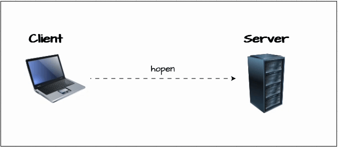
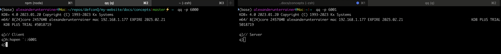

# Fundamentals of Interprocess Communication (IPC)

We have now covered most of the key KDB/Q concepts, with just one crucial topic left before you're fully equipped to build a complete KDB/Q application: Interprocess Cummincation (OPC). The last piece of the puzzle is understanding how KDB/Q processes communicate with each other. In the following section, we will explore how to establish a connection to a KDB/Q process, using connection handles to send messages, the differences between synchronous and asynchronous communication, their respective advantages, and when to use each. While IPC can be complex in many mainstream programming languages, KDB/Q provides it out of the box. So, without further delay, let's jump into the world of IPC!

## Why IPC matters

Before diving into the technical details of IPC, let’s take a step back and look at the bigger picture: why do we need IPC in the first place? When designing a KDB/Q application (or any application, for that matter), relying on a single process to handle all tasks is not ideal. Not only does this create a single point of failure, but it also places an overwhelming burden on that one process. Imagine being the only employee in your company, you would struggle to keep up with all the tasks, and even if you managed, the quality of your work would likely suffer. The same principle applies to a software application.

A more efficient approach is to adopt a microservices-style architecture, breaking down tasks into smaller, specialized processes that communicate with each other. This is where IPC comes into play: it enables seamless communication between different components of a KDB/Q Tick system, such as the Tickerplant, Real-time Database, Historical Database, and more. For a deeper dive into the typical architecture of a KDB/Q Tick setup, check out my blog post [here](https://www.defconq.tech/docs/architecture/plain).

## Before You Start Communicating: Setting Up a Port

Before two processes can communicate, a connection must be established, and to do that, you need the address of the process you’re trying to reach. It’s just like making a phone call; you need to know the recipient’s number. The same applies to Interprocess Communication (IPC).

There are multiple ways to open a connection to a KDB/Q process, which we’ll explore in the next section. But first, we need to understand how to set the port of a KDB/Q process, as that’s what we’ll use to connect.

Think of a port like an apartment number in a large building. The server running the process is the entire apartment complex, and each port represents a different flat. To communicate with a specific process, you need to know its port number, just like you’d need an apartment number to visit a friend in a large housing block.

In KDB/Q, you can define a process’s port either at startup using the `-p` flag or dynamically at runtime using the `\p` system command. Let’s see how that works.

```
// Start a KDB/Q process on port 5001 from the command line
(base) alexanderunterrainer@Mac:~|⇒  qq -p 5001
KDB+ 4.0 2023.01.20 Copyright (C) 1993-2023 Kx Systems
m64/ 8(24)core 24576MB alexanderunterrainer mac 192.168.1.177 EXPIRE 2025.02.21 KDB PLUS TRIAL #5018719

q)\p
5001i
q)\\
// Start a KDB/Q process without defining the port and assign it at runtime
(base) alexanderunterrainer@Mac:~|⇒  qq
KDB+ 4.0 2023.01.20 Copyright (C) 1993-2023 Kx Systems
m64/ 8(24)core 24576MB alexanderunterrainer mac 192.168.1.177 EXPIRE 2025.02.21 KDB PLUS TRIAL #5018719

q)\p 5001
q)\p
5001i
q)
```

Interprocess communication in KDB/Q functions both between processes on the same machine and across different machines, provided you have the necessary connection details for the target process.

## Opening a connection: `hopen`

Now, let’s learn how to connect to a KDB/Q process. For this, we have set up two KDB/Q processes: a client process (Process A) running on port `6000` and a server process (Process B) running on port `6001`. We establish the connection using the [`hopen`](https://code.kx.com/q/ref/hopen/) keyword.



`hopen` not only allows you to open a connection to a KDB/Q process, but it also lets you specify the protocol, connect to a file or a named pipe, authenticate with a username and password, and even set a timeout in case the target process doesn’t respond.

```
(base) alexanderunterrainer@Mac:~/repos/defconQ/my-website/docs/concepts|master⚡ ⇒  qq -p 6000
KDB+ 4.0 2023.01.20 Copyright (C) 1993-2023 Kx Systems
m64/ 8(24)core 24576MB alexanderunterrainer mac 192.168.1.177 EXPIRE 2025.02.21 KDB PLUS TRIAL #5018719
q)// Client
q)h:hopen `::6001
q)
```

```
(base) alexanderunterrainer@Mac:~|⇒  qq -p 6001
KDB+ 4.0 2023.01.20 Copyright (C) 1993-2023 Kx Systems
m64/ 8(24)core 24576MB alexanderunterrainer mac 192.168.1.177 EXPIRE 2025.02.21 KDB PLUS TRIAL #5018719
q)// Server
q)

```



That was pretty easy, wasn’t it? When connecting to a process on the same machine, you only need to specify the port number, no need to include the hostname. Alternatively, you can use `localhost`. Below is the full syntax for opening a connection from one process to another.

### Syntax

```
// hopen filehandle
q)hopen ":path/to/file.txt"  
// hopen processhandle
q)hopen `:localhost:5000
// hopen (communicationhandle;timeout)
q)hopen(":10.43.23.198:5010";10000) 
// hopen port
q)hopen 5010
```

Additionally, you can specify the communication protocol of your choice, whether it's the default TCP protocol, with or without SSL encryption, or Unix Domain Sockets. The process remains simple and straightforward.

#### TCP
```
q)hopen `:host:port[:user:password]
```
 host can be a hostname or IP address; omitted, it denotes the localhost

####  Unix domain socket

```
q)hopen `:unix://port[:user:password]
```
(Since V3.4.) Unix domain sockets can have significantly lower latency and higher throughput than a localhost TCP connection

#### SSL/TLS

##### TCP  with SSL/TLS encryption
```
q)hopen `:tcps://host:port[:user:password]
```
##### Unix domain socket with SSL/TLS encryption
```
q)hopen `:unixs://port
```
 
#### FIFO/Named Pipes

A [**FIFO**](https://en.wikipedia.org/wiki/Named_pipe) (First In, First Out) named pipe is a special type of file that allows for interprocess communication (IPC) by enabling one process to write data while another process reads it in the same order. Unlike regular files, FIFO pipes do not store data on disk permanently; instead, they act as a channel for data flow between processes.

##### Why Use a FIFO Named Pipe?

When dealing with **large files** that cannot fit into memory all at once, a FIFO named pipe is a great solution. Instead of loading the entire file into RAM, you can **stream** the data, reading it in chunks, processing it on the fly, and writing the processed output to disk or another process. This is particularly useful for scenarios like:

- **Efficiently handling large datasets** without overwhelming memory
- **Real-time data transformation** before storage
- **Parallel processing** between multiple applications

By using a FIFO named pipe, you can process large files in a **memory-efficient and scalable way**, reducing the need for temporary storage and speeding up workflows.

If you want to connect to a FIFO named pipe you can do so by using 

```
q)hopen `:fifo://filename
```

### What Happens When You Open a Connection?

What actually happens when we establish a connection to another KDB/Q process?

When we use `hopen` o open a connection from our client process to a server process and store the result in a variable `h`, we can observe that `hopen` returns a positive integer **≥3**. This number is our **connection handle**, which we use to communicate with the server.

```
q)// Client
q)h:hopen `::6001
q)h
8i
```

If you think the fact that it's **≥3** is trivial, think again. It **cannot** be 0, 1, or 2 because:

- 0 is reserved for standard input
- 1 is reserved for standard output
- 2 is reserved for standard error

:::note
Both the client and server have their own connection handles when a connection is established between them. However, these handles are assigned independently, meaning their integer values are generally not the same.
:::

As shown in the example above, we stored the connection handle returned by`hopen` in a varibale `h`. We can then use this variable to interact with the connected KDB/Q process, in this case, the server. However, you might be surprised to learn that using the variable isn’t strictly necessary. The variable is simply a literal, meaning we can use its actual value directly to communicate with the server. Let’s explore this in more detail.

```
q)h:hopen `::6001
q)h
8i
// Using the variable h to communicate with the server
q)h "2+2"
4
// Using the connection handle itself to communicate with the serer
q)8 "2+2"
4
``` 

But that's only half the story. When KDB/Q processes communicate, **built-in message handlers** are triggered based on the type of request received. In the case of opening a connection, the `.z.po` (**process open**) handler is invoked on the **server**.


However, `.z.po` is **not** the first event that occurs. Before reaching `.z.po` he system performs **authentication and security checks**:

1. **User permissions** are validated against any `-u/-U file`.
2. **Password checks** are performed using `.z.pw`.
3. Only **after both checks pass**, `.z.po` is finally executed.

:::tip
Understanding this flow is crucial, this is a **common interview question** for KDB/Q developers, so make sure you understand these details!
:::

### One-shot connections

Whenever you use `hopen` to establish a connection between two KDB/Q processes, a persistent connection is created, and a connection handle is assigned to it. Before KDB/Q `version 4.1`, the number of connections was limited to `1022`, and exceeding this limit resulted in a `'conn` error on the server. To prevent this, it was essential to close connections using `hclose` when they were no longer needed. However, if you only needed to execute a single query without maintaining an open connection, you could use a one-shot connection, which automatically opens, executes the query, and then closes without requiring manual intervention.

Let's look at an example

```
q)`::6001 "2+2"
4
q)(`::6001)"2+2"
4
q)(`:localhost:6001)"2+2"
4
```

In the example above, we sent a synchronous query, `"2+2"`, from the client to the server, and after the query was evaluated on the server, the result, `4`, was returned. Since `KDB/Q version 4.0` you can now send one-shot queries as below

```
`::[(":host:port:username:password";timeout);query]

q)`::[(":localhost:6001";5000);"2+2"]
4
```

## Message Formats: Sending Queries the Right Way

Now that we've established how to connect two KDB/Q processes, let's explore the different ways to send messages and execute queries. In the previous example, we used a simple string to send a query from the client to the server. While this approach is straightforward, it is also prone to errors and can be inconvenient.

For instance, consider a trades table on the server with a sym column of type string. If you try querying this table remotely using a plain string query, you'll quickly run into issues, specifically, an error due to unescaped quotation marks. To include string values in your query correctly, you must escape the quotes, which is both cumbersome and error-prone.

**Server**
```
// Server side
q)show trades:([] sym:("GOOG";"AAPL";"MSFT"); price:10 20 30)
sym    price
------------
"GOOG" 10
"AAPL" 20
"MSFT" 30
```

**Client**
```
// Client side

// Without escaping quotation marks
q)h "select from trades where sym like "AAPL"""
'"
  [0]  h "select from trades where sym like "AAPL"""

// Escaping quotation marks
q)h "select from trades where sym like \"AAPL\""
sym    price
------------
"AAPL" 20
```

In the next section, we'll explore the best practices for sending queries via IPC, ensuring a more reliable and efficient approach.

Whenever a KDB/Q process receives a message, it automatically triggers one of the built-in message handlers: `z.pg` (for **GET** requests) or `.z.ps` (for **SET** requests). The handler invoked depends on whether the query was sent **synchronously** or **asynchronously** (we’ll dive deeper into synchronous vs. asynchronous messaging later).

By default, both handlers use the KDB/Q `value` operator to evaluate the received query. This concept is similar to how functional selects and parse trees work (which I covered in a previous blog post [here](https://www.defconq.tech/docs/concepts/functionalSelect)). Queries sent via IPC follow the same structure: they are parsed as lists, where the first element represents the function and the remaining elements are its arguments.

Understanding this structure allows us to send queries as lists over IPC. We can either:

1. **Call a function that exists on the server**, passing the function’s name as a symbol (literal).
2. **Send a function defined on the client** along with its arguments, which will then be executed on the server.

To demonstrate, let’s first define a simple function `f` on the server, which takes two numbers and returns their sum. Once defined, we can send a synchronous query from the client in the form of a list. If the function is already defined on the server, we must pass its name as a symbol, ensuring the function is properly invoked on the remote process.

**SERVER**
```
// We define a function f on the server
q)f:{x+y}
```

**CLIENT**

```
// We can now make a synchronous query in form of a list to the server
q)h (`f;2;3)
5
```

While it’s technically possible to pass the function name as a string, we’ve already established that using strings for IPC is not ideal due to potential escaping issues.

```
q)h ("f";2;3)
5
```

Alternatively, if we want to execute a function that exists only on the client but have it run on the server, we can pass the function itself, either as a variable or an anonymous lambda, as the first argument. In this case, the function definition stored in the variable will be evaluated first (substituting the variable name with the actual function definition) before being sent to the server. This happens because the KDB/Q compiler evaluates all resolvable expressions before proceeding with query execution.

**CLIENT**
```
// Define a function on the client side
q)f1:{x-y}
q)h (f1;10;3)
7
q)h ({x-y};10;3)
7
```

**SERVER**

As you can see from the below error, the function `f1` is not defined on the server, and it's really the definition on the client side that has been invoked.

```
q)f1
'f1
  [0]  f1
       ^
```

## Closing a connection: `hclose`

As we discussed earlier, if you're not using the latest version of KDB/Q, the number of connection handles is limited to `1022` (this restriction was lifted in `KDB/Q version 4.1`). To avoid hitting this limit, it's good practice to close connection handles once they are no longer needed. This can be done easily using the [`hclose`](https://code.kx.com/q/ref/hopen/#hclose) operator, which takes the connection handle as its argument and terminates the connection.

```
q)hclose h
q)h
8i
q)h "2+2"
'Cannot write to handle 8. OS reports: Bad file descriptor
  [0]  h "2+2"
       ^
```

## Synchronous vs Asynchronous communication

Now that we've covered how to open and close a connection and the proper format for sending queries over IPC, let's shift our focus to synchronous and asynchronous communication, how they differ and when to use each.

In simple terms, a **synchronous** message causes the client process to pause after sending the request, waiting for a response from the server before proceeding. In contrast, an **asynchronous** message is sent to the server, but the client continues execution immediately without waiting for a reply. Notably, asynchronous communication does not return a value from the server.

The diagram below, which I borrowed from my very good friend [Nelson](https://www.linkedin.com/in/nelsonamigoscode/), founder of [Amigoscode](https://www.linkedin.com/company/amigoscode/), an online training platform covering all things software engineering (except KDB/Q, which is my domain), illustrates the key differences between synchronous and asynchronous communication.


We are now going to take a deeper look at synchronous and asynchronous communication, exploring their behavior, benefits, and the best scenarios for using each.

### Synchronous Communication

When sending a **synchronous** message from process A (the client) to process B (the server), a **positive** connection handle is used. This causes the client to block immediately after sending the query, waiting for a response from the server before proceeding. Behind the scenes, the following sequence of events takes place:


1. Any pending **outgoing asynchronous** messages on handle `h` are first sent.
2. The client transmits a message containing the arguments of the handle application to the server and waits for a response, pausing execution until a result is received.
3. The server receives the message, processes it as a function application, and computes the result.
4. The server sends the computed result back to the client.
5. The client receives the response and resumes execution from where it left off.

In synchronous message passing, when a client sends multiple queries to a server, the next query is only sent after the previous result has been received. This ensures that messages arrive at the server in the exact order they were sent, and the corresponding results are returned to the client in the same sequence.

We've previously explored how to use a positive connection handle to send a synchronous message from a client to a server. Now, let's revisit this concept to reinforce our understanding.

```
// positive connection handle
q)h
8i
// synchronous call to our server
q)h "2+2"
4
```

We've mentioned that when sending a synchronous message, the client process blocks until a response is received, preventing any further commands from executing in the meantime. But can we actually verify this, or do you just have to take my word for it? Of course not! This can be easily tested, and I'll show you how.

We'll create a lambda function that first prints the current datetime to the console. Then, it sends another lambda function to the server, which will invoke the sleep command, pausing for two seconds before adding two numbers and returning the sum to the client. Finally, we'll print the current datetime again to see exactly when the response is received. This will clearly demonstrate the blocking nature of synchronous communication.

```
q){0N!.z.p;0N!h ({system "sleep 2";x+y};2;2);.z.p}[]
2025.02.23D13:04:12.114709000
4
2025.02.23D13:04:14.146935000
```

In summary, **synchronous** queries are similar to an [HTTP GET](https://en.wikipedia.org/wiki/HTTP) request, as they involve requesting data from a server process and waiting for a response before proceeding. This type of messaging is best suited for scenarios where time and performance are not critical, and when receiving a result is necessary for further execution.

### Asynchronous Communication

When sending an **asynchronous** message from process A (the client) to process B (the server), a **negative** connection handle is used. In this scenario, the message is dispatched to the server, and the client continues execution immediately without waiting for a response. This approach is ideal when the result of the operation is not needed, such as triggering a long-running task or forwarding messages to other processes. Since the client does not wait for a reply, asynchronous messaging is essential in cases where delays from an unresponsive subscriber are unacceptable, such as in a tickerplant. Since an asynchronous message does not require a response from the server, it can be likened to an HTTP POST (SET) request.

In the following example, we use the KDB/Q [`neg`](https://code.kx.com/q/ref/neg/) operator to create a negative connection handle, allowing us to make an asynchronous call. We assign the value `10` to a variable `a` on the server without expecting any return value. 

**CLIENT**
```
// verify that we are on the client
q)\p
6000i
q)neg[h]"a:10"
q)
```

**SERVER**
```
// Verify that we are on the server
q)\p
6001i
// Verify the content of the variable a we just set via an asynchronous call
q)a
10
```

To confirm that the client process remains unblocked, we replicate the previous synchronous example but replace the synchronous request with an asynchronous one.

**CLIENT**
```
q){0N!.z.p;neg[h] ({0N!.z.p;system "sleep 2";0N!x;0N!.z.p};2);.z.p}[]
2025.02.23D13:56:52.381290000
2025.02.23D13:56:52.381414000
```

**SERVER**
```
2025.02.23D13:56:52.381771000
2
2025.02.23D13:56:54.408662000
```

We first printed the current datetime on the client console, then sent an asynchronous query to the server. On the server, the datetime was printed, followed by a two-second sleep, after which the asynchronously received number was output, and the datetime was printed again. Meanwhile, after sending the asynchronous message, the client immediately printed the datetime again. As observed, the client remained unblocked (with only a negligible time difference), while the server was blocked for two seconds as expected.

Asynchronous messaging is ideal when you don’t need to wait for the server to finish processing the query and don’t require a response. This is crucial for building high-performance and responsive applications.

One important consideration with asynchronous messaging is that, since KDB/Q processes are single-threaded by default, the server processes messages in the order they are received. However, there is no guarantee that messages will arrive at the server in the same order they were sent.

#### Flushing: Important Consideration when Sending Asynchronous Messages

When an asynchronous query is sent, the message isn’t transmitted immediately; instead, it is placed in the output queue, waiting to be sent when the KDB/Q main cycle runs next. You can inspect the output queue by calling `.z.W` on the client process, which returns a dictionary of IPC handles along with the number of bytes pending in their respective output queues.

To ensure the asynchronous message is sent immediately, you need to flush the output queue. This can be achieved by sending a synchronous **"chaser"** message right after the asynchronous query, as synchronous messages automatically flush the queue and send any pending asynchronous messages.

There are times when you may need to send a large number of asynchronous messages but want to block until all of them have been sent. This can be accomplished using an asynchronous flush, which is triggered by calling `neg[h]{}` or `neg[h](::)`.

If you require confirmation that the remote process has received and processed the asynchronous messages, you can send a synchronous request, such as `h""`. Since the remote process handles messages on a socket in the order they are received, this ensures all prior asynchronous messages have been processed.

### Message Handlers

Up to this point, we've focused primarily on how messages are sent from the client to the server, but we haven't explored much about how they are processed on the server side. In the next section, we'll dive into that.

Message handling on the server is managed through built-in handlers within the [`.z`](https://code.kx.com/q/ref/dotz/) namespace, and their default behavior can be easily customized. We've already encountered a few of them: `.z.po`, `.z.ppw`, `.z.ps`, and `.z.pg`. Below, we provide a more complete list of the core message handlers. For those interested in exploring the full set, the official documentation at [code.kx.com](https://code.kx.com/home/). provides further details.

- `.z.pw` – Handles user validation
- `.z.po` – Invoked when a connection to a kdb+ session is established
- `.z.pg` – Triggered for a synchronous request
- `.z.ps` – Triggered for an asynchronous request
- `.z.pc` – Called after a connection has been closed

 The default behavior of these callbacks can be restored using `\x.`

#### Customising Message Handlers

Let's walk through a practical example that incorporates all of the above concepts. First, we'll create a table on the server to log all incoming requests. Then, we'll customize the core message handlers:

- `.z.pw` will validate the username and password, returning `1b - true` for a valid match and `0b - false` otherwise
- `.z.po` will log connection events when a new session is initialized.
- `.z.pg` and `.z.ps` will record synchronous and asynchronous messages, respectively.
- `.z.pc` will track when a connection is closed.

This is a basic implementation, and a more advanced setup is left as an exercise for those who want to explore further.

We start by creating a registry table to log all IPC events and queries occurring on the server. This table includes:

- An `ID` that increments with each message handler invocation.
- The handle of the process that sent the query, retrieved using the built-in [`.z.w`](https://code.kx.com/q/ref/dotz/#zw-handle)
- The event type, the query sent, and the return value.

```
q)show registry:([id:`int$()] caller:`int$(); event:(); query:(); ret:())
id| caller event query ret
--| ----------------------
```

Since some columns will store mixed types (for this simplified example), we initialize the table with a dummy row containing empty lists. This ensures that mixed-type columns remain flexible, as KDB/Q typically infers column types from the first inserted row, restricting future inserts to the same type (You can read more about tables in my blog post [here](https://www.defconq.tech/docs/concepts/dictionariesTables#tables)).

```
q)`registry upsert (0;-1;();();())
`registry
q)registry
id| caller event query ret
--| ----------------------
0 | -1
```
We also create a global variable `ID` to keep track of the number of records inserted into the `registry` table.

```
q)`ID set 1
`ID
```
Next, we define our message handlers:

- `.z.pw` performs basic username/password validation (hardcoded for illustration). If authentication fails, `.z.po` is not triggered.
```
q).z.pw:{ret:(x=`alex)&(y~"1234");`ID set id:ID+1;`registry upsert (id;.z.w;`hopen;`$".z.pw";ret);ret}
```
- `.z.po` logs connection events when a session is initialized.
```
q).z.po:{`ID set id:ID+1;`registry upsert (id;.z.w;`hopen;`hopen;1b)}
```
- `.z.pg` and `.z.ps` track synchronous and asynchronous queries, respectively. The calling process is identified using `.z.w`.
```
q).z.pg:{`ID set id:ID+1;`registry upsert (id;.z.w;`synchronous;x;ret:value x);ret}
q).z.ps:{`ID set id:ID+1;`registry upsert (id;.z.w;`asynchronous;x;ret:value x)}
```
- `.z.pc` records when a connection is closed.
```
q).z.pc:{`ID set id:ID+1;`registry upsert (id;x;`hclose;`hclose;0b)}
```

#### Testing Customised Implementations

If a client attempts to open a connection without credentials or with incorrect ones, an access error occurs, and `.z.po` is never called since `.z.pw` returns `0b - false`. However, with valid credentials, `.z.po` is invoked, and the connection event is logged in the registry table.

We then test synchronous and asynchronous queries and finally close the connection. The registry table successfully logs all events, allowing us to inspect and verify the results.

**Trying to open a connection without username and password**
```
// CLIENT
q)h2:hopen `::6001
'access
  [0]  h2:hopen `::6001
          ^
```

As you can see, the client receives an access error as the return value, and the `registry` table on the server has been updated with only one record, ogging the failed attempt to call `.z.pw`.

```
// SERVER
q)registry
id| caller event  query  ret
--| ------------------------
0 | -1     ()     ()     ()
2 | 14     `hopen `.z.pw 0b
```

On the other hand, when the correct username and password are provided, authentication is successful, and both `.z.pw` and `.z.po` execute as expected. This can be confirmed by checking the logs in the `registry` table.

**Using the correct username and password combination results in a successfull connection request**
```
// CLIENT
q)h2:hopen `:localhost:6001:alex:1234
q)h2
14i
```

```
// SERVER
q)registry
id| caller event  query  ret
--| ------------------------
0 | -1     ()     ()     ()
2 | 14     `hopen `.z.pw 0b
3 | 14     `hopen `.z.pw 1b
4 | 14     `hopen `hopen 1b
```

Next, we can send both a synchronous and an asynchronous query to the server, observe their behavior on both the client and server sides, inspect the `registry` table, and finally close the connection by invoking `hclose` on the client.

```
// CLIENT
// synchronous query using a positive message handle
q)h2 "2+2"
4
// asynchronous query using a negative message handle
q)neg[h2]"myVar:100"
// close the connection
q)hclose h2
```

```
// SERVER
q)registry
id| caller event        query  ret
--| ------------------------------
0 | -1     ()           ()     ()
2 | 14     `hopen       `.z.pw 0b
3 | 14     `hopen       `.z.pw 1b
4 | 14     `hopen       `hopen 1b
5 | 14     `synchronous "2+2"  4
q)registry
id| caller event         query       ret
--| ------------------------------------
0 | -1     ()            ()          ()
2 | 14     `hopen        `.z.pw      0b
3 | 14     `hopen        `.z.pw      1b
4 | 14     `hopen        `hopen      1b
5 | 14     `synchronous  "2+2"       4
6 | 14     `asynchronous "myVar:100" ::
q)myVar
100
q)registry
id| caller event         query       ret
--| ------------------------------------
0 | -1     ()            ()          ()
2 | 14     `hopen        `.z.pw      0b
3 | 14     `hopen        `.z.pw      1b
4 | 14     `hopen        `hopen      1b
5 | 14     `synchronous  "2+2"       4
6 | 14     `asynchronous "myVar:100" ::
7 | 14     `hclose       `hclose     0b
```

Attempting to use the connection handle after it has been closed will result in an error.

```
q)h2 "2+2"
'Cannot write to handle 14. OS reports: Bad file descriptor
  [0]  h2 "2+2"
       ^
```
This wraps up our basic example of customizing the default message handlers. Keep in mind that this is a highly simplified demonstration, and in a production environment, message handlers can be far more complex. Now, let's move on to the final section of this blog post, where we'll explore synchronous and asynchronous messaging within a KDB/Q tick setup.

### Synchronous vs Asynchronous Communication in the KDB/Q Tick Architecture

In this final section of the blog post, we’ll explore synchronous and asynchronous communication within a typical KDB/Q Tick setup. If you need a quick refresher on a standard KDB/Q Tick architecture, you can refer to my dedicated blog post on KDB/Q architecture [here](https://www.defconq.tech/docs/architecture/plain)

- **Synchronous messaging** is best suited when you need a **response** from the server process. It’s ideal for scenarios where **time and performance are not critical**, but **obtaining a result** is essential for further execution.
- **Asynchronous messaging**, on the other hand, is optimal when you **don’t need to wait** for the server to complete processing and **don’t require a response**. This is crucial for **high-performance and responsive applications**.

The key takeaway is:

- Use **synchronous messaging** when a response is required, and performance is not the main concern.
- Use **asynchronous messaging** when performance is critical, and a response is unnecessary.

In most KDB/Q Tick architectures, performance is a top priority. As a result, IPC communication is **almost always asynchronous.** 

Consider a scenario where the feed handler, responsible for publishing updates to the tickerplant, uses synchronous communication. If the feed handler were to wait for the tickerplant’s response after each message, this delay would be impractical in a high-frequency, low-latency environment. The same applies to the tickerplant when publishing data to real-time subscribers (RTS) such as the real-time database (RDB). If the tickerplant had to wait for a response from every subscriber after each message, it would introduce significant delays, making it a major bottleneck. Therefore, the communication between the tickerplant and its real-time subscribers is always asynchronous.

However, there are scenarios where synchronous messaging is necessary. Two key instances include:

1. **Subscription requests to the tickerplant**
	- When a real-time subscriber (RTS) subscribes to the tickerplant, the request is made synchronously.
	- Why? Because the subscriber needs to receive the table schema before it can process incoming updates. Without this schema, the RTS wouldn’t know how to structure the incoming data. (For a detailed breakdown of tickerplant subscriptions, check out my [tickerplant walkthrough](https://www.defconq.tech/docs/tutorials/tick))
2. **Client requests to the gateway**
	- In a production KDB/Q setup, clients (end users) interact with the system through a gateway, which serves as the entry point.
	- Whenever a client requests data, it’s because they intend to process, analyze, or manipulate it. Since this cannot happen before receiving the requested data, the communication must be synchronous.

While most IPC communication in a KDB/Q Tick setup is asynchronous for performance reasons, understanding when to use synchronous messaging is key to building an efficient and reliable system.

This wraps up the fundamentals of IPC in KDB/Q. In my next blog post, we’ll dive into more advanced topics such as deferred sync, asynchronous callbacks, deferred responses, broadcasting, and additional practical examples. Until then, happy coding!

