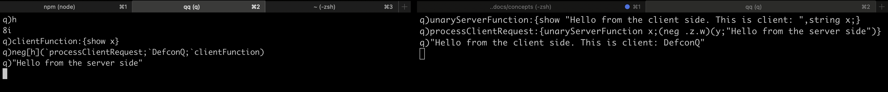
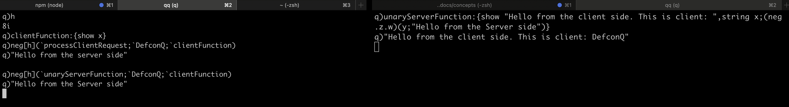
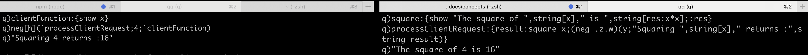
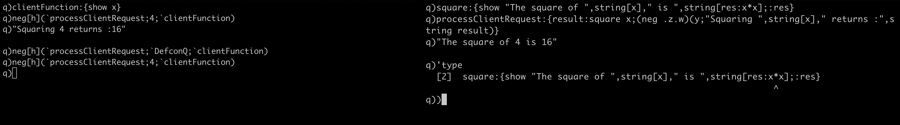
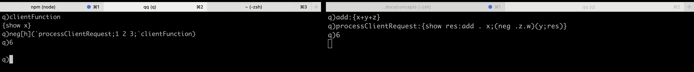
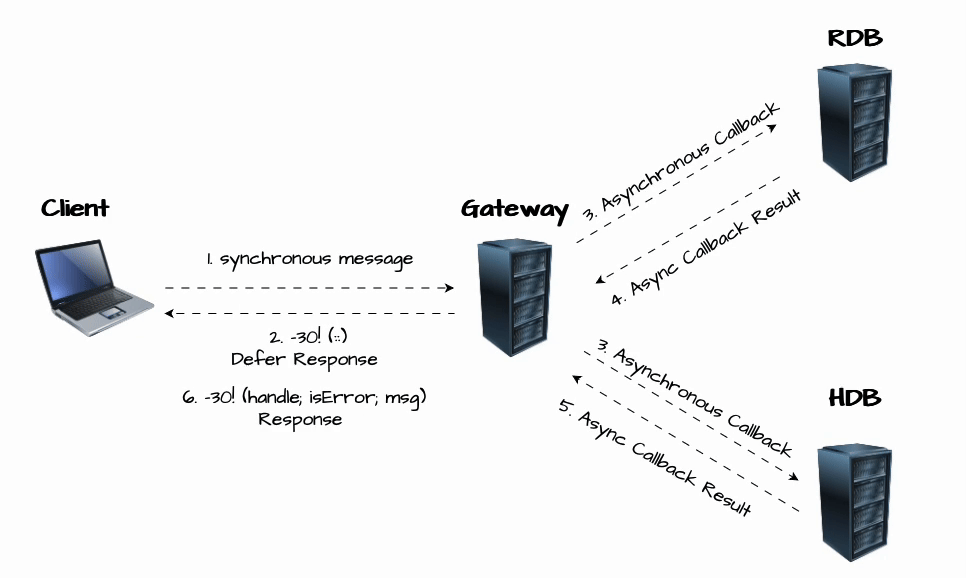

# Beyond the Fundamentals: Next Level Interprocess Communications

In my last blog post, we covered the essential concepts of **Interprocess Communication (IPC)** in KDB/Q. Now, it's time to take things up a notch!

In this post, we’ll explore advanced IPC techniques that are crucial for building more sophisticated **KDB/Q Tick applications**. Whether you're enhancing the standard Tick setup with components like a Gateway or Load Balancer, or simply looking to optimize your existing architecture for better efficiency and performance, these concepts will be invaluable. The topics we are going to cover are the follwoing

- **Asynchronous Broadcast**
- **Asynchronous Callbacks**
- **Deferred Synchronous Messaging**
- **Deferred Response**

All of these concepts are covered in the official documentation at [code.kx.com](https://code.kx.com/home/), but my goal is to break them down into simple, digestible explanations, one byte (pun intended) at a time. If you need a refresher on the **Fundamentals of IPC**, you can check out my previous blog post [here](https://www.defconq.tech/docs/concepts/ipc). Otherwise, let’s get straight to it, let's immerse ourselves into the world of IPC mastery!

## Asynchronous Broadcasting

In [KDB/Q version 3.4](https://code.kx.com/q/releases/ChangesIn3.4/), KX introduced asynchronous broadcast, also known as [`-25!`](https://code.kx.com/q/basics/internal/#-25x-async-broadcast), enabling the broadcasting of data as an asynchronous message to specific handles. But why was this feature implemented? To understand this, we need to take a step back and examine what happens behind the scenes when data is sent via Interprocess Communication (IPC).

Transmitting raw data can be inefficient and slow, which is why KDB/Q serializes data before sending it, and the receiving process then deserializes it. While this process is usually fast for small amounts of data, it can become increasingly time-consuming when dealing with large datasets or sending data to multiple processes. This inefficiency is particularly noticeable in the default implementation of the plain vanilla Tickerplant, as shown in the code below. (For a detailed walkthrough of the plain vanilla Tickerplant, check out my blog post [here](https://www.defconq.tech/docs/tutorials/tick)).

```
.u.pub:{[t;x]
        {[t;x;w] if[count x:.u.sel[x] w 1;(neg first w)(`upd;t;x)]}[t;x] each .u.w[t]
        };
```

As shown in the code above, we iterate over all subscriber handles for a specific table, sending the data asynchronously to each one. This approach requires the message to be serialized separately for every subscriber, which can introduce performance overhead and slow down the process.

:::tip
You can use the internal functions [`-8!`](https://code.kx.com/q/basics/internal/#-8x-to-bytes) and [`-9!`](https://code.kx.com/q/basics/internal/#-9x-from-bytes) for data serialization and deserialization. `-8!x` converts `x` into its IPC byte representation, while `-9!x` reconstructs data from its IPC byte format. Explore more serialization examples [here](https://code.kx.com/q/kb/serialization/)

```
// Serialise
q)-8!1 2 3
0x010000001a000000060003000000010000000200000003000000
// Deserialise
q)-9!-8!1 2 3
1 2 3
``` 
:::

To optimize this process, KX introduced asynchronous broadcast. The key advantage of `-25!(handles;msg)` over `neg[handles]@\:msg` is that it serializes the message only once, significantly reducing CPU and memory load. The message is serialized to the lowest capability of the list of handles, meaning if the connected processes are running different versions of KDB/Q, the serialization will be limited to the types supported by the oldest version. If an error occurs, no messages are sent, and the function will return the handle whose capability caused the failure.

Similar to `neg[handles]@\:msg`, the `-25!x` operation queues the message as asynchronous on the specified handles. The messages are not sent immediately but will be dispatched during the next iteration of the main loop or can be flushed manually using `neg[handles]@\:(::)` or `-25!(handles; ::)`

## Asynchronous Callbacks

So far, we’ve covered fairly straightforward concepts of Interprocess Communication. Now, it’s time to explore something slightly more advanced: **Asynchronous Callbacks**. This technique is especially useful when you want to maintain fully asynchronous communication between processes, ensuring maximum efficiency, neither process gets blocked or has to wait for a response.

While implementing asynchronous callbacks isn’t overly complex, there’s one critical rule to follow: **both the client and the server must use async calls**. Failing to do so can lead to a **deadlock**. For instance, due to KDB/Q's single-threaded nature, if the client makes a synchronous call, the server’s attempt to call back will hang indefinitely since the original synchronous call is still being processed.

Let’s go through some examples to see asynchronous callbacks in action!

### Unary Functions 

Let's start with a simple example: invoking a unary function (a function that takes a single argument) via an asynchronous call on the server side. The server will evaluate the function and send the result back to the client.

On the client side, we'll define a function to handle the server's response. Once the function is processed, the server will **"call back"** to the client process that originally invoked it, triggering the client-side function to process the result.

The following code snippet demonstrates this behavior:

First, we define two functions on the server: one to process and handle the client call and invoke a unary function, and secondly the actual unary function, invoked by the function that processes the request, itself. While it's not strictly necessary to separate them, as everything could be handled within a single function, for clarity, I've chosen to break it down into two distinct functions. This makes it easier to understand each step of the process. After this example, we’ll explore how to consolidate everything into a single function.

**SERVER**
```
// just a reminder, our server runs on port 6001
q)\p
6001
// A unary function taking one argument. 
q)unaryServerFunction:{show "Hello from the client side. This is client: ",string x}
```

Next, we define the function responsible for handling the client's request and executing the previously defined unary function. We then send an asynchronous message to the client, calling the client function that was provided as the `y` parameter in the request-handling function.

```
q)processClientRequest:{unaryServerFunction x;(neg .z.w)(y;"Hello from the server side")}
```

**CLIENT**

Now, the final step is to define the client function that will process the result returned by the server. Once that's in place, we can send an asynchronous message to the server, calling the `processClientRequest` function and passing the client name as the `x` parameter and the client function name as the `y` parameter for the server to invoke as a callback.

```
// h contains the connection handle to the server 
q)h
8i
// define client function to be invoked by the server
q)clientFunction:{show x}
// asynchronous call to the server
q)neg[h](`processClientRequest;`DefconQ;`clientFunction)
// result
q)"Hello from the server side"
```



That wasn’t too difficult! Earlier, I mentioned that everything we just implemented using two functions could actually be done in a single function. Do you think that’s possible? It absolutely is! All we need to do is make a small adjustment to the `unaryServerFunction`, modifying it so that it prints the "Hello from the client side" message to the console and then sends an asynchronous message back to the client. The code snippet below highlights the necessary changes on the server side, no modifications are needed on the client side since the overall behavior remains unchanged.

**SERVER**

```
q)unaryServerFunction:{
	show "Hello from the client side. This is client: ",string x;
	(neg .z.w)(y;"Hello from the Server side")}
```



That wasn’t too difficult either! At this point, you might be thinking that interprocess communication isn’t all that challenging after all. But, as with anything in programming, or life in general, you should always expect the unexpected. What do I mean by that? Well, what if the client sends an incorrect data type as a parameter to the unary function on the server? What would happen then?


Let's walk through an example. First, we'll define a function called square `square` on the server, which takes a parameter `x`, computes its square, and returns the result. Additionally, it will print the result to the console. We'll then refactor our `processClientRequest` function to invoke the`square` function with the parameter provided by the client and return the result via an asynchronous callback. Once again, there’s no need to modify anything on the client side, all we have to do is send an asynchronous message to the server, invoking `processClientRequest` with the appropriate parameters.

**SERVER**

```
q)square:{show "The square of ",string[x]," is ",string[res:x*x];:res}
q)processClientRequest:{result:square x;(neg .z.w)(y;"Squaring ",string[x]," returns :",string result)}
```

**CLIENT**

With our server-side functions now refactored, the final step is to invoke them asynchronously from the client. Let's start by passing a valid integer to be squared.

```
q)neg[h](`processClientRequest;4;`clientFunction)
// Answer from server
q)"Squaring 4 returns :16"
```

**SERVER**

The request was successfully processed on the server, with the result logged to the console and then sent back to the client, which also displayed it on its console (as shown above).

```
q)"The square of 4 is 16"
```


Next, let's repeat the same exercise but pass a symbol data type instead. Since the `square` function on the server expects a numerical input, this will naturally result in a `type` error.

**CLIENT**
```
q)neg[h](`processClientRequest;`DefconQ;`clientFunction)
```

**SERVER**
```
q)'type
  [2]  square:{show "The square of ",string[x]," is ",string[res:x*x];:res}
                                                                  ^
q))\
```



As seen in the code snippet and screenshot above, the server encountered a `type` error and has entered debug mode. You will need to manually exit it using the backslash `\` command. 

This behavior is highly undesirable and must be avoided at all costs, as it results in the server becoming unresponsive until manual intervention. In a large investment bank or hedge fund processing millions of trades daily, even a few minutes of downtime could lead to substantial financial losses.

#### Error Trapping: Safeguard Your Code 

How can we prevent situations like the one we just encountered? Luckily, nearly every programming language offers a mechanism for handling exceptions. If you're familiar with languages like Java, you might recognize this as a **try-catch** statement. In KDB/Q, exception handling is managed using the **trap** operator. And in good KDB/Q manner, this is an operator we have already seen several times, having multiple overloads, one of which serves as **trap**. Here’s the syntax:

| Name          | Syntax      | Description 		       |
| ------------- | ----------- | ------------------------------ |
| Trap At       | `@[f;fx;e]` | Try `f@fx`;    catch with `e`  |
| Trap          | `.[g;gx;e]` | Try `g . gx`;  catch with `e`  |


where

- `f` is a unary function, with `fx` as an argument within its domain.
- `g` is a function with a specified rank, and `gx` is either an atom or a list of length **count**  containing elements within the domain of `g`.
- `e` represents an expression, usually a function.

Now, let's put the trap operator into action and see how it works in practice. First, we define two functions in our KDB/Q process: a unary function, `square`, which takes a single argument and returns its square, and a binary function that accepts two arguments and returns their sum. By using the `trap` operator with `@` and `.` to invoke these functions, we can catch any errors that occur without disrupting the program flow. Instead of halting execution, the error message is returned gracefully. 
 
```
q)square:{x*x}
q)add:{x+y}
q)@[square;4;{"Error message: ",x}]
16
q)@[square;`DefconQ;{"Error message: ",x}]
"Error message: type"
q).[add;(3;4);{"Error message: ",x}]
7
q).[add;(`DefconQ;4);{"Error message: ",x}]
"Error message: type"
q)
```

Now, let's apply this knowledge within a function to prevent process interruptions. By wrapping our function calls with `trap`, we can ensure that any errors are handled gracefully, allowing the program to continue running smoothly instead of getting stuck in debug mode. First, we define a function that invokes the previously defined `square` function without using `trap` to observe how it behaves when called with an incorrect data type..

```
q)functionWithoutErrorTrap:{[x] res:square[x]; show "Function continues";:"Return success. Result is: ",string res}
q)square[2]
4
q)functionWithoutErrorTrap[2]
"Function continues"
"Return success. Result is: 4"
q)functionWithoutErrorTrap[`DefconQ]
'type
  [2]  square:{x*x}
                ^
q))\
```

Next, we create another function with the same functionality but explicitly use `trap` to catch any potential errors. In the first case, the program flow is interrupted, causing the process to enter debug mode until we manually exit using the backslash operator. However, in the second case, `trap` ensures that errors are handled gracefully, preventing any disruption to the process flow.

```
q)functionWithErrorTrap:{[x] res:@[square;x;{"Error message: ",x}];show "Function continues";:"Return success. Result is: ",res}
q)functionWithErrorTrap[`DefconQ]
"Function continues"
"Return success. Result is: Error message: type"
```

##### Trap Gotchas

One key consideration when using **trap** is how KDB/Q evaluates expressions. As we saw in the syntax `@[f;fx;e]`, the expression `e` can be any valid KDB/Q expression. However, KDB/Q evaluates expressions before executing the actual code, meaning that if `e` contains a syntax error, your code will fail before trap even gets a chance to run. Additionally, since `e` is evaluated first, any code within it will execute immediately, regardless of whether an error occurs in `f@fx`. In most cases, you’ll want `e` to be a function that only executes when an error is thrown, ensuring it runs only when needed. The below examples should illustrate this behaviour:

```
q)@[square;2;nonExistingVariable]
'nonExistingVariable
  [0]  @[square;2;nonExistingVariable]
                  ^
q)@[square;2;{nonExistingVariable}]
4
q)@[square;2;{nonExistingVariable]
']
  [0]  @[square;2;{nonExistingVariable]
                                      ^
q)@[square;2;a:20]
4
q)a
20
q)@[square;2;{ `a set 100}]
4
q)a
20
q)@[square;`b;{ `a set 100}]
`a
q)a
100
```

### Variadic Functions

We’ve now explored how to use asynchronous callbacks with a unary function. Next, let’s move on to asynchronous callbacks for variadic functions, functions that can accept any number of arguments. To illustrate this, we’ll define a `sum` function on the server that takes three arguments, `x,y and z`, and returns their sum. We’ll then use **apply** (another overload of `.`) to pass the parameters received from the client via an asynchronous call and return the result. The code for this example is provided below.

**SERVER**

```
q)add:{x+y+z}
q)processClientRequest:{show res:add . x;(neg .z.w)(y;res)}
```

From the client side, we can now make an asynchronous call to the server, invoking the `processClientRequest` function and passing the list of arguments to be passed to the `add` function defined on the server. The result is first logged to the console on the server side before being sent back to the client, where it is then displayed on the console as well.

**CLIENT**

```
q)clientFunction
{show x}
q)neg[h](`processClientRequest;1 2 3;`clientFunction)
// result from the server
q)6
```



This worked perfectly! However, there's something worth considering, our example is quite limited, as it only handles a single specific use case: calculating the sum of three numbers on the server. In a real-world KDB/Q Tick Architecture, this wouldn't be practical. So how can we make it more flexible? The solution is to create a wrapper function and refactor our code to handle a wider range of scenarios.

### Wrapper Function

To make the asynchronous communication between our client and server more flexible, we'll modify the `processClientRequest` function on the server. Instead of being limited to a specific function, it will now accept the name of any function defined on the server as a parameter, evaluate it with the provided arguments, and return the result to the client that initiated the asynchronous call. 

To evaluate any function dynamically on the server, we leverage the evaluate-by-name concept. By passing the function name as a parameter, we can use the `value` operator in KDB/Q to retrieve and execute the corresponding function definition. Let’s illustrate this with an example.

```
q)add
{x+y}
q)value `add
{x+y}
q)(value `add)[2;3]
5
```

Now, we can apply this knowledge to refactor our code and achieve the desired functionality. The following code implements these changes.

**SERVER**
```
q)add:{x+y}
q)sub:{x-y}
q)processClientRequest:{show res:(value x) . y;(neg .z.w)(z;res)}
```

**CLIENT**

```
// invoke the add function on the server, adding 5 to 10
q)neg[h](`processClientRequest;`add;10 5;`clientFunction)
q)15
// invoke the sub function on the server, subtracting 5 from 10
q)neg[h](`processClientRequest;`sub;10 5;`clientFunction)
q)5
```

Pretty cool, right?

### Anonymous Functions

But we can take it even further! By leveraging an anonymous function, we can combine everything we've learned so far to achieve the same functionality, without defining any functions on the server at all. And if we really want to push the boundaries, we don't even need to define the function that processes the result on the client either. Let's dive in and explore how this works!

**CLIENT**

First, to keep things simple, we'll use a single anonymous function while still relying on the `clientFunction` defined on our client to handle the result returned by the server. Remember, we can send a query via Interprocess Communication as a parse tree using the syntax `(functionName; arg1; ...; argN)`. In this case, instead of specifying a function name to be executed on the server, we send an anonymous function. This function takes three parameters: `x` and `y`, which are numeric values used to compute the sum of two numbers, and `z`, which represents the function name to be invoked on the client side when the server returns the result.

```
q)neg[h]({(neg .z.w)(z;x+y)};10;5;`clientFunction)
q)15
```
where
- `{(neg .z.w)(z;x+y)}` is the anonymous function taking three parameters, `x,y,z`
- `x and y` are numeric values used to compute the sum of two numbers
- `z` the function name to be invoked on the client side when the server returns the result

Let's take it a step further by replacing the function name intended for invocation on the client with another anonymous function. This makes the entire process completely independent of any predefined functions on either the client or server.

```
q)neg[h]({(neg .z.w)(z;x+y)};10;5;{show x})
q)15
```

## Deferred Synchronous Messaging

After exploring asynchronous callbacks, we now understand a powerful communication method that enables efficient interaction between KDB/Q processes without causing any of them to block. But is this always the best approach? What if the process sending an asynchronous call depends on the result and cannot proceed until it receives a response? Consider a client querying a load balancer, which then distributes the request across multiple backend processes. The client needs the full response before it can continue execution. In our previous asynchronous callback examples, the client never waited for a response, it simply sent the query and moved on. This can be problematic in scenarios where the client must wait for the result.

This is exactly where we are going to leverage **Deferred Synchronous Messaging**: This technique involves sending an asynchronous message first and immediately flushing the output queue by following up with a synchronous message. This ensures that the client remains blocked until a response is received, allowing for controlled execution flow.

Before discussing **deferred synchronous messaging** in detail, let’s quickly revisit the difference between synchronous and asynchronous messaging:

- **Synchronous messaging** pauses the client process after sending a request, waiting for a response from the server before continuing.
- **Asynchronous messaging** allows the client to continue execution immediately after sending a request, without waiting for or expecting a reply.

Since asynchronous messages do not expect a return value, what happens if the server does send a response to an asynchronous request? Let’s explore this scenario: we have set up two KDB/Q processes, the client running on port `6000` and the server on port `6001`.

Next, we will define a function `add` on the server that takes two numbers, adds them together, and sends the result back to the client using asynchronous messaging. Now, from the client, we can send an asynchronous request to invoke this function on the server. Let’s see what happens.

First, we define the function on the server, by leveraging the internal [`.z.w`](https://code.kx.com/q/ref/dotz/#zw-handle), which holds the connection handle of the process that sent the query.

```
q)add:{neg[.z.w] x+y}
```
We can now call the function from our client by sending an asynchronous message to the server and observe the outcome.

```
q)neg[h](`add;2;3)
q)'type
```

:::note
Remember, we established a connection from the client to the server using `hopen`. The connection handle stored in the variable `h` allows us to send messages and interact with the server.
```
q)h:hopen `::6001
q)h
8i
```
:::

As seen in the output, the client encountered a `type` error. But why did this happen? Remember, in asynchronous messaging, the client sends a query without expecting a response. However, in this case, the server did send a reply back to the client. Unlike receiving an unexpected gift, which might be a pleasant surprise, the client wasn’t prepared for a response, resulting in a  `type` error.

This is a small but important drawback of asynchronous messaging, if the server sends a response and the client isn't expecting it, a `type` error occurs. However, when using **Deferred Synchronous Messaging** we are essentiallys sending an asynchronous message and then immediately flushing the output queue by following up with a synchronous message. This not only ensures that the client is blocked until a response is received, but by doing this, the client now expects a reply, and when the server sends back the asynchronous callback, the client no longer encounters an error. Let's see this in action: 

```
q)neg[h](`add;2;3);h[]
5
q)neg[h](`add;2;3);h(::)
5
```

As seen in the code above, we no longer encounter a `type` error, and the result from the `add` function is successfully returned. The two methods, `h[]` and `h(::)`, are equivalent, allowing you to choose whichever style suits you best. Additionally, we can store the returned result in a variable for further processing. 

```
q)neg[h](`add;2;3);result:h[]
q)result*2
10
q)result
5
```

With this, we conclude our deep dive into **Deferred Synchronous Messaging** and can now move on to **Deferred Response**.

## Deferred Response

In the previous section, we explored how deferred synchronous messaging allows a client to send an asynchronous request to the server while immediately blocking itself with a synchronous message. This approach enables the server to process the request without being blocked, delegating tasks to worker processes in the background, aggregating the results, and then returning them to the client.

This method is so widely used that KX introduced a built-in function to optimize gateway efficiency. Starting from [KDB/Q version 3.6](https://code.kx.com/q/releases/ChangesIn3.6/#deferred-response), the **Deferred Response** was introduced. In the next section, we’ll take a closer look at how this works, reinforcing the theory with practical examples.

Even though this technique looks complicated at first, it's actually not that hard once you understand it. The deferred response consists of two key components:

1. **Suspending a Sync Message**: `-30!(::)` emporarily suspends the processing of a synchronous message, allowing the response to be sent explicitly at a later time. This enables the server to handle other messages before sending a response.
2. **Sending the Deferred Response**: `-30!(handle; isError; msg)` is used to respond to the deferred sync call. The `isError` flag indicates whether an error occurred (`1b` for an error, `0b` for success). The `msg` parameter contains either an error message (if an error occurred) or the actual result of the deferred sync call if execution was successful.

The diagram below illustrates this process.



As illustrated above, the client first sends a synchronous message (**1**) to the Gateway, which defers the response for later processing, using `-30!(::)` (**2**). The Gateway then asynchronously dispatches the request (**3**) to the Real-Time Database (RDB) and the Historical Database (HDB) without waiting for an immediate result. Once the RDB and HDB process the query, they return the results (**4** and **5**) asynchronously to the Gateway. The Gateway then aggregates these results (not shown in the diagram) before finally sending the consolidated response back to the client (**6**), using `-30!(handle;isError;msg)`

Now, we can explore a practical example, but before diving into the practical example shown above, let's first examine how **suspending a synchronous message** with `-30!(::)` and sending a **deferred response** via `-30!(handle;isError;msg)` works. 

To do this, we modify the default implementation of  `.z.pg`, the message handler for synchronous requests, so that it completes the currently executing callback without immediately responding to the client. The `-30!(::)` command can be used at any point in the execution path of `.z.pg` to defer the response. This allows us to initiate some work, let `.z.pg` complete without sending a reply, and then explicitly return the response once the workers have finished processing the task.

We update `.z.pg` to print the message handle of the client making the synchronous call, along with the function and its corresponding parameters, to the console. The response is then deferred. This allows us to observe how the client remains blocked while the server processes the function and eventually returns the result.


**SERVER**

```
q)// SERVER
q)\p 6001
q).z.pg:{show .z.w;show x;-30!(::)}
```

**CLIENT**

```
q)// CLIENT
q)h:hopen `::6001
q)h
5i
q)h({x+x};4)
```

**SERVER**

```
q)7i
{x+x}
4

q)-30!(7i;0b;{x+x}4)
```


The example above should give you a solid understanding of the concept behind deferred responses. Of course, it's a simplified version of how you would use `-30!` in real-world scenarios.

Before exploring a more practical example, let's complete this basic demonstration by showing how to send an error message back to the client. No refactoring is needed, his time, instead of returning a successful result, we will send an error message from the server. Let’s see how that works.

We begin by sending the same synchronous request from the client to the server as before. Once the request is sent, the client will again remain blocked, waiting for a response. Meanwhile, the server is free to continue its execution.


**CLIENT**
```q)// CLIENT
q)h({x+x};4)
```

Thanks to our customized `.z.pg` function, we can observe the connection handle of the process that sent the query, along with the query itself. Now, all that's left is to return an error message by setting the `isError` bollean flag to true (1b) and passing the error message in the form of a string or symbol

**SERVER**
```
q).z.pg
{show .z.w; show x; -30!(::)}
q)7i
{x+x}
4

q)-30!(7i;1b;`thisIsAnError)
q)
```

The client then receives the response from the server, which in this case is an error. The error message is displayed on the client console.

```
'thisIsAnError
  [0]  h({x+x};4)
       ^
q)
```

One great feature of the Deferred Response in KDB/Q is that it automatically tracks connection handles awaiting a response. If you attempt to send a message to a handle that is not expecting a response, a domain error will be triggered. This behavior is demonstrated in the code snippet below.

```
q)-30!(7i;1b;`thisIsAnError)
'Handle 7 was not expecting a response msg
  [0]  -30!(7i;1b;`thisIsAnError)
          ^
q)-30!(7i;0b;`noError)
'Handle 7 was not expecting a response msg
  [0]  -30!(7i;0b;`noError)
          ^
```

### Mastering Deferred Response: A Practical Gateway Example

Now that we’ve explored the details of deferred response, let’s apply our knowledge to a practical scenario. We’ll build a simple Gateway that handles synchronous queries from a client. This Gateway will forward the client’s query to two worker processes: a Real-time Database (**RDB**) containing intraday trade data and a Historical Database (**HDB**) storing historical data. Once the worker processes evaluate the query, they will return the results to the Gateway, which will aggregate them before sending the final response back to the client. Without further delay, let’s get started!

:::note
This example is an extended, in detailed explained walk through of the example provided by KX [here](https://code.kx.com/q/kb/deferred-response/)
:::


Let's start by looking at the code for the RDB and HDB, as this is the simplest part, it just involves setting up some dummy trade data. We’ll also define a `getTradeData` function that retrieves trade data for a given symbol. In the case of the RDB, we’ll add a date column with today’s date before returning the result. This ensures a consistent schema between the RDB and HDB, making it easier to aggregate the results on the Gateway.

#### Realtime Database RDB

```
  1 // RDB  rdb.q
  2
  3 // Set the RDB port to 6000
  4 system "p 6000";
  5
  6 // Create an intraday table for trade data
  7
  8 trade:([] time:asc 10?.z.T; sym:10?`AAPL`GOOG`MSFT; price:10?100.; qty:10?1000);
  9
 10 // Create a function to retrieve trade data for a specific symbol
 11 // For consistency, we add a date column set to today's date
 12 getTradeData:{[s] `date xcols update date:.z.D from select from trade where sym=s}
```

#### Historical Database HDB

```
  1 // HDB  hdb.q
  2
  3 // Set the HDB port to 6001
  4 system "p 6001";
  5
  6 // Create an intraday table for trade data
  7
  8 trade:([] date:asc 20?.z.D-1 2 3;time:asc 20?.z.T; sym:20?`AAPL`GOOG`MSFT; price:20?100.; qty:20?1000);
  9
 10 // Create a function to retrieve trade data for a specific symbol
 11 getTradeData:{[s] select from trade where sym=s}
```

#### Gateway

Now, let's move on to our Gateway, which is a bit more complex, but don't worry, I will walk you through it step by step.

First, we establish connections to all our worker processes (RDB and HDB) and store these connections in a variable called `workerHandles`. Next, we create an empty dictionary to store results received from the worker processes for each client handle, he handle of the process that sent a query to the Gateway.

How does this dictionary look in practice? Each entry maps a client handle to a list of tuples. Each tuple consists of two elements `clientHandle | ((isError;result1);(isError;result2);...;(isError;resultN))`:

1. The `isError` flag (which we introduced earlier).
2. The result, which could either be an error message or actual data.

Here's what that structure looks like:

```
clientHandle1 | ((0b;result1);(0b;result2))
clientHandle2 | ((1b;result1);(0b;result2))
```

Or, alternatively as actual KDB/Q dictionary

```
q)show pending:4 5!(((0b;10);(0b;11));((1b;20);(1b;21)))
4| 0b 10 0b 11
5| 1b 20 1b 21
```

Next, we define a custom `.z.pg` function to handle all incoming synchronous messages. Inside this function, we create a `remoteFunction` that will be sent to the worker processes. This function takes two parameters: the client query and the client handle. The client handle is essential for tracking which client the results belong to.

The Gateway sends an asynchronous message to each worker handle, invoking the `remoteFunction` with the client handle and client query as arguments. The worker processes, in turn, execute the `remoteFunction` on the worker process, invoking the client function passed by the gateway, and then sends the result back to the Gateway via an asynchronous message.

Finally, our custom `.z.pg` function defers the response using `-30!(::)`, ensuring that the client remains blocked while allowing the Gateway to continue processing other tasks.

```
// Customised .z.pg connection handler for synchronous messages
.z.pg:{[query]
        // function definition to be send to worker processes, executing the client query
        // and sending the result back to the gateway, invoking callback function on GW
        remoteFunction: {[clntHandle;query]
                        (neg .z.w)(`callback;clntHandle;@[(0b;)value@; query; {[error] (1b;error)}])
                        };
        // send client query to all worker processes
        neg[workerHandles]@\:(remoteFunction;.z.w;query);
        // defer response
        -30!(::);
        };
```

If you've been paying close attention to the `remoteFunction`, you might have noticed an extra `@` inside the `trap` command:

```
@[(0b;) value@; query; {[error] (1b; error)}]
```

You might be wondering why this is necessary. Well, remember that KDB/Q always attempts to evaluate expressions whenever possible. If we only had `(0b;) value` this would already be considered an evaluable expression. You can see this in the following example:

```
q)(0b;)value
0b
.:
```

However, by adding the additional `@`, we create a projection that waits for another parameter to be passed, effectively delaying the evaluation of the expression until the parameter is provided.

```
q)(0b;)value@
enlist[0b;]@[.:]
```

Now, the final step on our gateway is to implement the callback function that the worker processes will invoke when sending back the result. This callback function takes two arguments: the client handle and the result. It first appends the result to the `pending` dictionary, keeping track of responses received for a particular client. Then, it checks whether the number of received results matches the total number of worker handles, if so, all responses have arrived; otherwise, it continues waiting for the remaining ones.

Next, the function verifies if an error occurred by summing the error flags. If the sum is zero, no errors were encountered. However, if the sum is greater than or equal to one, it indicates that at least one error was received, setting `isError` to `1b`.

The function then retrieves all results associated with a specific client handle. If an error occurred, it returns the first error message; otherwise, it aggregates the worker responses using the `raze` function. Finally, it sends the result back to the client via the client handle and clears the pending dictionary entry for that client.

```
// callback function to be called by worker processes when returning result to the gateway
callback:{[clientHandle;result]
        // append current result to the pending results for particular client
        pending[clientHandle],:enlist result;
        // check if we already have all expected results for this client
        if[count[workerHandles]=count pending[clientHandle];
                // check if any of the responses includes an error
                isError:0<sum pending[clientHandle][;0];
                // grab the results: either error string or data
                result:pending[clientHandle][;1];
                // return the first error or the reduced result to the client
                r:$[isError;{first x where 10h=type each x};reduceFunction] result;
                // send result to client
                -30!(clientHandle;isError;r);
                // reset pending results for this client
                pending[clientHandle]:();
        ];
        };
```

Putting it all together:

```
  1 // Gateway  gw.q
  2
  3 // Set the Gateway port
  4 system "p 5999";
  5
  6 // Connect to all worker handles, i.e. RDB and HDB
  7 workerHandles:hopen each 6000 6001;
  8
  9 // Dictionary to keep track of results received for each clientHandle
 10 pending:()!();
 11
 12 // function to reduce the results received from the different worker processes. In this case, basic raze
 13 reduceFunction:raze;
 14
 15 // Customised .z.pg connection handler for synchronous messages
 16 .z.pg:{[query]
 17         // function definition to be send to worker processes, executing the client query
 18         // and sending the result back to the gateway, invoking callback function on GW
 19         remoteFunction: {[clntHandle;query]
 20                         (neg .z.w)(`callback;clntHandle;@[(0b;)value@; query; {[error] (1b;error)}])
 21                         };
 22         // send client query to all worker processes
 23         neg[workerHandles]@\:(remoteFunction;.z.w;query);
 24         // defer response
 25         -30!(::);
 26         };
 27
 28
 29 // callback function to be called by worker processes when returning result to the gateway
 30 callback:{[clientHandle;result]
 31         // append current result to the pending results for particular client
 32         pending[clientHandle],:enlist result;
 33         // check if we already have all expected results for this client
 34         if[count[workerHandles]=count pending[clientHandle];
 35                 // check if any of the responses includes an error
 36                 isError:0<sum pending[clientHandle][;0];
 37                 // grab the results: either error string or data
 38                 result:pending[clientHandle][;1];
 39                 // return the first error or the reduced result to the client
 40                 r:$[isError;{first x where 10h=type each x};reduceFunction] result;
 41                 // send result to client
 42                 -30!(clientHandle;isError;r);
 43                 // reset pending results for this client
 44                 pending[clientHandle]:();
 45         ];
 46         };
```

#### Client

```
q)h(`getTradeData;`AAPL)                                                                                                 
date       time         sym  price    qty                                                                                
-----------------------------------------                                                                                
2025.03.09 06:16:08.787 AAPL 63.46716 360                                                                                
2025.03.09 07:14:17.624 AAPL 23.06385 257                                                                                
2025.03.09 08:50:31.645 AAPL 94.9975  858                                                                                
2025.03.09 09:01:27.840 AAPL 43.9081  585                                                                                
2025.03.10 14:17:41.480 AAPL 8.123546 959                                                                                
2025.03.11 18:21:54.926 AAPL 15.08133 865                                                                                
2025.03.11 20:02:15.145 AAPL 15.67317 344                                                                                
2025.03.11 21:09:39.902 AAPL 70.43314 314                                                                                
2025.03.12 04:25:17.604 AAPL 19.59907 257                                                                                
2025.03.12 20:26:20.197 AAPL 69.19531 869
```

The final step in our example is to launch all the processes, start a client, and test our implementation. Since the Gateway depends on the RDB and HDB, we need to start these processes first. Once they are up and running, we can start the Gateway. Finally, we launch a client and send a synchronous query to the Gateway to see everything in action. Let's do it!


## Bonus Material

After sharing my last article about **Next-level Interprocess Communication** on LinkedIn, I received valuable feedback from two experienced developers. This is exactly what DefconQ is all about: fostering a community where KDB/Q knowledge is shared, and experienced developers help qbies and fellow KDB/Q developers grow.

The first suggestion by [Conor Mahony](https://www.linkedin.com/in/conor-mahony-5430801b/), was to include the `.z.pc` message handler callback function in the article. The second was a more practical request from [James Neill](https://www.linkedin.com/in/james-neill-aa127955/), asking for an explanation of the default behavior of `.z.pg`. Let's dive into both.

### [`.z.pc`](https://code.kx.com/q/ref/dotz/#zpc-close) connection handler

The `.z.pc` message handler is a unary function triggered when a connection is closed, regardless of the reason. It allows for any necessary cleanup actions and ensures a graceful disconnection. Since the connection is already closed when `.z.pc` is called, no remote values can be assigned to `.z.a`, `.z.u`, or `.z.w`, and only local values are returned. The function receives a single parameter, `x` which represents the handle of the process whose connection was terminated.

You might be wondering why it's important to *worry* about processes that close or drop their connection to your process. Let me explain. When developing fully asynchronous applications, you always want to implement `.z.pc` such that it clears dropped clients. Otherwise, a new client that unexpectedly inherit a previous client handle, which is quite likely, might receive a result that wasn't addressed to them. That’s why it's highly recommend incorporating `.z.pc` from the start when working with asynchronous messaging, even if you're using deferred response.

### `value` - The Default Behavior of `.z.pg` and `.z.ps`

Neill’s request was essentially about what happens when we execute the following code 

```
q) h([]a:1 2 3;b:4 5 6)
q) h`a`b`c!(1 2;3 4;5 6)
``` 

So, let’s run it and analyze the results. We start by launching two KDB/Q processes, a server and a client, then establish a connection from the client to the server. When we execute our code, the first line runs without issues, while the second command results in a type error.

```
q)h `a`b`c!(1 2;3 4;5 6)
1 2
3 4
5 6
q)h ([] a:1 2 3;b:4 5 6)
'type
  [0]  h ([] a:1 2 3;b:4 5 6)
       ^
```

At first, this might be confusing for qbies, but the explanation is fairly simple. The key insight here is that the default implementation of `.z.pg` and `.z.ps` is the `value` operator. But why is that?

Since queries are typically sent as a **parse three** (which is the preferred format) or as a **string literal**, KDB/Q executes these by applying `value` to them. This explains why `value` is the default implementation of `.z.pg` and `.z.ps.`


```
q)value "2+2"
4
q)value (+;2;2)
4
q)h "2+2"
4
q)h (+;2;2)
4
```

Now, let’s examine the data types involved in our two queries:

- In the first query, we sent a dictionary, a structure mapping keys to values. Applying `value` to a dictionary returns its value part. The response from the server confirms this expected behavior.
```
q)value  `a`b`c!(1 2;3 4;5 6)
1 2
3 4
5 6
q)h `a`b`c!(1 2;3 4;5 6)
1 2
3 4
5 6
```
- In the second query, we sent a table. Since a table is essentially a **flipped column dictionary** (or a list of dictionaries), applying `value` to it results in a `type` error, as a table does not have a direct **"value"** component. 

```
q)value ([] a:1 2 3;b:4 5 6)
'type
  [0]  value ([] a:1 2 3;b:4 5 6)
       ^
q)h ([] a:1 2 3;b:4 5 6)
'type
  [0]  h ([] a:1 2 3;b:4 5 6)
       ^
```

To avoid this error, you could flip the table before sending it, since a flipped table is a dictionary, making it compatible with `value`.

```
q)value flip ([] a:1 2 3;b:4 5 6)
1 2 3
4 5 6
q)h flip ([] a:1 2 3;b:4 5 6)
1 2 3
4 5 6
```

And that wraps up our advanced IPC training! You're now a master of interprocess communication, at least when it comes to KDB/Q.

**Happy coding!**

