# Joins: Connecting the Dots for Data Clarity

So far, we’ve explored how to query data using Q-SQL and how to translate those queries into their corresponding functional forms. Now, let’s take it a step further and dive into **joining datasets** with KDB/Q. Joins are one of the most powerful tools in KDB/Q, and they play a significant role in its unmatched efficiency for big data analysis. Compared to other languages, KDB/Q joins are not only faster and more efficient but also uniquely versatile, featuring specialized joins like the **asof join** and **window join**.

While other databases are beginning to incorporate these advanced join types into their capabilities, KDB/Q has been perfecting them for decades, enabling you to answer complex questions about your data that would otherwise be challenging to tackle. Without further ado, let’s explore this fascinating topic!

## Why we use Joins

Before we start exploring joins in greater detail, let’s take a step back and consider why we use them in the first place. Why not just store all our data in one massive table and eliminate the need for joins entirely? While possible, such an approach would violate many best practices in software development and lead to significant inefficiencies. The schema for such a table would be absolutely horrendous, with potentially hundreds of columns, making it difficult to manage and query. 

This brings us to one of the core principles of database design: [**data normalization**](https://en.wikipedia.org/wiki/Database_normalization). Normalization is the process of organizing a relational database into structured tables following specific rules, called normal forms, to reduce redundancy and improve data integrity. While a deep dive into normalization is beyond the scope of this post, the gist is simple - data is divided into smaller, related tables using keys and reassembled when needed using joins.

Normalization eliminates duplicate data, saving storage space and ensuring consistency. Joins, in turn, restore the flat, rectangular structure needed for effective data analysis. For example, trading data might be stored in one table, while reference data like instrument details resides in another. Joins allow you to combine these datasets seamlessly, enabling meaningful analysis while adhering to good database design principles.

One of the key reasons KDB/Q excels in big data analytics is its exceptional efficiency in performing joins. Additionally, KDB/Q has featured **as-of joins** for nearly three decades - a groundbreaking innovation introduced by Arthur Whitney that enables users to answer questions that would otherwise remain unresolved.

In KDB/Q, joins can be broadly categorized into two main types: Equi (or Exact) Joins and As-of Joins. In the following sections we will look at both categories in more detail and walking through numerous examples to demonstrate their power and versatility.

## Basic Joins

Technically, there’s a third category of joins in KDB/Q, though it’s more accurately described as a **concatenation** of tables or columns. Since a table in KDB/Q is essentially a list of conforming dictionaries (if this concept is unfamiliar, check out my dedicated blog post on tables [here](https://www.defconq.tech/docs/concepts/dictionariesTables#tables)) , and because tables are first-class citizens in KDB/Q, you can use the simple **concatenate operator** `,` to merge tables or leverage the **each-both iterator** `'` in combination with `,` to join all columns of two tables using `,'`. 

Let's look at some basic examples to illustrate how this works. We are using the simplified `trade` and `quote` tables for these examples:

### Merge Tables Effortlessly: Joining Records with Concatenate `,`

```
q)show trade:([] sym:`AAPL`MSFT`GOOG`IBM; price:123.0 45.9 234.4 20.0; qty: 100 45 200 300)
sym  price qty
--------------
AAPL 123   100
MSFT 45.9  45
GOOG 234.4 200
IBM  20    300
q)show quote:([] sym:`AAPL`MSFT`GOOG`IBM; bid:123.1 46.0 245.9 21.9; ask:124.8 46.1 246.2 23.9)
sym  bid   ask
----------------
AAPL 123.1 124.8
MSFT 46    46.1
GOOG 245.9 246.2
IBM  21.9  23.9
```

The first thing you’ll notice when attempting to use the concatenate operator to combine the `trade` table with the `quote` table is that it results in a `mismatch` error. This behavior is expected. Recall that a table in KDB/Q is essentially a list of conforming column dictionaries, and in this case, the `trade` and `quote` tables do not conform. The `trade` table has the columns `sym`, `price` and `qty`, while the `quote` table contains `sym`, `bid`, and `ask`.

```
q)trade,quote
'mismatch
  [0]  trade,quote
            ^
```

If we attempt to concatenate or join the `trade` table with itself, it works as expected. Since we are effectively joining the same table to itself, the schemas align perfectly, resulting in a table where each record appears twice. It’s important to note that the records are not sorted in any specific order—they appear sequentially based on how the two individual tables are joined.

```
q)trade,trade
sym  price qty
--------------
AAPL 123   100
MSFT 45.9  45
GOOG 234.4 200
IBM  20    300
AAPL 123   100
MSFT 45.9  45
GOOG 234.4 200
IBM  20    300
```

:::tip
The [`0N!`](https://code.kx.com/q/basics/internal/#0nx-show) operator is a powerful tool when it comes to debugging or inspecting the underlying structure of a KBD/Q data type 
:::

The compatibility of the schemas becomes more apparent when you use the `0N!` operator to inspect the underlying data structure of the `trade` table.

```
q)0N!trade,trade
+`sym`price`qty!(`AAPL`MSFT`GOOG`IBM`AAPL`MSFT`GOOG`IBM;123 45.9 234.4 20 123 45.9 234.4 20;100 45 200 300 100 45 200 300)
sym  price qty
--------------
AAPL 123   100
MSFT 45.9  45
GOOG 234.4 200
IBM  20    300
AAPL 123   100
MSFT 45.9  45
GOOG 234.4 200
IBM  20    300
q)(trade;trade)
+`sym`price`qty!(`AAPL`MSFT`GOOG`IBM;123 45.9 234.4 20;100 45 200 300)
+`sym`price`qty!(`AAPL`MSFT`GOOG`IBM;123 45.9 234.4 20;100 45 200 300)
```

As long as the table schemas align, you can concatenate more than two tables without any issues.

```
q)trade,trade,trade
sym  price qty
--------------
AAPL 123   100
MSFT 45.9  45
GOOG 234.4 200
IBM  20    300
AAPL 123   100
MSFT 45.9  45
GOOG 234.4 200
IBM  20    300
AAPL 123   100
MSFT 45.9  45
GOOG 234.4 200
IBM  20    300
```

This type of join is particularly useful when combining two tables with identical schemas. However, it’s important to note that this join does not match on any keys, which means it can result in **duplicate records**.

### Combining Columns: Mastering Concatenate and Each-Both Joins

Another useful technique is joining all columns of two tables. To achieve this, we use the concatenate operator `,` in combination with the each-both iterator `'`, resulting in `,'`. Since a table in KDB/Q is essentially a list of conforming dictionaries, the concatenation is applied element-wise to each record from both tables. By leveraging the each-both iterator, the first record of the trade table (a dictionary) is joined with the first record of the quote table (also a dictionary), and so on, resulting in the desired merged output.

:::tip
If you need a quick refresher on KDB/Q dictionaries and tables, check out my blog post [here](https://www.defconq.tech/docs/concepts/dictionariesTables)
:::

Let's take a closer look at how this works in practice. First, let's confirm that a table is indeed a list of conform dictionaries. We can do so by simply creating a list of conform dictionaries: 

```
q)(`sym`price`qty!(`AAPL;123;100);`sym`price`qty!(`MSFT;45.9;45);`sym`price`qty!(`GOOG;234.4;200);`sym`price`qty!(`IBM;20;300))
sym  price qty
--------------
AAPL 123   100
MSFT 45.9  45
GOOG 234.4 200
IBM  20    300
```

alternatively, a table can be seen as a flipped column dictionary.

```
q)flip (`sym`price`qty!(`AAPL;123;100);`sym`price`qty!(`MSFT;45.9;45);`sym`price`qty!(`GOOG;234.4;200);`sym`price`qty!(`IBM;20;300))
sym  | AAPL MSFT GOOG  IBM
price| 123  45.9 234.4 20
qty  | 100  45   200   300
```

Building on the concept above, we can use the **concatenate** operator `,` alongside the **each-both** iterator `'` to join each record from both tables using `,'`. This operation adds any keys and values from the second dictionary that are missing in the first. However, if a key exists in both dictionaries, the value from the right dictionary takes precedence. The result of this operation is a list of conforming dictionaries, which, as we know, forms a valid table.

```
q)trade,'quote
sym  price qty bid   ask
--------------------------
AAPL 123   100 123.1 124.8
MSFT 45.9  45  46    46.1
GOOG 234.4 200 245.9 246.2
IBM  20    300 21.9  23.9
```

There are two key observations to make:

1. If a key exists in both dictionaries, the value from the right dictionary takes precedence.
2. For this type of join to work, both tables must have the same number of records, which is logical given the element-wise nature of the operation.

```
// Reverse quote to illustrate that the sym column values of the right table take precedence
q)(update symTrade:sym from trade),'reverse quote
sym  price qty symTrade bid   ask
-----------------------------------
IBM  123   100 AAPL     21.9  23.9
GOOG 45.9  45  MSFT     245.9 246.2
MSFT 234.4 200 GOOG     46    46.1
AAPL 20    300 IBM      123.1 124.8
// Use non conform lengths
q)trade,'2#quote
'length
  [0]  trade,'2#quote
             ^
```

With these two fundamental implicit joins covered, let’s move on to the real strength of KDB/Q native joins.

## Equi (or Exact) Joins

The first category of joins, **Equi (or Exact) Joins**, is used when you have one or more columns that uniquely identify the records in a table. These identifiers serve as the basis for matching and combining data from two different datasets. The shape and content of the resulting table depend on the specific type of join used. In the following sections, we’ll explore all the exact joins: **left join** (`lj`), **inner join** (`ij`), **union join** (`uj`), **plus join** (`pj`), and **equi join** (`ej`). The common pattern across all these joins is the fact that they rely on one or more key columns to match and align records. 


In our examples, we’ll reuse the `trade` and `quote` tables from the previous section. To enhance understanding, we’ll illustrate the outcome of each join with graphical representations, making it easier to grasp the mechanics behind each join.


```
q)trade
sym  price qty
--------------
AAPL 123   100
MSFT 45.9  45
GOOG 234.4 200
IBM  20    300
q)quote
sym  bid   ask
----------------
AAPL 123.1 124.8
MSFT 46    46.1
GOOG 245.9 246.2
IBM  21.9  23.9
```

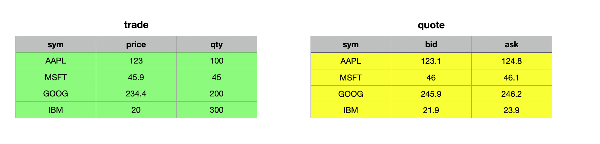

### Left Join `lj`

If you’re familiar with set theory, the concept of a **left join** (`lj`) will feel intuitive. However, for completeness, let’s break it down. Given an **unkeyed or keyed table** as the **left operand** and a **keyed table** as the **right operand**, a left join matches rows from the right table where the key column(s) align with those in the left table. The result includes all rows from the left table, with matching data from the right table added to it.

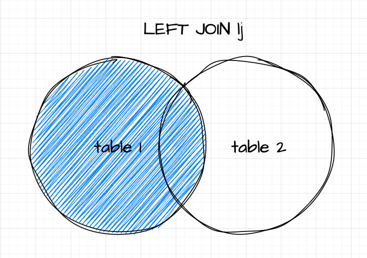

#### Syntax

```
table1 lj table2
```
where
- **table1** is either a table or keyed table
- **table2** is a keyed table

If the right table lacks data for any record in the left table, the corresponding new columns will contain nulls. However, if the source and target tables have duplicate non-key columns, the operation follows upsert semantics. This means the values in the right operand (target) columns will take precedence over those in the left operand (source). A key detail to remember is that the resulting table will always have the same number of records as the left table, neither expanding nor shrinking.

A practical use case for a left join might involve appending bid and ask prices to trade records or enriching trade data with reference information.

Let's look at the example where we join bid and ask prices to trade records:

:::note
**Remember**: The right operand needs to be a keyed table
:::

```
// we key the quote table on the first column (sym)
q)trade lj 1!quote
sym  price qty bid   ask
--------------------------
AAPL 123   100 123.1 124.8
MSFT 45.9  45  46    46.1
GOOG 234.4 200 245.9 246.2
IBM  20    300 21.9  23.9
```

As mentioned above, if there are common non-key columns, the left join has upset semantics and the values of the right table prevail. Let's illustrate this concept:

```
// Adding a qty column to quote so we have a common column
q)trade lj 1!select sym,bid,ask,qty:10000 from quote where sym in `AAPL`GOOG
sym  price qty   bid   ask
----------------------------
AAPL 123   10000 123.1 124.8
MSFT 45.9  45
GOOG 234.4 10000 245.9 246.2
IBM  20    300
```

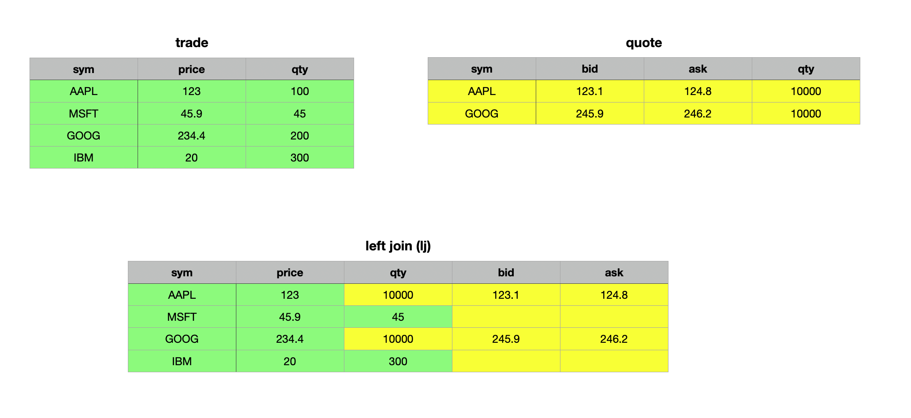

```
// Adding bid and ask column to trades for illustration
q)(update bid:10.0,ask:11.0 from trade) lj 1!select sym,bid,ask,qty:10000 from quote where sym in `AAPL`GOOG
sym  price qty   bid   ask
----------------------------
AAPL 123   10000 123.1 124.8
MSFT 45.9  45    10    11
GOOG 234.4 10000 245.9 246.2
IBM  20    300   10    11
```

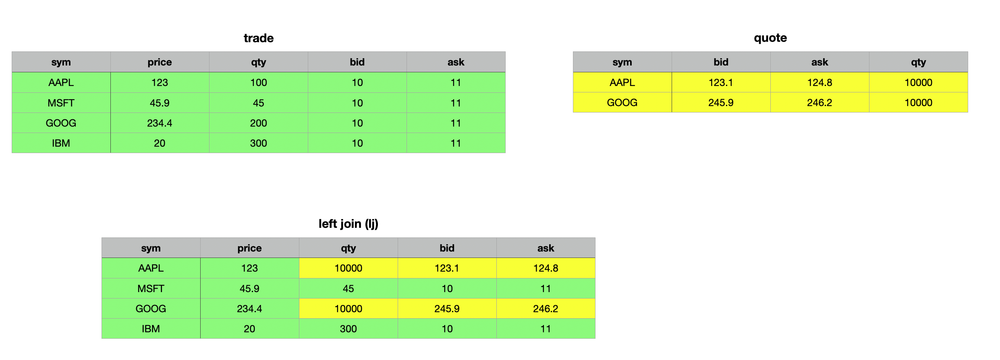

In the first example above, we added the `qty` column to the `quotes` table to create a shared non-key column. As observed, the resulting join updated the values in the `qty` column wherever the keys matched (to ensure not all keys matched, we selected only Apple and Google records from the `quotes` table). For records without a match, the corresponding columns were populated with null values (evident in the `bid` and `ask` columns for Microsoft and IBM). 

In the second example, we added `bid` and `ask` columns to the `trade` table to demonstrate that only records with matching key columns are updated, while all non-matching records remain unchanged.

When performing a left join on two keyed tables, the result is as expected, with the distinction that the resulting table remains keyed rather than unkeyed.

```
q)(1!trade)lj 1!quote
sym | price qty bid   ask
----| ---------------------
AAPL| 123   100 123.1 124.8
MSFT| 45.9  45  46    46.1
GOOG| 234.4 200 245.9 246.2
IBM | 20    300 21.9  23.9
```

Although KDB/Q **does not** have a dedicated **right join**, you can achieve the same result as a SQL right join by simply swapping the arguments of a left join. 

```
// Swapping the arguments to obtain a right join
q)quote lj 1!trade
sym  bid   ask   price qty
--------------------------
AAPL 123.1 124.8 123   100
MSFT 46    46.1  45.9  45
GOOG 245.9 246.2 234.4 200
IBM  21.9  23.9  20    300
```

### Inner Join `ij`

The **Inner Join** `ij` works similarly to the left join, with one key ***difference***: the resulting table includes **only** the records present in both the left (source) and right (target) table. As with a left join, the right operand must be a keyed table (target), while the left operand can be a table or keyed table (source) with column(s) that serve as foreign key(s) to the target or match the target's key column(s) in name and type. Matching is performed on the common column name(s) between the source and the key column(s) of the target, returning only those records with matching keys in both tables.

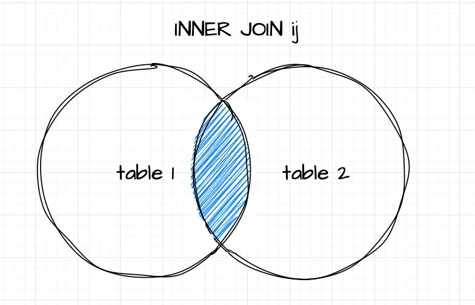

#### Syntax

```
table1 ij table2
```
where
- **table1** is either a table or keyed table
- **table2** is a keyed table


```
q)trade ij 1!update sym:`X from quote where sym in `AAPL`IBM
sym  price qty bid   ask
--------------------------
MSFT 45.9  45  46    46.1
GOOG 234.4 200 245.9 246.2
```

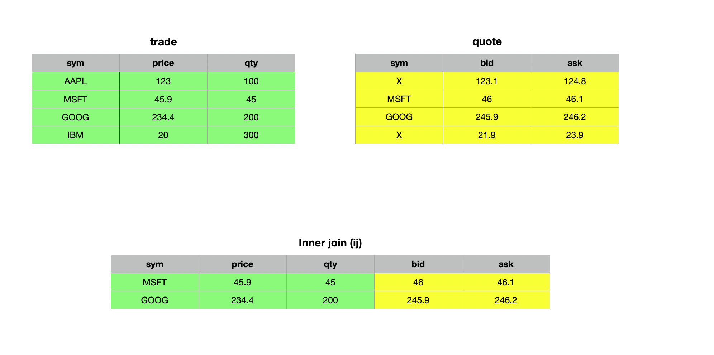

### Union Join `uj`

As the name suggests, a union join merges data from two tables. In terms of set theory, the union join is analogous to the union of two sets. It vertically and horizontally combines two tables or keyed tables into a single table. The resulting table is expanded to include new columns and rows from the right operand that do not exist in the left operand, with the same name and type. Records from the left operand appear first in the result, with null values in any newly added columns. Records from the right operand follow, with their field values placed in the corresponding columns. Let’s explore this concept with some examples — it will make things clearer.

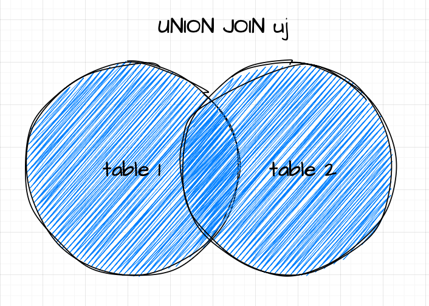

#### Syntax

Unlike left and inner joins, the union join operates exclusively on **two unkeyed tables** or **two keyed tables** - it **does not** support combining a keyed table with an unkeyed table.

```
table1 uj table2

keyedTable1 uj keyedTable2
```

#### Union Join for unkeyed table

When neither table has a key, the union join appends the right table to the left table, filling non-common columns with null values.

```
q)trade uj quote
sym  price qty bid   ask
--------------------------
AAPL 123   100
MSFT 45.9  45
GOOG 234.4 200
IBM  20    300
AAPL           123.1 124.8
MSFT           46    46.1
GOOG           245.9 246.2
IBM            21.9  23.9
q)quote uj trade
sym  bid   ask   price qty
--------------------------
AAPL 123.1 124.8
MSFT 46    46.1
GOOG 245.9 246.2
IBM  21.9  23.9
AAPL             123   100
MSFT             45.9  45
GOOG             234.4 200
IBM              20    300
// Add a common column qty to quote
q)trade uj update qty:10 20 30 40 from quote
sym  price qty bid   ask
--------------------------
AAPL 123   100
MSFT 45.9  45
GOOG 234.4 200
IBM  20    300
AAPL       10  123.1 124.8
MSFT       20  46    46.1
GOOG       30  245.9 246.2
IBM        40  21.9  23.9
```


As demonstrated in the examples above, the union join of two unkeyed tables combines the tables both vertically and horizontally, filling any missing cells with null values. This behavior becomes particularly evident when we examine the first record of the resulting table.

```
q)first trade uj update qty:10 from quote
sym  | `AAPL
price| 123f
qty  | 100
bid  | 0n
ask  | 0n
```

#### Union Join for keyed tables

When performing a union join on two keyed tables, the operation follows upsert semantics for both rows and columns. This behavior is best understood through an example.

```
q)(1!trade) uj 1!quote
sym | price qty bid   ask
----| ---------------------
AAPL| 123   100 123.1 124.8
MSFT| 45.9  45  46    46.1
GOOG| 234.4 200 245.9 246.2
IBM | 20    300 21.9  23.9
```

Similar to other join operations, if there are common non-key columns, the values from the right operand (table) take precedence.

```
q)trade
sym  price qty
--------------
AAPL 123   100
MSFT 45.9  45
GOOG 234.4 200
IBM  20    300
q)quote
sym  bid   ask
----------------
AAPL 123.1 124.8
MSFT 46    46.1
GOOG 245.9 246.2
IBM  21.9  23.9
q)update qty:10 20 from quote where sym in `MSFT`GOOG
sym  bid   ask   qty
--------------------
AAPL 123.1 124.8
MSFT 46    46.1  10
GOOG 245.9 246.2 20
IBM  21.9  23.9
q)(1!trade) uj 1!update qty:10 20 from quote where sym in `MSFT`GOOG
sym | price qty bid   ask
----| ---------------------
AAPL| 123       123.1 124.8
MSFT| 45.9  10  46    46.1
GOOG| 234.4 20  245.9 246.2
IBM | 20        21.9  23.9
```


#### The Danger of Union Joins: Handle with Care


Like Uncle Ben wisely told Peter Parker in Spider-Man: ***"With great power comes great responsibility."***, the same principle applies to union joins. While incredibly powerful, they require careful handling. The upsert semantics of a union join do not enforce data type conformity, meaning it will upsert values regardless of their type. Let’s examine this in detail.

```
q)show t1:([] a:"ABC"; b:1 2 3; c:("tick";"tack";"toe"))
a b c
----------
A 1 "tick"
B 2 "tack"
C 3 "toe"
q)show t2:([] a:`A`B`C; b:1 2 3f; c:3?0Ng)
a b c
----------------------------------------
A 1 8c6b8b64-6815-6084-0a3e-178401251b68
B 2 5ae7962d-49f2-404d-5aec-f7c8abbae288
C 3 5a580fb6-656b-5e69-d445-417ebfe71994
q)t1 uj t2
a   b  c
-------------------------------------------
"A" 1  "tick"
"B" 2  "tack"
"C" 3  "toe"
`A  1f 8c6b8b64-6815-6084-0a3e-178401251b68
`B  2f 5ae7962d-49f2-404d-5aec-f7c8abbae288
`C  3f 5a580fb6-656b-5e69-d445-417ebfe71994
```

As shown in the example above, a union join on two unkeyed tables completely disregards data types. If not approached carefully, this can result in a production run-time nightmare. To avoid such pitfalls, be the (super)hero of your KDB/Q application! Use your power wisely by opting for upsert instead of a union join when your primary goal is to upsert data. Upsert operates by using the amend functionality, either modifying the existing data structure in place or creating a new copy. In doing so, it ensures data type conformity and will throw an error if there is a type mismatch.

```
q)`t1 upsert t2
'type
  [0]  `t1 upsert t2
           ^
q)upsert
.[;();,;]
q)1 2 3 upsert 3 4 5f
'type
  [0]  1 2 3 upsert 3 4 5f
             ^
q).[1 2 3;();,;4 5 6f]
'type
  [0]  .[1 2 3;();,;4 5 6f]
       ^
q)1 2 3 union 4 5 6f
1
2
3
4f
5f
6f
q)union
?,
q)1 2 3,4 5 6f
1
2
3
4f
5f
6f
```

The examples above clearly illustrate that upsert enforces data type conformity and raises a type error if any violations occur. A union join on keyed tables ensures data type conformity for the key column and will only succeed if the key column's data types are consistent. Unfortunately, data type conformity for non-key columns is not enforced.

```
q)show t3:([] a:"ABC"; b:3 4 5f; c:3?0Ng)
a b c
----------------------------------------
A 3 409031f3-b19c-6770-ee84-6e9369c98697
B 4 52cb20d9-f12c-9963-2829-3c64d8d8cb14
C 5 cddeceef-9ee9-3847-9172-3e3d7ab39b26
q)(1!t1) uj 1!t3
a| b c
-| --------------------------------------
A| 3 409031f3-b19c-6770-ee84-6e9369c98697
B| 4 52cb20d9-f12c-9963-2829-3c64d8d8cb14
C| 5 cddeceef-9ee9-3847-9172-3e3d7ab39b26
q)meta t1
c| t f a
-| -----
a| c
b| j
c| C
q)meta t2
c| t f a
-| -----
a| s
b| f
c| g
q)(1!t1) uj (1!t2)
'type
  [0]  (1!t1) uj (1!t2)
              ^
```

### Plus Join `pj`

The plus join `pj` works similar to the left join, with one key difference: it adds non-key columns rather than upserting them. This makes it particularly useful when working with two tables that share identical schemas and have numeric non-key columns. The operands for a plus join are the same as those for a left join, with the added requirement that all non-key columns must be numeric. In this operation, duplicate columns are summed across matching keys, while missing or null values are treated as zero.

#### Syntax

```
table1 pj table2
```
where 
- **table1** is either a table or keyed table
- **table2** is a keyed table

```
q)trade pj 1!update qty:10 100 1000 10000 from quote
sym  price qty   bid   ask
----------------------------
AAPL 123   110   123.1 124.8
MSFT 45.9  145   46    46.1
GOOG 234.4 1200  245.9 246.2
IBM  20    10300 21.9  23.9
q)(1!trade) pj 1!update qty:10 100 1000 10000 from quote
sym | price qty   bid   ask
----| -----------------------
AAPL| 123   110   123.1 124.8
MSFT| 45.9  145   46    46.1
GOOG| 234.4 1200  245.9 246.2
IBM | 20    10300 21.9  23.9
```


### Equi Join `ej`

Up until now, all our joins have relied on a key column to determine which records from the tables should match and be included in the result. The equi join `ej`, however, allows you to join two tables even when neither has a primary key. The right operand does not need to be a keyed table. Using the column or list of columns defined as the first parameter, an equi join returns all rows from the right table that match the left table. If the specified column(s) used for matching are unique, the result will be identical to an inner join `ij`. However, in cases where the right table has multiple rows with the same matching criteria, the result will include all these rows, making it more expansive than an inner join. Unlike `ij`, every matching record from the right table is included in the output. Let's illustrate this with an example.

### Syntax

```
ej[column(List);table1;table2]
```
where
- **column(List)** is a column name or list of column names used to match common records.
- **table1** can be a table or keyed table
- **table2** can be a table or keyed table

In this example, we will make a slight modification to our `quote` table. The updated tables are defined as follows:

```
q)show trade:([] sym:`AAPL`MSFT`GOOG`IBM; price:123.0 45.9 234.4 20.0; qty: 100 45 200 300)
sym  price qty
--------------
AAPL 123   100
MSFT 45.9  45
GOOG 234.4 200
IBM  20    300
q)show quote:([] sym:`AAPL`AAPL`GOOG`GOOG; bid:123.1 46.0 245.9 21.9; ask:124.8 46.1 246.2 23.9)
sym  bid   ask
----------------
AAPL 123.1 124.8
AAPL 46    46.1
GOOG 245.9 246.2
GOOG 21.9  23.9
```

As you can see, the `quote` table now includes multiple records for Google and Apple, while no other stocks are represented.

```
q)ej[`sym;trade;quote]
sym  price qty bid   ask
--------------------------
AAPL 123   100 123.1 124.8
AAPL 123   100 46    46.1
GOOG 234.4 200 245.9 246.2
GOOG 234.4 200 21.9  23.9
q)(1!trade)ij 1!quote
sym | price qty bid   ask
----| ---------------------
AAPL| 123   100 123.1 124.8
GOOG| 234.4 200 245.9 246.2
q)(1!trade) lj 1!quote
sym | price qty bid   ask
----| ---------------------
AAPL| 123   100 123.1 124.8
MSFT| 45.9  45
GOOG| 234.4 200 245.9 246.2
IBM | 20    300
```

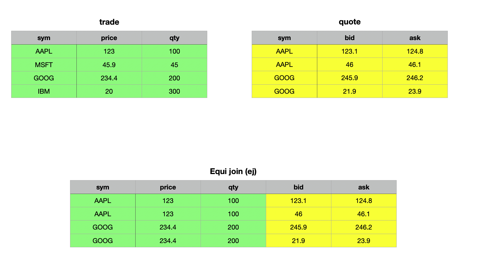

From the example above, you can observe that the equi join matched the `trade` and `quote` tables using the `sym` column, including all matching records from the right argument, the `quote` table. In contrast, the inner join and left join only matched the first record from the right table to the left table, adhering to the specific logic of inner and left joins, respectively.

## As-Of-Joins

Equi or Exact Joins are invaluable when matching datasets with a common key or ID column, such as enhancing a dataset with reference data. However, when working with big data and time series, joining solely on a key column often falls short. In many cases, you need to analyze the state of the world at a specific moment in time or within a certain time range. This is where KDB/Q's native as-of joins, such as the **as-of join `aj`** and **window join `wj`**, prove extremely useful.

These joins enable you to recreate the state of the world at a particular point or over a specified time range. A common use case is analyzing the quote just before a trade occurred to assist compliance officers or regulators in understanding the events and verifying if the best bid and ask prices were executed. Another example is calculating the average trade price over a specific time interval before a trade, which can be done using the window join to self-join the trades data.

We’ll dive deeper into as-of and window joins, along with practical examples, in the following section.

### As-of Join `aj`

The **asof join `aj`** is a powerful tool for joining tables based on time (or any other ordered **nummerical** value) columns, retrieving the most recent value in one table as of a given value in another table. The basic as-of join is implemented using the triadic function `aj`. It performs joins along common columns, selecting the most recent matching values. The syntax for `aj` is:

#### Syntax

```
aj[`c1...`cn; t1; t2]
```
where 
- **``` `c1...`cn```** is a list of column names (symbols) shared by `t1` and `t2`, the tables to be joined
- The join columns do not need to be keys, although having them as keys can improve performance.
- All columns from both tables are included in the resulting table.

The logic of `aj` works as follows:
1. Matches on all specified columns, except the last, are determined using equality.
2. For the last column (e.g., time), the match identifies the greatest value in `t2` that is less than or equal to the corresponding value in `t1`

When the last column represents temporal values, the join effectively finds the value in `t2` that was valid "as of" the time specified in `t1`. This ensures efficient and meaningful joins, especially when dealing with time-ordered data.

Let’s explore this with an example. In order to do so, we need to modify our trade and quote tables slightly by adding a time column.

```
q)show trades:([] time:10:01:01 10:01:03 10:01:04;sym:`msft`ibm`ge;qty:100 200 150)
time     sym  qty
-----------------
10:01:01 msft 100
10:01:03 ibm  200
10:01:04 ge   150
q)show quotes:([] time:10:01:00 10:01:01 10:01:01 10:01:02 10:01:03 10:01:05;sym:`ibm`msft`msft`ibm`msft`ibm;px:100 99 101 98 102 97)
time     sym  px
-----------------
10:01:00 ibm  100
10:01:01 msft 99
10:01:01 msft 101
10:01:02 ibm  98
10:01:03 msft 102
10:01:05 ibm  97
q)aj[`sym`time;trades;quotes]
time     sym  qty px
---------------------
10:01:01 msft 100 101
10:01:03 ibm  200 98
10:01:04 ge   150
```
At first glance, the as-of join might seem complex, but it becomes much clearer when you work through an example step by step. Let’s do exactly that with the example above:
1. We start with the first record in the `trades` table: We look for a `quotes` records matching `msft` as of the trade time `10:01:01`. There are two such records where the time in `t2` is less than or equal than the time in `t1`, both stamped `10:01:01`. The last one has a price of `101`, which is included in the result. Remember: the match identifies the greatest value in `t2` that is less than or equal to the corresponding `time` value in `t1`. Therefore, everything that occured after the timestamp in `t1` for this particular record is ignored. E.g `msft` at `10:01:03`
2. Then, move to the second record in the `trades` table: For `ibm` as of `10:01:03`, the last matching quote record is stamped `10:01:02` with a price of `98`.
3. For the final record in our `trades` table: The symbol `ge` at `10:01:04`, there are no matching quote records.


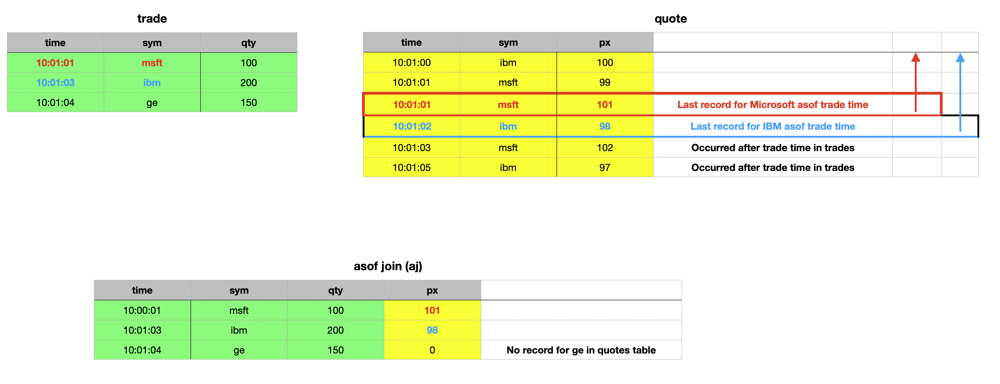

By walking through the process systematically, you can see how the as-of join matches and retrieves the most relevant records. There are some key observations to note. First, the last column specified in the column names parameter does not have to be named `time`; it can have any name, as long as the column exists in both tables. Furthermore, this column doesn’t need to be of a temporal data type - the type can be any numerical value. This flexibility comes from the fact that temporal data types in KDB/Q are internally represented as numerical values, storing a float that reflects the fractional day count from midnight on January 1, 2000.

We can quickly validate these points by making adjustments to our trades and quotes tables.

```
q)show tradesNew:([] whatever:1 3 4;sym:`msft`ibm`ge;qty:100 200 150)
whatever sym  qty
-----------------
1        msft 100
3        ibm  200
4        ge   150
q)show quotesNew:([] whatever:0 1 1 2;sym:`ibm`msft`msft`ibm;px:100 99 101 98)
whatever sym  px
-----------------
0        ibm  100
1        msft 99
1        msft 101
2        ibm  98
q)aj[`sym`whatever;tradesNew;quotesNew]
whatever sym  qty px
---------------------
1        msft 100 101
3        ibm  200 98
4        ge   150
q)aj[`sym`time;trades;quotes]
time     sym  qty px
---------------------
10:01:01 msft 100 101
10:01:03 ibm  200 98
10:01:04 ge   150
q)aj[`sym`whatever;update whatever:`int$time from trades;update whatever:`int$time from quotes]
time     sym  qty whatever px
------------------------------
10:01:01 msft 100 36061    101
10:01:02 ibm  200 36063    98
10:01:04 ge   150 36064
```

The result of an asof join `aj` includes all columns from the right table except those used for matching. The columns used in the exact match remain the same between the two tables, but the temporal column (or more generally, the last column) will differ. In an asof join `aj`, the value from the left table takes precedence. If you want the value from the right table instead - such as the timestamp of the matching quote rather than the trade's timestamp - you can use `aj0`, which has the exact same syntax as `aj` but returns the time from the right table. 

```
q)trades
time     sym  qty
-----------------
10:01:01 msft 100
10:01:03 ibm  200
10:01:04 ge   150
q)quotes
time     sym  px
-----------------
10:01:00 ibm  100
10:01:01 msft 99
10:01:01 msft 101
10:01:02 ibm  98
q)aj[`sym`time;trades;quotes]
time     sym  qty px
---------------------
10:01:01 msft 100 101
10:01:03 ibm  200 98
10:01:04 ge   150
q)aj0[`sym`time;trades;quotes]
time     sym  qty px
---------------------
10:01:01 msft 100 101
10:01:02 ibm  200 98
10:01:04 ge   150
```
:::note
Everything else remains the same. The only difference between `aj` and `aj0` is that `aj0` returns the time column (or the last column) from the right table instead of the one from the left table.
:::

#### Navigating the Pitfalls: The Hidden Dangers of As-Of Joins

Although the asof `aj` join doesn't seem that complicated once you're familiar with its syntax and logic, there's a very important detail you must always remember. Both the asof `aj` and the window join `wj` use a binary search algorithm to locate the appropriate records for joining. For this to work correctly, the temporal column - or more generally, the last column specified - must be in ascending order within the partitions defined by the preceding columns.

This requirement is not enforced by KDB/Q, so no error is thrown if the temporal column isn't sorted. Instead, the operation will produce incorrect results - essentially garbage. **To emphasize**: all columns except the last one specified in the join parameter are used to filter records for an exact match and narrow the rows. The binary search is then performed within this narrowed set, where the temporal (or last) column must be sorted.

For example, if the `sym` column is used for matching, the temporal column (e.g., `time`) must be sorted within each `sym` group for the join to work as intended.

### Window Join `wj`

Sometimes, focusing on a single point in time isn't sufficient to answer our questions, and we may need to consider a time range or window instead of just a specific moment. This is where the window join proves invaluable. Contrary to popular belief, the window join is not a special case of the asof join; rather, the asof join is a specific instance of the more generalized window join.

While the asof join provides a snapshot of the current state at a specific moment in time, the window join aggregates values of specified columns within defined intervals, making it particularly useful for analyzing the relationship between trades and quotes in financial data. The core idea is to investigate how quotes behave in the vicinity of a trade.

For instance, to evaluate the execution quality of a trade, you may need to examine the range of bid and ask prices prevailing around the trade time. Unlike the asof join, which only looks back in time, the window join enables both backward - and forward-looking analysis. Additionally, while the asof join captures the state of the world at a particular time by selecting the last value before that moment, the window join facilitates more comprehensive analysis. It allows you to compute functions such as averages, medians, or any other summarizations over records within the specified time window.

The syntax for the window join is arguably the most complex, so let's break it down step by step and illustrate it with an example.

#### Syntax

```
wj [w; c; t; (q; (f0;c0); (f1;c1))]
wj1[w; c; t; (q; (f0;c0); (f1;c1))]
```
where
- `t` and `q` are simple tables to be joined. The table `q` must be sorted by `sym` and `time`, with the parted `p` attribute on `sym`. Starting from `version 4.1t` (2023.08.04), if `t` is provided as a table name, it will be updated in place.
- `w` represents a pair of lists containing the start and end of the time intervals
- `c` specifies the common column names, such as `sym` and `time`, which must be of integral data types.
- `f0` and `f1` are aggregation functions applied to the values in `q` columns `c0` and `c1` over the defined intervals.

For each record in `t`, the result includes additional columns `c0` and `c1`, which store the results of the aggregation functions applied to the matching intervals in `w`.

A typical use case might be:

```
wj[w;`sym`time;trade;(quote;(max;`ask);(min;`bid))]
```

:::tip
To view all the values within each window, use the identity function :: instead of aggregation functions.
E.g.
```
wj[w;c;t;(q;(::;c0);(::;c1))]
```
:::
 
Let’s go through an example to better understand how the window join works. Our example is inspired by the official documentation in ***Q for Mortals***, which you can find [here](https://code.kx.com/q4m3/9_Queries_q-sql/#999-window-join) For symplicity we will only consider trades and quotes for Apple.

```
q)show trades:([]sym:3#`aapl;time:09:30:01 09:30:04 09:30:08;price:100 103 101)
sym  time     price
-------------------
aapl 09:30:01 100
aapl 09:30:04 103
aapl 09:30:08 101
q)show quotes::([] sym:8#`aapl;time:09:30:01+(til 5),7 8 9;ask:101 103 103 104 104 103 102 100;bid:98 99 102 103 103 100 100 99)
sym  time     ask bid
---------------------
aapl 09:30:01 101 98
aapl 09:30:02 103 99
aapl 09:30:03 103 102
aapl 09:30:04 104 103
aapl 09:30:05 104 103
aapl 09:30:08 103 100
aapl 09:30:09 102 100
aapl 09:30:10 100 99
```

First, we create fixed-width time windows spanning 2 seconds before and 1 second after each trade time. (Note that the windows don't have to be of uniform width.) To achieve this, we extract the `time` column from our trades table and use the each-right iterator to add -2 and 1 seconds to each time value, effectively subtracting 2 seconds and adding 1 second to each time value, creating a pair of lists representing the time intervals for each trade.

```
q)show w:-2 1+\:trades`time
09:29:59 09:30:02 09:30:06
09:30:02 09:30:05 09:30:09
```

Now, let’s examine the actual syntax of the window join and break it down step by step.

```
wj[w;`sym`time;trades;(quotes;(::;`ask);(::;`bid))]
```

The first parameter in our window join, `w` is the list of time windows we created earlier. This is followed by a list of column names, `sym` and `time` in this case, which specify the common columns between the tables. Next, we have the `trades` table, which serves as the left table in the join. The final parameter is a list containing the `quotes` table and a pair of lists, each pairing an aggregate function with a column name.

To view all the values within each window, we used the identity function `::` instead of an aggregate function. This produces a result similar to grouping without applying any aggregation, which can be useful for visualizing the data included in each window.

```
q)wj[w;`sym`time;trades;(quotes;(::;`ask);(::;`bid))]
sym  time     price ask             bid
--------------------------------------------------
aapl 09:30:01 100   101 103         98 99
aapl 09:30:04 103   103 103 104 104 99 102 103 103
aapl 09:30:08 101   104 103 102     103 100 100
```

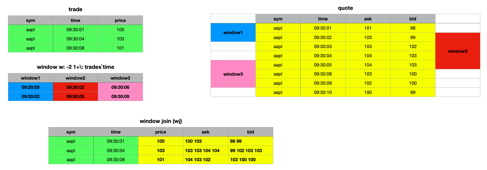

The syntax for the `wj1` window join is identical to that of `wj`. The difference lies in how the time window interval is interpreted. In `wj`, the prevailing quote at the start of the window is included, reflecting the step-function nature of quotes. However, `wj1` considers only quotes that arrive on or after the window's start.

If your analysis requires quotes starting precisely from the beginning of the interval, you should use `wj1`. For further details, refer to the official documentation, as ***Q for Mortals***  is outdated in this regard. You can find the updated reference [here](https://code.kx.com/q/ref/wj/#interval-behavior).

```
q)wj1[w;`sym`time;trades;(quotes;(::;`ask);(::;`bid))]
sym  time     price ask             bid
--------------------------------------------------
aapl 09:30:01 100   101 103         98 99
aapl 09:30:04 103   103 103 104 104 99 102 103 103
aapl 09:30:08 101   103 102         100 100
```

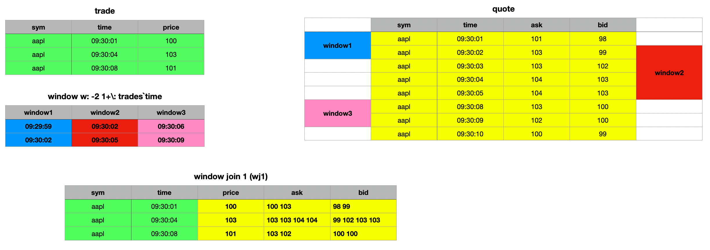

:::note
The key distinction between window join `wj` and `wj1` lies in how they handle interval behavior. Both, `wj` and `wj1` operate on `[]` intervals, meaning they consider quotes that are ≥ the beginning and ≤ the end of the interval. With `wj`, the prevailing quote at the start of the window is considered valid, as quotes are treated as a step function. This is evident in the first example, where the second window `window2` includes the prevailing bid and ask prices as valid. In contrast, this is not the case with the `wj1` join. For `wj1`, only quotes on or after the start of the window are considered. If your use case requires quotes to be included from the beginning of the interval, you should use `wj1`
:::

Additionally, you can perform various analyses on the selected columns within the time range of the window join. For instance, you can calculate averages, minimums, maximums, medians, or standard deviations.

```
q)wj[w;`sym`time;trades;(quotes;(min;`ask);(min;`bid))]
sym  time     price ask bid
---------------------------
aapl 09:30:01 100   101 98
aapl 09:30:04 103   103 99
aapl 09:30:08 101   102 100
q)wj[w;`sym`time;trades;(quotes;(max;`ask);(max;`bid))]
sym  time     price ask bid
---------------------------
aapl 09:30:01 100   103 99
aapl 09:30:04 103   104 103
aapl 09:30:08 101   104 103
q)wj[w;`sym`time;trades;(quotes;(med;`ask);(med;`bid))]
sym  time     price ask   bid
-------------------------------
aapl 09:30:01 100   102   98.5
aapl 09:30:04 103   103.5 102.5
aapl 09:30:08 101   103   100
q)wj[w;`sym`time;trades;(quotes;(sdev;`ask);(sdev;`bid))]
sym  time     price ask       bid
---------------------------------------
aapl 09:30:01 100   1.414214  0.7071068
aapl 09:30:04 103   0.5773503 1.892969
aapl 09:30:08 101   1         1.732051
```

```
q)wj[w;`sym`time;trades;(quotes;(avg;`ask);(avg;`bid))]
sym  time     price ask   bid
--------------------------------
aapl 09:30:01 100   102   98.5
aapl 09:30:04 103   103.5 101.75
aapl 09:30:08 101   103   101
q)wj1[w;`sym`time;trades;(quotes;(avg;`ask);(avg;`bid))]
sym  time     price ask   bid
--------------------------------
aapl 09:30:01 100   102   98.5
aapl 09:30:04 103   103.5 101.75
aapl 09:30:08 101   102.5 100
```
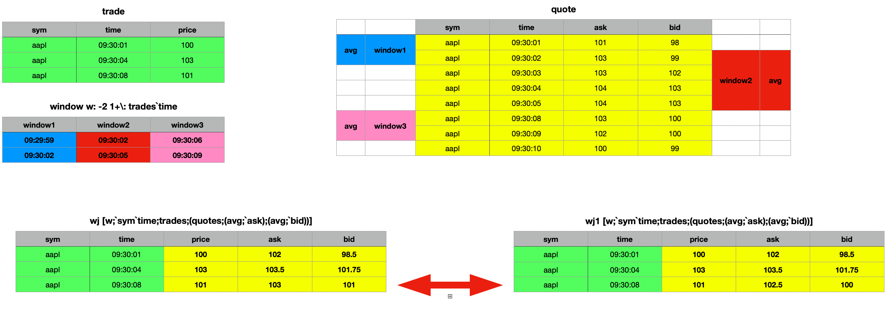

#### Window Joins: Mind the Edge Before You Lean Too Far

When performing a window join, several critical constraints must be adhered to. First, similar to the asof join, the data must be sorted - first by the key identifier used for the exact match (e.g., `sym` in this case) and then by time within each identifier partition. Additionally, the parted attribute `p` must be applied to the identifier column. Unlike other joins, which may tolerate unpartitioned data or function correctly with the grouped `g` attribute, the window join strictly requires the parted attribute.

While the query will execute without errors even if these conditions are not met, the resulting output will be meaningless. This requirement also makes the window join unsuitable for real-time data, such as that in the Real-Time Database (RDB). Instead, it is designed for use with historical data stored in the Historical Database (HDB), where the parted attribute has been correctly applied.

### As of `asof`

The `asof` operator is a simplified version of the `asof join aj` enabling you to perform the same type of match as `aj` but between a table and a single record. It returns the remaining columns from the matched row in the table.

#### Syntax

```
t1 asof t2     asof[t1;t2]
```
where
- `t1` is a table
- `t2` is a table or dictionary
- the last key or column of `t2` corresponds to a time column in `t1`

and returns the values from the last rows matching the rest of the keys and time ≤ the time in `t2`.

```
q)show trades:([] time:10:01:01 10:01:03 10:01:04; sym:`msft`ibm`ge; qty:100 200 150; px:45 160 55)
time     sym  qty px
---------------------
10:01:01 msft 100 45
10:01:03 ibm  200 160
10:01:04 ge   150 55
q)trades asof `sym`time!(`ibm;10:01:03)
qty| 200
px | 160
```

:::note
As shown in the example above, the result does not include the columns from the original dictionary used for the match. To include these columns in the result, save them into a variable and prepend them to the output of the `asof` operation.
```
q)d,trades asof d:`sym`time!(`ibm;10:01:03)
sym | `ibm
time| 10:01:03
qty | 200
px  | 160
```
:::

You can also use a list of conforming dictionary records – i.e., a table – to perform `asof` matches against each reacord.

```
q)trades asof ([] sym:`msft`ibm; time:10:01:01 10:01:03)
qty px
-------
100 45
200 160
```

Prepending the original `asof` records to the result:

```
q)t,'trades asof t:([] sym:`msft`ibm; time:10:01:01 10:01:03)
sym  time     qty px
---------------------
msft 10:01:01 100 45
ibm  10:01:03 200 160
```
## Performance considerations

In the next section, we will explore various performance optimizations for different types of joins, starting with the obvious and basic strategies before progressing to more advanced techniques.

#### Join Smart: Only the Data You Need

When performing joins like left join, inner join, or union join, all non-common columns from the right table are added to the left table if their key columns match. For large datasets, this means a significant amount of data is appended, which can impact performance due to the overhead of copying data. To optimize performance, it’s better to select only the columns you need for the join. The following examples demonstrate this approach.

**Non Optimal Query**
```
table1 lj table2
```

**Optimised Query**

```
lj[select sym,time,exchange,price from trades where sym in `AAPL`MSFT;
   1!select sym,description from referenceData where sym in `AAPL`MSFT]
```

#### Boost Your Joins with KDB/Q's Secret Weapon: Attributes

A key performance enhancement for running queries in KDB/Q lies in its powerful feature: attributes. Attributes are metadata you can apply to lists that follow a specified order, significantly improving query performance - including joins. Joining datasets requires identifying matching keys, an operation that becomes increasingly time-consuming as datasets grow larger.

The efficiency of a join operation depends on how quickly KDB/Q can locate all matching records for the key column(s) in both tables. If no attributes are applied to the key column(s), the system defaults to a sequential, linear search. However, by applying an attribute, the linear search is replaced with a faster binary search, drastically improving join performance and delivering results much quicker.

Instead of performing a join without attributes, such as 
```
aj[`sym`time;trades;quotes]
```
you should use 
```
aj[`sym`time;trades;update `g#sym from quotes]
```
applying the grouped `g` attribute to the key column.

#### Optimising Asof Join Performance: Tips and Tricks

First and foremost, ensure that the columns specified as the first argument of the asof join are in the correct order, such as ``` `sym`time ```. Incorrect ordering can lead to significant performance degradation. Next, leverage attributes for performance optimization. For in-memory asof joins, apply the grouped `g` attribute to the key column of `table2` and sort the records by time within this grouped column. For on-disk data, ensure the parted `p` attribute is applied to the key column, with records sorted by time within each partition.

Additionally, when performing asof joins on disk-stored data, select only the columns needed for the join. KDB/Q uses memory mapping and loads columns into memory only when required. Reducing the number of columns involved in the join will greatly enhance query performance by limiting memory usage to essential data.

Lastly, only select the virtual partition column if it is explicitly needed, as it is generated on demand, which can be time-consuming for large partitions.

##### Don't Lose Your Attributes

When saving data to disk, we typically partition by date and apply the parted attribute to the `sym` column within each partition. As we’ve learned, attributes can greatly enhance query performance, making their use a best practice. But what happens when we load data from disk into memory and query a time range that spans multiple days? Will the parted attribute persist if we query several days worth of data? Or will it be lost? 

For the purpose of this exercise, I have created a small, simple Historical Database (HDB), containing a trades and quotes table spanning a few days. The structure is as below 

```
alexanderunterrainer@Mac:~/repos/test|⇒  ls -l
total 8
drwxr-xr-x@ 4 alexanderunterrainer  staff  128 13 Dec 17:06 2024.12.09
drwxr-xr-x@ 4 alexanderunterrainer  staff  128 13 Dec 17:06 2024.12.10
drwxr-xr-x@ 4 alexanderunterrainer  staff  128 13 Dec 17:06 2024.12.11
drwxr-xr-x@ 4 alexanderunterrainer  staff  128 13 Dec 17:06 2024.12.12
drwxr-xr-x@ 4 alexanderunterrainer  staff  128 13 Dec 17:06 2024.12.13
-rw-r--r--@ 1 alexanderunterrainer  staff   23 13 Dec 17:02 sym
``` 

We can now start a KDB/Q process and load our data

```
alexanderunterrainer@Mac:~/repos/test|⇒  qq .
KDB+ 4.0 2023.01.20 Copyright (C) 1993-2023 Kx Systems
m64/ 8(24)core 24576MB alexanderunterrainer mac 192.168.1.142 EXPIRE 2025.02.21 KDB PLUS TRIAL #5018719
q)\l .
q)tables[]
`s#`quotes`trades
q)t!{count value x}each t:tables[]
quotes| 50
trades| 50
q)select count i by date from trades
date      | x
----------| --
2024.12.09| 10
2024.12.10| 10
2024.12.11| 10
2024.12.12| 10
2024.12.13| 10
q)select count i by date from quotes
date      | x
----------| --
2024.12.09| 10
2024.12.10| 10
2024.12.11| 10
2024.12.12| 10
2024.12.13| 10
q)meta trades
c   | t f a
----| -----
date| d
sym | s   p
time| v
qty | j
px  | f
q)meta quotes
c   | t f a
----| -----
date| d
sym | s   p
time| v
bid | f
ask | f
```

Our Historical Database (HDB) includes two tables, `trades` and `quotes`, each containing a total of 50 records, distributed as 10 records per day over a span of 5 days. By examining the metadata of these tables using the `meta` operator, we can confirm that the parted attribute `p` is applied to the sym column in both tables. When we query either table for a specific day and verify the metadata, we observe that the parted attribute remains intact.

```
q)meta select from trades where date=2024.12.13
c   | t f a
----| -----
date| d
sym | s   p
time| v
qty | j
px  | f
q)meta select from quotes where date=2024.12.13
c   | t f a
----| -----
date| d
sym | s   p
time| v
bid | f
ask | f
```

Interestingly (and perhaps unexpectedly for some), querying the tables for a date range results in the parted attribute being removed.

```
q)meta select from trades where date within 2024.12.10 2024.12.13
c   | t f a
----| -----
date| d
sym | s
time| v
qty | j
px  | f
q)meta select from quotes where date within 2024.12.10 2024.12.13
c   | t f a
----| -----
date| d
sym | s
time| v
bid | f
ask | f
```

But should this really come as a surprise? Not quite. Examining the data, we notice that querying a range of dates returns the results ordered by date, not by the `sym` This behavior makes perfect sense, as the Historical Database (HDB) is primarily partitioned by date, with the `sym` column partitioned only within each individual date. When querying a date range, the data is retrieved exactly as it is stored on disk, preserving this structure.

```
q)select from trades where date within (2024.12.10;2024.12.13),i<5
date       sym  time     qty px
-------------------------------------
2024.12.10 aapl 02:15:30 11  28.2223
2024.12.10 aapl 02:27:56 57  18.70281
2024.12.10 aapl 18:20:20 74  44.18975
2024.12.10 goog 11:20:03 28  44.6898
2024.12.10 goog 21:02:21 54  79.32503
2024.12.11 aapl 15:19:46 61  14.29403
2024.12.11 aapl 16:26:35 59  49.53894
2024.12.11 aapl 18:11:13 16  65.76692
2024.12.11 goog 02:15:01 52  56.78577
2024.12.11 goog 15:08:29 3   97.55778
2024.12.12 aapl 00:18:37 52  27.85781
2024.12.12 aapl 02:46:34 38  30.64804
2024.12.12 aapl 14:04:50 57  72.42412
2024.12.12 aapl 15:12:09 50  98.86591
2024.12.12 goog 11:36:19 79  78.44527
2024.12.13 aapl 02:06:01 43  68.67425
2024.12.13 aapl 17:37:16 9   68.45319
2024.12.13 goog 15:33:46 13  16.47619
2024.12.13 goog 16:28:17 79  92.76588
2024.12.13 goog 21:26:55 64  71.08719
```

Is losing attributes really that problematic? Unfortunately, yes, it is. We've seen how attributes significantly enhance query performance, especially with large datasets. Conversely, running queries without attributes applied means the operations become less efficient, leading to a noticeable performance hit.

Fortunately, there's an easy solution to this problem. As we've seen in an earlier example, querying data for a single day preserves the parted attribute since the data is parted by `sym` within each day. By leveraging this behavior and using iterators, we can create a lambda function (an anonymous function) to iterate over a list of dates, querying one day at a time. This ensures that the parted attribute remains intact. The result of such a query is a list of tables, which can then be combined into a single table using the `raze` operator.

```
// Using a lambda to query each date art a time returns a list of tables
q){ aj[`sym`time;select from trades where date=x;select from quotes where date=x]} each 2024.12.09 2024.12.10 2024.12.11 2024.12.12
+`date`sym`time`qty`px`bid`ask!(2024.12.09 2024.12.09 2024.12.09 2024.12.09 2..
+`date`sym`time`qty`px`bid`ask!(2024.12.10 2024.12.10 2024.12.10 2024.12.10 2..
+`date`sym`time`qty`px`bid`ask!(2024.12.11 2024.12.11 2024.12.11 2024.12.11 2..
+`date`sym`time`qty`px`bid`ask!(2024.12.12 2024.12.12 2024.12.12 2024.12.12 2..
// You can observe that each individual element is in fact a table
q)first { aj[`sym`time;select from trades where date=x;select from quotes where date=x]} each 2024.12.09 2024.12.10 2024.12.11 2024.12.12
date       sym  time     qty px       bid      ask
-------------------------------------------------------
2024.12.09 aapl 12:28:12 12  34.93533 38.39793 38.78682
2024.12.09 aapl 20:12:34 17  63.35864 76.04912 76.86455
2024.12.09 goog 01:08:14 89  95.54843
2024.12.09 goog 04:47:02 26  21.7258  59.37708 59.55671
2024.12.09 goog 04:48:15 27  22.57321 59.37708 59.55671
2024.12.09 goog 05:37:39 44  88.60093 97.53188 97.55164
2024.12.09 goog 07:30:19 57  71.99879 97.53188 97.55164
2024.12.09 goog 10:11:22 37  66.08195 97.53188 97.55164
2024.12.09 goog 10:15:57 68  97.89487 97.53188 97.55164
2024.12.09 goog 11:35:23 58  91.17688 24.69932 24.74801
// Applying raze to this list will combine all elements into a single table
q)raze{ aj[`sym`time;select from trades where date=x;select from quotes where date=x]} each 2024.12.09 2024.12.10 2024.12.11 2024.12.12
date       sym  time     qty px       bid      ask
-------------------------------------------------------
2024.12.09 aapl 12:28:12 12  34.93533 38.39793 38.78682
2024.12.09 aapl 20:12:34 17  63.35864 76.04912 76.86455
2024.12.09 goog 01:08:14 89  95.54843
2024.12.09 goog 04:47:02 26  21.7258  59.37708 59.55671
2024.12.09 goog 04:48:15 27  22.57321 59.37708 59.55671
2024.12.09 goog 05:37:39 44  88.60093 97.53188 97.55164
2024.12.09 goog 07:30:19 57  71.99879 97.53188 97.55164
2024.12.09 goog 10:11:22 37  66.08195 97.53188 97.55164
2024.12.09 goog 10:15:57 68  97.89487 97.53188 97.55164
2024.12.09 goog 11:35:23 58  91.17688 24.69932 24.74801
2024.12.10 aapl 02:15:30 11  28.2223
2024.12.10 aapl 02:27:56 57  18.70281
2024.12.10 aapl 18:20:20 74  44.18975 34.64666 34.70822
2024.12.10 goog 11:20:03 28  44.6898  86.7695  87.26624
2024.12.10 goog 21:02:21 54  79.32503 1.318344 2.207291
2024.12.10 msft 02:39:17 73  35.95293
2024.12.10 msft 09:13:50 39  48.09078 23.71334 24.2586
2024.12.10 msft 13:25:26 39  13.16095 23.71334 24.2586
2024.12.10 msft 14:39:50 28  63.33324 23.71334 24.2586
2024.12.10 msft 17:22:33 11  69.90336 23.71334 24.2586
..
```

This technique will be a valuable addition to your KDB/Q toolkit the next time you need to query a large dataset spanning multiple dates.

## Tips and Tricks

Sometimes, joining multiple datasets is necessary to achieve the desired result. However, in longer queries, this can lead to messy and unreadable code, making it harder to maintain and less accessible for your fellow KDB/Q colleagues.

```
q)((select open:first px,low:min px, high:max px, close:last px by sym from trades) lj select by sym from quotes) lj 1!reference
sym | open     low      high     close    date       time     bid      ask      description
----| --------------------------------------------------------------------------------------
aapl| 34.93533 14.29403 98.86591 68.45319 2024.12.13 18:12:53 91.26417 91.30803 "Apple Inc"
goog| 95.54843 16.47619 97.89487 21.4076  2024.12.13 12:28:42 46.10987 46.54357 "Google Inc"
msft| 35.95293 1.280633 92.56132 56.10808 2024.12.13 10:25:30 80.95108 81.65008 "Microsoft"
```

The query above is already somewhat difficult to read, and it’s not even a particularly complex one. In practice, you’re likely to encounter much more complicated queries. Fortunately, there’s a simple way to make such queries more readable. By leveraging an iterator, we can achieve the same result while significantly improving readability. By leveraging an iterator, we can achieve the same result while significantly improving clarity. Specifically, using the `over` iterator in combination with the desired join operation allows us to join datasets in a much cleaner and more understandable manner.

```
q)(lj/)(select open:first px,low:min px, high:max px, close:last px by sym from trades;select by sym from quotes;1!reference)
sym | open     low      high     close    date       time     bid      ask      description
----| --------------------------------------------------------------------------------------
aapl| 34.93533 14.29403 98.86591 68.45319 2024.12.13 18:12:53 91.26417 91.30803 "Apple Inc"
goog| 95.54843 16.47619 97.89487 21.4076  2024.12.13 12:28:42 46.10987 46.54357 "Google Inc"
msft| 35.95293 1.280633 92.56132 56.10808 2024.12.13 10:25:30 80.95108 81.65008 "Microsoft"
```

Doesn't this already look much clearer? In a KDB/Q script, you can take it a step further by spreading the query across multiple lines, making it even easier to read and understand. You can even add some comments if you want.

```
result:(lj/)(select open:first px,low:min px, high:max px, close:last px by sym from trades;
	    select by sym from quotes;
	    1!reference);
```

Last but not least, we verify that both our queries actually return the same result.

```
q)((lj/)(select open:first px,low:min px, high:max px, close:last px by sym from trades;select by sym from quotes;1!reference))~((select open:first px,low:min px, high:max px, close:last px by sym from trades) lj select by sym from quotes) lj 1!reference
1b
```

**That's all Folks! I hope you found this blog post helpful. See you next time. Don't forget to subscribe to my newsletter for updates straight to your inbox. Subscribe [now](https://defconq.substack.com)**
