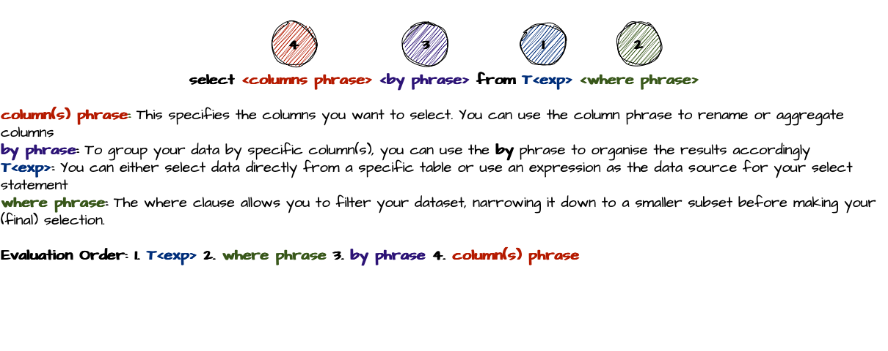
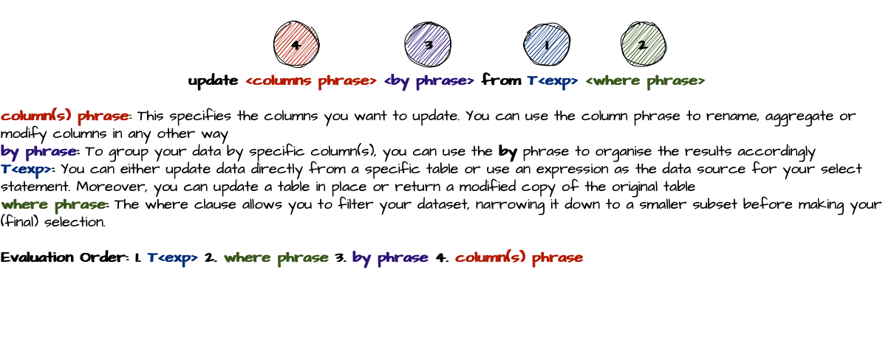
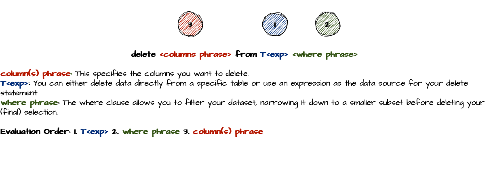
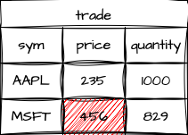
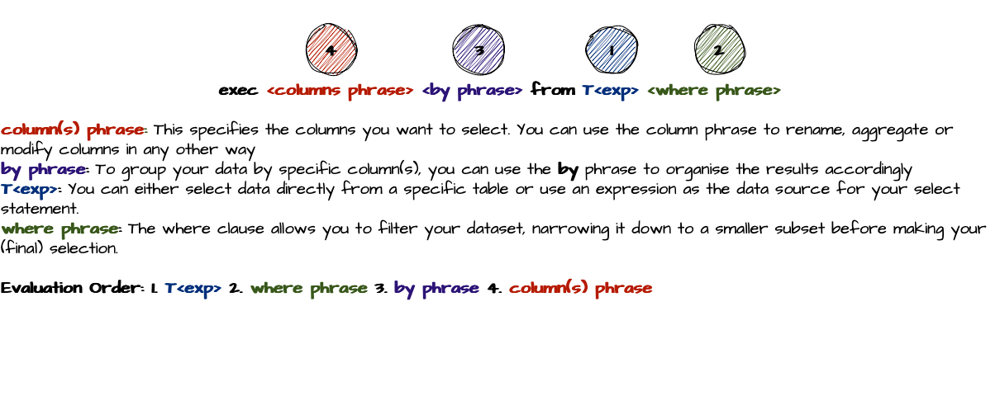

# QSQL - Querying Your Data

In our latest blog post, we've covered a lot about [Dictionaries and Tables](https://www.defconq.tech/docs/concepts/dictionariesTables) and explored how to store large volumes of data. Now, it's time to take the next step and dive into how we can access this data. How do we query it, filter for what we need, and manipulate the information to gain valuable insights? Just like other databases, KDB/Q comes with its own built-in querying language: **Q-SQL**. Contrary to popular belief, I find Q-SQL easier to use than traditional SQL, and it's significantly more performant. Thanks to KDB/Q's column-oriented database structure, which stores data as collections of lists rather than rows and keeps columns in contiguous memory, it's perfectly optimized for vectorized operations, delivering near-instant results. In this blog post, we'll explore the key concepts of the Q-SQL query language and how you can effectively access your data.

## The [`select`](https://code.kx.com/q4m3/9_Queries_q-sql/#93-the-select-template) Statement

The most common way to query your data is through the `select` statement, which can range from simple, basic queries to more advanced and powerful data retrieval. In the following section, we’ll discuss the syntax of the select statement and explore various methods for selecting data. Let’s get started!

### Syntax



```
 select <columns phrase> <by phrase> from T<exp> <where phrase>
```

- **`column(s) phrase`:** This specifies the columns you want to select. You can use the column phrase to rename or aggregate columns.
- **`by phrase`:** To group your data by specific column(s), you can use the **`by`** phrase to organize the results accordingly.
- **`T<exp>`:** You can either select data directly from a specific table or use an expression as the data source for your select statement
- **`where phrase`:** The where clause allows you to filter your dataset, narrowing it down to a smaller subset before making your (final) selection.

It’s crucial to remember the order in which the individual clauses of a `select` statement are evaluated, particularly when optimizing queries for maximum efficiency. The evaluation order is as follows:

1. **Texp**: The first clause to be evaluated is the **`from T<exp>`** expression, which defines the data source. If this is a straightforward table, no evaluation is necessary, making it almost instantaneous. However, as previously mentioned, `T<exp>` can be any KDB/Q expression that returns a table. 
2. The next step is the evaluation of the **where phrase**. This filters your data, starting with the leftmost condition and progressively narrowing down the dataset for subsequent conditions. You can significantly improve performance by prioritizing the most restrictive condition first. We’ll dive into this deeper later.
3. The **by clause** is evaluated next, grouping your data based on specific columns.
4. Lastly, the **column phrase** is executed, selecting the desired columns. You can also rename columns, perform calculations, or apply aggregations during this step.

Let's look at the individual phrases in more detail:

In order to demonstrate the various forms, we’ll create a simple `trade` table as an example.

```
q)show trade:([] sym:20?`AAPL`GOOG`IBM`MSFT;price:20?100.; quantity:20?1000;exchange:20?`LSE`NASDAQ`CBOE`NYSE)
sym  price    quantity exchange
-------------------------------
MSFT 78.33686 45       LSE
GOOG 40.99561 745      LSE
MSFT 61.08817 898      CBOE
MSFT 49.76492 935      NASDAQ
IBM  40.87545 64       CBOE
AAPL 44.9731  177      NASDAQ
IBM  1.392076 238      CBOE
GOOG 71.48779 361      NYSE
AAPL 19.46509 850      CBOE
IBM  9.059026 241      NASDAQ
AAPL 62.03014 296      LSE
AAPL 93.26316 216      NYSE
AAPL 27.47066 717      NASDAQ
GOOG 5.752516 414      CBOE
AAPL 25.60658 657      CBOE
GOOG 23.10108 890      NASDAQ
IBM  8.724017 407      LSE
MSFT 10.24432 635      NASDAQ
MSFT 86.71096 108      CBOE
IBM  72.78528 652      LSE
```

:::note
To keep this article concise, I will abbreviate table outputs where appropriate and where the full data isn't crucial for understanding. Complete tables will be provided whenever necessary to maintain clarity and context.
:::

### Selecting Columns: The column(s) phrase

Let’s begin with a simple and straightforward query: selecting all columns from a table without any filters. If you’re familiar with SQL, this is the equivalent of the classic "Hello World" example for SQL, where you would write `SELECT * FROM trade` ([SQL SELECT reference](https://www.w3schools.com/sql/sql_select.asp)) to return all columns using the `*` wildcard. But as ***KDB/Q developers, we prefer our code to be concise and terse***. So, instead of the unnecessary `*`, we just write `select from trade`. Moreover, we don’t worry about capitalising our code either. Let’s try it out!

```
q)select from trade
sym  price    quantity exchange
-------------------------------
MSFT 78.33686 45       LSE
GOOG 40.99561 745      LSE
MSFT 61.08817 898      CBOE
MSFT 49.76492 935      NASDAQ
IBM  40.87545 64       CBOE
AAPL 44.9731  177      NASDAQ
IBM  1.392076 238      CBOE
...
``` 

Can we make it even more concise? Absolutely! Since a table is stored in a variable, we can just type `trade` in the KDB/Q console to return the entire table. But be careful: 

:::danger
Do **NOT** try this with a large table in a production environment! (Actually you shouldn't have access to a production environment at all)
:::

```
q)trade
sym  price    quantity exchange
-------------------------------
MSFT 78.33686 45       LSE
GOOG 40.99561 745      LSE
MSFT 61.08817 898      CBOE
MSFT 49.76492 935      NASDAQ
IBM  40.87545 64       CBOE
AAPL 44.9731  177      NASDAQ
IBM  1.392076 238      CBOE
...
// Let's make sure that the results actually match
q)trade~select from trade
1b
```
That was easy! Now, let’s take it up a notch. If we want to select only a few specific columns from our table, we can do this by simply listing the columns we’re interested in, separated by commas.

```
q)select sym,price from trade
sym  price
-------------
MSFT 78.33686
GOOG 40.99561
MSFT 61.08817
MSFT 49.76492
IBM  40.87545
AAPL 44.9731
IBM  1.392076
...
```

That wasn't too difficult either. Now, let's try performing some calculations on our data. For example, if we want to calculate the nominal value for each row by multiplying the price column with the quantity column, here's how we can do it.

```
q)select sym,price*quantity from trade
sym  price
-------------
MSFT 3525.159
GOOG 30541.73
MSFT 54857.18
MSFT 46530.2
IBM  2616.029
AAPL 7960.239
IBM  331.3141
...
```

Note that KDB/Q will name the resulting column based on the first column it encounters in the calculation (in this case, price). You can rename the resulting column, as shown below. However, this is not an assignment— the original table remains unaltered. KDB/Q returns a copy of the data with the modifications applied. 

```
q)select sym,nominal:price*quantity from trade
sym  nominal
-------------
MSFT 3525.159
GOOG 30541.73
MSFT 54857.18
MSFT 46530.2
IBM  2616.029
AAPL 7960.239
IBM  331.3141
...
```

You can choose to assign this result to a new variable or leave it as is, but the original table will stay unchanged.

```
q)tradeNew:select sym,nominal:price*quantity from trade
q)tradeNew
sym  nominal
-------------
MSFT 3525.159
GOOG 30541.73
MSFT 54857.18
MSFT 46530.2
IBM  2616.029
AAPL 7960.239
IBM  331.3141
...
q)trade
sym  price    quantity exchange
-------------------------------
MSFT 78.33686 45       LSE
GOOG 40.99561 745      LSE
MSFT 61.08817 898      CBOE
MSFT 49.76492 935      NASDAQ
IBM  40.87545 64       CBOE
AAPL 44.9731  177      NASDAQ
IBM  1.392076 238      CBOE
...
```
But that's not all—Q-SQL offers far more capabilities, even at a basic level. Below are a few examples with brief explanations. While covering its full potential is beyond the scope of this article, you can explore more in-depth details in [*Q for Mortals, Chapter 9: Queries-Q-SQL*](https://code.kx.com/q4m3/9_Queries_q-sql/). Here, I’ll focus on what I believe are the most important concepts.


You can select the same column multiple times, and KDB/Q will automatically append a suffix to any duplicate column names. If KDB/Q cannot determine a column name, it will default to using `x`.

```
q)select sym,price,sym,3*price+1 from trade
sym  price    sym1 x
---------------------------
MSFT 78.33686 MSFT 238.0106
GOOG 40.99561 GOOG 125.9868
MSFT 61.08817 MSFT 186.2645
MSFT 49.76492 MSFT 152.2948
IBM  40.87545 IBM  125.6263
```

One important point to remember when writing Q-SQL queries is that any time you create, rename, update, or modify a column, the changes will only take effect after the entire Q-SQL statement has been executed. This means you cannot create a new column and immediately reuse it within the same statement. Let me illustrate this:

```
q)select avgPrice:avg price, avgQty:avg quantity, nominal: avgPrice*avgQty from trade
'avgQty
  [0]  select avgPrice:avg price, avgQty:avg quantity, nominal: avgPrice*avgQty from trade
                                                                         ^
```
As you can see from the error above, avgQty doesn't exist yet. To achieve this, you have to use a second Q-SQL query like below:

```
q)select avgNominal:avgPrice*avgQty from select avgPrice:avg price, avgQty:avg quantity from trade
avgNominal
----------
19882.57
```

Another useful feature of KDB/Q is the (hidden) virtual index, known as `i` column, which you can utilize in your Q-SQL queries. Because this index is referenced as `i`, it's best to avoid using `i` as a column name. You can also incorporate the virtual index in the `where` clause of your Q-SQL queries (more details on this later). One important thing to note is that the virtual index is not generated when the table is created, but only when it is referenced. Each time you reference it, the index is recreated, which can affect query performance as your dataset grows. The below examples illustrate this in more details.

```
// Create a table called trade1 consisting of the first 5 rows of trade
// Using the # take operator
q)show trade1:5#trade
sym  price    quantity exchange
-------------------------------
MSFT 78.33686 45       LSE
GOOG 40.99561 745      LSE
MSFT 61.08817 898      CBOE
MSFT 49.76492 935      NASDAQ
IBM  40.87545 64       CBOE
// Selecting all columns including the virtal column i
q)select i,sym,price,quantity,exchange from trade1
x sym  price    quantity exchange
---------------------------------
0 MSFT 78.33686 45       LSE
1 GOOG 40.99561 745      LSE
2 MSFT 61.08817 898      CBOE
3 MSFT 49.76492 935      NASDAQ
4 IBM  40.87545 64       CBOE
// Creating a subset of trade1 selecting only the last 3 rows using -3#
q)select i,sym,price,quantity,exchange from -3#trade1
x sym  price    quantity exchange
---------------------------------
0 MSFT 61.08817 898      CBOE
1 MSFT 49.76492 935      NASDAQ
2 IBM  40.87545 64       CBOE
```

As shown in the last two examples above, when we select the virtual column `i` in the first example, the index ranges from 0 to 4. However, when we use the `# take` operator to select the last three rows of `trade1` and then select the virtual index again, the index is updated. This demonstrates that the virtual column `i` is generated each time it is referenced.

Another powerful yet often overlooked feature of the `select` template is the `select [] from table` pattern. The expression within the square brackets allows you to select a subset of rows by specifying either a positive or negative number to retrieve the first or last `n` rows, respectively. You can also provide a start index `s` and the number `n` of rows you want to return. Additionally, it's possible to sort the results in **ascending or descending** order based on a specific column. And, you can combine these features for even more flexibility. Let's explore some examples.

```
// Selecting the first 5 rows
q)select [5] from trade
sym  price    quantity exchange
-------------------------------
MSFT 78.33686 45       LSE
GOOG 40.99561 745      LSE
MSFT 61.08817 898      CBOE
MSFT 49.76492 935      NASDAQ
IBM  40.87545 64       CBOE
// Selecting the last 5 rows
q)select [-5] from trade
sym  price    quantity exchange
-------------------------------
GOOG 23.10108 890      NASDAQ
IBM  8.724017 407      LSE
MSFT 10.24432 635      NASDAQ
MSFT 86.71096 108      CBOE
IBM  72.78528 652      LSE
// Starting at index 2, select 5 rows
q)select [2 5] i,sym,price,quantity,exchange from trade
x sym  price    quantity exchange
---------------------------------
2 MSFT 61.08817 898      CBOE
3 MSFT 49.76492 935      NASDAQ
4 IBM  40.87545 64       CBOE
5 AAPL 44.9731  177      NASDAQ
6 IBM  1.392076 238      CBOE
// Select everything from trade in descending order by column sym
q)select [>sym] from trade
sym  price    quantity exchange
-------------------------------
MSFT 78.33686 45       LSE
MSFT 61.08817 898      CBOE
MSFT 49.76492 935      NASDAQ
MSFT 10.24432 635      NASDAQ
MSFT 86.71096 108      CBOE
IBM  40.87545 64       CBOE
IBM  1.392076 238      CBOE
IBM  9.059026 241      NASDAQ
IBM  8.724017 407      LSE
IBM  72.78528 652      LSE
GOOG 40.99561 745      LSE
GOOG 71.48779 361      NYSE
GOOG 5.752516 414      CBOE
GOOG 23.10108 890      NASDAQ
AAPL 44.9731  177      NASDAQ
AAPL 19.46509 850      CBOE
AAPL 62.03014 296      LSE
AAPL 93.26316 216      NYSE
AAPL 27.47066 717      NASDAQ
AAPL 25.60658 657      CBOE
// Select everything from trade in ascending order by column price
q)select [>price] i,sym,price,quantity,exchange from trade
x  sym  price    quantity exchange
----------------------------------
11 AAPL 93.26316 216      NYSE
18 MSFT 86.71096 108      CBOE
0  MSFT 78.33686 45       LSE
19 IBM  72.78528 652      LSE
7  GOOG 71.48779 361      NYSE
10 AAPL 62.03014 296      LSE
2  MSFT 61.08817 898      CBOE
3  MSFT 49.76492 935      NASDAQ
5  AAPL 44.9731  177      NASDAQ
1  GOOG 40.99561 745      LSE
4  IBM  40.87545 64       CBOE
12 AAPL 27.47066 717      NASDAQ
14 AAPL 25.60658 657      CBOE
15 GOOG 23.10108 890      NASDAQ
8  AAPL 19.46509 850      CBOE
17 MSFT 10.24432 635      NASDAQ
9  IBM  9.059026 241      NASDAQ
16 IBM  8.724017 407      LSE
13 GOOG 5.752516 414      CBOE
6  IBM  1.392076 238      CBOE
// Select a subset
q)select [2 5] i,sym,price,quantity,exchange from trade
x sym  price    quantity exchange
---------------------------------
2 MSFT 61.08817 898      CBOE
3 MSFT 49.76492 935      NASDAQ
4 IBM  40.87545 64       CBOE
5 AAPL 44.9731  177      NASDAQ
6 IBM  1.392076 238      CBOE
// Combine subset selection with ordering
q)select [2 5;>price] i,sym,price,quantity,exchange from trade
x  sym  price    quantity exchange
----------------------------------
0  MSFT 78.33686 45       LSE
19 IBM  72.78528 652      LSE
7  GOOG 71.48779 361      NYSE
10 AAPL 62.03014 296      LSE
2  MSFT 61.08817 898      CBOE
```

One important observation to note is when we combine selecting a subset of rows with sorting in descending order by price. The table is first sorted by price in descending order, but the virtual index `i` remains as if the table were still in its original order. Then, the subset is drawn, starting at position `s` and selecting `n` rows, without affecting the virtual index.

Attentive readers may have noticed that you can achieve the same result from the `select [5] from trade` pattern by using the `# take` operator like `5#trade`. You might wonder why you should use the longer syntax when KDB/Q emphasizes brevity, and we've been advocating for concise code. This comes down to one of KDB/Q's core concepts: code is interpreted right to left. (You can read more about key KDB/Q concepts in my blog post [here](https://www.defconq.tech/blog/The%20Magnificent%20Seven%20-%20Mastering%20KDB/Q%20Concepts%20for%20Data%20Excellence)). Since KDB/Q interprets code right to left, `5#trade` first evaluates the entire `trade` table before selecting the first 5 rows. In contrast, `select [5] from trade` is optimized internally to directly take the first 5 rows without evaluating the entire table. This difference can significantly impact performance and memory usage, especially for large datasets. Therefore, it is recommended to use `select [n] from table` in production code rather than `5#table` for efficiency.

```
q)(5#trade)~select [5] from trade
1b
```

#### Nested Columns: Handle with Care

The final behavior I'd like to explain is how to work with nested columns. A nested column is one where each cell essentially contains a list of lists. KDB/Q tables are very powerful, allowing you to store nearly anything within them—but that's a topic for another time. For now, let's explore a table where two columns are nested, meaning they hold a list of lists. In our example, we're examining a quote table that contains the first three levels of an order book, with three bid and three ask prices for each symbol and row.

```
q)show quote:([] sym:`AAPL`MSFT`FB`GOOG; bid:(130+3?1.0;50+3?1.0;300+3?1.0;200+3?1.0); ask:(131+3?1.0;51+3?1.0;301+3?1.0;201+3?1.0))
sym  bid                        ask
----------------------------------------------------------
AAPL 130.5632 130.0602 130.7008 131.012  131.6942 131.1428
MSFT 50.87678 50.76479 50.85959 51.50566 51.97591 51.00381
FB   300.8109 300.4545 300.8047 301.0912 301.5939 301.3439
GOOG 200.6956 200.8063 200.1153 201.2325 201.3502 201.1478
``` 

Now, let’s say we want to calculate the average bid and ask price for each symbol. A naive approach might be to simply apply the average `avg` operator to the bid and ask columns. However, it's important to remember that each cell in these columns is a list, so we can't directly apply the operator to them. Instead, we need to use an iterator to handle each cell individually. Here's an example of how to do that:

```
// Not using an iterator throws an error
q)select sym,bid,ask,avgBid:avg bid,avgAsk:avg ask from quote
'length
  [0]  select sym,bid,ask,avgBid:avg bid,avgAsk:avg ask from quote
       ^
q)select sym,bid,ask, avgBid:avg each bid,avgAsk:avg each ask from quote
sym  bid                        ask                        avgBid   avgAsk
----------------------------------------------------------------------------
AAPL 130.5632 130.0602 130.7008 131.012  131.6942 131.1428 130.4414 131.283
MSFT 50.87678 50.76479 50.85959 51.50566 51.97591 51.00381 50.83372 51.49513
FB   300.8109 300.4545 300.8047 301.0912 301.5939 301.3439 300.69   301.343
GOOG 200.6956 200.8063 200.1153 201.2325 201.3502 201.1478 200.5391 201.2435
```

Let's look at this in more detail. First, we start by examining the `bid` column independently:

```
q)quote`bid
130.5632 130.0602 130.7008
50.87678 50.76479 50.85959
300.8109 300.4545 300.8047
```

Let's go one step further, and use the `0N!` operator to inspect the column in even greater detail: 

```
q)0N!quote`bid
(130.5632 130.0602 130.7008;50.87678 50.76479 50.85959;300.8109 300.4545 300...
130.5632 130.0602 130.7008
50.87678 50.76479 50.85959
300.8109 300.4545 300.8047
200.6956 200.8063 200.1153
```
 
As shown above, the `bid` column is a nested list. Due to the [atomic nature](https://www.defconq.tech/blog/The%20Magnificent%20Seven%20-%20Mastering%20KDB/Q%20Concepts%20for%20Data%20Excellence#kdbq-is-atomic) of KDB/Q operators, the `avg` operator will apply element-wise to each item within the lists, rather than to each sublist as a whole. Let’s look at an example to demonstrate this behavior.

```
q)avg 0N!(1 2 3;4 5 6;8 9 10)
(1 2 3;4 5 6;8 9 10)
4.333333 5.333333 6.333333
q)(avg 1 4 8;avg 2 5 9;avg 3 6 10)
4.333333 5.333333 6.333333
```

In order to achieve the desired result, we have to leverage the behavior of the `each` iterator.

```
q)avg each (1 2 3;4 5 6;8 9 10)
2 5 9f
```

Understanding this concept is essential, as nested columns are quite common, particularly when you start grouping tables. If you're unsure about any part of this explanation, I encourage you to review the section again and feel free to reach out to me directly for further clarification.

### Filtering Your Data: Mastering the Where Clause

When working with KDB/Q, you're typically handling large datasets, often containing millions or even billions of records. However, it’s rare that you’ll need to analyze an entire table. The `where clause` enables you to filter your data into more manageable subsets. In this section, we'll explore the powerful functionality and behavior of the `where clause`.

Let's start with a simple example. Assume you would like to retrieve all the records for the stock Google from our `trade` table. You can do this simply by using the below query:

```
q)select from trade where sym=`GOOG
sym  price    quantity exchange
-------------------------------
GOOG 40.99561 745      LSE
GOOG 71.48779 361      NYSE
GOOG 5.752516 414      CBOE
GOOG 23.10108 890      NASDAQ
```

#### Multiple Where Clauses

Obviously you're not limited to using just one `where clause` in a Q-SQL query; you can include as many as needed, with each being an individual KDB/Q expression. Although KDB/Q code is generally evaluated from right to left ([left-of-right](https://www.defconq.tech/blog/The%20Magnificent%20Seven%20-%20Mastering%20KDB/Q%20Concepts%20for%20Data%20Excellence#left-of-right-and-no-operator-precedence)), Q-SQL `where clauses` are executed from the left most, to the right most. Each clause successively narrows down the data, passing the filtered subset to the next. This is one of the reasons Q-SQL queries are so efficient and powerful. Given this, it's often best to place the most restrictive `where clause` first to optimize performance. Let’s look at an example: Suppose we have an order table with data for eight different stocks, including the order price and whether it was a buy or sell. Our table contains 100 million records, and we want to filter for all the buy orders for Google.

```
// Set n to 100 million
q)n:100000000
// Create the order table
q)order:([] sym:n?`AAPL`GOOG`MSFT`FB`CSCO`C`GS`AMZN; price:n?100.0; side:n?`buy`sell)
q)count order
100000000
// Estimate the size of the order table
q)1e-6*-22!order
1662.5
```

First, we use a where clause to filter for all buy orders and then, subsequently we filter for all Google orders. Let's have a look at the performance of this query

```
q)\ts select from order where side=`buy,sym=`GOOG
377 1140851408
q)1e-6*1140851408
1140.851
```
As you can see, this takes just under 400 milliseconds to return and uses 1.14GB of memory.

On the other hand, if we first filter for all Google orders and then apply a second filter for buy orders, the performance of our query improves by approximately 30% in terms of execution time while using four times less memory compared to the initial query.

```
q)\ts select from order where sym=`GOOG,side=`buy
265 285213392
q)1e-6*285213392
285.2134
```

The example above clearly demonstrates the importance of placing the most restrictive `where clause` first, followed by progressively less restrictive ones. If you've worked with KDB/Q for a while, you've likely encountered a situation where either you or a less experienced user accidentally queried the Historical Database (HDB) without filtering by date first. This can lead to blocking the HDB and potentially crashing the process as it tries to load all the data into memory (unless certain safety flags are enabled, which is a topic for another post). Since the HDB typically holds years or even decades of market data, partitioned by date, failing to use a date filter first in your Q-SQL query will cause KDB/Q to attempt to load the entire dataset, overwhelming memory and crashing the KDB/Q process.

#### The virtual column `i` in a `where clause`

We've already seen how the virtual column `i` can be used in your column selection, but there's even more you can do with it. You can also leverage it within your `where clause`. A quick example will highlight this functionality.

```
q)select from trade where i=5
sym  price   quantity exchange
------------------------------
AAPL 44.9731 177      NASDAQ
q)select from trade where i within 3 9
sym  price    quantity exchange
-------------------------------
MSFT 49.76492 935      NASDAQ
IBM  40.87545 64       CBOE
AAPL 44.9731  177      NASDAQ
IBM  1.392076 238      CBOE
GOOG 71.48779 361      NYSE
AAPL 19.46509 850      CBOE
IBM  9.059026 241      NASDAQ
q)select from trade where i in 5 6 7 1
sym  price    quantity exchange
-------------------------------
GOOG 40.99561 745      LSE
AAPL 44.9731  177      NASDAQ
IBM  1.392076 238      CBOE
GOOG 71.48779 361      NYSE
```

#### Leveraging the Flexibility of KDB/Q: Writing Powerful Q-SQL Queries

I've mentioned it before, and I can't emphasize enough how powerful and flexible KDB/Q is for coding. You can accomplish a lot with minimal code in a highly elegant manner. This is especially clear when writing more complex Q-SQL queries. By leveraging the flexibility of KDB/Q, we can create concise yet effective code.

Consider this scenario: Our trade table contains trade data for various stocks across multiple exchanges. One of your business users, a quant, is interested in trades for Google (GOOG), Apple (AAPL), and Microsoft (MSFT). Specifically, they want trades for Apple on the NASDAQ (National Association of Securities Dealers Automatic Quotation System), trades for Google on the NYSE (New York Stock Exchange), and trades for Microsoft on both the NASDAQ and CBOE (Chicago Board Options Exchange). The table below lists the various exchanges where these stocks are traded. How can we create a query to return the desired outcome? 

```
q)select count i by sym,exchange from trade
sym  exchange| x
-------------| -
AAPL CBOE    | 2
AAPL LSE     | 1
AAPL NASDAQ  | 2
AAPL NYSE    | 1
GOOG CBOE    | 1
GOOG LSE     | 1
GOOG NASDAQ  | 1
GOOG NYSE    | 1
IBM  CBOE    | 2
IBM  LSE     | 2
IBM  NASDAQ  | 1
MSFT CBOE    | 2
MSFT LSE     | 1
MSFT NASDAQ  | 2
```

As you can see, the stocks we are focusing on are traded on multiple exchanges, some of which are not relevant to our needs. To start, let's filter the data to include only the stocks we're interested in.

```
q)select from trade where sym in `AAPL`GOOG`MSFT
sym  price    quantity exchange nominal
----------------------------------------
MSFT 78.33686 45       LSE      3525.159
GOOG 40.99561 745      LSE      30541.73
MSFT 61.08817 898      CBOE     54857.18
MSFT 49.76492 935      NASDAQ   46530.2
AAPL 44.9731  177      NASDAQ   7960.239
GOOG 71.48779 361      NYSE     25807.09
AAPL 19.46509 850      CBOE     16545.33
AAPL 62.03014 296      LSE      18360.92
AAPL 93.26316 216      NYSE     20144.84
AAPL 27.47066 717      NASDAQ   19696.47
GOOG 5.752516 414      CBOE     2381.541
AAPL 25.60658 657      CBOE     16823.52
GOOG 23.10108 890      NASDAQ   20559.96
MSFT 10.24432 635      NASDAQ   6505.145
MSFT 86.71096 108      CBOE     9364.784
```

This is a good start, but now we need to narrow it down to include only the exchanges that interest us. Let's give that a try.

```
q)select from trade where sym in `AAPL`GOOG`MSFT,exchange in `NASDAQ`CBOE`NYSE
sym  price    quantity exchange nominal
----------------------------------------
MSFT 61.08817 898      CBOE     54857.18
MSFT 49.76492 935      NASDAQ   46530.2
AAPL 44.9731  177      NASDAQ   7960.239
GOOG 71.48779 361      NYSE     25807.09
AAPL 19.46509 850      CBOE     16545.33
AAPL 93.26316 216      NYSE     20144.84
AAPL 27.47066 717      NASDAQ   19696.47
GOOG 5.752516 414      CBOE     2381.541
AAPL 25.60658 657      CBOE     16823.52
GOOG 23.10108 890      NASDAQ   20559.96
MSFT 10.24432 635      NASDAQ   6505.145
MSFT 86.71096 108      CBOE     9364.784
```

That's not quite what we want, is it? While we have all the trades for the stocks we're interested in, we're also seeing trades for Apple on the NYSE and CBOE, which we want to exclude. Perhaps rearranging the where clauses might help?

```
q)select from trade where exchange in `NASDAQ`CBOE`NYSE, sym in `AAPL`GOOG`MSFT
sym  price    quantity exchange nominal
----------------------------------------
MSFT 61.08817 898      CBOE     54857.18
MSFT 49.76492 935      NASDAQ   46530.2
AAPL 44.9731  177      NASDAQ   7960.239
GOOG 71.48779 361      NYSE     25807.09
AAPL 19.46509 850      CBOE     16545.33
AAPL 93.26316 216      NYSE     20144.84
AAPL 27.47066 717      NASDAQ   19696.47
GOOG 5.752516 414      CBOE     2381.541
AAPL 25.60658 657      CBOE     16823.52
GOOG 23.10108 890      NASDAQ   20559.96
MSFT 10.24432 635      NASDAQ   6505.145
MSFT 86.71096 108      CBOE     9364.784
```

No, that didn't work either. Alright, let's construct a query for each individual stock along with the exchanges we're interested in and then combine them.

```
q)(select from trade where sym=`AAPL, exchange=`NASDAQ),(select from trade where sym=`GOOG,exchange=`NYSE),select from trade where sym=`MSFT,exchange in `NASDAQ`CBOE
sym  price    quantity exchange nominal
----------------------------------------
AAPL 44.9731  177      NASDAQ   7960.239
AAPL 27.47066 717      NASDAQ   19696.47
GOOG 71.48779 361      NYSE     25807.09
MSFT 61.08817 898      CBOE     54857.18
MSFT 49.76492 935      NASDAQ   46530.2
MSFT 10.24432 635      NASDAQ   6505.145
MSFT 86.71096 108      CBOE     9364.784
```

:::note
In the code above, we've joined three tables into a single table. We'll discuss joins in much greater detail in a future post
:::

The code above gives us the desired result, showing all trades for Apple on the NASDAQ, all Google trades on the NYSE, and all Microsoft trades on both the NASDAQ and CBOE. However, this required quite a bit of typing. Surely, there must be a more concise way to achieve this. Let’s take a moment to consider what we’re actually interested in. The table below summarizes the stocks and exchanges we're focusing on.

```
q)([] sym:`AAPL`GOOG`MSFT`MSFT;exchange:`NASDAQ`NYSE`NASDAQ`CBOE)
sym  exchange
-------------
AAPL NASDAQ
GOOG NYSE
MSFT NASDAQ
MSFT CBOE
```

Wouldn't it be fantastic if we could utilize this information to filter our table? Well, KDB/Q always comes through! We can definitely achieve that! Let me demonstrate how.

```
q)select from trade where ([] sym;exchange) in ([] sym:`AAPL`GOOG`MSFT`MSFT;exchange:`NASDAQ`NYSE`NASDAQ`CBOE)
sym  price    quantity exchange nominal
----------------------------------------
MSFT 61.08817 898      CBOE     54857.18
MSFT 49.76492 935      NASDAQ   46530.2
AAPL 44.9731  177      NASDAQ   7960.239
GOOG 71.48779 361      NYSE     25807.09
AAPL 27.47066 717      NASDAQ   19696.47
MSFT 10.24432 635      NASDAQ   6505.145
MSFT 86.71096 108      CBOE     9364.784
```

You can probably already see that the result is exactly what we are looking for and matches the result of our previous query. However, the order of the table differs slightly from our previous result. So, let's sort both tables by the symbol and then compare the results to ensure they contain the same information.

```
q)(`sym xasc select from trade where ([] sym;exchange) in ([] sym:`AAPL`GOOG`MSFT`MSFT;exchange:`NASDAQ`NYSE`NASDAQ`CBOE))~(`sym xasc select from trade where sym=`AAPL, exchange=`NASDAQ),(select from trade where sym=`GOOG,exchange=`NYSE),select from trade where sym=`MSFT,exchange in `NASDAQ`CBOE
1b
```

Et voila! There we have it! We've confirmed that the results match perfectly, and we've now learned how to write terse yet powerful queries. 

#### Demystifying the Magic of Where Clauses

We’ve explored some basic where clause expressions and gained a solid understanding of how to use them. Now, let’s dive deeper into what actually happens under the hood when you apply a where clause in your Q-SQL query. Each where clause in your Q-SQL expression is evaluated to produce a boolean vector (or boolean-equivalent types, like an integer 0 representing false) that matches the row count of the table. From a intuitive perspective you would expect that each boolean vector from the where clauses is combined using an **AND** operation, and the final vector is applied to filter your data. However, as we learned in the previous section on multiple where clauses, only the records passing the current where clause are tested in the next subphrase. The result is a progressively narrower subset of rows for each subsequent clause.

Let's look at this behaviour in action using our `trade` table:

```
// For reference
q)trade
sym  price    quantity exchange
-------------------------------
MSFT 78.33686 45       LSE
GOOG 40.99561 745      LSE
MSFT 61.08817 898      CBOE
MSFT 49.76492 935      NASDAQ
IBM  40.87545 64       CBOE
AAPL 44.9731  177      NASDAQ
IBM  1.392076 238      CBOE
GOOG 71.48779 361      NYSE
AAPL 19.46509 850      CBOE
IBM  9.059026 241      NASDAQ
AAPL 62.03014 296      LSE
AAPL 93.26316 216      NYSE
AAPL 27.47066 717      NASDAQ
GOOG 5.752516 414      CBOE
AAPL 25.60658 657      CBOE
GOOG 23.10108 890      NASDAQ
IBM  8.724017 407      LSE
MSFT 10.24432 635      NASDAQ
MSFT 86.71096 108      CBOE
IBM  72.78528 652      LSE
// Create count[trade] random boolean values --> 20
q)show ind:count[trade]?01b
01000111010011011101b
// Use our boolean vector to filter the trade table. Returning all rows where the boolean vector is 1b true
q)select from trade where ind
sym  price    quantity exchange
-------------------------------
GOOG 40.99561 745      LSE
AAPL 44.9731  177      NASDAQ
IBM  1.392076 238      CBOE
GOOG 71.48779 361      NYSE
IBM  9.059026 241      NASDAQ
AAPL 27.47066 717      NASDAQ
GOOG 5.752516 414      CBOE
GOOG 23.10108 890      NASDAQ
IBM  8.724017 407      LSE
MSFT 10.24432 635      NASDAQ
IBM  72.78528 652      LSE
// You can also select the whole table using 1b. This works because KDB/Q applies atomic extension
q)select from trade where 1b
sym  price    quantity exchange
-------------------------------
MSFT 78.33686 45       LSE
GOOG 40.99561 745      LSE
MSFT 61.08817 898      CBOE
MSFT 49.76492 935      NASDAQ
IBM  40.87545 64       CBOE
AAPL 44.9731  177      NASDAQ
IBM  1.392076 238      CBOE
GOOG 71.48779 361      NYSE
AAPL 19.46509 850      CBOE
IBM  9.059026 241      NASDAQ
AAPL 62.03014 296      LSE
AAPL 93.26316 216      NYSE
AAPL 27.47066 717      NASDAQ
GOOG 5.752516 414      CBOE
AAPL 25.60658 657      CBOE
GOOG 23.10108 890      NASDAQ
IBM  8.724017 407      LSE
MSFT 10.24432 635      NASDAQ
MSFT 86.71096 108      CBOE
IBM  72.78528 652      LSE
// Or select an empty table using 0b
q)select from trade where 0b
sym price quantity exchange
---------------------------
``` 

That was fun, right? As you've seen, we can use a boolean vector to filter our data effectively. Thanks to the atomic nature of KDB/Q operators and atomic expansion, you can even pass a single `true` value (`1b`) to return the entire table or a `false` value (`0b`) to get an empty table. But let's take it up a notch and dive deeper into how the `where clause` really works.

```
q)ind
01000111010011011101b
q)where ind
1 5 6 7 9 12 13 15 16 17 19
```

As you can see, the `where` operator returns the index of all `true (1b)` values. 

:::tip
There's actually more to this, but that, my friends, is a topic for another post. You can subscribe to my newsletter [here](https://defconq.substack.com) to stay updated and receive my blog posts directly in your inbox.
:::

Now, back to the `where` operator. Let's try using the indexes it returns to index into our `trade` table—it works like a charm. 

```
q)trade where ind
sym  price    quantity exchange
-------------------------------
GOOG 40.99561 745      LSE
AAPL 44.9731  177      NASDAQ
IBM  1.392076 238      CBOE
GOOG 71.48779 361      NYSE
IBM  9.059026 241      NASDAQ
AAPL 27.47066 717      NASDAQ
GOOG 5.752516 414      CBOE
GOOG 23.10108 890      NASDAQ
IBM  8.724017 407      LSE
MSFT 10.24432 635      NASDAQ
IBM  72.78528 652      LSE
```

But what if we use numerical indexes directly in our Q-SQL statement? That should work, right? Given the left-to-right nature of KDB/Q, the indexing into the table should filter the data, and then we can select from it. Let’s try it...

```
q)select from trade 1 5 6 7 9 12 13 15 16 17 19
sym  price    quantity exchange
-------------------------------
GOOG 40.99561 745      LSE
AAPL 44.9731  177      NASDAQ
IBM  1.392076 238      CBOE
GOOG 71.48779 361      NYSE
IBM  9.059026 241      NASDAQ
AAPL 27.47066 717      NASDAQ
GOOG 5.752516 414      CBOE
GOOG 23.10108 890      NASDAQ
IBM  8.724017 407      LSE
MSFT 10.24432 635      NASDAQ
IBM  72.78528 652      LSE
q)(trade where ind)~select from trade 1 5 6 7 9 12 13 15 16 17 19
1b
```

It worked—awesome! However, there’s one caveat when using this behavior in a Q-SQL `where` clause. The boolean vector must be the same length as the table's row count, otherwise, you’ll encounter a length error. Take a look at the example below.

```
q)select from trade where 010b
'length
  [0]  select from trade where 010b
       ^
```

### Grouping Data: The `by` clause

When dealing with large tables, it's common to store data for multiple instruments or IDs; I have never encountered a table containing data for just one specific identifier. Therefore, it's usually impractical to run aggregation functions like minimum `min`, maximum `max`, or average `avg` on the entire table (unless, of course, you're calculating something like the average height of a population, but let's set that aside for now). For example, calculating the minimum, maximum, and average trade price for the entire `trade` table wouldn't make much sense, would it?

```
q)select minimum:min price,maximum: max price,average: avg price from trade
minimum  maximum  average
--------------------------
1.392076 93.26316 41.65634
```

The query above is quite pointless if we're interested in individual stocks. It makes far more sense to calculate the minimum, maximum, and average trade price for each specific stock. This is where the `by` clause comes in handy. By specifying the column we want to group by, we can calculate these metrics for each stock accordingly.

```
q)select minimum:min price,maximum: max price,average: avg price by sym from trade
sym | minimum  maximum  average
----| --------------------------
AAPL| 19.46509 93.26316 45.46812
GOOG| 5.752516 71.48779 35.33425
IBM | 1.392076 72.78528 26.56717
MSFT| 10.24432 86.71096 57.22905
```

Now this is much more meaningful. Of course, you can include multiple columns in the `by` clause for more detailed grouping. 

```
q)select minimum:min price,maximum: max price,average: avg price by sym,exchange from trade
sym  exchange| minimum  maximum  average
-------------| --------------------------
AAPL CBOE    | 19.46509 25.60658 22.53583
AAPL LSE     | 62.03014 62.03014 62.03014
AAPL NASDAQ  | 27.47066 44.9731  36.22188
AAPL NYSE    | 93.26316 93.26316 93.26316
GOOG CBOE    | 5.752516 5.752516 5.752516
GOOG LSE     | 40.99561 40.99561 40.99561
GOOG NASDAQ  | 23.10108 23.10108 23.10108
GOOG NYSE    | 71.48779 71.48779 71.48779
IBM  CBOE    | 1.392076 40.87545 21.13376
IBM  LSE     | 8.724017 72.78528 40.75465
IBM  NASDAQ  | 9.059026 9.059026 9.059026
MSFT CBOE    | 61.08817 86.71096 73.89957
MSFT LSE     | 78.33686 78.33686 78.33686
MSFT NASDAQ  | 10.24432 49.76492 30.00462
```

#### By clause demystified

But how does the `by` clause actually work? Let’s break it down. When you use the `by` clause, KDB/Q groups the underlying data based on the specified column, creating a keyed table (if you're unfamiliar with keyed tables, you can learn more about them [here](https://www.defconq.tech/docs/concepts/dictionariesTables#keyed-tables-vs-tables)). The column you specified in the `by` clause becomes the key, and all the values for the other columns are stored as nested columns. To illustrate this, we can use the [`xgroup`](https://code.kx.com/q/ref/xgroup/) operator: given a table `trade`, the `xgroup` operator will group the data by the designated column. 

```
q)`sym xgroup trade
sym | price                                                quantity                exchange
----| --------------------------------------------------------------------------------------------------------------
MSFT| 78.33686 61.08817 49.76492 10.24432 86.71096         45 898 935 635 108      `LSE`CBOE`NASDAQ`NASDAQ`CBOE
GOOG| 40.99561 71.48779 5.752516 23.10108                  745 361 414 890         `LSE`NYSE`CBOE`NASDAQ
IBM | 40.87545 1.392076 9.059026 8.724017 72.78528         64 238 241 407 652      `CBOE`CBOE`NASDAQ`LSE`LSE
AAPL| 44.9731 19.46509 62.03014 93.26316 27.47066 25.60658 177 850 296 216 717 657 `NASDAQ`CBOE`LSE`NYSE`NASDAQ`CBOE
```

As you can see, each column is now a nested column. To perform meaningful analysis, we can apply an aggregation operator.

```
q)select minimum:min price,maximum: max price,average: avg price by sym from trade
sym | minimum  maximum  average
----| --------------------------
AAPL| 19.46509 93.26316 45.46812
GOOG| 5.752516 71.48779 35.33425
IBM | 1.392076 72.78528 26.56717
MSFT| 10.24432 86.71096 57.22905
```

As previously mentioned, there's nothing preventing you from using multiple columns to group your data. Additionally, you can use any KDB/Q expression in the `by` clause. For example, if you're interested in how many records there are for Apple stock, an intuitive approach would be to filter all records where the `sym` column matches the Apple ticker and then count the results, like this:

```
q)select count i by sym from trade where sym=`AAPL
sym | x
----| -
AAPL| 6
```

However, this method only provides the count for Apple stock. If you want to know the count for all other stocks as well, you would need to run an additional, separate query. Using the `by` clause, though, you can achieve everything in one step.

```
q)select n:count i by isAAPL:sym=`AAPL from trade
isAAPL| n
------| --
0     | 14
1     | 6
```

#### How to Retrieve the Last Element for a Specific Identifier

Another highly useful feature of the `by` clause is the ability to retrieve the last record for a specific identifier. For example, if you're looking to obtain the most recent record for a particular stock, a more verbose method might look like this:

```
q)select last price,last quantity,last exchange by sym from trade
sym | price    quantity exchange
----| --------------------------
AAPL| 25.60658 657      CBOE
GOOG| 23.10108 890      NASDAQ
IBM | 72.78528 652      LSE
MSFT| 86.71096 108      CBOE
```

This approach works well if you're dealing with a small table containing just a few columns. But what if you have dozens or even hundreds of columns, as is often the case? Typing out each column manually would be inefficient. Instead, you can leverage the `by` clause without specifying any columns. By leaving the column selection blank and using the `by` clause, KDB/Q will automatically return the last record for each identifier specified in the `by` clause.

```
q)select by sym from trade
sym | price    quantity exchange
----| --------------------------
AAPL| 25.60658 657      CBOE
GOOG| 23.10108 890      NASDAQ
IBM | 72.78528 652      LSE
MSFT| 86.71096 108      CBOE
q)(select last price,last quantity,last exchange by sym from trade)~select by sym from trade
1b
```

## The [`update`](https://code.kx.com/q4m3/9_Queries_q-sql/#95-the-update-template) statement

### Syntax

Now that we understand how to select and filter our data, let’s explore how to update it. You can modify your data using the `update` template. The `update` template follows the same syntax as the `select` template, except that you use the `update` keyword in place of the `select` keyword.



The key difference between a `select` statement and an `update` statement is that the columns specified in the update are modified rather than just selected. If you update an existing column, the table returned will reflect the changes in that column. If you update a column that doesn't yet exist, a new column will be added to the end of the column list. **One important note**: the original table remains unchanged when using the `update` statement—what you get is a copy with the modifications. To apply changes directly to the original table, you need to reference the table by name. Let’s look at some examples.

```
// For reference
q)trade
sym  price    quantity exchange
-------------------------------
MSFT 78.33686 45       LSE
GOOG 40.99561 745      LSE
MSFT 61.08817 898      CBOE
MSFT 49.76492 935      NASDAQ
IBM  40.87545 64       CBOE
AAPL 44.9731  177      NASDAQ
IBM  1.392076 238      CBOE
GOOG 71.48779 361      NYSE
...
// Updating the price to price times 2
q)update price*2 from trade
sym  price    quantity exchange
-------------------------------
MSFT 156.6737 45       LSE
GOOG 81.99122 745      LSE
MSFT 122.1763 898      CBOE
MSFT 99.52983 935      NASDAQ
IBM  81.75089 64       CBOE
AAPL 89.94621 177      NASDAQ
IBM  2.784152 238      CBOE
GOOG 142.9756 361      NYSE
...
// Update the price to price+10 for all Apple stocks
q)update price+10 from trade where sym=`AAPL
sym  price    quantity exchange
-------------------------------
MSFT 78.33686 45       LSE
GOOG 40.99561 745      LSE
MSFT 61.08817 898      CBOE
MSFT 49.76492 935      NASDAQ
IBM  40.87545 64       CBOE
AAPL 54.9731  177      NASDAQ
IBM  1.392076 238      CBOE
GOOG 71.48779 361      NYSE
AAPL 29.46509 850      CBOE
IBM  9.059026 241      NASDAQ
AAPL 72.03014 296      LSE
AAPL 103.2632 216      NYSE
AAPL 37.47066 717      NASDAQ
...
// Adding a new column nominal:price*quantity
q)update nominal:price*quantity from trade
sym  price    quantity exchange nominal
----------------------------------------
MSFT 78.33686 45       LSE      3525.159
GOOG 40.99561 745      LSE      30541.73
MSFT 61.08817 898      CBOE     54857.18
MSFT 49.76492 935      NASDAQ   46530.2
IBM  40.87545 64       CBOE     2616.029
AAPL 44.9731  177      NASDAQ   7960.239
IBM  1.392076 238      CBOE     331.3141
GOOG 71.48779 361      NYSE     25807.09
AAPL 19.46509 850      CBOE     16545.33
...
// Inspecting the trade table --> Updates haven't been persisted
q)trade
sym  price    quantity exchange
-------------------------------
MSFT 78.33686 45       LSE
GOOG 40.99561 745      LSE
MSFT 61.08817 898      CBOE
MSFT 49.76492 935      NASDAQ
IBM  40.87545 64       CBOE
AAPL 44.9731  177      NASDAQ
IBM  1.392076 238      CBOE
...
// Updating the trade table in place --> Using update by name
q)update nominal:price*quantity from `trade
`trade
q)trade
sym  price    quantity exchange nominal
----------------------------------------
MSFT 78.33686 45       LSE      3525.159
GOOG 40.99561 745      LSE      30541.73
MSFT 61.08817 898      CBOE     54857.18
MSFT 49.76492 935      NASDAQ   46530.2
IBM  40.87545 64       CBOE     2616.029
AAPL 44.9731  177      NASDAQ   7960.239
IBM  1.392076 238      CBOE     331.3141
GOOG 71.48779 361      NYSE     25807.09
...
```

As shown in the examples above, when we update the `trade` table, we receive a modified copy of the original table, but the changes are not persisted. This is because the table is updated by value, not by name. To ensure the changes are saved, we need to update the table by name, as demonstrated in the final example.

#### Conformability Matters: Update Modifications Are Vector Operations

There is one final point we have to cover about the `update` statement before moving on to the next topic. Actions in the `update` statement are vector operations applied to the entire column. This means the **length and type** of the values you are updating matters.

Let’s dive into this in more detail. Suppose we want to add a `name` column to our trade table that contains the company names. For now, let’s assume we only know the name of the stock with the ticker `MSFT` and want to update just those records.

```
q)update name:"Microsoft" from trade where sym=`MSFT
'length
  [0]  update name:"Microsoft" from trade where sym=`MSFT
                                                    ^
```
Surprisingly, this doesn’t work. But should it really be a surprise after learning that `update` operations are vector-based? Remember, "Microsoft" is a character vector, and its length doesn’t match the length of our `trade` table.

```
q)count "Microsoft"
9
q)count trade
20
```

Alright, let’s adjust our code to ensure we have the same number of "Microsoft" entries as the number of rows we intend to update.

```
q)update name:count[i]#"Microsoft" from trade where sym=`MSFT
sym  price    quantity exchange nominal  name
---------------------------------------------
MSFT 78.33686 45       LSE      3525.159 M
GOOG 40.99561 745      LSE      30541.73
MSFT 61.08817 898      CBOE     54857.18 i
MSFT 49.76492 935      NASDAQ   46530.2  c
IBM  40.87545 64       CBOE     2616.029
AAPL 44.9731  177      NASDAQ   7960.239
IBM  1.392076 238      CBOE     331.3141
GOOG 71.48779 361      NYSE     25807.09
AAPL 19.46509 850      CBOE     16545.33
IBM  9.059026 241      NASDAQ   2183.225
AAPL 62.03014 296      LSE      18360.92
AAPL 93.26316 216      NYSE     20144.84
AAPL 27.47066 717      NASDAQ   19696.47
GOOG 5.752516 414      CBOE     2381.541
AAPL 25.60658 657      CBOE     16823.52
..
```

Wait a minute, what’s going on? Remember that "Microsoft" is a string, which is technically a character-vector. So, when we use the `take` operator, it treats the string "Microsoft" as a vector, no surprise here..

```
// Additional illustration of how strings work
q)update name:count[trade]#"Microsoft" from trade
sym  price    quantity exchange nominal  name
---------------------------------------------
MSFT 78.33686 45       LSE      3525.159 M
GOOG 40.99561 745      LSE      30541.73 i
MSFT 61.08817 898      CBOE     54857.18 c
MSFT 49.76492 935      NASDAQ   46530.2  r
IBM  40.87545 64       CBOE     2616.029 o
AAPL 44.9731  177      NASDAQ   7960.239 s
IBM  1.392076 238      CBOE     331.3141 o
GOOG 71.48779 361      NYSE     25807.09 f
AAPL 19.46509 850      CBOE     16545.33 t
IBM  9.059026 241      NASDAQ   2183.225 M
AAPL 62.03014 296      LSE      18360.92 i
AAPL 93.26316 216      NYSE     20144.84 c
AAPL 27.47066 717      NASDAQ   19696.47 r
GOOG 5.752516 414      CBOE     2381.541 o
AAPL 25.60658 657      CBOE     16823.52 s
..
q)count[trade]#"Microsoft"
"MicrosoftMicrosoftMi"
```

Ok, so what’s the solution? Let’s create a singleton list containing the character vector "Microsoft" and allow KDB/Q’s atomic extension to work its magic.

```
q)update name:enlist "Microsoft" from trade where sym=`MSFT
'length
  [0]  update name:enlist "Microsoft" from trade where sym=`MSFT
                                                           ^
```

This still doesn’t work. It seems atomic extension doesn’t apply to lists, which isn’t surprising—after all, it’s called "atomic" extension for a reason. So let’s try one more approach: we’ll create a list of lists, where we repeat the `enlist "microsoft"` as many times as needed for all our `MSFT` symbols.

```
q)update name:sum[trade[`sym]=`MSFT]#enlist "Microsoft" from trade where sym=`MSFT
sym  price    quantity exchange nominal  name
----------------------------------------------------
MSFT 78.33686 45       LSE      3525.159 "Microsoft"
GOOG 40.99561 745      LSE      30541.73 ()
MSFT 61.08817 898      CBOE     54857.18 "Microsoft"
MSFT 49.76492 935      NASDAQ   46530.2  "Microsoft"
IBM  40.87545 64       CBOE     2616.029 ()
AAPL 44.9731  177      NASDAQ   7960.239 ()
IBM  1.392076 238      CBOE     331.3141 ()
GOOG 71.48779 361      NYSE     25807.09 ()
AAPL 19.46509 850      CBOE     16545.33 ()
IBM  9.059026 241      NASDAQ   2183.225 ()
AAPL 62.03014 296      LSE      18360.92 ()
AAPL 93.26316 216      NYSE     20144.84 ()
AAPL 27.47066 717      NASDAQ   19696.47 ()
GOOG 5.752516 414      CBOE     2381.541 ()
AAPL 25.60658 657      CBOE     16823.52 ()
..
```

Finally, this worked! However, the query isn't particularly clean, concise, or as terse as we would like in KDB/Q. So, let's rewrite it in a more efficient and elegant way. Given what we know about the execution order of Q-SQL queries, we know that after the table expression `T<exp>` is evaluated, the `where clause` is processed, filtering the data so that only a subset is used in further operations. We can leverage this by simply using `count[i]` to determine how many times we need to take `enlist "Microsoft"`.

```
q)update name:count[i]#enlist "Microsoft" from trade where sym=`MSFT
sym  price    quantity exchange nominal  name
----------------------------------------------------
MSFT 78.33686 45       LSE      3525.159 "Microsoft"
GOOG 40.99561 745      LSE      30541.73 ()
MSFT 61.08817 898      CBOE     54857.18 "Microsoft"
MSFT 49.76492 935      NASDAQ   46530.2  "Microsoft"
IBM  40.87545 64       CBOE     2616.029 ()
AAPL 44.9731  177      NASDAQ   7960.239 ()
IBM  1.392076 238      CBOE     331.3141 ()
GOOG 71.48779 361      NYSE     25807.09 ()
AAPL 19.46509 850      CBOE     16545.33 ()
IBM  9.059026 241      NASDAQ   2183.225 ()
AAPL 62.03014 296      LSE      18360.92 ()
AAPL 93.26316 216      NYSE     20144.84 ()
AAPL 27.47066 717      NASDAQ   19696.47 ()
GOOG 5.752516 414      CBOE     2381.541 ()
AAPL 25.60658 657      CBOE     16823.52 ()
..
```
:::tip
**Bonus tip**: When working with small tables, using `count[i]` is perfectly fine. However, for large tables, it's more efficient to use an already existing column to get the record count. Why? The virtual column `i` is created each time it's referenced, which can decrease query performance. So, when dealing with large datasets, particularly in the Historical Database (HDB), always opt for an existing column.

**Extra bonus tip**: Using `count` on an existing column in the HDB is especially fast because the column file headers store the length of each column, speeding up the process.
:::

One final note: Besides ensuring length conformability, the data type of the updated records (when the column already exists) must match the type of the existing column. This may seem obvious, but it's important to emphasize

```
q)update price:`error from trade where sym=`MSFT
'type
  [0]  update price:`error from trade where sym=`MSFT
                                                ^
q)update price:`error from trade
sym  price quantity exchange nominal
-------------------------------------
MSFT error 45       LSE      3525.159
GOOG error 745      LSE      30541.73
MSFT error 898      CBOE     54857.18
MSFT error 935      NASDAQ   46530.2
IBM  error 64       CBOE     2616.029
AAPL error 177      NASDAQ   7960.239
IBM  error 238      CBOE     331.3141
GOOG error 361      NYSE     25807.09
...
```

If you attempt to partially update a column with data that doesn't match the column's existing data type, you'll encounter a `type` error. However, updating the entire column with a new data type will work without issue.

## The [`delete`](https://code.kx.com/q4m3/9_Queries_q-sql/#96-the-delete-template) Statement

### Syntax



Deleting from a table is quite simple—you can either delete entire columns or entire rows, but not individual cells. The reason for this becomes clear when you think about it. If you were to delete a specific cell, the table structure would be compromised. Should the result be a list of non-conforming dictionaries? Or should the empty cells be filled with null values? Since there's no clear answer, deleting individual cells isn't allowed.

```
// For reference 
q)trade
sym  price    quantity exchange nominal
----------------------------------------
MSFT 78.33686 45       LSE      3525.159
GOOG 40.99561 745      LSE      30541.73
MSFT 61.08817 898      CBOE     54857.18
MSFT 49.76492 935      NASDAQ   46530.2
IBM  40.87545 64       CBOE     2616.029
AAPL 44.9731  177      NASDAQ   7960.239
IBM  1.392076 238      CBOE     331.3141
GOOG 71.48779 361      NYSE     25807.09
AAPL 19.46509 850      CBOE     16545.33
IBM  9.059026 241      NASDAQ   2183.225
AAPL 62.03014 296      LSE      18360.92
AAPL 93.26316 216      NYSE     20144.84
AAPL 27.47066 717      NASDAQ   19696.47
GOOG 5.752516 414      CBOE     2381.541
AAPL 25.60658 657      CBOE     16823.52
..
// We can delete a column
q)delete nominal from trade
sym  price    quantity exchange
-------------------------------
MSFT 78.33686 45       LSE
GOOG 40.99561 745      LSE
MSFT 61.08817 898      CBOE
MSFT 49.76492 935      NASDAQ
IBM  40.87545 64       CBOE
AAPL 44.9731  177      NASDAQ
IBM  1.392076 238      CBOE
GOOG 71.48779 361      NYSE
AAPL 19.46509 850      CBOE
IBM  9.059026 241      NASDAQ
AAPL 62.03014 296      LSE
AAPL 93.26316 216      NYSE
AAPL 27.47066 717      NASDAQ
GOOG 5.752516 414      CBOE
AAPL 25.60658 657      CBOE
..
// We can delete rows
q)delete from trade where sym=`GOOG
sym  price    quantity exchange nominal
----------------------------------------
MSFT 78.33686 45       LSE      3525.159
MSFT 61.08817 898      CBOE     54857.18
MSFT 49.76492 935      NASDAQ   46530.2
IBM  40.87545 64       CBOE     2616.029
AAPL 44.9731  177      NASDAQ   7960.239
IBM  1.392076 238      CBOE     331.3141
AAPL 19.46509 850      CBOE     16545.33
IBM  9.059026 241      NASDAQ   2183.225
AAPL 62.03014 296      LSE      18360.92
AAPL 93.26316 216      NYSE     20144.84
AAPL 27.47066 717      NASDAQ   19696.47
AAPL 25.60658 657      CBOE     16823.52
IBM  8.724017 407      LSE      3550.675
MSFT 10.24432 635      NASDAQ   6505.145
MSFT 86.71096 108      CBOE     9364.784
IBM  72.78528 652      LSE      47456
// But we can't delete individual cells
q)delete nominal from trade where sym=`GOOG
'nyi
  [0]  delete nominal from trade where sym=`GOOG
                                           ^
```
The image below should illustrate why it's not possible to delete an individual cell.



## The [`exec`](https://code.kx.com/q4m3/9_Queries_q-sql/#94-the-exec-template) Statement

### Syntax



When I first started learning Q-SQL and querying data, I primarily used the `exec` statement to extract a single column as a list from a table. Over time, I realized how powerful the `exec` statement truly is. After reading [Nick Psaris'](https://www.linkedin.com/in/nickpsaris/) [Q Tips](https://www.amazon.co.uk/Tips-Fast-Scalable-Maintainable-Kdb/dp/9881389909/ref=sr_1_1?crid=11GT2ZOQMHXVY&dib=eyJ2IjoiMSJ9.Y6P9bHDEKP-atK4ImvugPeFdDmX11RAYdkw4oEoR2Z9nfZKYwMxDvsijpTjDjs2sliBRstAkHtsOk96iXfG6gGHrER8nUi-3MO8RoBp9XQ-8yXIuf2fwiA1T7sOPzIhwnwjCbJ2cvMyXi7CM569o630TVyjKmCHznRvcBFX5VZaZhNTiKMIgQiydla8vBxxP.UuFJQs4F3ZwgrkdzGgJO5bE8ZsAad38t5SSibg92zGE&dib_tag=se&keywords=nick+psaris+Q+tips&qid=1727970339&sprefix=nick+psaris+q+tips%2Caps%2C68&sr=8-1) I discovered that `exec` is actually the general form of selecting data, while `select` is just a special form of `exec` that always returns a table. In contrast, `exec` can return a wide range of outputs: an atom, a list, a dictionary, or even a table.

Let’s begin with a few simple examples to understand the full potential of the `exec` statement, and then progressively work our way towards more advanced use cases.

We can retrieve a single atom from a table

```
q)exec min price from trade
1.392076
```

Or we can retrieve a list

```
q)exec sym from trade
`MSFT`GOOG`MSFT`MSFT`IBM`AAPL`IBM`GOOG`AAPL`IBM`AAPL`AAPL`AAPL`GOOG`AAPL`GOOG`IBM`MSFT`MSFT`IBM
q)exec distinct sym from trade
`MSFT`GOOG`IBM`AAPL
```

When using the `exec` statement to select multiple columns from a table, the result is returned as a dictionary.

```
q)exec sym,price from trade
sym  | MSFT     GOOG     MSFT     MSFT     IBM      AAPL    IBM      GOOG     AAPL     IBM      AAPL     AAPL     AAPL     GOOG     AAPL     GOOG     IBM      MSFT     MSFT     IBM
price| 78.33686 40.99561 61.08817 49.76492 40.87545 44.9731 1.392076 71.48779 19.46509 9.059026 62.03014 93.26316 27.47066 5.752516 25.60658 23.10108 8.724017 10.24432 86.71096 72.78528
```

This feature also works for a single column when combined with an assignment.

```
q)exec price:price from trade
price| 78.33686 40.99561 61.08817 49.76492 40.87545 44.9731 1.392076 71.48779 19.46509 9.059026 62.03014 93.26316 27.47066 5.752516 25.60658 23.10108 8.724017 10.24432 86.71096 72.78528
q)exec px:price from trade
px| 78.33686 40.99561 61.08817 49.76492 40.87545 44.9731 1.392076 71.48779 19.46509 9.059026 62.03014 93.26316 27.47066 5.752516 25.60658 23.10108 8.724017 10.24432 86.71096 72.78528
```

#### The Magic of `exec`

By now, you might have started to understand how the `select` statement is simply a specialized form of the more general `exec` statement. If not, here's a quick reminder: a table is essentially a flipped column dictionary. If you haven't internalized this concept yet, write it down on a post-it and stick it everywhere you can until it becomes second nature. You can also revisit my blog post for a refresher [here](https://www.defconq.tech/docs/concepts/dictionariesTables#tables)

```
// Selecting multiple columns from trade
q)exec sym,price,quantity,exchange,nominal from trade
sym     | MSFT     GOOG     MSFT     MSFT     IBM      AAPL     IBM      GOOG     AAPL     IBM      AAPL     AAPL     AAPL     GOOG     AAPL     GOOG     IBM      MSFT     MSFT     IBM
price   | 78.33686 40.99561 61.08817 49.76492 40.87545 44.9731  1.392076 71.48779 19.46509 9.059026 62.03014 93.26316 27.47066 5.752516 25.60658 23.10108 8.724017 10.24432 86.71096 72.78528
quantity| 45       745      898      935      64       177      238      361      850      241      296      216      717      414      657      890      407      635      108      652
exchange| LSE      LSE      CBOE     NASDAQ   CBOE     NASDAQ   CBOE     NYSE     CBOE     NASDAQ   LSE      NYSE     NASDAQ   CBOE     CBOE     NASDAQ   LSE      NASDAQ   CBOE     LSE
nominal | 3525.159 30541.73 54857.18 46530.2  2616.029 7960.239 331.3141 25807.09 16545.33 2183.225 18360.92 20144.84 19696.47 2381.541 16823.52 20559.96 3550.675 6505.145 9364.784 47456
// Selecting several columns from trade using exec and then flipping the result returns a table
q)flip exec sym,price,quantity,exchange,nominal from trade
sym  price    quantity exchange nominal
----------------------------------------
MSFT 78.33686 45       LSE      3525.159
GOOG 40.99561 745      LSE      30541.73
MSFT 61.08817 898      CBOE     54857.18
MSFT 49.76492 935      NASDAQ   46530.2
IBM  40.87545 64       CBOE     2616.029
AAPL 44.9731  177      NASDAQ   7960.239
IBM  1.392076 238      CBOE     331.3141
GOOG 71.48779 361      NYSE     25807.09
AAPL 19.46509 850      CBOE     16545.33
IBM  9.059026 241      NASDAQ   2183.225
AAPL 62.03014 296      LSE      18360.92
AAPL 93.26316 216      NYSE     20144.84
AAPL 27.47066 717      NASDAQ   19696.47
GOOG 5.752516 414      CBOE     2381.541
AAPL 25.60658 657      CBOE     16823.52
..
q)trade~flip exec sym,price,quantity,exchange,nominal from trade
1b
```

:::tip
Selecting several columns from `trade` using `exec` and then flipping the result returns a table.
:::

The key difference between a `select` statement and an `exec` statement lies in their flexibility. White the `select` statement always has to return a rectangular result (i.e. a table) the `exec` statement is far more versatile, allowing the result to have any shape.

```
q)select sym,distinct exchange from trade
'length
  [0]  select sym,distinct exchange from trade
       ^
q)exec sym,distinct exchange from trade
sym     | `MSFT`GOOG`MSFT`MSFT`IBM`AAPL`IBM`GOOG`AAPL`IBM`AAPL`AAPL`AAPL`GOOG`AAPL`GOOG`IBM`MSFT`MSFT`IBM
exchange| `LSE`CBOE`NASDAQ`NYSE
```

Just like with the `select` statement, you cal also use the `by` clause within an `exec` statement.

```
q)exec sym by exchange from trade
CBOE  | `MSFT`IBM`IBM`AAPL`GOOG`AAPL`MSFT
LSE   | `MSFT`GOOG`AAPL`IBM`IBM
NASDAQ| `MSFT`AAPL`IBM`AAPL`GOOG`MSFT
NYSE  | `GOOG`AAPL
q)exec distinct sym by exchange from trade
CBOE  | `MSFT`IBM`AAPL`GOOG
LSE   | `MSFT`GOOG`AAPL`IBM
NASDAQ| `MSFT`AAPL`IBM`GOOG
NYSE  | `GOOG`AAPL
// See how the result is a dictionary
q)0N!exec min price by sym from trade
`s#`AAPL`GOOG`IBM`MSFT!19.46509 5.752516 1.392076 10.24432
AAPL| 19.46509
GOOG| 5.752516
IBM | 1.392076
MSFT| 10.24432
```

The result is a dictionary. But what if we want a table instead of a dictionary? Can we make that happen? Let's give it a try.

First, let's give the name used in the `by` clause a name.

```
// Giving the column in the by clause a name
q)exec sym by exchange:exchange from trade
exchange|
--------| ---------------------------------
CBOE    | `MSFT`IBM`IBM`AAPL`GOOG`AAPL`MSFT
LSE     | `MSFT`GOOG`AAPL`IBM`IBM
NASDAQ  | `MSFT`AAPL`IBM`AAPL`GOOG`MSFT
NYSE    | `GOOG`AAPL
// Inspecting the output using 0N!
q)0N!exec sym by exchange:exchange from trade
(`s#+(,`exchange)!,`s#`CBOE`LSE`NASDAQ`NYSE)!(`MSFT`IBM`IBM`AAPL`GOOG`AAPL`MSFT;`MSFT`GOOG`AAPL`IBM`IBM;`MSFT`AAPL`IBM`AAPL`GOOG`MSFT;`GOOG`AAPL)
exchange|
--------| ---------------------------------
CBOE    | `MSFT`IBM`IBM`AAPL`GOOG`AAPL`MSFT
LSE     | `MSFT`GOOG`AAPL`IBM`IBM
NASDAQ  | `MSFT`AAPL`IBM`AAPL`GOOG`MSFT
NYSE    | `GOOG`AAPL
```

As we can see from the result, when we inspect it using the `0N!` operator, the output is a dictionary where the key is a dictionary, and the value is a list of lists. Although it appears similar to a table, it is, in fact, not a table.

Next, let's try naming the selected column rather than the column used in the `by` clause. 

```
q)exec sym:distinct sym by exchange from trade
      | sym
----  | -------------------
CBOE  | `MSFT`IBM`AAPL`GOOG
LSE   | `MSFT`GOOG`AAPL`IBM
NASDAQ| `MSFT`AAPL`IBM`GOOG
NYSE  | `GOOG`AAPL
q)0N!exec sym:distinct sym by exchange from trade
`s#`CBOE`LSE`NASDAQ`NYSE!+(,`sym)!,(`MSFT`IBM`AAPL`GOOG;`MSFT`GOOG`AAPL`IBM;`MSFT`AAPL`IBM`GOOG;`GOOG`AAPL)
      | sym
----  | -------------------
CBOE  | `MSFT`IBM`AAPL`GOOG
LSE   | `MSFT`GOOG`AAPL`IBM
NASDAQ| `MSFT`AAPL`IBM`GOOG
NYSE  | `GOOG`AAPL
```

The result appears similar to the previous one, but now the output is a dictionary where the key is a list and the value is another dictionary. Still, it's not a table. Let's give it one last try by naming both the selected column and the column used in the `by` clause

```
q)exec sym:distinct sym by exchange:exchange from trade
exchange| sym
--------| -------------------
CBOE    | `MSFT`IBM`AAPL`GOOG
LSE     | `MSFT`GOOG`AAPL`IBM
NASDAQ  | `MSFT`AAPL`IBM`GOOG
NYSE    | `GOOG`AAPL
q)0N!exec sym:distinct sym by exchange:exchange from trade
(`s#+(,`exchange)!,`s#`CBOE`LSE`NASDAQ`NYSE)!+(,`sym)!,(`MSFT`IBM`AAPL`GOOG;`MSFT`GOOG`AAPL`IBM;`MSFT`AAPL`IBM`GOOG;`GOOG`AAPL)
exchange| sym
--------| -------------------
CBOE    | `MSFT`IBM`AAPL`GOOG
LSE     | `MSFT`GOOG`AAPL`IBM
NASDAQ  | `MSFT`AAPL`IBM`GOOG
NYSE    | `GOOG`AAPL
```

Finally, now the result not only looks like a table but is, in fact, a keyed table. Remember, a keyed table is a dictionary where both the key and the value are dictionaries. As shown in the first line of the output, using `0N!` confirms that this is indeed the case.

#### Crafting Elegant Queries with exec: Simplify Your Q-SQL

Writing Q-SQL queries can occasionally feel verbose and cumbersome, but that's where the `exec` statement really shines over a `select` statement.  In the following example, we'll calculate the open, high, low, and close prices for each symbol, and then sequentially for each symbol and exchange. These metrics are commonly used in candlestick charts, a key tool for technical analysis. While it’s not too difficult to achieve this with a `select` statement, the `exec` statement offers a far more elegant and traditionally KDB/Q-style approach.

First, let's look at the `select` statement

```
// Create a candlestick chart for every symbol using a select statement
q)select open:first price,high:max price,low:min price,close:last price by sym from trade
sym | open     high     low      close
----| -----------------------------------
AAPL| 44.9731  93.26316 19.46509 25.60658
GOOG| 40.99561 71.48779 5.752516 23.10108
IBM | 40.87545 72.78528 1.392076 72.78528
MSFT| 78.33686 86.71096 10.24432 86.71096
// Create a candlestick chart for every symbol and exchange using a select statement
q)select open:first price,high:max price,low:min price,close:last price by sym,exchange from trade
sym  exchange| open     high     low      close
-------------| -----------------------------------
AAPL CBOE    | 19.46509 25.60658 19.46509 25.60658
AAPL LSE     | 62.03014 62.03014 62.03014 62.03014
AAPL NASDAQ  | 44.9731  44.9731  27.47066 27.47066
AAPL NYSE    | 93.26316 93.26316 93.26316 93.26316
GOOG CBOE    | 5.752516 5.752516 5.752516 5.752516
GOOG LSE     | 40.99561 40.99561 40.99561 40.99561
GOOG NASDAQ  | 23.10108 23.10108 23.10108 23.10108
GOOG NYSE    | 71.48779 71.48779 71.48779 71.48779
IBM  CBOE    | 40.87545 40.87545 1.392076 1.392076
IBM  LSE     | 8.724017 72.78528 8.724017 72.78528
IBM  NASDAQ  | 9.059026 9.059026 9.059026 9.059026
MSFT CBOE    | 61.08817 86.71096 61.08817 86.71096
MSFT LSE     | 78.33686 78.33686 78.33686 78.33686
MSFT NASDAQ  | 49.76492 49.76492 10.24432 10.24432
```

As you can see, this is quite a bit of typing. Next, let's take a look at the corresponding `exec` statement.

```
// Create a candlestick chart for every symbol using an exec statement
q)exec `open`high`low`close!(first;max;min;last)@\:price by sym:sym from trade
sym | open     high     low      close
----| -----------------------------------
AAPL| 44.9731  93.26316 19.46509 25.60658
GOOG| 40.99561 71.48779 5.752516 23.10108
IBM | 40.87545 72.78528 1.392076 72.78528
MSFT| 78.33686 86.71096 10.24432 86.71096
// Create a candlestick chart for every symbol and exchange using an exec statement
q)exec `open`high`low`close!(first;max;min;last)@\:price by sym,exchange from trade
sym  exchange| open     high     low      close
-------------| -----------------------------------
AAPL CBOE    | 19.46509 25.60658 19.46509 25.60658
AAPL LSE     | 62.03014 62.03014 62.03014 62.03014
AAPL NASDAQ  | 44.9731  44.9731  27.47066 27.47066
AAPL NYSE    | 93.26316 93.26316 93.26316 93.26316
GOOG CBOE    | 5.752516 5.752516 5.752516 5.752516
GOOG LSE     | 40.99561 40.99561 40.99561 40.99561
GOOG NASDAQ  | 23.10108 23.10108 23.10108 23.10108
GOOG NYSE    | 71.48779 71.48779 71.48779 71.48779
IBM  CBOE    | 40.87545 40.87545 1.392076 1.392076
IBM  LSE     | 8.724017 72.78528 8.724017 72.78528
IBM  NASDAQ  | 9.059026 9.059026 9.059026 9.059026
MSFT CBOE    | 61.08817 86.71096 61.08817 86.71096
MSFT LSE     | 78.33686 78.33686 78.33686 78.33686
MSFT NASDAQ  | 49.76492 49.76492 10.24432 10.24432
```

This is much more elegant, isn’t it? The reason the `exec` statement works so well is that for each symbol (or symbol and exchange in the second example), KDB/Q creates a dictionary with conforming keys, which is then transformed into a table. As we've learned, a list of conforming dictionaries forms a table (if you need a refresher on tables, dictionaries, and column dictionaries, please refer to my blog post [here](https://www.defconq.tech/docs/concepts/dictionariesTables)). You can see the underlying structure when we inspect the result in more detail.

When we examine the individual records generated by the `by` clause in the `exec` statement, we can observe that it's a list of conforming dictionaries.

```
q)exec 0N!`open`high`low`close!(first;max;min;last)@\:price by sym:sym from trade
`open`high`low`close!78.33686 86.71096 10.24432 86.71096
`open`high`low`close!40.99561 71.48779 5.752516 23.10108
`open`high`low`close!40.87545 72.78528 1.392076 72.78528
`open`high`low`close!44.9731 93.26316 19.46509 25.60658
sym | open     high     low      close
----| -----------------------------------
AAPL| 44.9731  93.26316 19.46509 25.60658
GOOG| 40.99561 71.48779 5.752516 23.10108
IBM | 40.87545 72.78528 1.392076 72.78528
MSFT| 78.33686 86.71096 10.24432 86.71096
```

This list of conforming dictionaries is subsequently transformed into a table.

```
q)0N!exec `open`high`low`close!(first;max;min;last)@\:price by sym:sym from trade
(`s#+(,`sym)!,`s#`AAPL`GOOG`IBM`MSFT)!+`open`high`low`close!(44.9731 40.99561 40.87545 78.33686;93.26316 71.48779 72.78528 86.71096;19.46509 5.752516 1.392076 10.24432;25.60658 23.10108 72.78528 86.71096)
sym | open     high     low      close
----| -----------------------------------
AAPL| 44.9731  93.26316 19.46509 25.60658
GOOG| 40.99561 71.48779 5.752516 23.10108
IBM | 40.87545 72.78528 1.392076 72.78528
MSFT| 78.33686 86.71096 10.24432 86.71096
```

If we try to accomplish the same with a `select` statement, we’ll end up disappointed. At first glance, the result may seem acceptable, but upon closer inspection, it's clear that it's not what we intended. The candlestick metrics we calculated have been grouped into a single column, making it inconvenient for any further processing.

```
q)select (first;max;min;last)@\:price by sym from trade
sym | price
----| -----------------------------------
AAPL| 44.9731  93.26316 19.46509 25.60658
GOOG| 40.99561 71.48779 5.752516 23.10108
IBM | 40.87545 72.78528 1.392076 72.78528
MSFT| 78.33686 86.71096 10.24432 86.71096
```

Using `0N!` to inspect the result highlights this issue even more.

```
q)0N!select (first;max;min;last)@\:price by sym from trade
(`s#+(,`sym)!,`s#`AAPL`GOOG`IBM`MSFT)!+(,`price)!,(44.9731 93.26316 19.46509 25.60658;40.99561 71.48779 5.752516 23.10108;40.87545 72.78528 1.392076 72.78528;78.33686 86.71096 10.24432 86.71096)
sym | price
----| -----------------------------------
AAPL| 44.9731  93.26316 19.46509 25.60658
GOOG| 40.99561 71.48779 5.752516 23.10108
IBM | 40.87545 72.78528 1.392076 72.78528
MSFT| 78.33686 86.71096 10.24432 86.71096
```

There is one downside to our elegant code: we trade speed for conciseness. Since we are iterating through the price column for every function in our exec statement, this approach is slower than the select statement, which avoids iteration. In fact, the select statement is approximately 30% faster than the exec statement. If performance is critical, you may need to resort to a more verbose select statement. However, if performance isn't your primary concern, aim for the more elegant solution by using the exec statement.

```
q)\ts:10000 exec `open`high`low`close!(first;max;min;last)@\:price by sym:sym from trade
66 11392
q)\ts:10000 select open:first price,high:max price,low:min price,close:last price by sym from trade
42 3008
```

## Conclusion

In conclusion, we've explored the unique power and flexibility of Q-SQL, especially through its efficient handling of large datasets. We have learned about `select`, `update`, `delete` and the flexible exec statements, and the use of nested queries. Unlike standard SQL, Q-SQL allows for more elegant, concise code while leveraging vectorized operations to enhance performance. These features make it a powerful tool for complex data analysis. I hope this deep dive helps you on your journey with KDB/Q! 


Happy coding, and don't hesitate to reach out if you need any guidance. Make sure to subscribe to my newsletter [here](https://defconq.substack.com) to stay updated!


**Resources**:

1. [Q for Mortals, Chapter 9: Queries: q-sql](https://code.kx.com/q4m3/9_Queries_q-sql/)
2. [Q Tips: Fast, Scalable and Maintainable Kdb+ by Nick Psaris](https://www.amazon.co.uk/Tips-Fast-Scalable-Maintainable-Kdb/dp/9881389909/ref=sr_1_1?crid=2TXXQ5KF3QP2F&dib=eyJ2IjoiMSJ9.Y6P9bHDEKP-atK4ImvugPeFdDmX11RAYdkw4oEoR2Z8D7z6tlKY2lTsqtFdPjdzIu9BqidS6G-RpIVcRXPwJWLpHEyLEk5tDbPtL11RJ_tZrdcLK46XdH1zrj5RodmNpcpxuTGsJ9iJG8yDBUYuubrXdfnh4Dy0v4W_R5jGGLnk.fJihB-HM5Yy8Vgv_ISFrQA6MX6ClKNF-GxX5m1bCfG0&dib_tag=se&keywords=nick+psaris+q+tips&qid=1728220898&sprefix=%2Caps%2C107&sr=8-1)
