# Pulse

In this post, we are going to look at [Pulse](https://www.timestored.com/pulse/), a real-time data visualization tool that allows you to quickly develop interactive, real-time dashboards with little to no effort and easily share it with your colleagues or users. It excels in presenting real-time trade blotters, price graphs, or any contextual or positional data crucial for traders. Tailored specifically for the financial industry, Pulse is particular well suited for managing big data in a time-critical and responsive manner.

Without further ado, let's explore Pulse.

:::note
Pulse is polyglot and supports various databases like KDB, MySQL, PostgreSQL, Redis, Timescale, SQLServer, and QuestDB. However, in this blog post, all code and database connections will be executed in KDB/Q. If you're keen on exploring demos for other databases, please visit the official [website](https://www.timestored.com/pulse/) or get in touch with [TimeStored](https://www.timestored.com)
:::

## Installation

Pulse is compatible with all three major operating systems: Microsoft Windows, Apple Mac, and Linux. Installing it is a straightforward process—simply select the appropriate package for your operating system, download it, and follow the installation steps outlined [here](https://www.timestored.com/pulse/download).

The process couldn't have been simpler. Within a few minutes, we are all set and ready to create our first dashboard. Let's get started!!

## Hands on Pulse! 

Pulse operates within a web browser, and upon launching the application, we are directed to the Home Screen of Pulse—a simple yet resourceful and informative landing page.

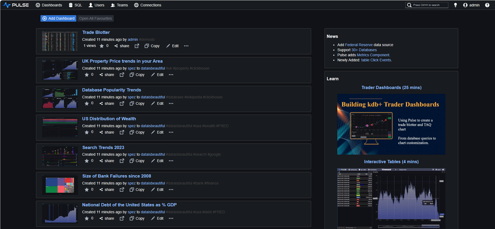  

To engage with our data, we need to establish a connection between Pulse and a KDB/Q process. This can be your Historical Database (HDB), Real-time Database (RDB), or any other KDB/Q process with access to the data you wish to showcase. 

For this demo we will follow the examples provided in one of the official Pulse [tutorials](https://www.timestored.com/pulse/tutorial/kdb-database-charts). We simply start a KDB/Q process and subsequently generate data dynamically using the code furnished in the tutorial.

First, we start a KDB/Q process on port 5000.

```
q -p 5000
KDB+ 4.0 2023.01.20 Copyright (C) 1993-2023 Kx Systems
m64/ 4(24)core 8192MB Alexander alexanders-macbook-pro.local 127.0.0.1 EXPIRE 2025.02.21 XXXX@gmail.com KDB PLUS TRIAL #5018719

q)\p
5000i
```

Next, we establish a connection to our KDB/Q process through Pulse. All we have to do is clicking the **Connect Data** button and providing the host and port details we want to connect to. 

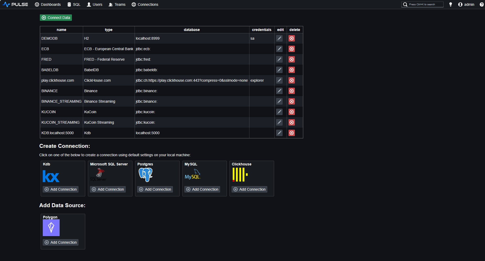

We are now ready to explorer our data.

### Pulse SQL Editor

Pulse isn't just simply a data visualisation tool, but it goes beyond; it also incorporates a built-in web version of [qStudio](https://www.timestored.com/qstudio/) an intelligent code editor designed for KDB/Q, providing features such as KDB/Q Syntax Highlighting, Q Code Completion, Database Management tools to modify your database structure as well as utility tools such as qDoc for generating HTML documentation or QUnit, a unit testing framework for KDB/Q.

You can access the KDB/Q Editor available in the SQL Editor tab to compose and execute KDB/Q code as you would in your preferred IDE, benefiting from the additional features provided by Pulse.

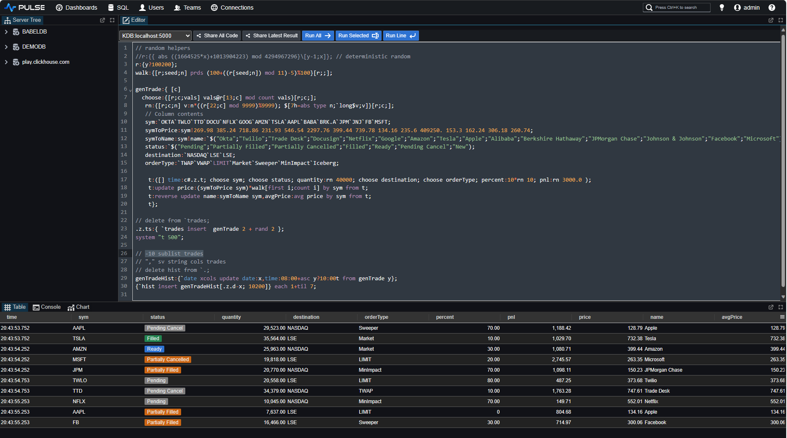

### Pulse Dashboards

Let's now create our first Dashboard. Navigate to the HomeScreen and select **Add Dashboard**. This action will redirect you to a new, empty dashboard. From here, you can add various components and customize them by transitioning to Design Mode. Save the dashboard, assign a new name, or share it with your colleagues.

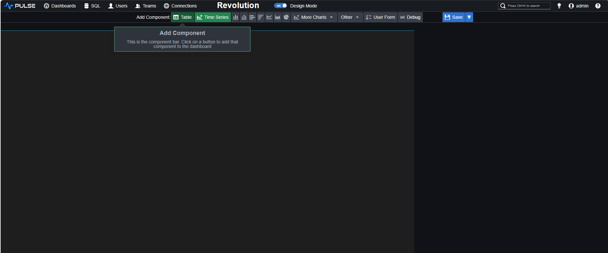

We will first examine the most recent 10 rows of our `trades` table. This can be accomplished by executing the following concise KDB/Q code.

```
-10 sublist trades
```

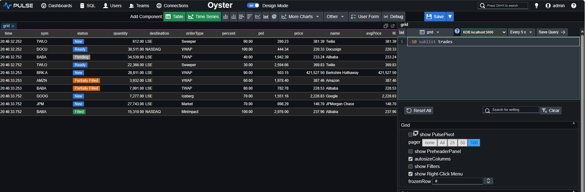

Notice that due to the 5-second refresh interval, Pulse will autonomously re-execute the query every 5 seconds. You now have a dynamically updating, real-time trades table showcasing the latest 10 trades. 

You can observe the updates here:

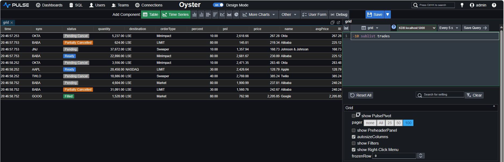

:::tip
If you're concerned that frequent dashboard refreshes might impact performance, we will address this in a later section of the article.
:::

Now, let's take a closer look at our trade table. We'll choose the columns we are interested in and obtain a well-formatted table.

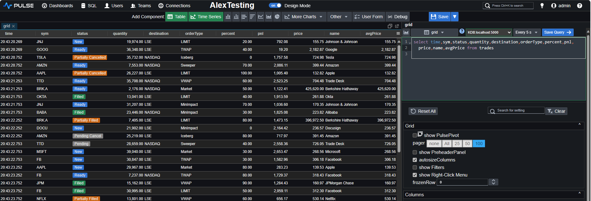

As easy as it was to render our data, customizing the formatting of individual columns to our preferences is just as simple. A quick right-click on any of the columns reveals the formatting settings.

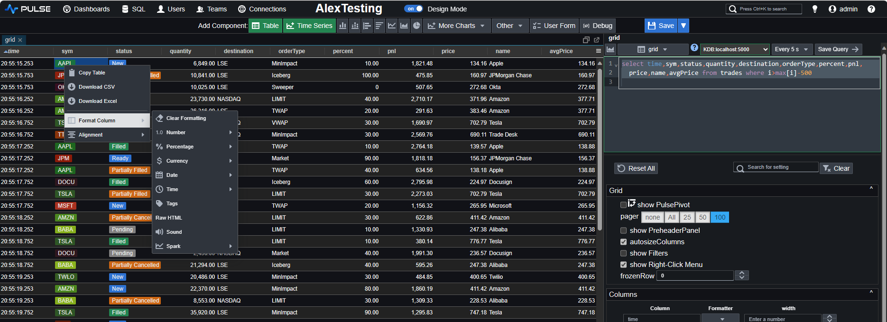

Let's customise some columns. First, we add a tag to our `sym` column, then we remove decimal points from the `quantity` column, and finally, convert the `price` column to GBP £. We also rename the dashboard to `DefconQ Dashboard` and rename the table to `trades`.

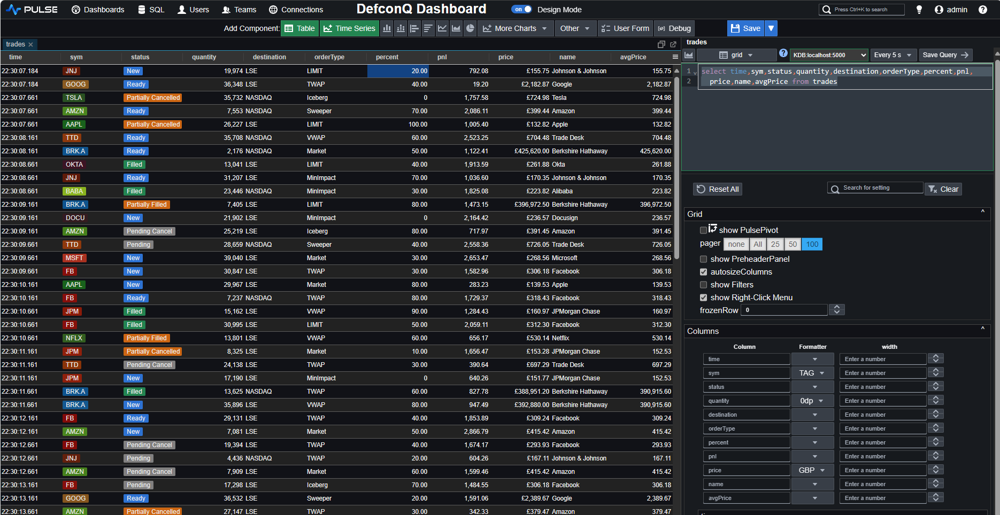

One of my personal favorites, however, involves the special formatting you can apply to columns using the dedicated column-name syntax. Let's explore this feature. Using the `_sd_databar` annotation in combination with the column name will transform the column to showcase its content as a databar. This functionality seamlessly integrates with our percent column.

```
select time,sym,status,quantity,destination,orderType,percent_sd_databar:percent%100,
	price,name from trades where i>max[i]-500
```

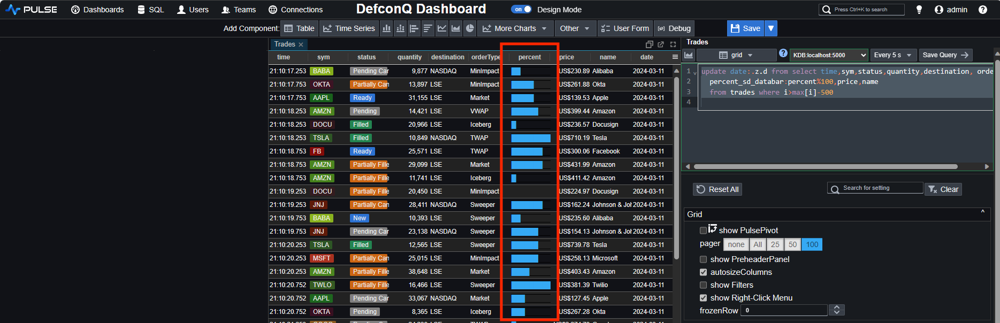

Next we would like to add a user input form and make our query reactive, depending on the input we provide. We first start by adding a date picker 

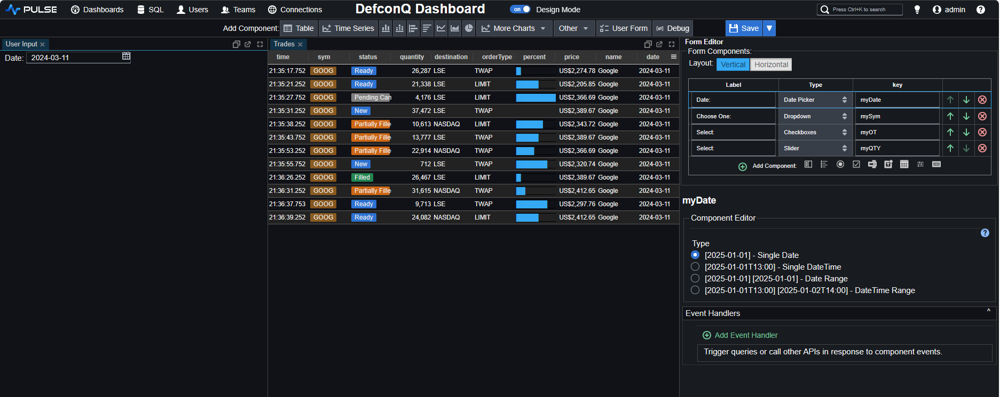

We also add a dropdown box for our `sym` column, a multi-check box for the `orderType` column and a slider for the `quantity` and assign each user input component to a dedicated variable name. The final configuration will then look like the following 

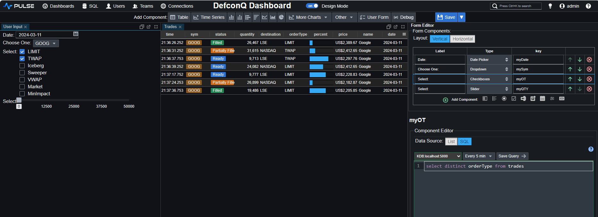 

Now, all that remains is to update our code, and we will have a completely interactive trades table.

```
select from (update date:.z.d from 
	select time,sym,status,quantity,destination,orderType,percent_sd_databar:percent%100,
	         price,name from trades where i>max[i]-500)
		where date=((myDate)), sym=`$((mySym)), orderType in `$((myOT)), quantity>((myQTY))
```

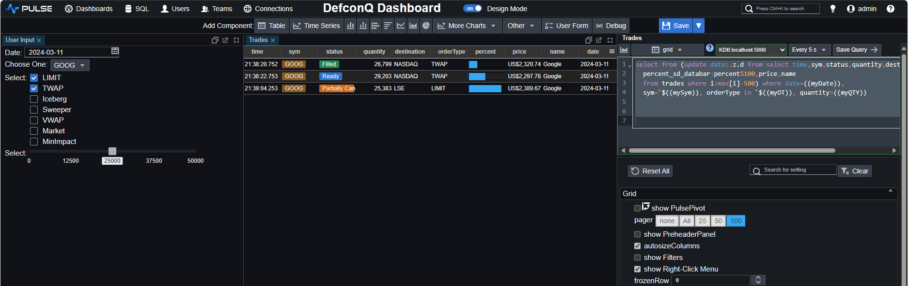

Once satisfied with our dashboard, we can save it and exit the design mode to inspect the final result.

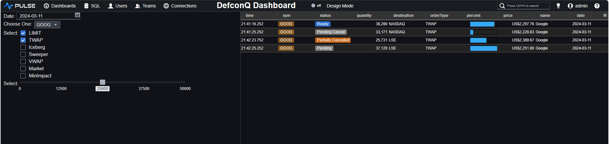

When dealing with large datasets, there are times when you don't want to refresh your dashboard until you've finished modifying all the user input fields. Pulse provides a simple solution for this – you just need to add a submit button. This button allows you to send the query only after you've clicked it, preventing automatic refreshing during ongoing modifications. You can add a submit button from the form editor of the components:

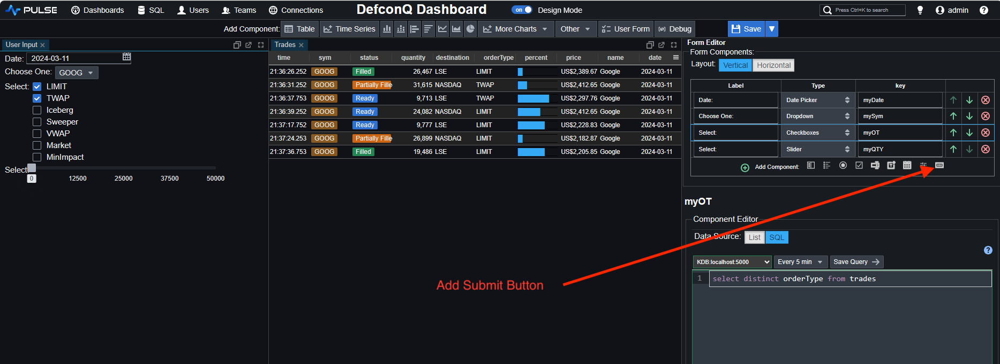

This will add a button to your input form. You then simply have to add the below code snippet to trigger your query

```
((submit_5))
```

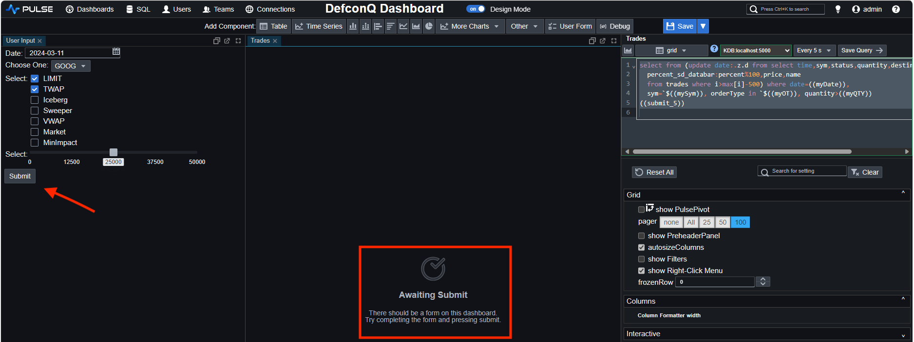

As you can see, a submit button has been added and the table isn't displayed before you send the query. The information **"Awaiting Submit"** is displayed to inform the user about this.

:::note
The `submit_5` name of the button is automatically assigned by default. You can rename your components as you wish.
:::

After exiting the design mode, we can review the final appearance of our dashboard.

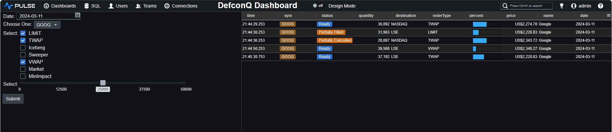

We have seen that we can create a dashboard displaying trade data in a table with little to no effort in a very short time. But what about graphs? Charting should definitely be more complicated? Or should it not? Let's have a look. 

We create a new dashboard by repeating the same steps as before, using the **Add Dashboard** button on the Homescreen to start the task. This time, however, instead of adding a table component to the dashboard we add a **Timeseries** component. As before, Pulse initially creates some template graph with random data. We can then modify the graph to display the data we are interested in.

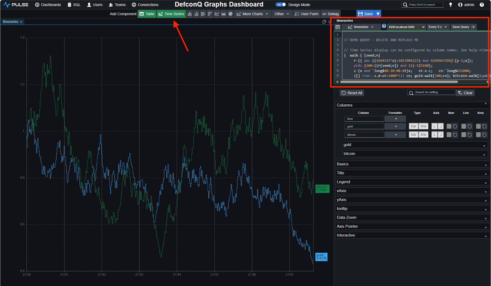

We want to analyze the performance of three technology stocks by charting their prices over time. We generate three separate graphs for each stock and an additional graph to compare the prices of two of the stocks. This scenario is a typical use case you might encounter in your role.

To accomplish this, we simply need to create and arrange four distinct time series components and update the corresponding query accordingly. The query below demonstrates how it's done for the Microsoft stock.

```
`time xasc select time,price from trades where sym=`MSFT
```

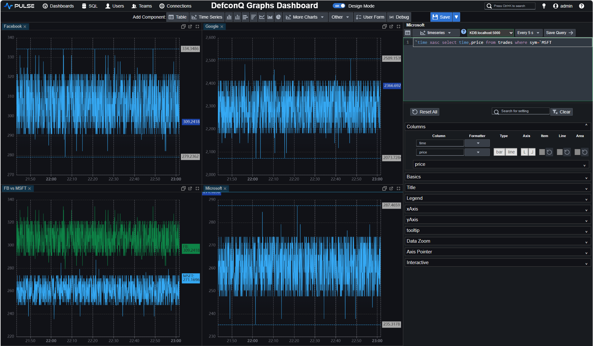

Comparing the graphs of two stocks is as straightforward as joining the data for both stocks and sorting it by time. However, it's necessary to rename the price column with the name of the respective stock. As they say, a picture is worth a thousand words, so let me show you.

```
`time xasc (uj/){(`time,x) xcol 1!`time xasc select time,price from trades where sym=x} each `MSFT`FB
```

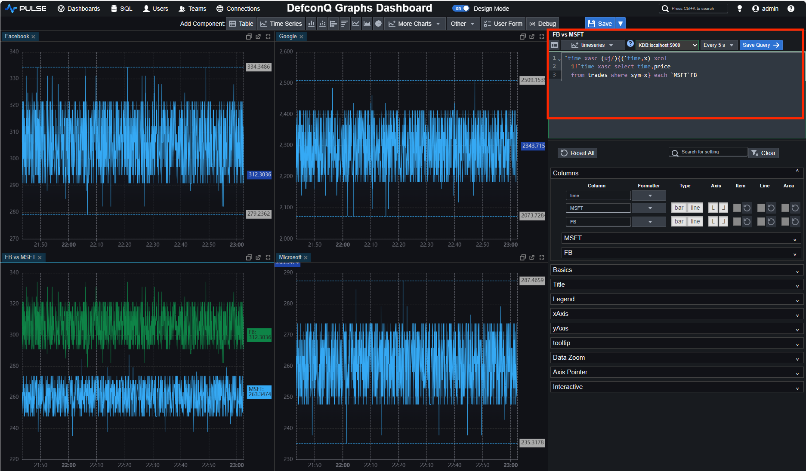

We save our changes and exit the design mode to obtain the final result.

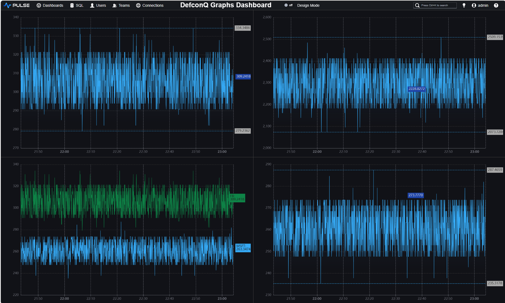

I vividly recall the first time I sat in front of a Bloomberg Terminal, captivated by the market data for various world indices on stock markets. The dynamic price updates and the flashing green and red colors indicating up and down changes held my fascination. Wouldn't it be amazing if we could create something similar ourselves? Let's give it a try.

 For the purpose of this, we'll modify our previous dashboard by removing all but one graphs and adding a table component. We then adjust the corresponding query to select the time, price, and price difference between updates for each symbol. Leveraging the special formatting syntax, we can alter the formatting of the price column to feature a green background when the stock goes up and a red background when it goes down. Achieving this is a straightforward process, requiring just a few simple steps.

```
select price_SD_BG:?[d>0;`green;?[d<0;`red;`]] from select last price,d:last[price]-last prev price, 
	last time by sym from trades
```

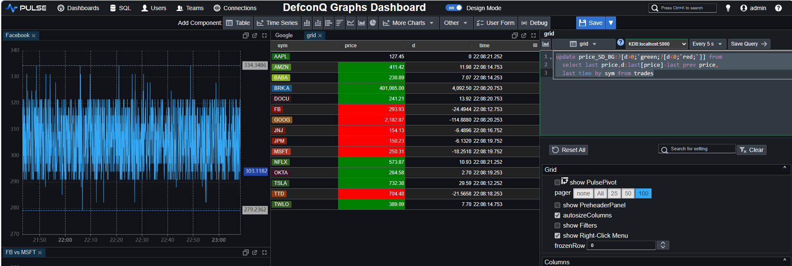

:::note
Note the special formatting using the **_SD_BG** annotation
:::

And with that, we conclude our brief demonstration of Pulse.

## Pulse Performance Considerations

Earlier, we briefly discussed Pulse's performance and its ability to handle large data sets responsively. This matter is extensively covered and explained in their documentation, but I will provide a summary for you.

Efforts to optimize query performance in Pulse involve:

1. Utilizing a websocket for communication, eliminating the need to open an HTTP handle every time, as seen in some other frameworks.
2. Implementing connection pooling for database queries, which allows sharing connections among users/dashboards, thereby avoiding the cost of opening a new connection each time.
3. Introducing a mechanism where, if the database query result remains unchanged, a "nochange" message is sent to the client instead of the entire data load.
4. Employing query caching for situations where the same query is executed across multiple users. More information on query caching can be found at https://www.timestored.com/pulse/help/query-caching.
5. Distinguishing itself from many other visualization tools, Pulse supports the streaming of non-database sources, eliminating the need for the store-to-table step. Examples include streaming from kdb (https://www.timestored.com/pulse/help/connections-subscriptions) and streaming Binance websockets (https://www.timestored.com/pulse/help/connections-binance). To enhance problem-solving capabilities, Pulse allows the appending of incoming data on the client side, ensuring that only the new rows are transmitted.

## Conclusion

In conclusion, my experience with Pulse left a lasting impression, highlighting its remarkable ease of use for displaying and modifying data swiftly. The platform's user-friendly interface and intuitive design resulted in a smooth and enjoyable learning curve. Even for someone like myself, who may not be particularly fond of UI and front-end tasks, Pulse proved to be an efficient and enjoyable tool for creating interactive dashboards. The minimal time investment required to achieve meaningful results further adds to the appeal of Pulse as a productivity-enhancing solution.

