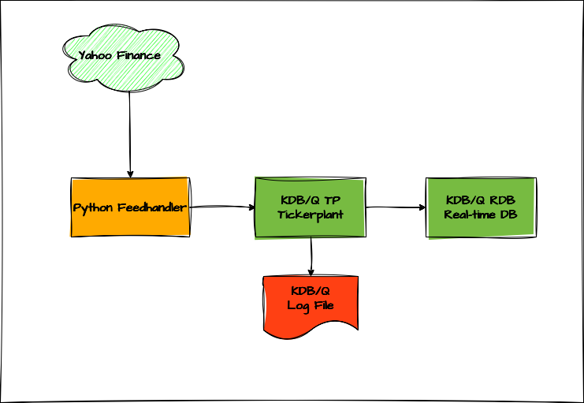

# A Real Time Stock Market Feed

In this tutorial, we'll walk through building a real-time stock market data feed and streaming that data into a simplified KDB/Q Tick architecture. We'll use Python, specifically the [`yfinance`](https://github.com/ranaroussi/yfinance) library, to fetch live market data from Yahoo Finance, and then publish it to a custom KDB/Q Tickerplant (TP), which will forward the data to a Real-Time Database (RDB). We'll use the [`qpython`](https://github.com/exxeleron/qPython/tree/master) library to connect our Feedhandler to the Tickerplant, enabling us to stream real-time data for further processing.

While this setup has been simplified for educational purposes, it can be easily adapted to resemble a more production-ready environment.

## Who is this tutorial for?

This tutorial is designed for anyone interested in building a real-time stock market data application. Whether you're a KDB/Q developer curious about the technical implementation, or a quantitative developer or researcher looking to set up a live data feed for analytics and strategy development, this guide is for you.

## Prerequisites

To get the most out of this tutorial, you should have a solid understanding of the KDB/Q Tick architecture. If you're unfamiliar with it, please check out [this dedicated blog post](https://www.defconq.tech/docs/architecture/plain). Additionally, a good understanding of how the Tickerplant works will be helpful, and I recommend reviewing my two in-depth tutorials that walk through the Plain Vanilla Tickerplant code line by line, which you can find [here](https://www.defconq.tech/docs/tutorials/tick).

## What’s in It for You: Skills You’ll Master in This Tutorial

In this tutorial, you’ll learn how to build a simple yet powerful real-time stock data streaming application. Along the way, you’ll get hands-on with the plain vanilla Tick architecture and deepen your understanding of key KDB/Q concepts like dictionaries, tables, attributes, and interprocess communication. You’ll also explore how to work with various Python libraries and establish seamless connectivity between Python and KDB/Q.

## Under the Hood: The Minimalist Tech Stack Powering It All

The tech stack behind this application is intentionally lightweight and focused, using just two core technologies.

On the Python side, we use:

- [`yfinance`](https://github.com/ranaroussi/yfinance) to fetch real-time stock market data from Yahoo Finance
- [`qpython`](https://github.com/exxeleron/qPython/tree/master) to connect Python to KDB/Q and stream data in real time

And of course, the backbone of the setup is KDB/Q. We’ll build a streamlined Tickerplant and a real-time database using the simple tick library provided by KX.

## The Setup



The architecture of this application is fairly simple and consists of three main components:
- A Python-based Feedhandler that retrieves real-time stock data from Yahoo Finance and streams it to a KDB/Q Tickerplant
- A custom KDB/Q Tickerplant that ingests the data and forwards it to the Real-Time Database (RDB)
- A Real-Time Database that stores all intraday data in memory

In the following section, we’ll take a closer look at each component of the setup, highlighting their key features and roles.

### Feedhandler

As expected, the Python script for the Feedhandler is by far the longest, bringing to life the common joke: ***“For every line of KDB/Q, you’ll need at least 10 in a mainstream language like Python or Java.”***. Having worked almost exclusively with KDB/Q over the past decade, my Python skills are admittedly non existent and my friend Claude had to save the day. While LLMs still struggle to make sense of KDB/Q, thankfully they’re fluent in Python. After a few back-and-forths, Claude managed to crank out a fully functioning Feedhandler.

The Feedhandler uses the [`yfinance`](https://github.com/ranaroussi/yfinance) library to pull real-time stock market data from Yahoo Finance. You can specify which tickers you'd like to track by listing them in a CSV file, which the script reads on startup.

Due to rate limits imposed by Yahoo Finance, the script fetches data at 30-second intervals by default. This interval is configurable via a command-line argument or an environment variable.

To stream data from Python to KDB/Q, we use the [`qpython`](https://github.com/exxeleron/qPython/tree/master) library. While [**PyKX**](https://code.kx.com/pykx/3.1/) would be a more modern alternative, it’s currently only available under a [**KX Insights**](https://code.kx.com/insights/1.13/enterprise/index.html) license, so for broader accessibility, we’ve opted for `qpython`. Since the library is a bit dated, there’s a minor workaround needed when working with `numpy`, but otherwise, the script is fairly straightforward and easy to follow.

### `tickers.csv`: Your Command Center for Stock Selection

To keep our application flexible and easy to configure, we use a simple CSV file, `tickers.csv`, to define the list of stocks we want to track. Just add the relevant stock tickers to this file, and the Feedhandler will take it from there. This approach lets you quickly adjust your data feed without touching the code. 

### Table Schema and `sym.q` File

Before we dive into the Tickerplant code, let’s take a moment to review the table schema for the data we’re capturing. As you might recall (especially if you’ve read my [Tickerplant walkthrough](https://www.defconq.tech/docs/tutorials/tick)), table schemas are stored in the `sym.q` file, which the Tickerplant loads during initialization.

For this exercise, we’ve defined the schema as follows:

- `time`			: timestamp recorded by the Tickerplant
- `sym`				: ticker symbol of the stock
- `feedHandlerTime`		: timestamp from the Feedhandler
- `open, high, low, close`	: OHLC price data
- `volume`			: trading volume
- `bid, ask`			: bid and ask prices
- `bidSize, askSize`		: sizes at the bid and ask

**A quick note**: we're capturing both the Tickerplant and Feedhandler timestamps. While this might not be critical in our educational example, it’s a best practice in real-time systems—especially when you want to measure latency between data ingestion points. To reinforce good KDB/Q practices, we apply the **sorted** `s` attribute to the `time` column and the `grouped` attribute to the `sym` column. If you're not familiar with attributes, or could use a refresher on how they work and why they matter, check out my dedicated post [here](https://www.defconq.tech/docs/concepts/attributes)

```
stocks:([] time:`s#`timestamp$(); `g#sym:`symbol$(); feedHandlerTime:`timestamp$(); open: `float$(); high:`float$(); low:`float$(); close:`float$(); volume:`int$(); bid:`float$(); ask:`float$(); bidSize:`int$(); askSize:`int$() )
```

### Tickerplant (TP)

The Tickerplant used in this setup is an even more lightweight version than the one featured in our [Plain Vanilla Tick Setup walkthrough](https://www.defconq.tech/docs/tutorials/tick). Since we're only fetching data every 30 seconds, there's no need to process each tick individually, instead, we'll run the Tickerplant in batch mode, publishing data on a pre-defined interval.

We've also made a few tweaks to the `.u.upd` function to accommodate the structure of the incoming data. To understand how it works, we'll set a breakpoint in `.u.upd`, inspect the incoming messages, and step through the logic together.

The section we're focusing on is shown below. We’ll start the Tickerplant ***without*** specifying a batch interval, which means the execution path will hit the `.u.upd` function defined here. At this point, we can set a breakpoint using `'break` to pause execution and inspect the incoming data when the function is triggered.

```
if[not system"t";system"t 1000";
 .z.ts:{ts .z.D};
 upd:{[t;x]
 ts"d"$a:.z.P;
 'break;
 if[not -16=type first first x;a:"n"$a;x:$[0>type first x;a,x;(enlist(count first x)#a),x]];

 f:key flip value t;pub[`$t;$[0>type first x;enlist f!x;update `$sym,"P"$feedHandlerTimer from flip f!flip x:a,'x]];if[l;l enlist (`upd;t;x);i+:1];}];
```

:::tip
To trigger a breakpoint, you can use the [signal](https://code.kx.com/q/ref/signal/) operator `'` with any custom error message and are not limited to using `break` as I did.
:::

After saving our changes, we launch the Tickerplant with the command:

```
qq tick.q sym . -p 5010
```

Once the Tickerplant is up and running, be sure to set the [`\e`](https://code.kx.com/q/basics/cmdline/#-e-error-traps) flag to `1` (true). This enables error trapping mode, allowing us to inspect the internal state and debug more effectively.

```
alexanderunterrainer@Mac:~/repos/yfinData|⇒  qq tick.q sym . -p 5010
KDB+ 4.1 2025.02.18 Copyright (C) 1993-2025 Kx Systems
m64/ 8(24)core 24576MB alexanderunterrainer mac 192.168.1.177 EXPIRE 2026.03.11 KDB PLUS PERSONAL #5024911

q).u.upd
{[t;x]
 ts"d"$a:.z.P;
 'break;
 if[not -16=type first first x;a:"n"$a;x:$[0>type first x;a,x;(enlist(count first x)#a),x]];

 f:key flip value t;pub[`$t;$[0>type first x;enlist f!x;update `$sym,"P"$feedHandlerTimer from flip f!flip x:a,'x]];if[l;l enlist (`upd;t;x);i+:1];}
q)\e 1
q)\e
1i
q)
```

Now let’s fire up the Python Feedhandler and watch the magic happen as our code ***"breaks"*** precisely where we intended.

```
q)'break
  [0]  /Users/alexanderunterrainer/repos/yfinData/tick.q:45: .u.upd:
 ts"d"$a:.z.P;
 'break;
  ^
 if[not -16=type first first x;a:"n"$a;x:$[0>type first x;a,x;(enlist(count first x)#a),x]];
q.u))
```

Based on our function definition, we know that `.u.upd` accepts two arguments: `t`, the table name, and `x`, the data to be streamed to all real-time subscribers. Let’s take a closer look at the data being received.

```
q)'break
  [0]  /Users/alexanderunterrainer/repos/yfinData/tick.q:45: .u.upd:
 ts"d"$a:.z.P;
 'break;
  ^
 if[not -16=type first first x;a:"n"$a;x:$[0>type first x;a,x;(enlist(count first x)#a),x]];
q.u))t
"stocks"
q.u))x
"AMZN"  "2025.05.18D10:22:20.279" 206.85 206.85 204.37 205.59 43072700  205.49 205.77 3  3
"GOOGL" "2025.05.18D10:22:20.279" 167.73 169.35 165.62 166.19 42650100  166.14 166.26 7  7
"HD"    "2025.05.18D10:22:20.279" 380.23 381.17 378.15 380.78 3127300   377.36 379.6  8  8
"JNJ"   "2025.05.18D10:22:20.279" 149.67 151.5  149.22 151.33 8046000   151.1  151.1  8  9
"JPM"   "2025.05.18D10:22:20.279" 267.5  268.46 264.71 267.56 8925900   264.5  266.01 12 8
"MA"    "2025.05.18D10:22:20.279" 580.43 584.29 580.43 583.28 2225400   578.78 584.29 11 8
"META"  "2025.05.18D10:22:20.279" 637.96 640.44 626.15 640.34 18405900  639.55 640.95 1  1
"MSFT"  "2025.05.18D10:22:20.279" 452.05 454.36 448.73 454.27 23803400  443.32 454.45 1  2
"NVDA"  "2025.05.18D10:22:20.279" 136.22 136.35 133.46 135.4  222651500 126.78 137f   1  2
"PG"    "2025.05.18D10:22:20.279" 162.65 163.43 161.85 163.28 7100200   163.17 163.49 9  8
"TSLA"  "2025.05.18D10:22:20.279" 346.24 351.62 342.33 349.98 93811800  328.7  363.64 1  1
"UNH"   "2025.05.18D10:22:20.279" 279.29 294.49 269.14 291.91 70637700  287.57 287.7  8  14
"V"     "2025.05.18D10:22:20.279" 362.95 366.19 360.89 365.12 5836500   363.55 365.25 8  9
"WMT"   "2025.05.18D10:22:20.279" 96.14  99.19  96f    98.24  33708300  96.51  97.78  13 22
q.u))type x
0h
q.u))type first x
0h
q.u))first x
"AMZN"
"2025.05.18D10:22:20.279"
206.85
206.85
204.37
205.59
43072700
205.49
205.77
3
3
q.u))
``` 

As shown above, the data sent by the Feedhandler is a mixed list of mixed lists. We can verify this by applying the [`type`](https://code.kx.com/q/ref/type/) operator to the entire dataset as well as to its first element, both return `0h`, indicating a mixed list.

Since our table schema includes a Tickerplant timestamp, the first step is to prepend this timestamp to each row of incoming data. Here's how we can do that:

From the first line of our `.u.upd` function, we know that the current timestamp, retrieved using `.z.P`, s stored in the variable `a`. We can now use this variable to append the timestamp to each record in the mixed list. To do this, we use the [**each-both**](https://www.defconq.tech/docs/concepts/iterators#binary-opplication-of-each) `'` iterator along with the concatenate operator `,`. Thanks to atomic extension, and the fact that we’re adding the **same** timestamp to every record, we can simply use a single timestamp atom, rather than generating a list of timestamps matching the length of our dataset.

```
q.u))a
2025.05.18D10:22:23.548140000
q.u))a,'x
2025.05.18D10:22:23.548140000 "AMZN"  "2025.05.18D10:22:20.279" 206.85 206.85 204.37 205.59 43072700  205.49 205.77 3  3
2025.05.18D10:22:23.548140000 "GOOGL" "2025.05.18D10:22:20.279" 167.73 169.35 165.62 166.19 42650100  166.14 166.26 7  7
2025.05.18D10:22:23.548140000 "HD"    "2025.05.18D10:22:20.279" 380.23 381.17 378.15 380.78 3127300   377.36 379.6  8  8
2025.05.18D10:22:23.548140000 "JNJ"   "2025.05.18D10:22:20.279" 149.67 151.5  149.22 151.33 8046000   151.1  151.1  8  9
2025.05.18D10:22:23.548140000 "JPM"   "2025.05.18D10:22:20.279" 267.5  268.46 264.71 267.56 8925900   264.5  266.01 12 8
2025.05.18D10:22:23.548140000 "MA"    "2025.05.18D10:22:20.279" 580.43 584.29 580.43 583.28 2225400   578.78 584.29 11 8
2025.05.18D10:22:23.548140000 "META"  "2025.05.18D10:22:20.279" 637.96 640.44 626.15 640.34 18405900  639.55 640.95 1  1
2025.05.18D10:22:23.548140000 "MSFT"  "2025.05.18D10:22:20.279" 452.05 454.36 448.73 454.27 23803400  443.32 454.45 1  2
2025.05.18D10:22:23.548140000 "NVDA"  "2025.05.18D10:22:20.279" 136.22 136.35 133.46 135.4  222651500 126.78 137f   1  2
2025.05.18D10:22:23.548140000 "PG"    "2025.05.18D10:22:20.279" 162.65 163.43 161.85 163.28 7100200   163.17 163.49 9  8
2025.05.18D10:22:23.548140000 "TSLA"  "2025.05.18D10:22:20.279" 346.24 351.62 342.33 349.98 93811800  328.7  363.64 1  1
2025.05.18D10:22:23.548140000 "UNH"   "2025.05.18D10:22:20.279" 279.29 294.49 269.14 291.91 70637700  287.57 287.7  8  14
2025.05.18D10:22:23.548140000 "V"     "2025.05.18D10:22:20.279" 362.95 366.19 360.89 365.12 5836500   363.55 365.25 8  9
2025.05.18D10:22:23.548140000 "WMT"   "2025.05.18D10:22:20.279" 96.14  99.19  96f    98.24  33708300  96.51  97.78  13 22
```

With all the necessary data in place, the final step is to transform it into a proper KDB/Q table:

We start by transposing the dataset using the [`flip`](https://code.kx.com/q/ref/flip/) operator. This restructures the mixed list so that each inner list now represents a column: the first list contains the Tickerplant timestamps, the second is a list of ticker symbols (as character strings), the third holds the Feedhandler timestamps, followed by lists of price data, volume, bid/ask prices, and sizes.

Next, we use this transposed structure to build a column dictionary, aligning each list with the corresponding column name from our stock table schema defined in `sym.q`, which the Tickerplant loads during initialization. From there, it’s simple: a KDB/Q table is just a flipped column dictionary. So all that remains is one final `flip` to produce the fully structured stock data table.

:::tip
If you need a refresher on KDB/Q dictionaries or tables, and how to create, update, or manipulate them, check out my post [here](https://www.defconq.tech/docs/concepts/dictionariesTables)
:::

```
q.u))flip a,'x
2025.05.18D10:22:23.548140000 2025.05.18D10:22:23.548140000 2025.05.18D10:22:23.548140000 2025.05.18D10:22:23.548140000 2025.05.18D10:22:23.548140000 2025.05.18D10:22:23.548140000 2025.05.18D10:22:23.548140000 2025.05.18D10:22:23.548140000..
"AMZN"                        "GOOGL"                       "HD"                          "JNJ"                         "JPM"                         "MA"                          "META"                        "MSFT"                       ..
"2025.05.18D10:22:20.279"     "2025.05.18D10:22:20.279"     "2025.05.18D10:22:20.279"     "2025.05.18D10:22:20.279"     "2025.05.18D10:22:20.279"     "2025.05.18D10:22:20.279"     "2025.05.18D10:22:20.279"     "2025.05.18D10:22:20.279"    ..
206.85                        167.73                        380.23                        149.67                        267.5                         580.43                        637.96                        452.05                       ..
206.85                        169.35                        381.17                        151.5                         268.46                        584.29                        640.44                        454.36                       ..
204.37                        165.62                        378.15                        149.22                        264.71                        580.43                        626.15                        448.73                       ..
205.59                        166.19                        380.78                        151.33                        267.56                        583.28                        640.34                        454.27                       ..
43072700                      42650100                      3127300                       8046000                       8925900                       2225400                       18405900                      23803400                     ..
205.49                        166.14                        377.36                        151.1                         264.5                         578.78                        639.55                        443.32                       ..
205.77                        166.26                        379.6                         151.1                         266.01                        584.29                        640.95                        454.45                       ..
3                             7                             8                             8                             12                            11                            1                             1                            ..
3                             7                             8                             9                             8                             8                             1                             2                            ..
q.u))`time`sym`feedHandlerTime`open`high`low`close`volume`bid`ask`bidSize`askSize!flip a,'x
time           | 2025.05.18D10:22:23.548140000 2025.05.18D10:22:23.548140000 2025.05.18D10:22:23.548140000 2025.05.18D10:22:23.548140000 2025.05.18D10:22:23.548140000 2025.05.18D10:22:23.548140000 2025.05.18D10:22:23.548140000 2025.05.18D1..
sym            | "AMZN"                        "GOOGL"                       "HD"                          "JNJ"                         "JPM"                         "MA"                          "META"                        "MSFT"      ..
feedHandlerTime| "2025.05.18D10:22:20.279"     "2025.05.18D10:22:20.279"     "2025.05.18D10:22:20.279"     "2025.05.18D10:22:20.279"     "2025.05.18D10:22:20.279"     "2025.05.18D10:22:20.279"     "2025.05.18D10:22:20.279"     "2025.05.18D..
open           | 206.85                        167.73                        380.23                        149.67                        267.5                         580.43                        637.96                        452.05      ..
high           | 206.85                        169.35                        381.17                        151.5                         268.46                        584.29                        640.44                        454.36      ..
low            | 204.37                        165.62                        378.15                        149.22                        264.71                        580.43                        626.15                        448.73      ..
close          | 205.59                        166.19                        380.78                        151.33                        267.56                        583.28                        640.34                        454.27      ..
volume         | 43072700                      42650100                      3127300                       8046000                       8925900                       2225400                       18405900                      23803400    ..
bid            | 205.49                        166.14                        377.36                        151.1                         264.5                         578.78                        639.55                        443.32      ..
ask            | 205.77                        166.26                        379.6                         151.1                         266.01                        584.29                        640.95                        454.45      ..
bidSize        | 3                             7                             8                             8                             12                            11                            1                             1           ..
askSize        | 3                             7                             8                             9                             8                             8                             1                             2           ..
q.u))flip `time`sym`feedHandlerTime`open`high`low`close`volume`bid`ask`bidSize`askSize!flip a,'x
time                          sym     feedHandlerTime           open   high   low    close  volume    bid    ask    bidSize askSize
-----------------------------------------------------------------------------------------------------------------------------------
2025.05.18D10:22:23.548140000 "AMZN"  "2025.05.18D10:22:20.279" 206.85 206.85 204.37 205.59 43072700  205.49 205.77 3       3
2025.05.18D10:22:23.548140000 "GOOGL" "2025.05.18D10:22:20.279" 167.73 169.35 165.62 166.19 42650100  166.14 166.26 7       7
2025.05.18D10:22:23.548140000 "HD"    "2025.05.18D10:22:20.279" 380.23 381.17 378.15 380.78 3127300   377.36 379.6  8       8
2025.05.18D10:22:23.548140000 "JNJ"   "2025.05.18D10:22:20.279" 149.67 151.5  149.22 151.33 8046000   151.1  151.1  8       9
2025.05.18D10:22:23.548140000 "JPM"   "2025.05.18D10:22:20.279" 267.5  268.46 264.71 267.56 8925900   264.5  266.01 12      8
2025.05.18D10:22:23.548140000 "MA"    "2025.05.18D10:22:20.279" 580.43 584.29 580.43 583.28 2225400   578.78 584.29 11      8
2025.05.18D10:22:23.548140000 "META"  "2025.05.18D10:22:20.279" 637.96 640.44 626.15 640.34 18405900  639.55 640.95 1       1
2025.05.18D10:22:23.548140000 "MSFT"  "2025.05.18D10:22:20.279" 452.05 454.36 448.73 454.27 23803400  443.32 454.45 1       2
2025.05.18D10:22:23.548140000 "NVDA"  "2025.05.18D10:22:20.279" 136.22 136.35 133.46 135.4  222651500 126.78 137    1       2
2025.05.18D10:22:23.548140000 "PG"    "2025.05.18D10:22:20.279" 162.65 163.43 161.85 163.28 7100200   163.17 163.49 9       8
2025.05.18D10:22:23.548140000 "TSLA"  "2025.05.18D10:22:20.279" 346.24 351.62 342.33 349.98 93811800  328.7  363.64 1       1
2025.05.18D10:22:23.548140000 "UNH"   "2025.05.18D10:22:20.279" 279.29 294.49 269.14 291.91 70637700  287.57 287.7  8       14
2025.05.18D10:22:23.548140000 "V"     "2025.05.18D10:22:20.279" 362.95 366.19 360.89 365.12 5836500   363.55 365.25 8       9
2025.05.18D10:22:23.548140000 "WMT"   "2025.05.18D10:22:20.279" 96.14  99.19  96     98.24  33708300  96.51  97.78  13      22
q.u))
```

If you were paying close attention, you may have noticed that the `sym` and `feedHandlerTime` columns are of type ***string*** i.e., lists of characters) instead of ***symbol*** and ***timestamp***, respectively. Fortunately, we can easily correct this with a simple update statement:

```
q.u))update `$sym,"P"$feedHandlerTime from flip `time`sym`feedHandlerTime`open`high`low`close`volume`bid`ask`bidSize`askSize!flip a,'x
time                          sym   feedHandlerTime               open   high   low    close  volume    bid    ask    bidSize askSize
-------------------------------------------------------------------------------------------------------------------------------------
2025.05.18D10:22:23.548140000 AMZN  2025.05.18D10:22:20.279000000 206.85 206.85 204.37 205.59 43072700  205.49 205.77 3       3
2025.05.18D10:22:23.548140000 GOOGL 2025.05.18D10:22:20.279000000 167.73 169.35 165.62 166.19 42650100  166.14 166.26 7       7
2025.05.18D10:22:23.548140000 HD    2025.05.18D10:22:20.279000000 380.23 381.17 378.15 380.78 3127300   377.36 379.6  8       8
2025.05.18D10:22:23.548140000 JNJ   2025.05.18D10:22:20.279000000 149.67 151.5  149.22 151.33 8046000   151.1  151.1  8       9
2025.05.18D10:22:23.548140000 JPM   2025.05.18D10:22:20.279000000 267.5  268.46 264.71 267.56 8925900   264.5  266.01 12      8
2025.05.18D10:22:23.548140000 MA    2025.05.18D10:22:20.279000000 580.43 584.29 580.43 583.28 2225400   578.78 584.29 11      8
2025.05.18D10:22:23.548140000 META  2025.05.18D10:22:20.279000000 637.96 640.44 626.15 640.34 18405900  639.55 640.95 1       1
2025.05.18D10:22:23.548140000 MSFT  2025.05.18D10:22:20.279000000 452.05 454.36 448.73 454.27 23803400  443.32 454.45 1       2
2025.05.18D10:22:23.548140000 NVDA  2025.05.18D10:22:20.279000000 136.22 136.35 133.46 135.4  222651500 126.78 137    1       2
2025.05.18D10:22:23.548140000 PG    2025.05.18D10:22:20.279000000 162.65 163.43 161.85 163.28 7100200   163.17 163.49 9       8
2025.05.18D10:22:23.548140000 TSLA  2025.05.18D10:22:20.279000000 346.24 351.62 342.33 349.98 93811800  328.7  363.64 1       1
2025.05.18D10:22:23.548140000 UNH   2025.05.18D10:22:20.279000000 279.29 294.49 269.14 291.91 70637700  287.57 287.7  8       14
2025.05.18D10:22:23.548140000 V     2025.05.18D10:22:20.279000000 362.95 366.19 360.89 365.12 5836500   363.55 365.25 8       9
2025.05.18D10:22:23.548140000 WMT   2025.05.18D10:22:20.279000000 96.14  99.19  96     98.24  33708300  96.51  97.78  13      22
```

To verify that the column types have been updated correctly, we can inspect the table schema using the [`meta`](https://code.kx.com/q/ref/meta/) operator.

```
q.u))meta update `$sym,"P"$feedHandlerTime from flip `time`sym`feedHandlerTime`open`high`low`close`volume`bid`ask`bidSize`askSize!flip a,'x
c              | t f a
---------------| -----
time           | p
sym            | s
feedHandlerTime| p
open           | f
high           | f
low            | f
close          | f
volume         | j
bid            | f
ask            | f
bidSize        | j
askSize        | j
```

It's important to note that type conversions like the one above should not be performed at the Tickerplant level. This approach is tailored to a very specific dataset and goes against the principle of keeping the Tickerplant generic and adaptable to various data sources.

Ideally, the Tickerplant should remain as lightweight as possible, free of any dataset-specific business logic. A more appropriate place to handle this kind of transformation would be within the Feedhandler itself.

That said, for illustrative and educational purposes, we'll keep the code as-is for now.

Now, returning to our Tickerplant code, we make a few final adjustments, cleaning up anything unnecessary, before it's ready to run. You can find the final version of the code in my GitHub repo [here](https://github.com/DefconQ/defconQ/tree/master/projects/realTimeStock).


### Real-Time Database (RDB)

For the Real-Time Database (RDB), only minimal adjustments are needed. The main change is modifying the end-of-day save-down process: instead of persisting data to disk, which isn’t necessary for our current setup, we simply purge the data from the `stocks` table and start fresh the next day. We'll cover building a Historical Database (HDB) in a later stage.

## Bringing it all to Life: Launching Your Real-Time KDB/Q Stack 

Now that all the pieces are in place, it’s time to bring your real-time application to life.

We’ll start by launching the Tickerplant with the following command:

```
qq tick.q sym . -p 5010
```

Once it’s up and running, you can verify that the `stocks` table was correctly initialized by inspecting its contents and checking the schema using `meta`

```
alexanderunterrainer@Mac:~/repos/yfinData|⇒  qq tick.q sym . -p 5010
KDB+ 4.1 2025.02.18 Copyright (C) 1993-2025 Kx Systems
m64/ 8(24)core 24576MB alexanderunterrainer mac 192.168.1.177 EXPIRE 2026.03.11 KDB PLUS PERSONAL #5024911

q)stocks
time sym feedHandlerTime open high low close volume bid ask bidSize askSize
---------------------------------------------------------------------------
q)meta stocks
c              | t f a
---------------| -----
time           | p   s
sym            | s   g
feedHandlerTime| p
open           | f
high           | f
low            | f
close          | f
volume         | i
bid            | f
ask            | f
bidSize        | i
askSize        | i
```

Next, start the Real-Time Database (RDB):

```
qq tick/r.q :5010 -p 5011
```

Again, confirm that everything is wired up properly by reviewing the data and table schema.

```
alexanderunterrainer@Mac:~/repos/yfinData|⇒  qq tick/r.q :5010 -p 5011
KDB+ 4.1 2025.02.18 Copyright (C) 1993-2025 Kx Systems
m64/ 8(24)core 24576MB alexanderunterrainer mac 192.168.1.177 EXPIRE 2026.03.11 KDB PLUS PERSONAL #5024911

q)stocks
time sym feedHandlerTime open high low close volume bid ask bidSize askSize
---------------------------------------------------------------------------
```

Finally, kick off the Feedhandler, which will fetch stock data from Yahoo Finance every 30 seconds and stream it to the Tickerplant:

```
alexanderunterrainer@Mac:~/repos/yfinData|⇒  python3 yahoo_finance_streamer.py --tickers tickers.csv
2025-05-19 20:41:22,555 - INFO - Loaded 14 ticker symbols from tickers.csv
2025-05-19 20:41:22,555 - INFO - Connecting to KDB+ at localhost:5010 (attempt 1/3)
2025-05-19 20:41:22,556 - INFO - Successfully connected to KDB+: 3
2025-05-19 20:41:22,556 - INFO - Starting data streaming for 14 symbols at 30s intervals
2025-05-19 20:41:22,556 - INFO - Fetching data for batch 1: 14 symbols
2025-05-19 20:41:26,063 - INFO - Streamed 14 records to KDB+ table 'stocks'
2025-05-19 20:41:26,063 - INFO - Completed iteration 1. Next run at 20:41:52
2025-05-19 20:41:52,642 - INFO - Fetching data for batch 1: 14 symbols
2025-05-19 20:41:55,327 - INFO - Streamed 14 records to KDB+ table 'stocks'
2025-05-19 20:41:55,327 - INFO - Completed iteration 2. Next run at 20:42:22
2025-05-19 20:42:22,664 - INFO - Fetching data for batch 1: 14 symbols
2025-05-19 20:42:25,360 - INFO - Streamed 14 records to KDB+ table 'stocks'
2025-05-19 20:42:25,360 - INFO - Completed iteration 3. Next run at 20:42:52
```

Let’s take a closer look at the incoming data.

```
q)stocks
time                          sym   feedHandlerTime               open    high     low     close    volume    bid    ask    bidSize askSize
-------------------------------------------------------------------------------------------------------------------------------------------
2025.05.19D20:41:26.062916000 AMZN  2025.05.19D20:41:22.556000000 201.645 206.62   201.26  205.47   23999471  195.53 205.94 1       1
2025.05.19D20:41:26.062916000 GOOGL 2025.05.19D20:41:22.556000000 164.51  166.07   164.22  165.78   24114304  165.75 172    1       2
2025.05.19D20:41:26.062916000 HD    2025.05.19D20:41:22.556000000 374.19  381.145  374.23  379.49   2873584   379.27 379.26 13      8
2025.05.19D20:41:26.062916000 JNJ   2025.05.19D20:41:22.556000000 151.89  152.41   151.05  152.41   4847505   152.13 152.15 10      11
2025.05.19D20:41:26.062916000 JPM   2025.05.19D20:41:22.556000000 265.55  268.31   261.93  264.965  9446982   265.11 265.17 8       9
2025.05.19D20:41:26.062916000 MA    2025.05.19D20:41:22.556000000 581.015 588.45   580.48  585.265  1134011   585.04 585.29 11      8
2025.05.19D20:41:26.062916000 META  2025.05.19D20:41:22.556000000 628.25  643      627.9   639.038  7486566   609.58 658.53 1       4
2025.05.19D20:41:26.062916000 MSFT  2025.05.19D20:41:22.556000000 450.875 459.585  450.875 457.49   13771984  455.03 457.76 4       2
2025.05.19D20:41:26.062916000 NVDA  2025.05.19D20:41:22.556000000 132.41  135.87   132.41  135.216  164733322 134.99 135.45 1       1
2025.05.19D20:41:26.062916000 PG    2025.05.19D20:41:22.556000000 163.47  165.15   163.41  164.54   5727733   164.37 164.43 9       8
2025.05.19D20:41:26.062916000 TSLA  2025.05.19D20:41:22.556000000 336.34  343      333.38  342.3106 77338471  339    348    2       1
2025.05.19D20:41:26.062916000 UNH   2025.05.19D20:41:22.556000000 304.775 316.21   297.245 314.7999 55893400  312.55 312.43 11      14
2025.05.19D20:41:26.062916000 V     2025.05.19D20:41:22.556000000 363.02  369.1499 362.321 367.73   3239193   367.38 367.43 8       10
2025.05.19D20:41:26.062916000 WMT   2025.05.19D20:41:22.556000000 96.65   98.26    95.8101 98.189   13795258  98.05  98.07  10      10
q)stocks
time                          sym   feedHandlerTime               open    high     low     close    volume    bid    ask    bidSize askSize
-------------------------------------------------------------------------------------------------------------------------------------------
2025.05.19D20:41:26.062916000 AMZN  2025.05.19D20:41:22.556000000 201.645 206.62   201.26  205.47   23999471  195.53 205.94 1       1
2025.05.19D20:41:26.062916000 GOOGL 2025.05.19D20:41:22.556000000 164.51  166.07   164.22  165.78   24114304  165.75 172    1       2
2025.05.19D20:41:26.062916000 HD    2025.05.19D20:41:22.556000000 374.19  381.145  374.23  379.49   2873584   379.27 379.26 13      8
2025.05.19D20:41:26.062916000 JNJ   2025.05.19D20:41:22.556000000 151.89  152.41   151.05  152.41   4847505   152.13 152.15 10      11
2025.05.19D20:41:26.062916000 JPM   2025.05.19D20:41:22.556000000 265.55  268.31   261.93  264.965  9446982   265.11 265.17 8       9
2025.05.19D20:41:26.062916000 MA    2025.05.19D20:41:22.556000000 581.015 588.45   580.48  585.265  1134011   585.04 585.29 11      8
2025.05.19D20:41:26.062916000 META  2025.05.19D20:41:22.556000000 628.25  643      627.9   639.038  7486566   609.58 658.53 1       4
2025.05.19D20:41:26.062916000 MSFT  2025.05.19D20:41:22.556000000 450.875 459.585  450.875 457.49   13771984  455.03 457.76 4       2
2025.05.19D20:41:26.062916000 NVDA  2025.05.19D20:41:22.556000000 132.41  135.87   132.41  135.216  164733322 134.99 135.45 1       1
2025.05.19D20:41:26.062916000 PG    2025.05.19D20:41:22.556000000 163.47  165.15   163.41  164.54   5727733   164.37 164.43 9       8
2025.05.19D20:41:26.062916000 TSLA  2025.05.19D20:41:22.556000000 336.34  343      333.38  342.3106 77338471  339    348    2       1
2025.05.19D20:41:26.062916000 UNH   2025.05.19D20:41:22.556000000 304.775 316.21   297.245 314.7999 55893400  312.55 312.43 11      14
2025.05.19D20:41:26.062916000 V     2025.05.19D20:41:22.556000000 363.02  369.1499 362.321 367.73   3239193   367.38 367.43 8       10
2025.05.19D20:41:26.062916000 WMT   2025.05.19D20:41:22.556000000 96.65   98.26    95.8101 98.189   13795258  98.05  98.07  10      10
2025.05.19D20:41:55.327104000 AMZN  2025.05.19D20:41:52.643000000 201.645 206.62   201.26  205.52   24022841  200    205.94 2       1
2025.05.19D20:41:55.327104000 GOOGL 2025.05.19D20:41:52.643000000 164.51  166.07   164.22  165.84   24144223  165.75 172    1       2
2025.05.19D20:41:55.327104000 HD    2025.05.19D20:41:52.643000000 374.19  381.145  374.23  379.475  2877334   379.27 379.31 13      8
2025.05.19D20:41:55.327104000 JNJ   2025.05.19D20:41:52.643000000 151.89  152.41   151.05  152.395  4854132   152.12 152.14 10      11
2025.05.19D20:41:55.327104000 JPM   2025.05.19D20:41:52.643000000 265.55  268.31   261.93  264.975  9457337   265.11 265.18 8       9
2025.05.19D20:41:55.327104000 MA    2025.05.19D20:41:52.643000000 581.015 588.45   580.48  585.35   1137405   585.04 585.44 11      8
2025.05.19D20:41:55.327104000 META  2025.05.19D20:41:52.643000000 628.25  643      627.9   639.35   7497210   609.58 658.53 1       4
2025.05.19D20:41:55.327104000 MSFT  2025.05.19D20:41:52.643000000 450.875 459.585  450.875 457.5375 13786633  455.03 457.76 4       2
2025.05.19D20:41:55.327104000 NVDA  2025.05.19D20:41:52.643000000 132.41  135.87   132.41  135.265  164894932 135.05 135.51 1       1
2025.05.19D20:41:55.327104000 PG    2025.05.19D20:41:52.643000000 163.47  165.15   163.41  164.545  5732887   164.37 164.43 9       8
2025.05.19D20:41:55.327104000 TSLA  2025.05.19D20:41:52.643000000 336.34  343      333.38  342.4911 77449325  339    342.53 2       1
2025.05.19D20:41:55.327104000 UNH   2025.05.19D20:41:52.643000000 304.775 316.21   297.245 314.575  55935141  312.8  312.92 11      14
2025.05.19D20:41:55.327104000 V     2025.05.19D20:41:52.643000000 363.02  369.1499 362.321 367.72   3245083   367.38 367.54 8       10
2025.05.19D20:41:55.327104000 WMT   2025.05.19D20:41:52.643000000 96.65   98.26    95.8101 98.1883  13833048  98.07  98.07  10      10
q)count stocks
28
q)stocks
time                          sym   feedHandlerTime               open    high     low     close    volume    bid    ask    bidSize askSize
-------------------------------------------------------------------------------------------------------------------------------------------
2025.05.19D20:41:26.062916000 AMZN  2025.05.19D20:41:22.556000000 201.645 206.62   201.26  205.47   23999471  195.53 205.94 1       1
2025.05.19D20:41:26.062916000 GOOGL 2025.05.19D20:41:22.556000000 164.51  166.07   164.22  165.78   24114304  165.75 172    1       2
2025.05.19D20:41:26.062916000 HD    2025.05.19D20:41:22.556000000 374.19  381.145  374.23  379.49   2873584   379.27 379.26 13      8
2025.05.19D20:41:26.062916000 JNJ   2025.05.19D20:41:22.556000000 151.89  152.41   151.05  152.41   4847505   152.13 152.15 10      11
2025.05.19D20:41:26.062916000 JPM   2025.05.19D20:41:22.556000000 265.55  268.31   261.93  264.965  9446982   265.11 265.17 8       9
2025.05.19D20:41:26.062916000 MA    2025.05.19D20:41:22.556000000 581.015 588.45   580.48  585.265  1134011   585.04 585.29 11      8
2025.05.19D20:41:26.062916000 META  2025.05.19D20:41:22.556000000 628.25  643      627.9   639.038  7486566   609.58 658.53 1       4
2025.05.19D20:41:26.062916000 MSFT  2025.05.19D20:41:22.556000000 450.875 459.585  450.875 457.49   13771984  455.03 457.76 4       2
2025.05.19D20:41:26.062916000 NVDA  2025.05.19D20:41:22.556000000 132.41  135.87   132.41  135.216  164733322 134.99 135.45 1       1
2025.05.19D20:41:26.062916000 PG    2025.05.19D20:41:22.556000000 163.47  165.15   163.41  164.54   5727733   164.37 164.43 9       8
2025.05.19D20:41:26.062916000 TSLA  2025.05.19D20:41:22.556000000 336.34  343      333.38  342.3106 77338471  339    348    2       1
2025.05.19D20:41:26.062916000 UNH   2025.05.19D20:41:22.556000000 304.775 316.21   297.245 314.7999 55893400  312.55 312.43 11      14
2025.05.19D20:41:26.062916000 V     2025.05.19D20:41:22.556000000 363.02  369.1499 362.321 367.73   3239193   367.38 367.43 8       10
2025.05.19D20:41:26.062916000 WMT   2025.05.19D20:41:22.556000000 96.65   98.26    95.8101 98.189   13795258  98.05  98.07  10      10
2025.05.19D20:41:55.327104000 AMZN  2025.05.19D20:41:52.643000000 201.645 206.62   201.26  205.52   24022841  200    205.94 2       1
2025.05.19D20:41:55.327104000 GOOGL 2025.05.19D20:41:52.643000000 164.51  166.07   164.22  165.84   24144223  165.75 172    1       2
2025.05.19D20:41:55.327104000 HD    2025.05.19D20:41:52.643000000 374.19  381.145  374.23  379.475  2877334   379.27 379.31 13      8
2025.05.19D20:41:55.327104000 JNJ   2025.05.19D20:41:52.643000000 151.89  152.41   151.05  152.395  4854132   152.12 152.14 10      11
2025.05.19D20:41:55.327104000 JPM   2025.05.19D20:41:52.643000000 265.55  268.31   261.93  264.975  9457337   265.11 265.18 8       9
2025.05.19D20:41:55.327104000 MA    2025.05.19D20:41:52.643000000 581.015 588.45   580.48  585.35   1137405   585.04 585.44 11      8
2025.05.19D20:41:55.327104000 META  2025.05.19D20:41:52.643000000 628.25  643      627.9   639.35   7497210   609.58 658.53 1       4
2025.05.19D20:41:55.327104000 MSFT  2025.05.19D20:41:52.643000000 450.875 459.585  450.875 457.5375 13786633  455.03 457.76 4       2
2025.05.19D20:41:55.327104000 NVDA  2025.05.19D20:41:52.643000000 132.41  135.87   132.41  135.265  164894932 135.05 135.51 1       1
2025.05.19D20:41:55.327104000 PG    2025.05.19D20:41:52.643000000 163.47  165.15   163.41  164.545  5732887   164.37 164.43 9       8
2025.05.19D20:41:55.327104000 TSLA  2025.05.19D20:41:52.643000000 336.34  343      333.38  342.4911 77449325  339    342.53 2       1
2025.05.19D20:41:55.327104000 UNH   2025.05.19D20:41:52.643000000 304.775 316.21   297.245 314.575  55935141  312.8  312.92 11      14
2025.05.19D20:41:55.327104000 V     2025.05.19D20:41:52.643000000 363.02  369.1499 362.321 367.72   3245083   367.38 367.54 8       10
2025.05.19D20:41:55.327104000 WMT   2025.05.19D20:41:52.643000000 96.65   98.26    95.8101 98.1883  13833048  98.07  98.07  10      10
2025.05.19D20:42:25.360198000 AMZN  2025.05.19D20:42:22.665000000 201.645 206.62   201.26  205.51   24037280  195.53 205.94 1       1
2025.05.19D20:42:25.360198000 GOOGL 2025.05.19D20:42:22.665000000 164.51  166.07   164.22  165.815  24171372  165.75 172    1       2
2025.05.19D20:42:25.360198000 HD    2025.05.19D20:42:22.665000000 374.19  381.145  374.23  379.43   2882141   379.12 379.31 13      8
2025.05.19D20:42:25.360198000 JNJ   2025.05.19D20:42:22.665000000 151.89  152.41   151.05  152.39   4856696   152.12 152.14 10      11
2025.05.19D20:42:25.360198000 JPM   2025.05.19D20:42:22.665000000 265.55  268.31   261.93  264.8824 9464132   265.09 265.11 8       9
2025.05.19D20:42:25.360198000 MA    2025.05.19D20:42:22.665000000 581.015 588.45   580.48  585.26   1138452   585.04 585.44 11      8
2025.05.19D20:42:25.360198000 META  2025.05.19D20:42:22.665000000 628.25  643      627.9   639.095  7503508   609.58 658.53 1       4
2025.05.19D20:42:25.360198000 MSFT  2025.05.19D20:42:22.665000000 450.875 459.585  450.875 457.46   13795208  455.03 457.76 4       2
2025.05.19D20:42:25.360198000 NVDA  2025.05.19D20:42:22.665000000 132.41  135.87   132.41  135.245  164987096 135.03 135.49 1       1
2025.05.19D20:42:25.360198000 PG    2025.05.19D20:42:22.665000000 163.47  165.15   163.41  164.565  5738934   164.38 164.41 9       8
2025.05.19D20:42:25.360198000 TSLA  2025.05.19D20:42:22.665000000 336.34  343      333.38  342.26   77520926  339    348    2       1
2025.05.19D20:42:25.360198000 UNH   2025.05.19D20:42:22.665000000 304.775 316.21   297.245 314.57   56023879  312.8  312.92 11      14
2025.05.19D20:42:25.360198000 V     2025.05.19D20:42:22.665000000 363.02  369.1499 362.321 367.71   3247511   367.38 367.54 8       10
2025.05.19D20:42:25.360198000 WMT   2025.05.19D20:42:22.665000000 96.65   98.26    95.8101 98.195   13851133  97.99  98.07  10      10
q)count stocks
42
q)meta stocks
c              | t f a
---------------| -----
time           | p   s
sym            | s   g
feedHandlerTime| p
open           | f
high           | f
low            | f
close          | f
volume         | i
bid            | f
ask            | f
bidSize        | i
askSize        | i
```

Let it run as long as you'd like, and when you're ready to shut it down, simply press `CTRL+C` to exit the Python script.

```
2025-05-19 20:42:25,360 - INFO - Completed iteration 3. Next run at 20:42:52
^C2025-05-19 20:42:48,192 - INFO - Received keyboard interrupt. Shutting down...
2025-05-19 20:42:48,192 - INFO - Closed KDB+ connection
```

I hope you found this tutorial useful and got a glimpse of the power and flexibility of KDB/Q, especially how straightforward it can be to build a real-time streaming application. In the next tutorial, we’ll learn how to build a historical stock price database for research purposes. Stay tuned!

## Resources

- yfinance library: [Githup repo](https://github.com/ranaroussi/yfinance)
- qpython library: [Github repo](https://github.com/exxeleron/qPython/tree/master)
- [qpython Documentation](https://qpython.readthedocs.io/en/latest/#)
- [The Plain Vanilla Tick Setup](https://www.defconq.tech/docs/architecture/plain)
- [KDB Tick Explained: A Walkthrough](https://www.defconq.tech/docs/tutorials/tick)
- [Attributes](https://www.defconq.tech/docs/concepts/attributes)
- [Dictionaries and Tables](https://www.defconq.tech/docs/concepts/dictionariesTables)
- [Fundamentals of Interprocess Communication (IPC)](https://www.defconq.tech/docs/concepts/ipc)
