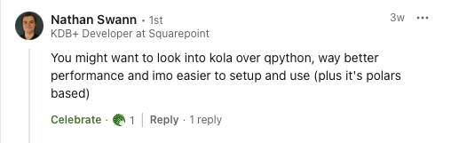
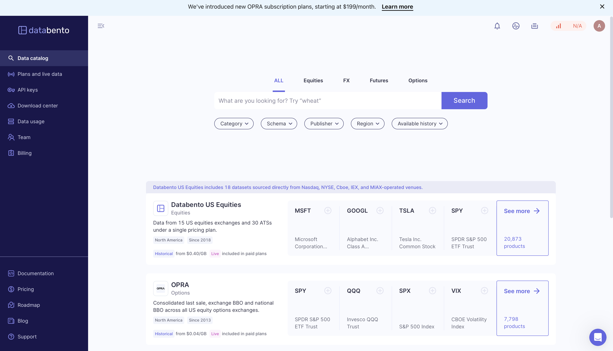
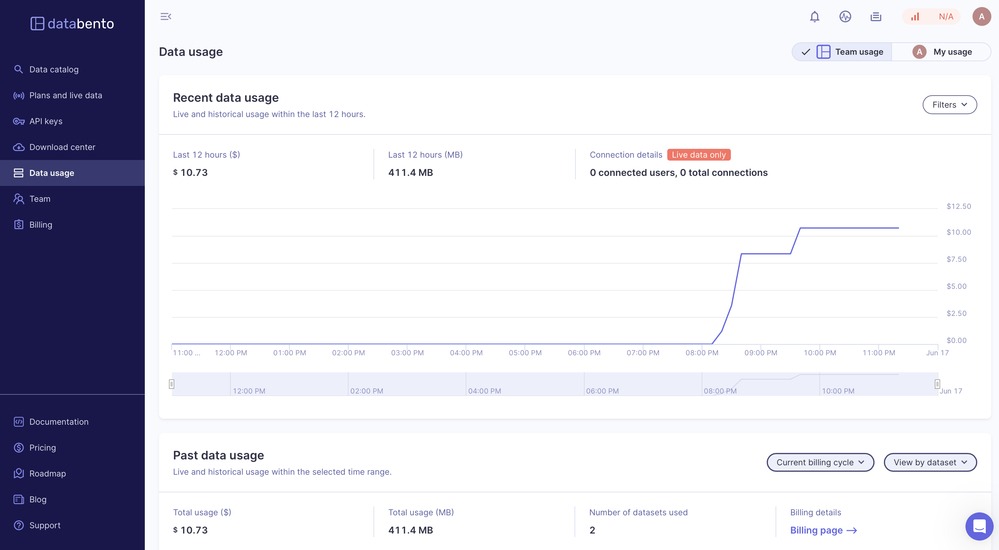
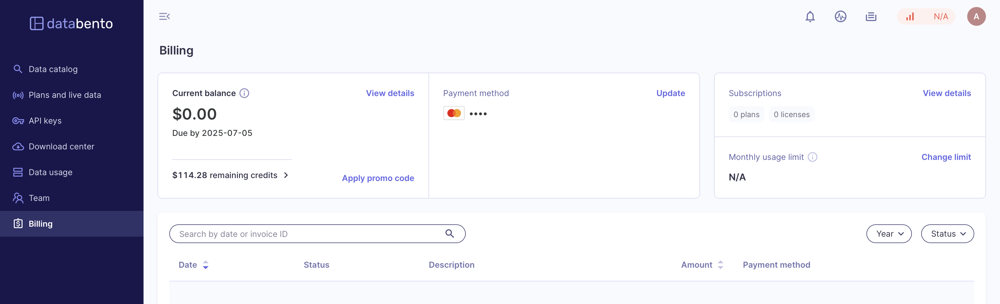

# Streaming Smarter: Real-Time Market Data with Kola, Python, and Databento

A few weeks back, I shared a blog post on how to stream [real-time data from Yahoo Finance](https://www.defconq.tech/docs/tutorials/realTimeStocks) into KDB using Python and the yfinance API. Following that, my former colleague [Nathan Swann](https://www.linkedin.com/in/nathan-swann-568765257/), instead of using `qpython`, why not try the `kola` API? 



This is a perfect example of the power of the KDB/Q community, sharing knowledge, tools, and better ways to do things. So, you asked, and we delivered. I gave `kola` a try, refactored the code to use it instead of `qpython`, and was impressed with the results.

But I didn’t stop there. One of the limitations of using Yahoo Finance is the restriction on request volume, a real challenge for real-time data feeds. So I explored other options and found a great alternative: [Databento](https://databento.com), a modern market data provider offering **$125 in free credits** for new users.

In this updated blog post, I walk through how to:

- Replace `qpython` with `kola`
- Swap out **Yahoo Finance** for **Databento**
- Build a flexible, scalable pipeline from real-time data sources into KDB

It’s a great demonstration of just how powerful and adaptable KDB/Q is, easily integrating with other programming languages and data providers.


## Meet Kola: The Blazing-Fast Python Interface for KDB/Q You Didn’t Know You Needed

Kola is a free and open-source Python interface for KDB/Q designed with performance and modern development in mind. Built on top of [**Rust**](https://www.rust-lang.org) or speed and using [**Polars**](https://pola.rs) for ultra-fast DataFrame operations, Kola delivers a powerful and efficient toolkit for working with KDB data in Python.

The project is the brainchild of [Jo Shinonome](https://www.linkedin.com/in/jshinonome/), a well-known contributor to the KDB/Q ecosystem and the developer behind the popular [KDB/Q plugin for Visual Studio Code](https://github.com/jshinonome/vscode-q). Kola combines his deep understanding of both KDB/Q and modern Python tooling.

If you’re looking for a high-performance alternative to `qpython` or simply want a more efficient and modern way to work with KDB/Q in Python, Kola is worth checking out. You can explore the source code on [Jo’s GitHub](https://github.com/jshinonome) and read more about Kola’s performance and internals in this excellent [Timestored blog post](https://www.timestored.com/kdb-guides/kola-python-api).

Whether you’re building research tools, ingesting real-time data, or just tinkering with KDB from Python, Kola is a fantastic addition to your toolbox.

### How do you install Kola?

Just like any standard Python library, getting started with Kola is incredibly simple. All it takes is a quick `pip install` and you're ready to roll. Since Kola is built on top of Polars, the Polars library will be automatically installed alongside it, no extra steps needed.

```
pip install kola
```

## Lean, Mean, and Lightning Fast: Upgrading Your KDB/Q Pipeline with Kola and Polars

We’ve built on the foundation laid in the previous tutorial, this time, with some powerful upgrades. With just a few strategic changes, we replaced legacy components and supercharged our pipeline using modern tools. Specifically, we phased out `qpython` in favour of `kola`, and swapped out `pandas` for `polars`.

These updates require minimal code changes but deliver significant improvements in performance and memory efficiency. If you've been following my blog, you’ll find the transition straightforward. Here's a breakdown of the core modifications:

### 🔄  Key Changes

1. Switched from `pandas` to `polars`
2. Replaced `qpython` with `kola`

### ⚡ Benefits of the Upgrade

- **🚀 Performance**: Polars is optimized for speed and easily outperforms pandas in most scenarios
- **🧠 Memory Efficiency**: Handles large datasets with significantly lower memory overhead
- **🔗 Simpler Integration**: Kola provides a more elegant and modern interface to interact with KDB/Q

You can find the complete, updated source code on my [GitHub repo here](https://github.com/DefconQ/defconQ/tree/master/projects/realTimeStock).

## Plug & Play: Launching Your Upgraded Market Data Stack

Getting your upgraded stack up and running is just as simple as before. The beauty of this new setup is that you don’t need to modify anything on the KDB/Q side. All the improvements happen in the Python layer, just swap in the new kola-based feed handler in place of the old one, and you're good to go.

Here’s how to get started:

We first start our Tickerplant, which loads the table schema we are already familiar with. 

```
alexanderunterrainer@Mac:~/repos/defconQ/projects/realTimeStock|master⚡ ⇒  qq tick_kola.q sym -p 5010
```

```
KDB+ 4.1 2025.02.18 Copyright (C) 1993-2025 Kx Systems
m64/ 8(24)core 24576MB alexanderunterrainer mac 192.168.1.177 EXPIRE 2026.03.11 KDB PLUS PERSONAL #5024911

q)stocks
time sym feedHandlerTime open high low close volume bid ask bidSize askSize
---------------------------------------------------------------------------
q)
```

Once the Tickerplant is running, we confirm the schema has loaded correctly. Next, we spin up the Real-Time Database (RDB)

```
alexanderunterrainer@Mac:~/repos/defconQ/projects/realTimeStock|master⚡ ⇒  qq tick/r.q :5010 -p 5011
```

```
KDB+ 4.1 2025.02.18 Copyright (C) 1993-2025 Kx Systems
m64/ 8(24)core 24576MB alexanderunterrainer mac 192.168.1.133 EXPIRE 2026.03.11 KDB PLUS PERSONAL #5024911

q)stocks
time sym feedHandlerTime open high low close volume bid ask bidSize askSize
---------------------------------------------------------------------------
q)count stocks
0
```

Last but not least, we launch our Python data feed.

```
alexanderunterrainer@Mac:~/repos/defconQ/projects/realTimeStock|master⚡ ⇒  python3 yahoo_finance_streamer_kola.py --tickers tickers.csv
```

```
2025-06-17 00:00:10,418 - WARNING - Failed to read CSV with Polars: 'ExprStringNameSpace' object has no attribute 'strip'. Trying alternate methods...
2025-06-17 00:00:10,418 - INFO - Successfully parsed CSV using delimiter: ','
2025-06-17 00:00:10,423 - INFO - Loaded 15 ticker symbols from tickers.csv
2025-06-17 00:00:10,424 - INFO - Connecting to KDB+ at localhost:5010 (attempt 1/3)
2025-06-17 00:00:10,424 - INFO - Successfully connected to KDB+ using kola
2025-06-17 00:00:10,424 - INFO - Starting data streaming for 15 symbols at 30s intervals
2025-06-17 00:00:10,424 - INFO - Fetching data for batch 1: 15 symbols
2025-06-17 00:00:14,802 - INFO - Streamed 15 records to KDB+ table 'stocks'
2025-06-17 00:00:14,802 - INFO - Completed iteration 1. Next run at 00:00:40
2025-06-17 00:00:40,443 - INFO - Fetching data for batch 1: 15 symbols
```

We can now see real-time data flowing into our RDB.

```
q)count stocks
15
q)stocks
time                          sym   feedHandlerTime               open    high     low      close  volume    bid    ask    bidSize askSize
------------------------------------------------------------------------------------------------------------------------------------------
2025.06.17D00:00:10.424303000 AAPL  2025.06.17D00:00:10.424303000 197.29  198.685  196.5636 198.42 42837838  197.99 198.46 4       4
2025.06.17D00:00:10.424303000 AMZN  2025.06.17D00:00:10.424303000 212.37  217.06   211.61   216.1  32973402  214.88 216.34 1       4
2025.06.17D00:00:10.424303000 GOOGL 2025.06.17D00:00:10.424303000 174.73  176.93   174.65   176.77 27277235  165.91 183.53 1       1
2025.06.17D00:00:10.424303000 HD    2025.06.17D00:00:10.424303000 355.88  357.105  351.9134 353.56 3675623   353.31 354    2       2
2025.06.17D00:00:10.424303000 JNJ   2025.06.17D00:00:10.424303000 156.42  156.495  154.45   155.22 5575009   155.17 155.35 1       22
2025.06.17D00:00:10.424303000 JPM   2025.06.17D00:00:10.424303000 267     271.7016 267      270.36 5549182   269.51 270.85 5       3
2025.06.17D00:00:10.424303000 MA    2025.06.17D00:00:10.424303000 563.9   575      562.64   568.67 2532015   564    575.41 4       1
2025.06.17D00:00:10.424303000 META  2025.06.17D00:00:10.424303000 698.99  707.15   693.5103 702.12 13648904  664.05 702.48 1       1
2025.06.17D00:00:10.424303000 MSFT  2025.06.17D00:00:10.424303000 475.265 480.6943 475      479.14 15497636  478.66 479.08 1       2
2025.06.17D00:00:10.424303000 NVDA  2025.06.17D00:00:10.424303000 143.345 146.175  143.2001 144.69 181574772 144.89 145.14 2       2
2025.06.17D00:00:10.424303000 PG    2025.06.17D00:00:10.424303000 160.88  161.95   160.01   160.88 6318973   160.61 160.89 3       9
2025.06.17D00:00:10.424303000 TSLA  2025.06.17D00:00:10.424303000 331.18  332.05   326.41   329.13 82528502  328.96 329.25 1       1
2025.06.17D00:00:10.424303000 UNH   2025.06.17D00:00:10.424303000 313     313.2197 304.79   307.66 13065049  307.03 307.39 4       3
2025.06.17D00:00:10.424303000 V     2025.06.17D00:00:10.424303000 356.49  360.22   354.33   355.48 6170903   355.2  355.25 4       2
2025.06.17D00:00:10.424303000 WMT   2025.06.17D00:00:10.424303000 94.75   95.78    94.1     94.29  11926452  94.23  94.36  6       8
q)count stocks
30
```

## Databento: Unlock Market Data Without Limits

Hitting data limits with Yahoo Finance can be frustrating, especially when you're aiming to build something that reflects real-world trading conditions. That’s where [Databento](https://databento.com) comes in. It’s built to provide developers and quants with fast, flexible access to real-time and historical market data, without the usual bottlenecks. Best of all? When you sign up, you get $125 in free credits to start exploring and integrating real market data right away.

### From Wall Street to Market Data Revolution: Meet Christina Qi, Hedge Fund Prodigy Turned Founder

Databento is a next-generation market data platform designed to make high-quality financial data more accessible and affordable. It was founded by [Christina Qi](https://www.linkedin.com/in/christinaqi/), former hedge fund manager and co-founder of Domeyard LP, a pioneering HFT firm. With her deep industry experience, Christina launched Databento to address the high cost and complexity of traditional market data providers. The platform offers fast, flexible access to a wide range of real-time and historical data, all on-demand and usage-based—no expensive licenses or long-term contracts. Whether you're building a quant strategy, research tool, or trading system, Databento offers a modern, developer-friendly alternative that’s both powerful and cost-effective.

### Kickstart Your Market Data Journey with Databento in Minutes

Getting started with Databento is refreshingly simple and takes just a few minutes. All you need to do is sign up with your email, verify your account, and you’re in. Instantly, you'll receive $125 in free credits to explore and use their API. Once logged in, you're welcomed by a clean, user-friendly dashboard displaying your API keys, data plans, usage stats, cost breakdown, and comprehensive documentation to guide you through every step. It's so intuitive that even I found it easy to navigate. 





Just like other Python libraries, you can install the Databento client with a quick `pip install`. The API supports Python, Rust, and C++, and the [QuickStart guide](https://databento.com/docs/) is the perfect place to begin.

```
pip install databento
```

## Integrating Databento into Your Real-Time KDB/Q Stack

To integrate Databento into our real-time KDB/Q tick stack, I made a few small but impactful updates to the codebase. You can find the latest version on my [GitHub repository](https://github.com/DefconQ/defconQ/tree/master/projects/realTimeStock). The main changes are as follows:

- **Schema Alignment**: Updated the table schema to match Databento’s format for seamless compatibility.
- **Renamed Table**: Changed the table name from `stocks` to `trades` to reflect the new data source.
- **Removed Yahoo Finance Dependency**: Dropped all `yfinance` imports and related logic.
- **Databento Integration**: Added support for the `databento` client, including authentication and stream setup.
- **Simplified Ticker Input**: Replaced CSV-based ticker loading with command-line argument support.
- **KDB+ Compatibility**: Retained all existing kola-based streaming functionality to ensure a smooth connection with KDB+.

This integration makes our real-time app more flexible, scalable, and production-ready, powered by high-quality data and a fast, modern toolchain.

## Kola Meets Databento: Powering Your Real-Time KDB/Q Stack

Let’s bring everything together and launch our updated KDB/Q tick stack with full support for Kola and Databento. We begin by starting the modified Tickerplant, which loads the updated table schema aligned with Databento’s format.

```
alexanderunterrainer@Mac:~/repos/defconQ/projects/realTimeStock|master⚡ ⇒  qq tick_databento.q sym_databento -p 5010
```

```
KDB+ 4.1 2025.02.18 Copyright (C) 1993-2025 Kx Systems
m64/ 8(24)core 24576MB alexanderunterrainer mac 192.168.1.133 EXPIRE 2026.03.11 KDB PLUS PERSONAL #5024911

q)trades
ts_event rtype publisher_id instrument_id action side depth price size flags ts_in_delta sequence symbol
--------------------------------------------------------------------------------------------------------
q)
```

Once the Tickerplant is running, we confirm the schema has loaded correctly. Next, we spin up the Real-Time Database (RDB) and verify it has picked up the new schema and is ready to receive data, checking the table count as a quick sanity check.

```
alexanderunterrainer@Mac:~/repos/defconQ/projects/realTimeStock|master⚡ ⇒  qq tick_databento/r.q :5010 -p 5011
```

```
KDB+ 4.1 2025.02.18 Copyright (C) 1993-2025 Kx Systems
m64/ 8(24)core 24576MB alexanderunterrainer mac 192.168.1.133 EXPIRE 2026.03.11 KDB PLUS PERSONAL #5024911

q)trades
ts_event rtype publisher_id instrument_id action side depth price size flags ts_in_delta sequence symbol
--------------------------------------------------------------------------------------------------------
q)count trades
0
```
Finally, we launch our Python data feed, which streams real-time market data directly from Databento into our stack.

```
alexanderunterrainer@Mac:~/repos/defconQ/projects/realTimeStock|master⚡ ⇒  python3 databento_streamer.py --databento-key YOU_API_KEY --dataset GLBX.MDP3 --schema trades --symbols ESM2 --start-date 2022-06-06 --end-date 2022-06-08 --interval 60
```

```
2025-06-16 21:42:33,393 - INFO - Initializing Databento client...
2025-06-16 21:42:33,393 - INFO - Initialized Historical(gateway=https://hist.databento.com)
2025-06-16 21:42:33,393 - INFO - Successfully initialized Databento client
2025-06-16 21:42:33,393 - INFO - Connecting to KDB+ at localhost:5010 (attempt 1/3)
2025-06-16 21:42:33,393 - INFO - Successfully connected to KDB+ using kola
2025-06-16 21:42:33,393 - INFO - Starting data streaming for symbols ['ESM2'] at 60s intervals
2025-06-16 21:42:33,393 - INFO - Fetching trades data from GLBX.MDP3 for symbols ['ESM2']
2025-06-16 21:42:33,393 - INFO - Date range: 2022-06-06 to 2022-06-08
2025-06-16 21:42:40,627 - INFO - Retrieved 952346 records from Databento
shape: (952_346, 13)
┌─────────────────────────────────┬───────┬──────────────┬───────────────┬───┬───────┬─────────────┬──────────┬────────┐
│ ts_event                        ┆ rtype ┆ publisher_id ┆ instrument_id ┆ … ┆ flags ┆ ts_in_delta ┆ sequence ┆ symbol │
│ ---                             ┆ ---   ┆ ---          ┆ ---           ┆   ┆ ---   ┆ ---         ┆ ---      ┆ ---    │
│ datetime[ns, UTC]               ┆ u8    ┆ u16          ┆ u32           ┆   ┆ u8    ┆ i32         ┆ u32      ┆ str    │
╞═════════════════════════════════╪═══════╪══════════════╪═══════════════╪═══╪═══════╪═════════════╪══════════╪════════╡
│ 2022-06-06 00:00:00.070033767 … ┆ 0     ┆ 1            ┆ 3403          ┆ … ┆ 0     ┆ 18681       ┆ 157862   ┆ ESM2   │
│ 2022-06-06 00:00:00.089830441 … ┆ 0     ┆ 1            ┆ 3403          ┆ … ┆ 0     ┆ 18604       ┆ 157922   ┆ ESM2   │
│ 2022-06-06 00:00:00.807018955 … ┆ 0     ┆ 1            ┆ 3403          ┆ … ┆ 0     ┆ 18396       ┆ 158072   ┆ ESM2   │
│ 2022-06-06 00:00:01.317385867 … ┆ 0     ┆ 1            ┆ 3403          ┆ … ┆ 0     ┆ 22043       ┆ 158111   ┆ ESM2   │
│ 2022-06-06 00:00:01.317385867 … ┆ 0     ┆ 1            ┆ 3403          ┆ … ┆ 0     ┆ 17280       ┆ 158112   ┆ ESM2   │
│ …                               ┆ …     ┆ …            ┆ …             ┆ … ┆ …     ┆ …           ┆ …        ┆ …      │
│ 2022-06-07 23:59:58.550608211 … ┆ 0     ┆ 1            ┆ 3403          ┆ … ┆ 0     ┆ 18440       ┆ 26322074 ┆ ESM2   │
│ 2022-06-07 23:59:58.550782187 … ┆ 0     ┆ 1            ┆ 3403          ┆ … ┆ 0     ┆ 18571       ┆ 26322076 ┆ ESM2   │
│ 2022-06-07 23:59:58.550811233 … ┆ 0     ┆ 1            ┆ 3403          ┆ … ┆ 0     ┆ 17159       ┆ 26322077 ┆ ESM2   │
│ 2022-06-07 23:59:59.228076537 … ┆ 0     ┆ 1            ┆ 3403          ┆ … ┆ 0     ┆ 18256       ┆ 26322090 ┆ ESM2   │
│ 2022-06-07 23:59:59.228284091 … ┆ 0     ┆ 1            ┆ 3403          ┆ … ┆ 0     ┆ 18254       ┆ 26322092 ┆ ESM2   │
└─────────────────────────────────┴───────┴──────────────┴───────────────┴───┴───────┴─────────────┴──────────┴────────┘
2025-06-16 21:42:40,649 - INFO - Processed 952346 records for streaming
shape: (952_346, 13)
``` 

We can now see real-time data flowing into our RDB.

```
q)count trades
952346
q)trades
ts_event                      rtype publisher_id instrument_id action side depth price   size flags ts_in_delta sequence symbol
-------------------------------------------------------------------------------------------------------------------------------
2022.06.06D00:00:00.070033767 0     1            3403          ,"T"   ,"A" 0     4108.5  1    0     18681       157862   "ESM2"
2022.06.06D00:00:00.089830441 0     1            3403          ,"T"   ,"A" 0     4108.25 1    0     18604       157922   "ESM2"
2022.06.06D00:00:00.807018955 0     1            3403          ,"T"   ,"B" 0     4108.25 4    0     18396       158072   "ESM2"
2022.06.06D00:00:01.317385867 0     1            3403          ,"T"   ,"A" 0     4108    1    0     22043       158111   "ESM2"
2022.06.06D00:00:01.317385867 0     1            3403          ,"T"   ,"A" 0     4108    7    0     17280       158112   "ESM2"
2022.06.06D00:00:01.317385867 0     1            3403          ,"T"   ,"A" 0     4108    1    0     17280       158112   "ESM2"
2022.06.06D00:00:01.317385867 0     1            3403          ,"T"   ,"A" 0     4108    1    0     17280       158112   "ESM2"
2022.06.06D00:00:01.317613333 0     1            3403          ,"T"   ,"A" 0     4108    1    0     21473       158114   "ESM2"
2022.06.06D00:00:01.324795185 0     1            3403          ,"T"   ,"A" 0     4107.75 4    0     19595       158206   "ESM2"
2022.06.06D00:00:01.324795185 0     1            3403          ,"T"   ,"A" 0     4107.75 1    0     19848       158207   "ESM2"
2022.06.06D00:00:01.324840223 0     1            3403          ,"T"   ,"A" 0     4107.75 1    0     19848       158207   "ESM2"
2022.06.06D00:00:01.324851563 0     1            3403          ,"T"   ,"A" 0     4107.75 1    0     22183       158208   "ESM2"
2022.06.06D00:00:01.324852069 0     1            3403          ,"T"   ,"A" 0     4107.75 1    0     22183       158208   "ESM2"
2022.06.06D00:00:01.324857297 0     1            3403          ,"T"   ,"A" 0     4107.75 1    0     22183       158208   "ESM2"
2022.06.06D00:00:01.324858743 0     1            3403          ,"T"   ,"A" 0     4107.75 1    0     19332       158209   "ESM2"
2022.06.06D00:00:01.324861955 0     1            3403          ,"T"   ,"A" 0     4107.75 2    0     19332       158209   "ESM2"
2022.06.06D00:00:01.336988409 0     1            3403          ,"T"   ,"A" 0     4107.5  1    0     24619       158279   "ESM2"
2022.06.06D00:00:01.336988409 0     1            3403          ,"T"   ,"A" 0     4107.5  1    0     21346       158280   "ESM2"
2022.06.06D00:00:01.336988409 0     1            3403          ,"T"   ,"A" 0     4107.5  1    0     21346       158280   "ESM2"
2022.06.06D00:00:01.336988409 0     1            3403          ,"T"   ,"A" 0     4107.5  1    0     21346       158280   "ESM2"
2022.06.06D00:00:01.336988409 0     1            3403          ,"T"   ,"A" 0     4107.5  1    0     21346       158280   "ESM2"
2022.06.06D00:00:01.336988409 0     1            3403          ,"T"   ,"A" 0     4107.5  3    0     21346       158280   "ESM2"
2022.06.06D00:00:01.336988409 0     1            3403          ,"T"   ,"A" 0     4107.25 13   0     21346       158280   "ESM2"
2022.06.06D00:00:01.336988409 0     1            3403          ,"T"   ,"A" 0     4107    9    0     21346       158280   "ESM2"
2022.06.06D00:00:01.336988409 0     1            3403          ,"T"   ,"A" 0     4107    1    0     19343       158281   "ESM2"
```

And that’s it! With everything in place, you now have a fully functioning, real-time system built on modern, high-performance tools. Hope you found this walkthrough helpful and inspiring!

