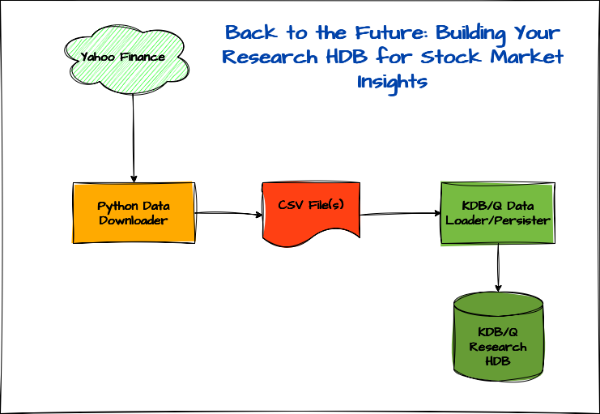

# Back to the Future: Building Your Research HDB for Stock Market Insights

In our last post, we explored how to build a [real-time stock market data feed](https://www.defconq.tech/docs/tutorials/realTimeStocks), but as any good quant knows, historical data is often the crystal ball we look into when trying to forecast future trends, or at least, give it our best shot.

In this tutorial, you'll learn how to build your very own **historical stock market database** for research and analysis, completely FREE of charge. Using **Python** and the [**`yfinance`**](https://github.com/ranaroussi/yfinance) library, we’ll fetch historical stock data from Yahoo Finance and save it to a CSV file. From there, we’ll load the data into **KDB/Q** and create a fully functional **Research HDB**.

Think it’ll take tons of code? Think again! It’s way simpler than you’d expect.
 
While this setup has been simplified for educational purposes, it can be easily adapted to resemble a more production-ready environment.


## Who is this tutorial for?

This tutorial is for anyone keen to build a historical stock market database. Whether you're a quant or researcher looking to analyze historical market data, or a KDB/Q developer curious about the technical implementation, there's something valuable here for everyone. 

## Prerequisites

This tutorial is by far the easiest one I’ve put together, no deep KDB/Q knowledge required, making it perfect even for q-bies (beginner KDB/Q developers) to follow along. That said, if you're curious to dive deeper into KDB/Q or explore a typical tick setup, I’ve included some helpful resources at the end of the post. A basic understanding of Python can be handy, but not necessary given that our trustworthy friend Claude is back lending us a hand with the Python code.

## What’s in It for You: Skills You’ll Master in This Tutorial

While this tutorial is relatively straightforward, it’s packed with valuable insights. You’ll learn how to read data from CSV files and persist it to disk using the full power of KDB/Q. We’ll explore how to benchmark performance using timer functions and discuss strategies to optimise your code for speed. You’ll also get an introduction to parallel processing with multi-threading and KDB/Q’s built-in parallel operators. On top of that, we’ll dive into the [`.Q`](https://code.kx.com/q/ref/dotq/) namespace and its handy helper functions for data persistence, and then take it a step further by examining one of those functions under the hood, exploring its `K` implementation, and building our own optimised version.

## Under the Hood: The Minimalist Tech Stack Powering It All

The tech stack for this tutorial is even more minimal than in our previous one. Since we’re not streaming data directly from Python to KDB/Q, we can drop the [`qpython`](https://github.com/exxeleron/qPython/tree/master) library altogether. All we need is Python with the [**`yfinance`**](https://github.com/ranaroussi/yfinance) library to fetch historical stock data from Yahoo Finance, and, of course, our go-to language for time series and big data analysis: **KDB/Q**.

## The Setup



The architecture of our application is built around three key components:

- **Python Data Downloader**: Using the [`yfinance`](https://github.com/ranaroussi/yfinance) library, we’ll fetch historical stock market data and save it as CSV files.
- **KDB/Q Data Loader & Persister**: This component reads the CSV data into memory, processes it, and writes it to disk as part of a Historical Database (HDB).
- **Historical Research Database (HDB)**: Finally, we configure a KDB/Q HDB to point to the persisted data on disk for analysis and querying.

In the following section, we’ll dive into each of these components in more detail.

### Python Data Downloader

Just like in our previous tutorial, the Python Data Downloader is the most code-heavy component, clocking in at just over 130 lines. It reads a list of tickers from a CSV file and fetches historical stock data from Yahoo Finance based on either a specified date range and interval or a predefined period and interval. The downloaded data is then saved in a designated folder, with one CSV file per stock.

### KDB/Q Data Loader & Persister

Now let’s turn our attention to the KDB/Q data loader and persister. In its simplest form, the entire script is under 20 lines of code, and we could trim it even further by eliminating some whitespace. But before we run it all at once, it’s worth checking how each function performs individually. To do this, we use the [`\ts`](https://code.kx.com/q/basics/syscmds/#ts-time-and-space) system command, which measures both time and memory usage for a given operation.

Before we dive into optimization, let’s quickly review the setup we created for our data loader.

First, we define an empty table schema that matches the structure of the final data we plan to load and persist. This will act as a container for all the data we process. Then, we specify the column names expected in the raw CSV files. Since we’ll be enriching the data before writing it to disk, the schema of the CSV files differs from the schema of the final output. Lastly, we create a variable to store a list of all the filenames we want to process.

You can find the complete source code for this project [here], but for now, we’ll walk through it step by step.

#### Setup

```
data:([] date:`date$(); sym:`symbol$(); feedHandlerTime: `timestamp$(); open: `float$(); high: `float$(); low: `float$(); close: `float$(); volume: `long$(); dividends: `float$(); stockSplit: `float$());
colsToLoad:`date`open`high`low`close`volume`dividends`stockSplit;
files:key `:.;
```

#### Data Load

Before loading any data, whether it's stock prices or something else, it's always a good idea o take a quick peek first. One easy way to do this is by using the Unix [`head`](https://man7.org/linux/man-pages/man1/head.1.html) command, which displays the first 10 lines of a file. This gives us a clear view of the structure, allowing us to understand the column headers, data types, and how we should shape our table schema in KDB/Q.

As we inspect the content, one key detail jumps out: the dataset doesn’t include the ticker symbol. A quick look at the filename reveals why, the symbol is encoded in the file name itself (`VOW3.DE_20250520_213458.csv`) and was likely omitted from the file content to avoid redundancy. That means we’ll need to extract the symbol from the filename and append it to each record.

Additionally, we'll enhance our dataset further by:
- Adding a `feedHandlerTime` column to simulate the time the feed processed the data
- Converting the `date` column from a `timestamp` to a `date` type

These small enhancements will make our data much cleaner and more useful for analysis.

```
alexanderunterrainer@Mac:~/repos/financeData/stock_data|⇒  head VOW3.DE_20250520_213458.csv
Date,Open,High,Low,Close,Volume,Dividends,Stock Splits
1998-07-22 00:00:00+02:00,21.488154257121344,22.136574506271078,21.488154257121344,21.980979919433594,56336,0.0,0.0
1998-07-23 00:00:00+02:00,22.22316856885747,22.396011942250293,21.01258087158203,21.01258087158203,95571,0.0,0.0
1998-07-24 00:00:00+02:00,20.75315016493062,21.185430035478102,20.37262180820672,20.925994873046875,154423,0.0,0.0
1998-07-27 00:00:00+02:00,20.925992035048456,21.099174218262796,20.234277095880632,20.32086753845215,62875,0.0,0.0
1998-07-28 00:00:00+02:00,20.14802370431103,20.908741550046198,19.680904936904067,19.836498260498047,116194,0.0,0.0
1998-07-29 00:00:00+02:00,19.853748790764257,20.753147350373524,19.5425608586415,20.32086753845215,95068,0.0,0.0
1998-07-30 00:00:00+02:00,20.40712156543796,21.012583592704,20.40712156543796,20.701396942138672,51306,0.0,0.0
1998-07-31 00:00:00+02:00,21.012583592704,21.012583592704,19.11028206085388,20.701396942138672,145369,0.0,0.0
1998-08-03 00:00:00+02:00,18.850849105456504,18.980397941705075,18.764257350178806,18.95469093322754,74948,0.0,0.0
```

Our final data loading function therefore becomes:

```
loadData:{[file]
        s:`$first "_" vs string file;
        `data insert `date`sym`feedHandlerTime xcols update `date$date,sym:s,feedHandlerTime:date from 1_flip colsToLoad!("PFFFFJFF";csv) 0: hsym file;
        };
```

#### Save Data

Next, we persist our data to disk using [`.Q.pdft`](https://code.kx.com/q/ref/dotq/#dpft-save-table), KDB/Q’s built-in function for saving data to a partitioned Historical Database (HDB). Don’t worry if you're not familiar with the different HDB types, we’ll explore those in a separate post. For now, our focus is on building a research-ready database.

To keep the code clean and easily extensible, we define a helper function to handle saving data for a single date. This approach makes it easy to optimize our code for performance later on. The function is then called by our main `saveData` routine, which loops through all unique dates in our dataset. Best of all, this can be accomplished in just a few lines of code. Let’s take a look.

```
saveOneDate:{[hdbDir;t;d]
        `stocks set select from t where date=d;
        .Q.dpft[hdbDir;d;`sym;`stocks];
        delete stocks from `.;
        };

saveData:{[]
        d:exec distinct date from data;
        saveOneDate[`$":/Users/alexanderunterrainer/repos/financeData/hdb/";data;] each d;
        };
```
#### Performance Tests

Now, let’s evaluate how our functions perform, leveraging the system command `\ts` mentioned earlier. This will return the execution time in milliseconds as well as how much memory was used in bytes. 

First we load all our data:

```
q)\ts loadData each files
53 11109488
q)count data
75824
q)10#data
date       sym    feedHandlerTime               open     high     low      close    volume   dividends stockSplit
-----------------------------------------------------------------------------------------------------------------
1999.05.06 7203.T 1999.05.06D00:00:00.000000000 396.8345 410.4792 392.2863 410.4792 15575000 0         0
1999.05.07 7203.T 1999.05.07D00:00:00.000000000 408.2051 409.3421 392.2862 395.6974 15165000 0         0
1999.05.10 7203.T 1999.05.10D00:00:00.000000000 395.6975 400.2458 392.2863 394.5605 6305000  0         0
1999.05.11 7203.T 1999.05.11D00:00:00.000000000 397.9717 400.2458 391.1493 391.1493 8430000  0         0
1999.05.12 7203.T 1999.05.12D00:00:00.000000000 391.1492 397.9716 391.1492 397.9716 12980000 0         0
1999.05.13 7203.T 1999.05.13D00:00:00.000000000 393.4233 393.4233 385.4639 388.8751 7165000  0         0
1999.05.14 7203.T 1999.05.14D00:00:00.000000000 390.0121 390.0121 383.1897 384.3268 11475000 0         0
1999.05.17 7203.T 1999.05.17D00:00:00.000000000 378.6415 379.7786 371.8192 372.9562 10900000 0         0
1999.05.18 7203.T 1999.05.18D00:00:00.000000000 375.2304 387.7381 371.8192 385.464  13680000 0         0
1999.05.19 7203.T 1999.05.19D00:00:00.000000000 374.0932 376.3673 358.1743 369.545  19680000 0         0
q)select count i by sym from data
sym    | x
-------| -----
7203.T | 6511
9988.HK| 1345
AAPL   | 11200
AMZN   | 7048
GOOG   | 5222
META   | 3270
MSFT   | 9874
QQQ    | 6591
SPY    | 8133
TSLA   | 3747
VOW3.DE| 6865
VTI    | 6018
```

Next, we save the data:

```
q)\ts saveData[]
13312 4396288
```

While the data loading step is impressively fast, just 53 milliseconds, the save-to-disk step takes significantly longer at 13.5 seconds, and that’s only for 12 stocks. Clearly, there’s room for optimization. Let’s see how we can speed things up.

#### Performance Tuning Part 1

The first optimization we’ll explore is a clever technique I picked up from [Nick Psaris'](https://www.linkedin.com/in/nickpsaris/) excellent book [***Q-Tips: Fast, Scalable and Maintainable KDB+***](https://amzn.to/4dAg1Hh), a personal favorite of mine. In his book, Nick demonstrates how to accelerate an [`as-of join`](https://www.defconq.tech/docs/concepts/joins#as-of-joins) by converting one of the tables into a dictionary, where each key is a date and the corresponding value is a table containing only the data for that date. Let’s apply this concept to the `stocks` data we just loaded into memory to see it in action.

:::tip
If you need a refresher of KDB/Q joins, read my dedicated blog post [here](https://www.defconq.tech/docs/concepts/joins)
:::

First, let’s take a quick glance at our dataset to understand its current structure. 

```
q)data
date       sym    feedHandlerTime               open     high     low      close    volume   dividends stockSplit
-----------------------------------------------------------------------------------------------------------------
1999.05.06 7203.T 1999.05.06D00:00:00.000000000 396.8345 410.4792 392.2863 410.4792 15575000 0         0
1999.05.07 7203.T 1999.05.07D00:00:00.000000000 408.2051 409.3421 392.2862 395.6974 15165000 0         0
1999.05.10 7203.T 1999.05.10D00:00:00.000000000 395.6975 400.2458 392.2863 394.5605 6305000  0         0
1999.05.11 7203.T 1999.05.11D00:00:00.000000000 397.9717 400.2458 391.1493 391.1493 8430000  0         0
1999.05.12 7203.T 1999.05.12D00:00:00.000000000 391.1492 397.9716 391.1492 397.9716 12980000 0         0
1999.05.13 7203.T 1999.05.13D00:00:00.000000000 393.4233 393.4233 385.4639 388.8751 7165000  0         0
1999.05.14 7203.T 1999.05.14D00:00:00.000000000 390.0121 390.0121 383.1897 384.3268 11475000 0         0
1999.05.17 7203.T 1999.05.17D00:00:00.000000000 378.6415 379.7786 371.8192 372.9562 10900000 0         0
1999.05.18 7203.T 1999.05.18D00:00:00.000000000 375.2304 387.7381 371.8192 385.464  13680000 0         0
1999.05.19 7203.T 1999.05.19D00:00:00.000000000 374.0932 376.3673 358.1743 369.545  19680000 0         0
1999.05.20 7203.T 1999.05.20D00:00:00.000000000 374.0932 382.0527 371.8191 377.5044 9375000  0         0
1999.05.21 7203.T 1999.05.21D00:00:00.000000000 380.9157 383.1898 372.9562 378.6415 11610000 0         0
1999.05.24 7203.T 1999.05.24D00:00:00.000000000 378.6415 378.6415 366.1339 378.6415 9865000  0         0
...
```

Since our goal is to organize the data by individual days, we need to identify the row indices corresponding to each unique date. This can be achieved by grouping the `date` column in our table using the [`group`](https://code.kx.com/q/ref/group/) keyword, which gives us exactly what we need: a mapping from dates to row indices.

```
q)group data`date
1999.05.06| 0 12505 19553 37919 44510 52643 63147
1999.05.07| 1 12506 19554 37920 44511 52644 63148
1999.05.10| 2 12507 19555 37921 44512 52645 63149
1999.05.11| 3 12508 19556 37922 44513 52646 63150
1999.05.12| 4 12509 19557 37923 44514 52647 63151
1999.05.13| 5 12510 19558 37924 44515 52648 63152
1999.05.14| 6 12511 19559 37925 44516 52649 63153
1999.05.17| 7 12512 19560 37926 44517 52650 63154
1999.05.18| 8 12513 19561 37927 44518 52651 63155
1999.05.19| 9 12514 19562 37928 44519 52652 63156
1999.05.20| 10 12515 19563 37929 44520 52653 63157
...
```

By using this grouped dictionary to index into our original table, we build a structure where each key is a date, and each value is a sub-table containing only the data for that specific date. 

```
q)data group data`date
1999.05.06| +`date`sym`feedHandlerTime`open`high`low`close`volume`dividends`stockSplit!(1999.05.06 1999.05.06 1999.05.06 1999.05.06 1999.05.06 1999.05.06 1999.05.06;`7203.T`AAPL`AMZN`MSFT`QQQ`SPY`VOW3.DE;1999.05.06D00:00:00.000000000 1999...
1999.05.07| +`date`sym`feedHandlerTime`open`high`low`close`volume`dividends`stockSplit!(1999.05.07 1999.05.07 1999.05.07 1999.05.07 1999.05.07 1999.05.07 1999.05.07;`7203.T`AAPL`AMZN`MSFT`QQQ`SPY`VOW3.DE;1999.05.07D00:00:00.000000000 1999...
1999.05.10| +`date`sym`feedHandlerTime`open`high`low`close`volume`dividends`stockSplit!(1999.05.10 1999.05.10 1999.05.10 1999.05.10 1999.05.10 1999.05.10 1999.05.10;`7203.T`AAPL`AMZN`MSFT`QQQ`SPY`VOW3.DE;1999.05.10D00:00:00.000000000 1999...
1999.05.11| +`date`sym`feedHandlerTime`open`high`low`close`volume`dividends`stockSplit!(1999.05.11 1999.05.11 1999.05.11 1999.05.11 1999.05.11 1999.05.11 1999.05.11;`7203.T`AAPL`AMZN`MSFT`QQQ`SPY`VOW3.DE;1999.05.11D00:00:00.000000000 1999...
1999.05.12| +`date`sym`feedHandlerTime`open`high`low`close`volume`dividends`stockSplit!(1999.05.12 1999.05.12 1999.05.12 1999.05.12 1999.05.12 1999.05.12 1999.05.12;`7203.T`AAPL`AMZN`MSFT`QQQ`SPY`VOW3.DE;1999.05.12D00:00:00.000000000 1999...
1999.05.13| +`date`sym`feedHandlerTime`open`high`low`close`volume`dividends`stockSplit!(1999.05.13 1999.05.13 1999.05.13 1999.05.13 1999.05.13 1999.05.13 1999.05.13;`7203.T`AAPL`AMZN`MSFT`QQQ`SPY`VOW3.DE;1999.05.13D00:00:00.000000000 1999...
1999.05.14| +`date`sym`feedHandlerTime`open`high`low`close`volume`dividends`stockSplit!(1999.05.14 1999.05.14 1999.05.14 1999.05.14 1999.05.14 1999.05.14 1999.05.14;`7203.T`AAPL`AMZN`MSFT`QQQ`SPY`VOW3.DE;1999.05.14D00:00:00.000000000 1999...
1999.05.17| +`date`sym`feedHandlerTime`open`high`low`close`volume`dividends`stockSplit!(1999.05.17 1999.05.17 1999.05.17 1999.05.17 1999.05.17 1999.05.17 1999.05.17;`7203.T`AAPL`AMZN`MSFT`QQQ`SPY`VOW3.DE;1999.05.17D00:00:00.000000000 1999...
1999.05.18| +`date`sym`feedHandlerTime`open`high`low`close`volume`dividends`stockSplit!(1999.05.18 1999.05.18 1999.05.18 1999.05.18 1999.05.18 1999.05.18 1999.05.18;`7203.T`AAPL`AMZN`MSFT`QQQ`SPY`VOW3.DE;1999.05.18D00:00:00.000000000 1999...
1999.05.19| +`date`sym`feedHandlerTime`open`high`low`close`volume`dividends`stockSplit!(1999.05.19 1999.05.19 1999.05.19 1999.05.19 1999.05.19 1999.05.19 1999.05.19;`7203.T`AAPL`AMZN`MSFT`QQQ`SPY`VOW3.DE;1999.05.19D00:00:00.000000000 1999...
```

With this dictionary in hand, we can now leverage the [each-both](https://www.defconq.tech/docs/concepts/iterators#binary-opplication-of-each) iterator to loop over our dataset and save the data for each day individually. Let’s go ahead and do that.

:::tip
You can find a detailed explanation of every iterator in my dedicated blog post: [Iterators - Navigating Vectors Without the Need for Loops](https://www.defconq.tech/docs/concepts/iterators). 
:::

```
q)\ts {[hdbDir;d;t] `stocks set t;.Q.dpft[hdbDir;d;`sym;`stocks];delete stocks from `.;}[`$":/Users/alexanderunterrainer/repos/financeData/hdb/"]'[key g;value g:data group data`date]
12766 13391008
q)\ts {[hdbDir;d;t] `stocks set t;.Q.dpft[hdbDir;d;`sym;`stocks];delete stocks from `.;}[`$":/Users/alexanderunterrainer/repos/financeData/hdb/"]'[key g;value g:data group data`date]
13449 13391008
```

Unfortunately, this approach didn’t yield the performance gains I was hoping for, clocking in at 12.5 seconds, it's only marginally faster than our original method. Even after a second run (always a good idea when testing performance), the improvement was negligible. So it’s clear we need a different strategy to optimise our save-down function. A quick win might be to leverage multithreading by using the [`peach`](https://www.defconq.tech/docs/concepts/iterators#each-parallel) iterator to save each date in parallel. Let’s give that a try.

To take advantage of multithreading, we need to launch our KDB/Q process with multiple slave threads. This is done using the `-s` command-line option, followed by the number of slaves you'd like to start. For our example, we’ll go with eight slaves, a number chosen arbitrarily. After starting the process, we can confirm the number of active slave threads by running the system command `\s`

```
alexanderunterrainer@Mac:~/repos/financeData/stock_data|⇒  qq ../draft.q -s 8
KDB+ 4.1 2025.02.18 Copyright (C) 1993-2025 Kx Systems
m64/ 8(24)core 24576MB alexanderunterrainer mac 192.168.1.177 EXPIRE 2026.03.11 KDB PLUS PERSONAL #5024911

q)\s
8i
```

Now, let’s update our function to use `peach` (parallel each) in place of the standard `each`, and then run it to see the performance impact.

**Modified saveData function:**

```
saveDataP:{[] 
	d:exec distinct date from data;
	saveOneDate[`$":/Users/alexanderunterrainer/repos/financeData/hdb/";data;] peach d;}
```

**Test run:**

```
q)\ts saveDataP[]
'noupdate: `. `stocks
  [4]  (.q.set)

  [3]  /Users/alexanderunterrainer/repos/financeData/draft.q:15: saveOneDate:{[hdbDir;t;d]
 `stocks set select from t where date=d;
         ^
 .Q.dpft[hdbDir;d;`sym;`stocks];
  [1]  saveDataP:{[] d:exec distinct date from data;saveOneDate[`$":/Users/alexanderunterrainer/repos/financeData/hdb/";data;] peach d;}
```

To our surprise, this threw an error, but was it really unexpected? Not quite. We just ran into a well-known limitation of multi-threading and `peach`: you can’t modify a global variable, like `stocks` in our case, within a parallel execution context. And that makes perfect sense. There’s no way to ensure multiple threads aren’t simultaneously reading from or, worse, writing to the same global variable. Thankfully, this is only a minor setback. All we need to do is refactor our `saveOneDate` function to avoid relying on global variables. A simple fix.

:::note
We'll also need to make a slight adjustment to our `saveData` function to accommodate the changes.
:::

```
saveOneDateP:{[hdbDir;t;d] 
	toSave:delete date from update `p#sym from `sym`feedHandlerTime xasc select from t where date=d;
	(` sv (.Q.par[hdbDir;d;`stocks];`)) set toSave
	}

```

Since we're no longer using the built-in `.Q.dpft` function, we need to handle a few steps manually. But as you'll see, this extra effort is worthwhile, it results in noticeable performance gains. In the first line of our updated function, we perform several steps in one go. Reading from right to left:

- We begin by selecting only the rows for the specific date we want to save.
- We then sort the data first by `sym` and, within each symbol, by `feedHandlerTime`.
- Next, we apply the `parted` attribute to the `sym` column, a step that `.Q.dpft` previously handled for us.
- Finally, we remove the `date` column, since it will now be represented as a partition directory in our HDB.

As the final step, we construct the file path for storing that day's data using `.Q.par`, combining the HDB root directory, table name, and target date. We then save the processed data directly to that path.

Now let’s take a look at the changes we need to apply to the `saveData` function.

```
saveDataP:{[data] 
	data:.Q.en[hdbDir:`$":/Users/alexanderunterrainer/repos/financeData/hdb/"] data;
	d:exec distinct date from data;
	saveOneDateP[hdbDir;data;] peach d
	}
```

Another task we now need to handle manually now that we no longer use `.Q.dpft` is enumeration, a key concept we'll explore in more detail in a future blog post.

To accommodate this, we modify the `saveData` function so it accepts the dataset to be saved as a parameter. Within the function, we perform the following steps:
- First, we enumerate the data using the `sym` file located in the root directory of our HDB.
- Next, we retrieve all unique dates from the dataset
- And finally, we use `peach` to invoke our optimized `saveOneDateP` function for each distinct date in parallel.

Next, let's put our newly optimized function to the test and compare its performance against the original implementation. 

```
q)\ts saveDataP[data]
6056 4195184
```
The result speak for itself, we managed to cut the execution time by more than half. That’s a significant improvement, especially considering how minimal the code changes were. Even with the enhancements, the total lines of code remain under twenty.

But is this the best we can do? We owe it to ourselves to at least give it another shot.

#### Behind the Magic: The Secret Life of .Q.pdft

For our next round of performance tuning, we’ll dive into the inner workings of `.Q.dpft` to see if we can repurpose some of its internal logic to our advantage. But before we do so, let's first look beyond the dot and understand how `.Q.dpft` works behind the curtains. As a reminder: 

```
.Q.dpft[d; p; f; t]
```
where:
- `d` is the directory handle for the HDB
- `p` is the partition (typically a date)
- `f` is the column used for partitioning (must exist in the table since version 4.1t 2021.09.03)
- `t` is the name (as a symbol) of the simple table to be saved, where columns are vectors or compound lists.

With that structure in mind, let’s explore how `.Q.dpft` is implemented internally and see what components we can reuse or adapt for even better performance.

```
q).Q.dpft
k){[d;p;f;t;s]
      if[` in f,c:!+r:`. . `\:t;'`domain];
      if[~f in c;'f];
      i:<t f;
      r:+enxs[$;d;r;s];
      {[d;t;i;u;x]@[d;x;:;u t[x]i]}[d:par[d;p;t];r;i;]'[(::;`p#)f=c;c];
      @[d;`.d;:;f,c@&~f=c];t}[;;;;`sym]
```

As is often the case, `K` code tends to be even more concise and cryptic than `Q`, making it challenging to read, especially for the untrained eye. That said, the core functionality of the `.Q.dpft` function can be broken down into six key steps:

- **Store the table content** and **Extract column names** from table `t` and validate that no unexpected columns are present.
- **Verify** that the column targeted for the parted attribute exists within the table.
- **Determine index order** using `iasc` to sort the table appropriately.
- **Enumerate** the table against the `sym` file to ensure consistency in symbol representation.
- **Persist data**, saving each column individually while reordering and applying attributes as needed.
- **Write the `.d` file**, which contains the column names in their correct order

Now, let’s dive deeper into each of these steps to better understand how we might adopt and adapt this approach.

In the first line, we use an `if` statement to ensure there are no unexpected columns in the table we want to persist. However, the condition inside that `if` does quite a bit, so let’s unpack it:

```
` in f,c:!+r:`. . `\:t
``` 
As we are well aware by now, we read `Q` and `K` from right to left. Starting on the far right:

- ``` `\:t ``` is `K` code for  the [`vs` (vector-from-scalar)](https://code.kx.com/q/ref/vs/) operator to convert the table name `t`, a symbol atom, into a single-element list

```
q)vs
k){x\:y}
q)` vs `stock
,`stock
q)k)`\:`stock
,`stock
```

- ``` `. . `\:t ``` performs a dot-apply to retrieve the actual table value from the general namespace, giving us the contents of the table name stored in `t`. The result is assigned to variable `r`

:::tip
If you'd like a refresher or a deep dive into how the powerful apply operator works in KDB/Q, make sure to check out my dedicated blog post: [Amend, Amend At – The Swiss Army Knife of KDB/Q Operators](https://www.defconq.tech/docs/concepts/amend).
:::

```
// Q code
q)`. . ` vs `data
date       sym    feedHandlerTime               open     high     low      close    volume   dividends stockSplit
-----------------------------------------------------------------------------------------------------------------
1999.05.06 7203.T 1999.05.06D00:00:00.000000000 396.8345 410.4792 392.2863 410.4792 15575000 0         0
1999.05.07 7203.T 1999.05.07D00:00:00.000000000 408.2051 409.3421 392.2862 395.6974 15165000 0         0
1999.05.10 7203.T 1999.05.10D00:00:00.000000000 395.6975 400.2458 392.2863 394.5605 6305000  0         0
1999.05.11 7203.T 1999.05.11D00:00:00.000000000 397.9717 400.2458 391.1493 391.1493 8430000  0         0
1999.05.12 7203.T 1999.05.12D00:00:00.000000000 391.1492 397.9716 391.1492 397.9716 12980000 0         0
1999.05.13 7203.T 1999.05.13D00:00:00.000000000 393.4233 393.4233 385.4639 388.8751 7165000  0         0
1999.05.14 7203.T 1999.05.14D00:00:00.000000000 390.0121 390.0121 383.1897 384.3268 11475000 0         0
...

// K code
q)k)`. . `\:`data
date       sym    feedHandlerTime               open     high     low      close    volume   dividends stockSplit
-----------------------------------------------------------------------------------------------------------------
1999.05.06 7203.T 1999.05.06D00:00:00.000000000 396.8345 410.4792 392.2863 410.4792 15575000 0         0
1999.05.07 7203.T 1999.05.07D00:00:00.000000000 408.2051 409.3421 392.2862 395.6974 15165000 0         0
1999.05.10 7203.T 1999.05.10D00:00:00.000000000 395.6975 400.2458 392.2863 394.5605 6305000  0         0
1999.05.11 7203.T 1999.05.11D00:00:00.000000000 397.9717 400.2458 391.1493 391.1493 8430000  0         0
1999.05.12 7203.T 1999.05.12D00:00:00.000000000 391.1492 397.9716 391.1492 397.9716 12980000 0         0
1999.05.13 7203.T 1999.05.13D00:00:00.000000000 393.4233 393.4233 385.4639 388.8751 7165000  0         0
1999.05.14 7203.T 1999.05.14D00:00:00.000000000 390.0121 390.0121 383.1897 384.3268 11475000 0         0
...
```

The remainder of the line is fairly straightforward. We use the `+` operator in `K` (which corresponds to the [`flip`](https://code.kx.com/q/ref/flip/) operator in `Q`) to convert our table into a dictionary, and then apply the `!` (`key` in `Q`) operator to extract the column names, storing them in the variable `c`. We then concatenate the column name of the column we want to apply the `parted` attribute to with this list of column names. Finally, we check if the empty symbol ``` ` ``` appears in that list, if it does, we throw a `domain` error; if not, we proceed with the function's execution. Not too bad, right? Let's back this up with some code examples.

```
q)flip
+:
q)key
!:
q)flip data
date           | 1999.05.06                    1999.05.07                    1999.05.10                    1999.05.11                    1999.05.12                    1999.05.13                    1999.05.14                    1999.05.17  ..
sym            | 7203.T                        7203.T                        7203.T                        7203.T                        7203.T                        7203.T                        7203.T                        7203.T      ..
feedHandlerTime| 1999.05.06D00:00:00.000000000 1999.05.07D00:00:00.000000000 1999.05.10D00:00:00.000000000 1999.05.11D00:00:00.000000000 1999.05.12D00:00:00.000000000 1999.05.13D00:00:00.000000000 1999.05.14D00:00:00.000000000 1999.05.17D0..
open           | 396.8345                      408.2051                      395.6975                      397.9717                      391.1492                      393.4233                      390.0121                      378.6415    ..
high           | 410.4792                      409.3421                      400.2458                      400.2458                      397.9716                      393.4233                      390.0121                      379.7786    ..
low            | 392.2863                      392.2862                      392.2863                      391.1493                      391.1492                      385.4639                      383.1897                      371.8192    ..
close          | 410.4792                      395.6974                      394.5605                      391.1493                      397.9716                      388.8751                      384.3268                      372.9562    ..
volume         | 15575000                      15165000                      6305000                       8430000                       12980000                      7165000                       11475000                      10900000    ..
dividends      | 0                             0                             0                             0                             0                             0                             0                             0           ..
stockSplit     | 0                             0                             0                             0                             0                             0                             0                             0           ..
q)key flip data
`date`sym`feedHandlerTime`open`high`low`close`volume`dividends`stockSplit
q)` in `sym,key flip data
0b
q)
```

That’s a lot happening in just one line! Don’t worry though, he next few lines are much simpler. In the following line, we just check whether the column we want to apply the `parted` attribute to is actually present in the table’s column names. If it’s not (`~` is the `K` operator for logical `not`), we raise an error and halt execution.

```
q)not
~:
q)not `sym in `hello`world`test
1b
q)not `sym in `hello`world`test`sym
0b
```

Next, we retrieve the sorted (ascending) indices of the column to which we want to apply the `parted` attribute. This allows us to reorder all other columns in the same sequence. We start by extracting the target column from the table using its name, then apply the `<` operator, the `K` equivalent of `Q's` `iasc` (You can disregard the initial part of the underlying `iasc` implementation, it simply checks whether the input is a list rather than a single atomic value.) This operator returns the indices that would sort the list in ascending order. When you use these indices to reindex the original list, the result is a sorted version of that list.

```
q)data`sym
`s#`7203.T`7203.T`7203.T`7203.T`7203.T`7203.T`7203.T`7203.T`7203.T`7203.T`7203.T`7203.T`7203.T`7203.T`7203.T`7203.T`7203.T`7203.T`7203.T`7203.T`7203.T`7203.T`7203.T`7203.T`7203.T`7203.T`7203.T`7203.T`7203.T`7203.T`7203.T`7203.T`7203.T`7203..
q)iasc
k){$[0h>@x;'`rank;<x]}
q)iasc 3 4 9 1 2 3 6 7 1 2
3 8 4 9 0 5 1 6 7 2
q)l iasc l:3 4 9 1 2 3 6 7 1 2
1 1 2 2 3 3 4 6 7 9
```

The next line might look a bit cryptic at first glance, but all it's doing is enumerating the table against the sym file. How do I know? By examining the underlying `K` code of the [`.Q.en`](https://code.kx.com/q/ref/dotq/#en-enumerate-varchar-cols) function, which is used to enumerate tables, it's clear that it closely mirrors the implementation of `.Q.enxs`. In fact, `.Q.en` is simply a projection of `.Q.enxs` with two parameters pre-applied.

```
q).Q.en
k){[x;d;t;s]if[(~(::)~d)&#c:&{$[11h=@*x;&/11h=@:'x;11h=@x]}'+t;(`/:d,s)??,/(?,/)'t c];@[t;c;{$[@y;x y;(-1_+\0,#:'y)_x@,/y]}x s]}[;;;`sym][?]
q).Q.enxs
k){[x;d;t;s]if[(~(::)~d)&#c:&{$[11h=@*x;&/11h=@:'x;11h=@x]}'+t;(`/:d,s)??,/(?,/)'t c];@[t;c;{$[@y;x y;(-1_+\0,#:'y)_x@,/y]}x s]}
q)
```

Now comes the line where most of the magic happens. At a high level, the lambda function here takes care of sorting each column based on the ascending indexes we previously calculated, applies the `parted` attribute when required, and then saves each column to disk. But let’s peel back the layers and break it down step by step to make it more approachable.

```
{[d;t;i;u;x] @[d;x;:;u t[x]i] }[d:par[d;p;t];r;i;]'[(::;`p#)f=c;c]
```

We can observe that the lambda function takes five parameters, with three of them already projected onto the function. This implies that the `'` operator used afterward is the [***each-both***](https://www.defconq.tech/docs/concepts/iterators#binary-opplication-of-each) iterator, meaning the lambda is being applied across the remaining two parameters simultaneously, those defined in the final part of the line.

Recall that `c` holds all column names and `f` contains the name of the column we want to apply the `parted` attribute to. The second parameter of `[(::;p#)f=c;c]` is straightforward, it’s simply the list of column names.

The first parameter becomes clear when broken down: `f=c` compares the column `f` to each element in `c` (this works thanks to [implicit iteration](https://www.defconq.tech/docs/concepts/iterators#implicit-iteration)), producing a boolean list. This boolean mask is then used to index into the list on the left, which consists of two functions, the identity function `::` and a function which applies the parted attribute ``` `p# ```.

The result of this indexing is a list of functions, for each column, we either apply the identity (if it's not `f`) or apply the parted attribute (if it is `f`). These functions can then be mapped to the corresponding columns, as demonstrated in the code that follows.

```
q)show c:`date`sym`feedHandlerTime`open`high`low`close`volume`dividends`stockSplit
`date`sym`feedHandlerTime`open`high`low`close`volume`dividends`stockSplit
q)show f:`sym
`sym
q)f=c
0100000000b
q)(::;`p#)f=c
::
#[`p]
::
::
::
::
::
::
::
::
```

Next, let’s examine the parameters that are projected onto our lambda function. The variables `r` and `i` are fairly straightforward: `i` holds the list of indices that would sort the `sym` column in ascending order, these indices are then used to reorder all other columns accordingly. `r` contains the enumerated version of our dataset, which we generated earlier.

Now let's take a closer look at the first parameter, `d:par[d;p;t]`. Here, `d` is the root directory of our Historical Database, `p` is the partition date we’re currently working with, and `t` is the table name, passed in as a symbol. The [`.Q.par`](https://code.kx.com/q/ref/dotq/#par-get-expected-partition-location) function takes these three arguments and constructs a full path by joining them. The resulting connection string is then reassigned to `d`. 

Now that we've covered all the parameters, both those projected onto the lambda and those iterated over using `each-both`, let’s look at what actually happens inside the lambda itself. Fortunately, it’s quite straightforward. The lambda uses `apply-at (@)` to store each column in the correct location on disk. Here's how it works: we first extract the relevant column from the table using its name `t[x]`, then reorder its values using the indices stored in `i` to ensure they align with the sorted `sym` column. Next, we apply the appropriate transformation from `u`: either the identity function `::` (which leaves the column unchanged) or the ``` `p# ``` function (which applies the parted attribute). Finally, we use `apply-at` to write the processed column to disk.

Not too bad after all, right?

The final line of the `.Q.pdft` function is simple but essential, it creates the `.d` file for the current partition. This file lists the column names, with the column to which we applied the parted attribute appearing first. This is achieved with the expression `f,c@&~f=c`. Here's what it does:

- `f=c` compares the parted column name (`f`) with all column names in `c`, returning a boolean mask.

```
q)f
`sym
q)c
`date`sym`feedHandlerTime`open`high`low`close`volume`dividends`stockSplit
q)f=c
0100000000b
```
- `~` (`not`) inverts the mask, identifying columns ***other than*** `f`

```
q)not
~:
q)k)~f=c
1011111111b
q)not f=c
1011111111b
```

- `&` (`where`) returns the indices of those non-matching columns.

```
q)where
&:
q)where not f=c
0 2 3 4 5 6 7 8 9
q)k)&~f=c
0 2 3 4 5 6 7 8 9
```

- `c@&~f=c` indexes into the list of column names to retrieve only the non-parted columns. 

```
q)c@where not f=c
`date`feedHandlerTime`open`high`low`close`volume`dividends`stockSplit
q)k)c@&~f=c
`date`feedHandlerTime`open`high`low`close`volume`dividends`stockSplit
```

- These are then appended to `f`, putting the parted column first.

```
q)f,c@where not f=c
`sym`date`feedHandlerTime`open`high`low`close`volume`dividends`stockSplit
q)k)f,c@&~f=c
`sym`date`feedHandlerTime`open`high`low`close`volume`dividends`stockSplit
```

Finally, we use another `amend-at` operation to write this ordered list of column names into the `.d` file on disk.

#### Performance Tuning Part 2

Now that we understand the inner workings of `.Q.pdft`, we can borrow some of its techniques to build a more efficient save-down function of our own.

The idea is to take our parallelism one step further, not only will we save each day in parallel, but we’ll also save each ***column*** in parallel. This is something `.Q.dpft` doesn’t do. Since KDB+/Q is a column-oriented database where each column is stored as a separate vector (and thus a separate file), we can safely write columns concurrently without risking file access conflicts.

We’ll implement two variations of this approach:


1. **Column-level sorting**:each column is sorted individually right before it's written to disk.
2. **Table-level sorting**: we sort the entire table once and then save each column independently.

This allows us to compare whether repeatedly sorting individual columns is faster than a single full-table sort followed by column saves. You can find the complete source code in my [repository](https://github.com/DefconQ/defconQ/tree/master/projects/researchHDB). For now, let’s focus on the performance comparison.

Once again, we launch our KDB+/Q process with 8 slave threads and benchmark the performance of our newly optimized functions.

```
alexanderunterrainer@Mac:~/repos/financeData/stock_data|⇒  qq ../researchHDB.q -s 8
KDB+ 4.1 2025.02.18 Copyright (C) 1993-2025 Kx Systems
m64/ 8(24)core 24576MB alexanderunterrainer mac 192.168.1.177 EXPIRE 2026.03.11 KDB PLUS PERSONAL #5024911

q)loadData each files
q)count data
75824
q)\ts saveDataP1[data]
6647 4196640
q)\ts saveDataP2[data]
7126 14154496
```

As you can see, our performance tuning unfortunately didn’t yield the improvements we had hoped for. This could be due to a couple of reasons:
- The table for each date is relatively small, with only 12 different stocks, the overall volume of data might not be large enough to benefit from further parallelization.
- Additionally, the table isn’t very wide, containing only a handful of columns. This limits the gains we could achieve from parallel column-wise writes.

That said, this section served as a valuable exercise in understanding the inner workings of the `.Q.dpft` function and exploring some advanced KDB+/Q techniques.

#### Historical Research Database (HDB)

The Historical Database (HDB) we set up for this project is as straightforward as it gets. We simply point our KDB+/Q process to the root directory of the HDB and load that path into memory. This action memory-maps all the data in the directory, making it immediately available for querying.

## Putting it all together

In this section, I’ll walk you through how to use the code we’ve covered to build your own research HDB.

Start by downloading historical stock data from Yahoo Finance using the provided Python data downloader. Begin executing the script with:

```
python3 stock_data_downloader.py --period max
```

Once the download is complete, confirm the data is there by running the `ls`command in your terminal: you should see a `stock_data` directory containing CSV files with the stock data.

Next, `cd` into the `stock_data` directory and start a KDB+/Q process.

```
alexanderunterrainer@Mac:~/repos/defconQ/projects/researchHDB/stock_data|master⚡ ⇒  qq ../researchHdb.q -s 8
KDB+ 4.1 2025.02.18 Copyright (C) 1993-2025 Kx Systems
m64/ 8(24)core 24576MB alexanderunterrainer mac 192.168.1.177 EXPIRE 2026.03.11 KDB PLUS PERSONAL #5024911

q)loadData each files
q)count data
75863
q)saveDataP1[data]

```

Load the corresponding `.q` file, then run the `loadData` function to load the stock data into memory. After that, use the `saveData` function to write the data to disk (you can choose whichever version of `saveData` you prefer).

Once the data has been persisted, you’re ready to start your research HDB process, and that’s it! You’re now all set to begin working with your historical stock data.

```
alexanderunterrainer@Mac:~/repos/financeData|⇒  qq hdb
KDB+ 4.1 2025.02.18 Copyright (C) 1993-2025 Kx Systems
m64/ 8(24)core 24576MB alexanderunterrainer mac 192.168.1.177 EXPIRE 2026.03.11 KDB PLUS PERSONAL #5024911

q)count stocks
75863
q)meta stocks
c              | t f a
---------------| -----
date           | d
sym            | s   p
feedHandlerTime| p
open           | f
high           | f
low            | f
close          | f
volume         | j
dividends      | f
stockSplit     | f
```

## Where we go from here

This project offers a simple yet powerful way to download historical stock market data for daily end-of-day price, completely free of charge. As you've seen, the code is fairly straightforward. From here, you might consider enhancing the data loading process or developing a research tool around your historical stock market database. You could even go a step further by integrating this with a real-time market data feed, building a query-routing gateway, and gradually creating your own full-featured framework. Whatever direction you choose, the key is to enjoy the process.

Until next time—happy coding!

## Resources

- yfinance library: [Githup repo](https://github.com/ranaroussi/yfinance)
- [The Plain Vanilla Tick Setup](https://www.defconq.tech/docs/architecture/plain)
- [KDB Tick Explained: A Walkthrough](https://www.defconq.tech/docs/tutorials/tick)
- [Attributes](https://www.defconq.tech/docs/concepts/attributes)
- [Dictionaries and Tables](https://www.defconq.tech/docs/concepts/dictionariesTables)

### Source code

[DefconQ Github Project Repo](https://github.com/DefconQ/defconQ/tree/master/projects)

