# Pulse Powered Alpha: Building your First Trading Strategy with KDB-X and Pulse

In the previous tutorials, we explored how to build a Tickerplant, pull real-time market data from providers like Yahoo and [Databento](https://databento.com), and create a research-focused historical database. Now it’s time to bring all these pieces together. In this tutorial, we’ll build our first (simple) trading strategy, visualize it in a dashboard, and even demonstrate how to create a backtesting engine to evaluate its performance.

Here’s what the final dashboard will look like.

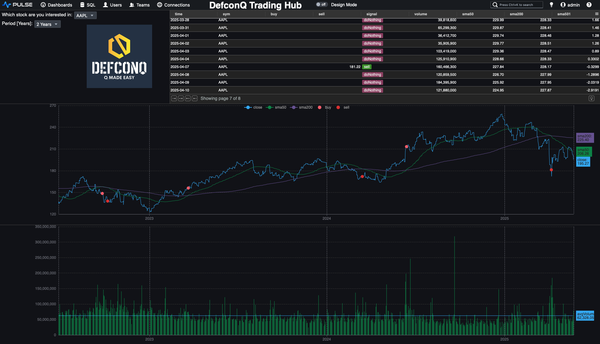

## Before We Dive In: Gearing Up for the Strategy Build

Since we’ll be reusing parts of the code introduced in earlier tutorials, it’s helpful to familiarise yourself with those foundations, they’re explained in detail and will make this tutorial much easier to follow. Don’t worry, though: all new additions will be fully explained as we go.
To visualise our trading strategy and build the dashboard, you’ll also need to install **Pulse**. Installation instructions are provided below.

**Prerequisites:**

1. Review the previous tutorials to understand the core building blocks we’ll build on
	- [KDB Tick Explained: A Walkthrough [PART 1]](https://www.defconq.tech/docs/tutorials/tick)
	- [KDB Tick Explained: A Walkthrough [PART 2]](https://www.defconq.tech/docs/tutorials/tick2)
	- [Back to the Future: Building Your Research HDB for Stock Market Insights](https://www.defconq.tech/docs/tutorials/researchHDB)
	- [The Plain Vanilla Tick Setup](https://www.defconq.tech/docs/architecture/plain)
2. Install Pulse: Follow the instructions [here](https://www.timestored.com/pulse/)

## Blueprints Before Code: Designing Your Trading Engine the Right Way

Before we jump into writing any code, it’s worth pausing to look at the most critical part of building any solid application: **the architecture**. Even a small, *simple* system benefits enormously from a clean, extensible design. With that mindset, here’s how we’ll structure our trading engine:
- **Data Ingestion:** A dedicated process responsible for feeding market data into our Tickerplant.
- **Tickerplant:** The heartbeat of every KDB-X application. It streams incoming data to all real-time subscribers and writes each update to a Tickerplant Log file, ensuring the system can recover seamlessly if needed.
- **Complex Event Processing Engine (CEP):** This component serves as our trading engine, executing the strategy logic and generating signals based on the incoming data.

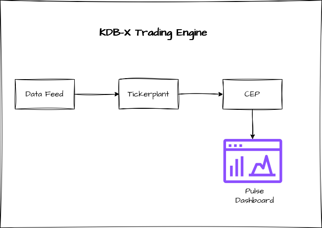

## Feeding the Beast: Bringing Data Into Your Trading Engine

For this tutorial, we’ll use end-of-day files from Yahoo Finance, the same dataset we worked with in an earlier tutorial. You can reuse those files or download fresh ones if you prefer. We'll write a function that loads these files into memory and publishes the data to our Tickerplant. And since we also want to build a backtesting engine, we’ll stream the historical data on a timer to simulate a “time-lapse” playback of market history.

Let’s get started.

First, we define the table schema for the data we want to load and gather the filenames of all historical data files into a variable. When following along, remember to update the file path to match the location of your own data. Also make sure that the folder contains only data files, as the `key` operator will list everything inside that directory.

```
// Define table schema for data we are going to load
data:([] time:`timestamp$(); sym:`symbol$(); feedHandlerTime: `timestamp$(); open: `float$(); high: `float$(); low: `float$(); close: `float$(); volume: `long$());

// List of files we want to load (Change this path to your file location. Note:folder should only contain your data as everything in the folder will be loaded)
fileList:key `$":/Users/alexanderunterrainer/repos/defconQ/projects/tradingStrategy/stock_data";

loadData:{[file]
    // Extract the name of the stock from the file name
    name:`$first "_" vs string file;
    // Load the data for the specific file, update the sym column with the stock name and a feedHandlerTime
    `data insert update sym:name,`timestamp$`date$time,feedHandlerTime:time from `time`open`high`low`close`volume xcol ("PFFFFJ";enlist csv) 0:hsym file;
 };
```

After defining our function, we can run it

```
q)loadData each fileList;
```

Before we can start streaming any data, we first need to bring up the Tickerplant. For this tutorial, we’re using an even more stripped-down version of the plain vanilla Tickerplant. If you’d like a detailed, line-by-line explanation of how it works, check out my walkthrough linked [here](https://www.defconq.tech/docs/tutorials/tick).

For now, let’s go ahead and start the Tickerplant.

```
alexanderunterrainer@Mac:~/repos/defconQ/projects/tradingStrategy|master⚡ ⇒  qx tick.q sym . -p 5010
KDB-X 0.1.1 2025.09.29 Copyright (C) 1993-2025 Kx Systems
q)stocks
time sym feedHandlerTime open high low close volume
---------------------------------------------------
q)
```

Once the Tickerplant is up and running, we can connect to it using `hopen`, which creates a connection handle between our feed handler and the Tickerplant. From there, we’re able to publish our data. Since we haven’t started any real-time subscribers yet, the Tickerplant will simply write the updates to its log file without broadcasting them to any subscribers.

```
q)h:hopen 5010
q)h(`.u.upd;`stocks;data)
```

Now that our data pipeline is in place, it’s time to build the Complex Event Processing Engine that will execute our trading strategy.


## Complex Event Processing Engine (CEP): Effortless Business Logic in Motion

For our trading strategy, we’ll implement a straightforward moving average crossover model. It uses two averages: a short-term 50-day moving average and a long-term 200-day one. The signal rules are simple: when the short average crosses above the long average, we generate a buy signal; when it crosses below, we trigger a sell signal. This captures the classic idea that prices tend to revert toward their longer-term trend over time.

Calculating the moving averages couldn’t be easier, KDB-X gives us the `mavg` keyword out of the box. This is another perfect example of why it excels at analytical workloads. Using `mavg`, we can directly update our table with both moving averages. The only detail to watch out for is that our dataset contains multiple symbols, so we need to compute the averages for each symbol. That’s easily achieved using a `by` clause as you can see in the line below

```
q)update sma50:mavg[50;close],sma200:mavg[200;close] by sym from `stocks
`stocks
```

So far so good, we’ve made solid progress. But now it’s time to bring our data to life. Let’s start building our dashboard. As a reminder, this is what the final result will look like:


## Pulse: The Catwalk for Your Data Model

For those who know me, I’m much more of a backend person, I usually steer clear of UI and front-end work. But Pulse is so simple and intuitive that even I found myself ***almost*** enjoying the UI side of things.
Once you’ve installed Pulse (installation guide linked [here](https://www.timestored.com/pulse/)), you can launch it directly from your terminal. This opens a new tab in your browser where you can begin designing your dashboard. The first step is to set up a connection to the KDB-X process that holds our data.


```
// Start Pulse from your terminal. This will launch Pulse and open the landing page
alexanderunterrainer@Mac:~|⇒  java -jar pulse.jar
```

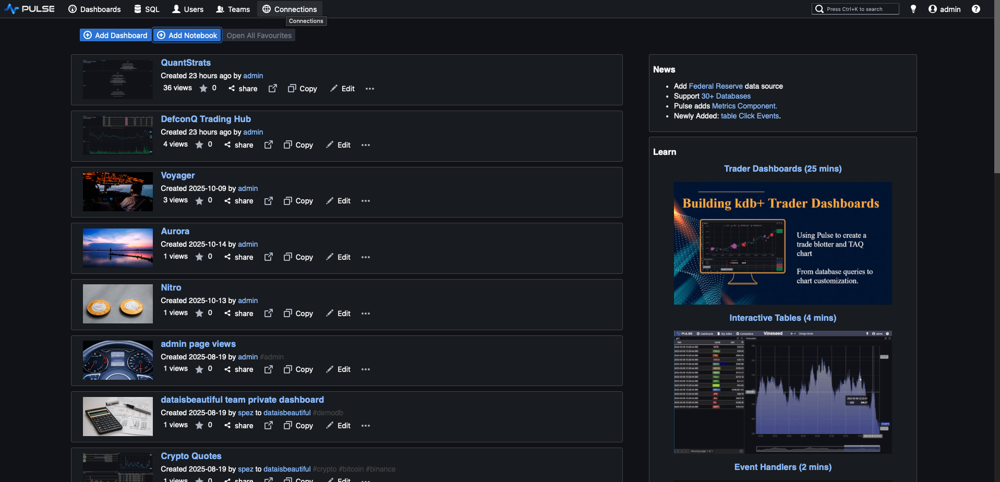
**Pulse Landing Page**

Now let’s create a new connection by specifying the host and port. In our example, the process is running on `localhost` using port `5001`.


With the connection configured, we can move on to creating our dashboard. Go ahead and add a new one to get started.


A new dashboard will open in design mode, and we can start adding components right away. I’m a big believer in the “low-hanging fruit principle”, tackle the easiest wins first. So let’s begin by charting the volume.
Before that, though, let’s quickly save and rename our dashboard.

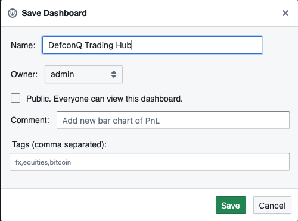

Once that’s done, click the **Time Series** button in the top panel to add a new time-series chart.

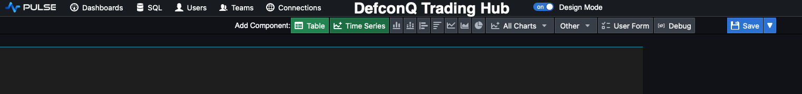

Pulse will generate a placeholder chart with simulated data, which we can now replace by updating the query to display the volume we’re interested in.


```
// Query for volume
`time xasc select time,volume from stocks
```


Hold on, something looks off. There are far too many data points, and the volume fluctuations don’t make much sense. That’s because our `stocks` table contains data for multiple symbols, so when we chart the volume directly, we’re plotting everything at once. The fix is simple: we add a drop-down selector so we can choose the specific stock we want to display.

To do this, add a **User Form**. Click the **User Form button** in the top panel and place it above your volume chart. Then, in the Form Editor on the right, add a Dropdown component. We can populate the drop-down with our stock symbols by running a simple KDB-X query. Details below.


```
asc select distinct sym from stocks
```
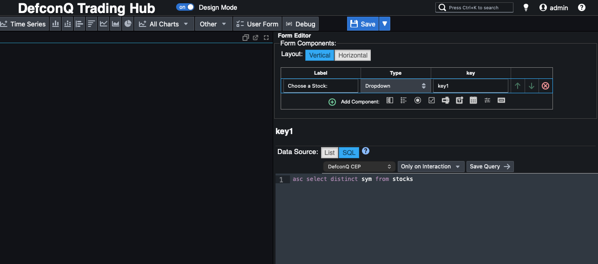


All that’s left is to connect the drop-down to our volume chart so that selecting a symbol updates the chart accordingly. We can do this by referencing the drop-down’s assigned key directly in the chart’s query. The updated query looks like this:

```
`time xasc select time,volume from stocks where sym=`${{key1}}
```


Not too bad, right? Since our historical dataset spans several decades, it’s useful to control how much of it we display at once. Let’s add another drop-down to let us choose the time range. Later, when we switch to real-time backtesting, this drop-down won’t be needed anymore and can be removed.

We start by adding another drop-down to choose the date range we want to display. This time, instead of populating the options with a Q-SQL query, we simply hard-code a list of day counts that correspond to 1, 2, 3, 5, 7, 10, and 15 years. We also include a large value to allow selecting the full time series.

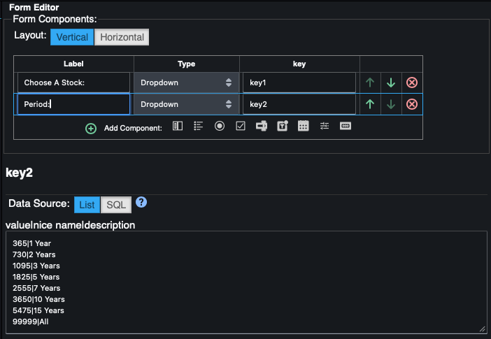
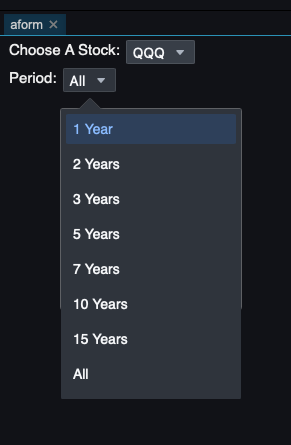

Next, we update the volume query to incorporate the drop-down’s key so the chart adjusts based on the selected range. For a small visual upgrade, we switch the chart from a **line plot** to a **bar chart**, and just like that, we have a clean, intuitive volume visualization for our stocks.


```
-{{key2}}#select time,volume from stocks where sym=`${{key1}}
```

Alright, with the volume chart in place, it’s time to move on to the price chart and start implementing our trading strategy. As before, we’ll tackle the easy part first, plotting the price series along with the moving averages.

Just like we did for the volume chart, we’ll add a new time-series component and define a Q-SQL query that selects the `time`, `close`, `sma50` (50-day simple moving average), and `sma200` (200-day simple moving average). As before, we’ll use the values from our drop-downs to limit the chart to a specific stock and chosen time range.


And just like that, we now have a clean visual of the price data alongside both moving averages. But how do we turn this into trading signals?
Our rules are simple:

- **buy** when the short-term moving average (`sma50`) crosses above the long-term average (`sma200`).
- **sell** when the short-term moving average (`sma50`) crosses below the long-term average (`sma200`).

Instead of jumping straight into solving this on our full dataset, let’s first strip the problem down and build the logic step by step. We’ll start with two simple lists: one for the short moving average and one for the long moving average:
- `s: 3 7 8 12 10 11 9 7` (short MA)
- `l: 5 9 10 11 8 7 12 13` (long MA)

First, we subtract the long moving average `l` from the short moving average `s`. This tells us whether the short MA is above or below the long MA at each point.

Next, we apply the built-in `signum` function to that result. `signum` returns `-1` for **negative** values, `1` for **positive** values, and `0` when the input is **zero**. We then compare this list against `0` to get a boolean mask indicating where the short MA is below the long MA. This effectively captures when the relationship between the two averages flips from negative to positive (or the other way around).

Finally, we use `deltas` on this boolean sequence to generate our trading signals:

- A delta of `+1` → we buy
- A delta of `-1` → we sell
- A delta of `0` → we do nothing

```
q)s:3 7 8 12 10 11 9 7
q)l:5 9 10 11 8 7 12 13
q)s-l
-2 -2 -2 1 2 4 -3 -6
q)signum s-l
-1 -1 -1 1 1 1 -1 -1i
q)0<signum s-l
00011100b
q)deltas 0<signum s-l
0 0 0 1 0 0 -1 0i
q)1+deltas 0<signum s-l
1 1 1 2 1 1 0 1
q)`sell`doNothing`buy 1+deltas 0<signum s-l
`doNothing`doNothing`doNothing`buy`doNothing`doNothing`sell`doNothing
```

The final step is to use the `deltas` output as an index into a list of symbols, allowing us to map the numeric values directly to their corresponding trading signals.

Now let’s integrate the signal-generation logic into our dashboard so we can produce a chart like the one shown below. It’s not particularly complicated, but it does require a few lines of code. We’ll also take advantage of some built-in Pulse features to display those nice visual marker, bubbles that highlight each buy or sell signal right on the chart.


Pulse is extremely flexible and even lets you write logic directly inside the chart’s code editor. However, to keep things clean and maintainable, we’ll follow good coding practices and wrap our logic in a function that Pulse can call, with parameters controlled by the UI.

We’ll create a function called `priceChart` that takes two arguments: the stock symbol we want to plot and the time range (in days). We’ll build it step by step. First, we reuse the original query that returns the price and the two moving averages.

```
select time,sym,sma50:mavg[50;close],sma200:mavg[200;close],price:close from stocks where sym=stock
```

Then we extend that result with our signal-generation logic, keeping the numeric encoding for now: `-1` for **sell**, `1` for **buy**, and `0` for **no action**.

```
update signal:deltas 0<signum sma50-sma200 from
select time,sym,sma50:mavg[50;close],sma200:mavg[200;close],price:close from stocks where sym=stock
```

Next, we derive a trade action and the corresponding buy/sell price, which for simplicity we set to the closing price at the signal time (ignoring bid/ask). After that, we create the visual “bubbles” that mark buys and sells using Pulse’s built-in conventions: if you add a column named `<field>_SD_CIRCLE` and define `<field>_SD_SIZE`, Pulse will draw a bubble of that size at the corresponding point. By adding four columns, `buy_SD_CIRCLE`, `buy_SD_SIZE`, `sell_SD_CIRCLE`, and `sell_SD_SIZE`, we get clear visual markers for our buy and sell signals.


```
update buy_SD_CIRCLE:buy*signal,buy_SD_SIZE:10,sell_SD_CIRCLE:abs sell*signal,sell_SD_SIZE:10 from
update action:`sell`doNothing`buy 1+signal,buy:?[signal=1;price;0N],sell:?[-1=signal;price;0n] from
update signal:deltas 0<signum sma50-sma200 from
select time,sym,sma50:mavg[50;close],sma200:mavg[200;close],price:close from stocks where sym=stock
```

In the final step, we narrow things down to just the columns we care about and apply `sublist` to restrict the output to the selected date range. Here’s the full function in one piece.

```
priceChart:{[stock;range]
        sublist[range;] select time,price,sma50,sma200,buy_SD_CIRCLE,buy_SD_SIZE,sell_SD_CIRCLE,sell_SD_SIZE from
        update buy_SD_CIRCLE:buy*signal,buy_SD_SIZE:10,sell_SD_CIRCLE:abs sell*signal,sell_SD_SIZE:10 from
        update action:`sell`doNothing`buy 1+signal,buy:?[signal=1;price;0N],sell:?[-1=signal;price;0n] from
        update signal:deltas 0<signum sma50-sma200 from
        select time,sym,sma50:mavg[50;close],sma200:mavg[200;close],price:close from stocks where sym=stock}
```

Following the same good coding practices, let’s also create a dedicated function for the volume chart.

```
volumeChart:{[stock;range] select time, avgVolume:avg volume, volume from sublist[range;] select time,volume from stocks where sym=stock }
```

As you’ve probably noticed, we also added the average volume to our volume chart. However, because KDB-X evaluates expressions from right to left, we can’t just compute the average volume first and then apply `sublist`, that would calculate the average over the ***entire*** dataset, giving us the wrong value for the selected time window.

To get the correct result, we must first extract the sublist for the chosen date range and ***then*** compute the average volume on that subset.

If you’re wondering why we use `sublist` instead of the **take** `#` operator, it comes down to their different behaviors. When you use `take #` on a list of `5` elements and request `7`, `take` will start cycling through the list again from the beginning to reach the desired length. In contrast, `sublist` returns only `min(n; count list)` elements. 

This matters when a stock’s price history is shorter than the time range the user selects, `sublist` prevents accidental cycling and ensures we only return the data that actually exists.

```
q)7#til 5
0 1 2 3 4 0 1
q)7 sublist til 5
0 1 2 3 4
```

Now that our functions are in place, the final step is simply adding them into our Pulse dashboard. We just add the function calls to the TimeSeries code editor and pass in the selected stock and time-range values from our drop-down inputs. That’s all it takes, let’s hook everything up.

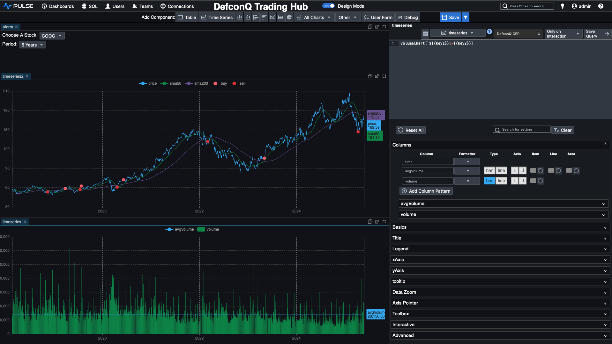

The last element to complete our dashboard is a summary table positioned at the top. This table presents key information at a glance, buy or sell price, the generated signal, volume, SMA50, SMA200, and the current price. It adds a numerical layer of context to complement the visual cues from our charts, rounding out the trading interface with clear, actionable insight.

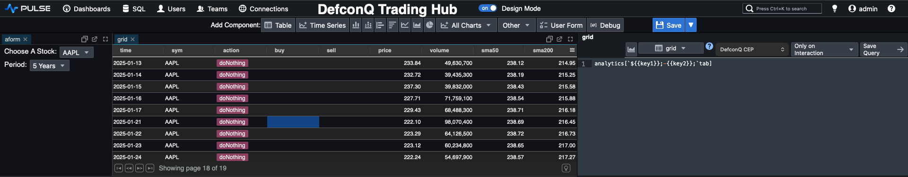

If we look closely at our `priceChart` function, we’ll notice that nearly all the data required for our summary table is already being produced. The only real difference is the set of columns we want to return. So instead of duplicating logic, we’ll refactor the function, rename it to `analytics`, and introduce a third parameter that specifies which column set we want, whether for the price chart or for the summary table. 

By using a `functional select`, we can make the underlying query far more flexible and dynamic. It’s yet another great example of how expressive and powerful KDB-X can be. You’ll find the refactored version of the code below.

:::note
You can read everything about functional selects on my dedicated blog post [here](https://www.defconq.tech/docs/concepts/functionalSelect)
:::

```
analytics:{[stock;range;columns]
         chartColumns:`time`price`sma50`sma200`buy_SD_CIRCLE`buy_SD_SIZE`sell_SD_CIRCLE`sell_SD_SIZE;
         tableColumns:`time`sym`action`buy`sell`price`volume`sma50`sma200;
         c:();
         if[columns=`tab;c:tableColumns];
         if[columns=`chart;c:chartColumns];
         ?[;();0b;{x!x} c]
         sublist[range;] `time xasc update buy_SD_CIRCLE:buy*signal,buy_SD_SIZE:10,sell_SD_CIRCLE:abs sell*signal,sell_SD_SIZE:10 from
         update action:`sell`doNothing`buy 1+signal,buy:?[signal=1;price;0N],sell:?[-1=signal;price;0n] from
         update signal:deltas 0<signum sma50-sma200 from
         select time,sym,sma50:mavg[50;close],sma200:mavg[200;close],price:close,volume from stocks where sym=stock}
```

Now all that remains is a bit of clean-up to make the dashboard look polished and professional. Rename each component to something meaningful, add some spacing to the left and right of the charts, and tidy up the layout. And just like that, voilà, you’ve got a sleek, production-ready dashboard that supports your traders’ decision-making with clarity and style.


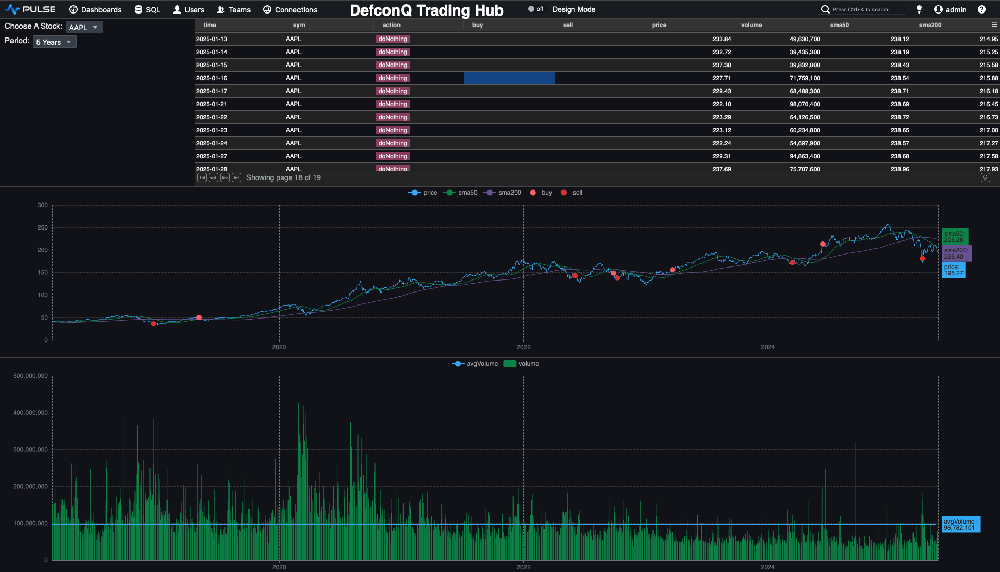

## Backtesting for Alpha: Turning Strategy Into Performance

At the start of this tutorial, I promised we would build a backtesting engine for our trading strategy, and I always deliver. In this final section, we’ll put everything together by creating a simple yet powerful backtester, powered by KDB-X’s built-in timer functionality: [`.z.ts`](https://code.kx.com/q/ref/dotz/#zts-timer).

Normally, `.z.ts` is undefined, but once you assign a function to it, that function is executed automatically every `n` milliseconds. You control this interval via a system command `\t`, either when starting your process with `-t n` or dyhnamically at runtime with `\t n`. 

Let’s look at a small example to understand how it works. We define `.z.ts:{show x}`, which prints the argument `x` every time the timer fires. By default, `x` is the current timestamp. So, when we set the timer to fire every `1000 milliseconds` using `\t 1000`, we get the current time printed once per second. Simple, elegant, and exactly what we’ll use to “time-lapse” our historical data for backtesting. You can reseet the timer by setting it to zero `\t 0`


```
q).z.ts:{show x}
q)\t 1000
q)2025.12.07D15:23:23.316105000
2025.12.07D15:23:24.316105000
2025.12.07D15:23:25.316105000
2025.12.07D15:23:26.316105000
2025.12.07D15:23:27.316105000
2025.12.07D15:23:28.316105000
2025.12.07D15:23:29.316105000
2025.12.07D15:23:30.316105000
\t 0
```

Remember, our original feed handler holds the ***entire*** price history for our stocks, about 75,000 records spanning from 1980 all the way to 2025. For the backtesting engine, we want to replay this history as a time-lapse, streaming one day’s worth of data every 100 milliseconds.

```
q)count data
75863
q)exec `startDate`EndDate!(min;max)@\:time by sym from data
       | startDate                     EndDate
------ | -----------------------------------------------------------
7203.T | 1999.05.06D00:00:00.000000000 2025.05.26D00:00:00.000000000
9988.HK| 2019.11.26D00:00:00.000000000 2025.05.26D00:00:00.000000000
AAPL   | 1980.12.12D00:00:00.000000000 2025.05.23D00:00:00.000000000
AMZN   | 1997.05.15D00:00:00.000000000 2025.05.23D00:00:00.000000000
GOOG   | 2004.08.19D00:00:00.000000000 2025.05.23D00:00:00.000000000
META   | 2012.05.18D00:00:00.000000000 2025.05.23D00:00:00.000000000
MSFT   | 1986.03.13D00:00:00.000000000 2025.05.23D00:00:00.000000000
QQQ    | 1999.03.10D00:00:00.000000000 2025.05.23D00:00:00.000000000
SPY    | 1993.01.29D00:00:00.000000000 2025.05.23D00:00:00.000000000
TSLA   | 2010.06.29D00:00:00.000000000 2025.05.23D00:00:00.000000000
VOW3.DE| 1998.07.22D00:00:00.000000000 2025.05.26D00:00:00.000000000
VTI    | 2001.06.15D00:00:00.000000000 2025.05.23D00:00:00.000000000
```

The logic is straightforward:

1. Extract the list of all distinct trading dates from our dataset.
2. Initialize a counter to track our current position within that date list.
3. On each timer tick (every 100 ms), publish the data for the next date to the Tickerplant.
4. Increment the counter so the following tick streams the next day in sequence.

Alright, time to bring it all together!

```
q)dateList:exec distinct `date$time from data
q)dateList
1999.05.06 1999.05.07 1999.05.10 1999.05.11 1999.05.12 1999.05.13 1999.05.14 1999.05.17 1999.05.18 1999.05.19 1999.05.20 1999.05.21 1999.05.24 1999.05.25 1999.05.26 1999.05.27 1999.05.28 1999.05.31 1999.06.01 1999.06.02 1999.06.03 1999.06...
q)(min;max)@\:dateList
1980.12.12 2025.05.26
q)cntr:0
q)select from data where $[`date;time]=dateList 0
time                          sym     feedHandlerTime               open      high      low       close     volume
---------------------------------------------------------------------------------------------------------------------
1999.05.06D00:00:00.000000000 7203.T  1999.05.06D00:00:00.000000000 396.8346  410.4793  392.2863  410.4793  15575000
1999.05.06D00:00:00.000000000 AAPL    1999.05.06D00:00:00.000000000 0.3498498 0.3521977 0.3305959 0.3343524 433148800
1999.05.06D00:00:00.000000000 AMZN    1999.05.06D00:00:00.000000000 3.7       3.775     3.39375   3.434375  365688000
1999.05.06D00:00:00.000000000 MSFT    1999.05.06D00:00:00.000000000 24.73093  24.86503  23.75395  23.88805  74021000
1999.05.06D00:00:00.000000000 QQQ     1999.05.06D00:00:00.000000000 45.50791  45.90524  43.83911  44.26293  15173400
1999.05.06D00:00:00.000000000 SPY     1999.05.06D00:00:00.000000000 84.72099  85.15424  83.42122  84.43543  13507200
1999.05.06D00:00:00.000000000 VOW3.DE 1999.05.06D00:00:00.000000000 12.69323  12.72496  12.17915  12.50283  107812
q)stream:{-1"Streaming data for date:",string dateList cntr;select from data where $[`date;time]=dateList cntr;cntr::cntr+1}
q)stream[]
Streaming data for date:1999.05.10
q)stream[]
Streaming data for date:1999.05.11
q)stream[]
// Add the actual publishing
stream:{-1"Streaming data for date:",string dateList cntr;h(`.u.upd;`stocks;select from data where $[`date;time]=dateList cntr);cntr::cntr+1}
```

Before we begin streaming, let’s reset the CEP by clearing out any previously stored data and create a copy of our Pulse dashboard to preserve the historical version. In the new ***Backtesting Dashboard***, we’ll remove the date-range drop-down and adjust our functions accordingly. With these two changes in place, we’re ready to fire up the backtesting engine. It's showtime!!!

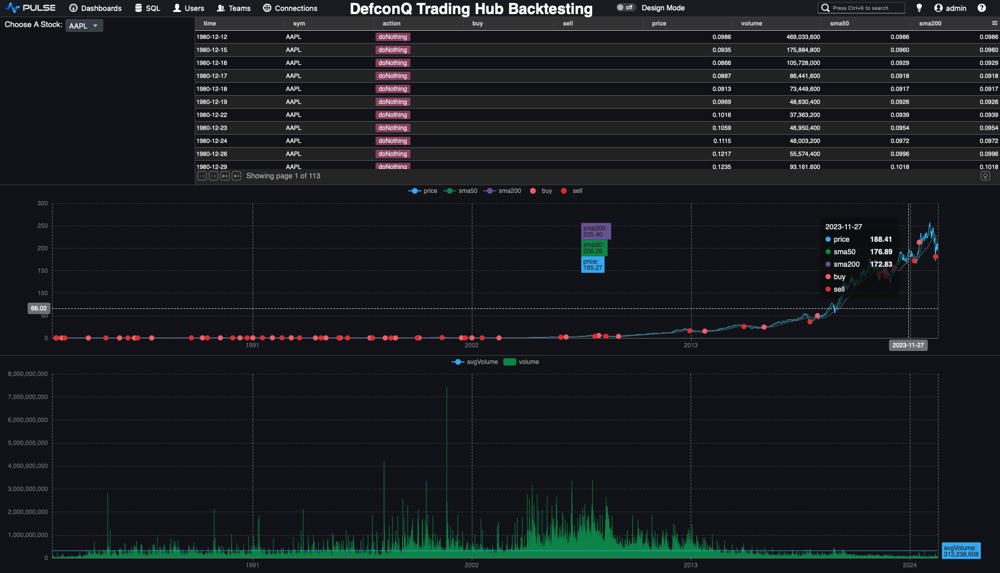
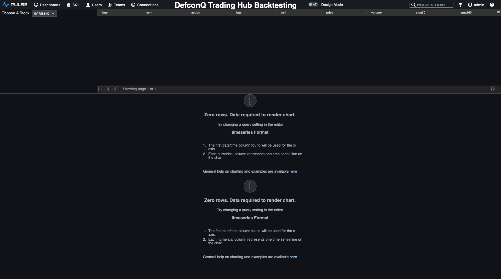


## Video Tutorial

<iframe width="560" height="315" src="https://www.youtube.com/embed/Cya2BD1hJOY?si=pcRrxFBD4YkSSxLn" title="YouTube video player" frameborder="0" allow="accelerometer; autoplay; clipboard-write; encrypted-media; gyroscope; picture-in-picture; web-share" referrerpolicy="strict-origin-when-cross-origin" allowfullscreen></iframe>

Code repo: [Pulse Powered Alpha: Building your First Trading Strategy with KDB-X and Pulse](https://github.com/DefconQ/defconQ/tree/master/projects/tradingStrategy)
