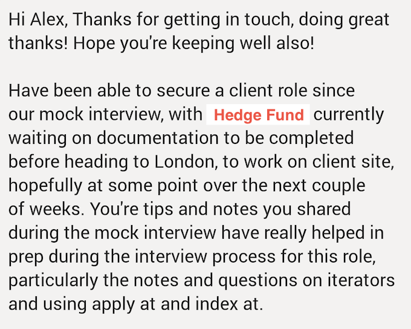

# DefconQ Pro: From Competent to Confident

After more than two years of creating content to help developers get started, level up, deepen their understanding or grow their skills in KDB/Q, and after receiving positive feedback and requests for something beyond blog-based, more structured support, it feels like the right time to take **DefconQ** one step further. This next chapter will introduce a set of new offerings designed for those who want to go deeper, move faster, and build with confidence, including services for ...

## ... Students

I would like to support a small number of motivated students each year by mentoring them through a project, dissertation, or other academic coursework. This would be open globally to **two selected students** (free of charge)  who are genuinely curious, hardworking, and eager to get a head start by learning KDB/Q before graduation.
\
\
The project would need to be part of your academic requirements and aligned with your university’s guidelines. Depending on the setup, a discussion with a supervising professor or academic staff member may be required to make sure everything fits within the formal framework, but those details can be explored together.

## ... Universities

I am very happy to collaborate with universities in a variety of ways. This could range from guest lectures and industry talks, to hands-on masterclasses or workshops in KDB/Q, and depending on location and scope, even a full course offering.
\
\
The audience can come from disciplines such as Computer Science, Finance, Engineering, Physics, Mathematics, or Quantitative Finance, though it’s by no means limited to these. If this sounds interesting, feel free to reach out for an initial, informal conversation.

## ... Professionals

For professionals, I’m offering two structured, **paid mentorship programs**, depending on where you are in your journey.

### Career Mentorship

This program is focused purely on career progression. It includes **our one-hour one-to-one sessions** where we will talk through **your goals, the role you’re aiming for, and how to position yourself to get there.** This could involve an internal move, a transition from sell-side to buy-side, a shift toward a more business-facing role, or any other direction you’d like to explore. This track does not include technical coaching, it’s all about clarity, strategy, and next steps.

### Technical Mentorship

This program is designed for anyone looking to **deepen their KDB/Q skills or transition into a KDB/Q role.** Over the past months, I’ve been piloting this format and have helped developers with no prior KDB/Q experience ramp up and successfully move into KDB/Q positions. The program includes:
- An onboarding call to understand your background and goals
- A personalised weekly study plan
- Ten one-hour one-to-one sessions with me (one hour per week)

Everything is tailored to your level and pace.

## ... Conferences, Meetups, and Podcasts

Over the past years, I have had the opportunity to speak at **conferences, meetups, and podcasts** such as [Quant Strats/Future Alpha](https://www.alphaevents.com/events-futurealphaglobal), [KX events and livestreams](https://kx.com), [Fancy Quant podcast](https://www.fancyquantnation.com) with [Dimitri Bianco](https://www.linkedin.com/in/dimitri-bianco/), and [Future of Finance & AI Conference](https://www.engineering.cornell.edu/orie/2025/07/28/future-of-finance-and-ai-conference-on-roosevelt-island-september-19-2025/) hosted by [Alexander Fleiss](https://www.linkedin.com/in/alexander-fleiss-70b49410/) of [Rebellion Research](https://www.rebellionresearch.com). I am keen to continue these engagements throughout the year.
\
\
If you’re organising a conference, meetup, or podcast in fintech, finance, quantitative finance, or a related space, feel free to reach out and let’s see if there’s a good fit.

## ... Sponsores

I’m opening up a small number of sponsorship opportunities, including:

### DefconQ Happy Hours

In 2025, I hosted DefconQ Happy Hours in **London, Belfast, and New York**, all of which turned out to be great community events. I am planning to continue these on a quarterly basis in 2026 and am looking for sponsors who’d like to support one of the events, typically by settling the tab.

### Sponsored Content

DefconQ’s reach has grown beyond the core KDB/Q community and now spans a broader finance audience. If you’d like to promote your business in a subtle, thoughtful, and occasionally witty way, sponsoring a blog post could be a good option. There’s even a **non-zero chance Adam Sandler might make a cameo**.

## ... Everything Else

If you’re interested in engaging with DefconQ but don’t see something that directly matches your situation above, don’t worry. Just drop me a message. I’m always happy to chat and explore ideas together, sometimes the best things come from conversations that weren’t planned in advance.

## Why Now

Now is an especially good time to take advantage of the **DefconQ Pro offerings**. Over the past year, **demand for KDB/Q developers** has **not only increased but reached its highest level in several years**. As data volumes continue to grow, the **need for engineers who can work efficiently with high-performance time-series** systems grows with it. While opportunities exist across **all experience levels**, there has been a **clear preference for mid-to-senior-level** developers, those who can design, build, and reason about real systems.

**DefconQ Pro** is designed to help you close that gap and position yourself exactly where the market demand is strongest.

## Why DefconQ

Choosing **DefconQ** means learning KDB/Q from a **practical, real-world perspective**. Everything is grounded in **hands-on experience**, from building full tick stacks and analytics engines to designing scalable architectures used in production environments. The focus isn’t on isolated syntax or academic examples, but on understanding ***why*** systems are built the way they are and how to apply that knowledge with confidence. Based on years of experience not only building systems but also mentoring, upskilling, and teaching developers KDB/Q, DefconQ offers a level of guidance that’s hard to find elsewhere. Ultimately, the results speak for themselves.

## Who This is For

DefconQ Pro is designed for highly motivated individuals who are serious about progressing their careers and deepening their KDB/Q expertise. It’s for developers who are willing to put in the work required to succeed in a competitive space and who want to leverage focused guidance to reach their goals faster and more efficiently. If you’re proactive, curious, and committed to improving, DefconQ Pro is built to support you on that journey.

## What DefconQ Pro Is Not

DefconQ Pro is not a passive, “attend-only” or click-through program with guaranteed outcomes. There are no shortcuts, you have to do the work and take ownership of your progress. It’s also not a recruiting service or a guaranteed path to a KDB/Q role. While the program can significantly improve your skills, confidence, and interview readiness, success ultimately depends on you showing up, performing, and earning the role yourself.

## How To Apply

If you’re ready to commit to this journey and are interested in any of the DefconQ Pro offerings, feel free to get in touch via email defconqpro@gmail.com or LinkedIn message [here](https://www.linkedin.com/in/alexanderunterrainer/). As availability is limited, applications are carefully reviewed to ensure a strong fit on both sides. To keep the process efficient, please include your LinkedIn profile or CV when reaching out.

## Client Testimonial

